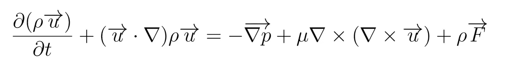
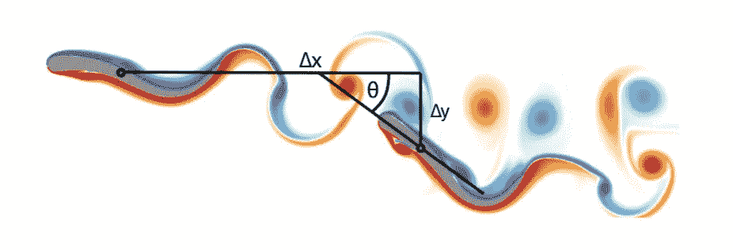
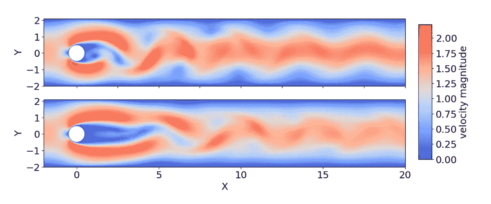
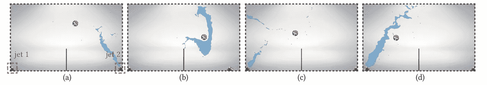
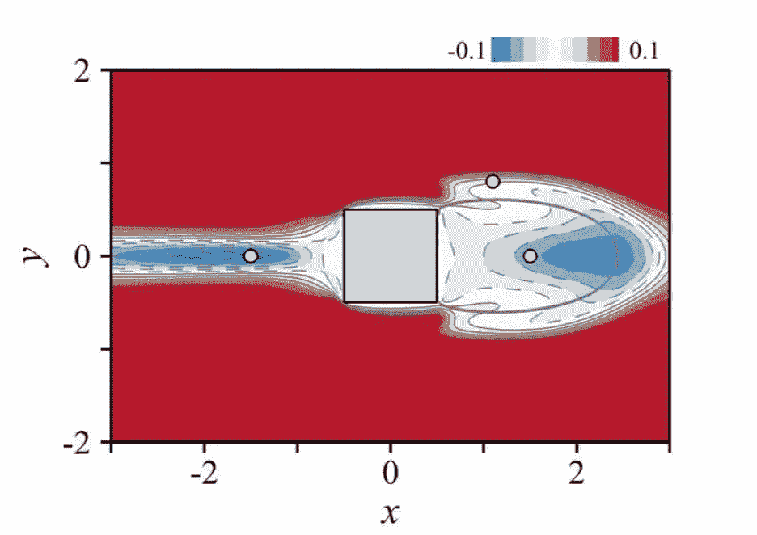
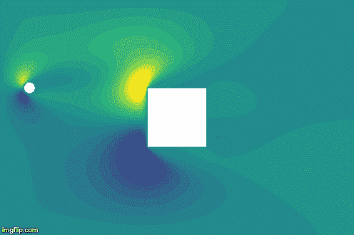
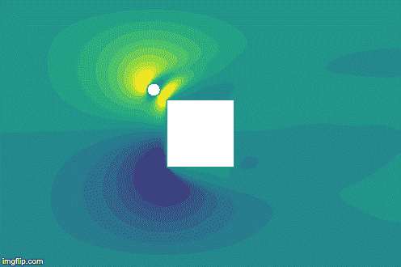
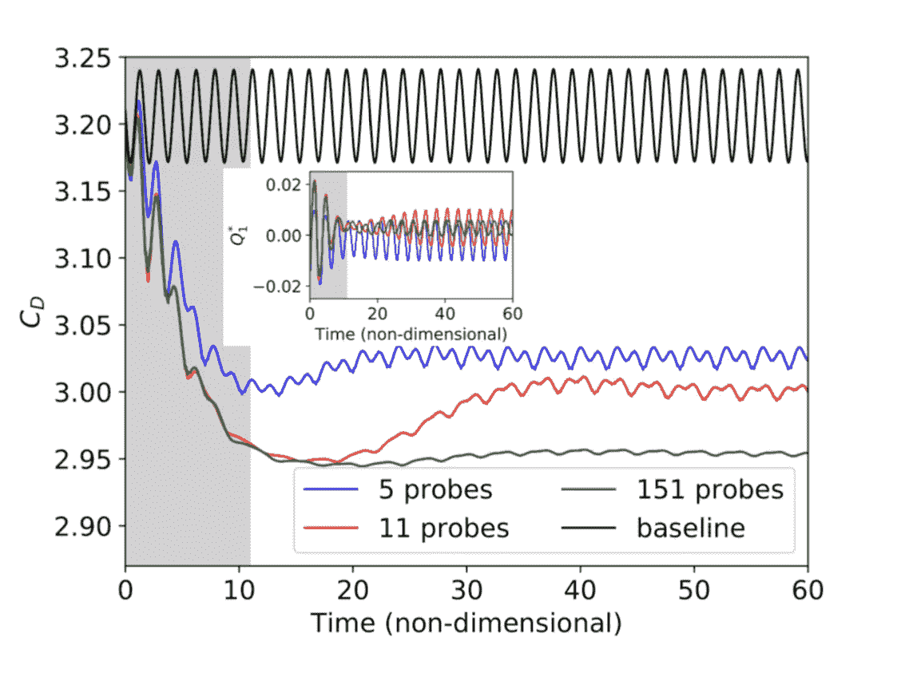

# 流体力学深度强化学习综述

> 原文：<https://medium.com/analytics-vidhya/a-review-on-deep-reinforcement-learning-for-fluid-mechanics-76211fc304e3?source=collection_archive---------15----------------------->

从之前的[博客文章](https://donsetpg.github.io/blog/2019/08/06/DRL-FM-review/)中复制，写于 2019 年 8 月。该论文现已发表。

当我开始在 [CEMEF](http://www.cemef.mines-paristech.fr/) 实习时，我已经接触过深度强化学习(DRL)和流体力学，但从未将其中一种与另一种结合使用。我知道已经有几个人走上了这条路，当我到达时，有些人甚至正在 T4 CEMEF T5 工作。然而，我(和我的导师 [Elie Hachem](http://www.cemef.mines-paristech.fr/staff/elie-hachem) 仍然有几个问题/目标在我的脑海里:

*   DRL 是如何应用于流体力学的？
*   为了提高这两个科目，我想自己尝试一个测试用例；
*   我们如何尽可能通用地编码呢？

在一个优秀团队的帮助下，这些问题的结果可以在这里[找到](https://arxiv.org/abs/1908.04127)。

# DRL 在流体力学中的应用

在 DRL 的帮助下，已经解决了几个流体力学问题。他们总是(大部分)遵循相同的模式，一方面使用 DRL 工具(如 [Gym](https://gym.openai.com/) 、 [Tensorforce](https://github.com/tensorforce/tensorforce) 或 [stables-baselines](https://stable-baselines.readthedocs.io/) 等)，另一方面使用计算流体动力学(CFD)([Fenics](https://fenicsproject.org/)、 [Openfoam](https://www.openfoam.com/) 等)。

目前，大多数案例总是考虑物体(圆柱、正方形、鱼等)。)在 2D/3D 流体中。然后，DRL 代理将能够执行几项任务:

*   移动对象
*   更改对象的几何图形或大小
*   直接更换液体

```
**A small step into the world of fluid mechanics**The Navier-Stokes equation looks pretty (and complicated) but is in fact traduction of Newton's equation for a fluid. Rather than describing the movement of an object, it is representing the movement of a fluid (more precisely, of a field (of points, vectors, etc).).
```



```
This equation is quite a paradox itself. Its application are enormous, but we still don't know if solutions always exists (it is even one of the seven [Millenium Prize Problems](https://en.wikipedia.org/wiki/Millennium_Prize_Problems)).Solving the Navier-Stokes now doesn't mean we are trying to solve it. We use the finite element method to 'slice' our domain into small parts, and starting from initial conditions, we run our simulation, making sure our equations are 'approximatively verified' every (little) timestep.
```

该代理可以在两个关键时刻执行这些任务:(I)当实验完成，并且您想要开始新的实验时，(ii)在实验期间(即，在 CFD 时间期间)。一个是关于直接优化；另一个是关于持续控制。下面是几个例子:



*领袖与跟随者游泳者转载自* [*诺瓦蒂等(2017)*](https://iopscience.iop.org/article/10.1088/1748-3190/aa6311/pdf) *，以领袖与跟随者之间的位移与朝向。*



*无(上)和有(下)主动流量控制的速度大小对比，转载自* [*Rabault 等人(2019)*](https://arxiv.org/abs/1808.07664) *。该主动流控制被链接到 DRL 代理。*



*流体射流控制刚体转载自* [*马等(2018)*](https://dl.acm.org/citation.cfm?id=3201334) *。射流的位置和方向由 DRL 控制。*

甚至[这个视频](https://www.youtube.com/watch?v=O8QtAi2cHBI)。(这非常令人惊讶)

# 我自己的测试案例

为了更深入地研究这个主题，我想自己尝试一个测试案例(尽管开始时得到了 Jonathan Viquerat 的帮助)。我们从这篇论文中得到启发，考虑了一个简单的情况:层流流过正方形。现在，计算这个正方形的阻力是很方便的(在这个装置中)。

然而，[论文](https://hal.archives-ouvertes.fr/hal-01082600v2)提出的问题是:如果我们在接近正方形的某个地方增加一个小圆柱体，我们是否能够同时减小正方形和小圆柱体的总阻力？

答案是肯定的，结果如下图:



*雷诺数= 100 时小控制圆柱诱导阻力的变化，转载自* [*梅利加等(2014)*](https://hal.archives-ouvertes.fr/hal-01082600v2) *。*

现在，与 DRL 一起解决这个案件当然很有趣，但我想看看是否有更多的可能性(因为这个案件在技术上已经解决了)。有几个想法是可行的(得益于与来自 CEMEF 的人的讨论和我之前做的回顾) :

1.  直接优化和连续控制有什么区别吗？
2.  使用自动编码器容易吗？
3.  迁移学习是可能的吗？
4.  我们能制定一个尽可能清晰的代码吗？

关于第一点，我发现直接优化和连续控制之间没有什么特别的区别。两个代理收敛并找到几乎相同的最佳最终位置。



*在雷诺= 40 和 100 时，从两个随机位置连续控制 17 个时间步长。*

我使用了自动编码器，但是没有时间比较使用和不使用它的结果。我必须解释一下为什么自动编码器会有所帮助。代理需要观察，当处理流体力学时，流体特性是重要的观察。

然而，它们可以具有非常高的维度(超过 10，000)。我们要处理的神经网络将会非常庞大。为了克服这个问题，可以使用自动编码器从高维流体场中提取简单的特征。似乎使用尽可能多的流体特征(使用自动编码器是可能的)是最好的办法:



*带主动流动控制的阻力系数值转载自* [*拉博特等人(2019)*](https://arxiv.org/abs/1808.07664) *。重要的是，我们给出的关于流体的信息越多(即，我们给代理的探针越多)，它的性能就越好。因此，能够在不扩大神经网络规模的情况下提供一切是非常有价值的。*

# DRL 流体力学图书馆？

开始时，我的目标是找出这样一个库是否可以建立(在合理的时间内)。在我创建测试用例的过程中，我意识到这样一个库的最大问题来自 CFD 求解器:不仅没有人使用相同的库，而且它们都非常不同。

对于我的测试用例，我的代码基于 [Fenics](https://fenicsproject.org/) ，这是一个易于使用的解算器(非常方便，因为您可以直接在 Python 中使用它)。代码可在[这里](https://github.com/DonsetPG/fenics-DRL)获得。它应该尽可能的清晰和可重用。它基于[健身房](https://gym.openai.com/)和[稳定基线](https://stable-baselines.readthedocs.io/)。

我使用 Gym 构建定制环境，总是遵循相同的模式:

对于稳定基线，我使用了他们的 DRL 算法实现，最后，正如我前面所说的，我使用 Fenics 来构建我的测试用例，使用自定义类，我希望它将被其他测试用例重用。他们使用三个主要类别:通道、障碍和问题:

# 频道:

基本上，这就是你想要进行实验的盒子。你只需给出盒子的下角和上角来定义它。

# 障碍:

这是您要添加到先前看到的框中的对象。如果您只想使用 Fenics，您只能轻松地添加正方形、圆形或多边形。然而，如果你想添加更复杂的形状和网格，你可以使用 Fenics 的*网格*功能。

# 问题:

这是一切发生的地方:设置盒子，放置几个物体，定义边界条件，等等。

然而，这还没有接近真正的 DRL 流体力学库，问题是 Fenics。虽然非常容易使用，但它求解速度很慢，用它来解决一个具有挑战性的问题是不切实际的。这就是为什么在 CEMEF 工作的其他人的目标是建立这个库，将 DRL 与其他 CFD 库连接起来，其中大多数是基于 C++的。

最后，我们现在对如何使用 DRL 来帮助解决流体力学问题有了更好的了解。此外，几个重要的特点可以记住:迁移学习，自动编码器，LSTM，等等。如果建立一个真正的 DRL-计算流体动力学库的目标没有实现，那么它的可能实现方式现在就更加清晰了。

# [Github 资源库](https://github.com/DonsetPG/fenics-DRL)

# 参考

1.  [两个自走式游泳运动员通过学习实现同步——诺瓦蒂等人(2017)](https://iopscience.iop.org/article/10.1088/1748-3190/aa6311/pdf)
2.  [通过深度强化学习训练的人工神经网络发现主动流量控制的控制策略— Rabault et al. (2019)](https://arxiv.org/abs/1808.07664)
3.  [采用深度强化学习的流体导向刚体控制——马等(2018)](https://dl.acm.org/citation.cfm?id=3201334)
4.  [流过方形柱体的层流和湍流中空气动力的敏感性——me liga 等人(2014 年)](https://hal.archives-ouvertes.fr/hal-01082600v2)
5.  [流体力学深度强化学习综述— Garnier et al. (2019)](https://arxiv.org/abs/1908.04127)