# 一个科学的方法来选择你的幻想运动队

> 原文：<https://medium.com/analytics-vidhya/a-scientific-method-to-select-your-fantasy-sports-team-b23726136256?source=collection_archive---------0----------------------->

## 使用机器学习和优化技术在梦幻体育平台上选择你的团队——Dream11.com

在过去的几周里，板球热在印度电视上达到了顶峰，首先是 IPL 的第二回合比赛，然后是备受期待的 T20 世界杯。然而，伴随这种狂热的另一个方面是以顶级印度板球运动员为特色的梦幻体育平台的积极推广。

由[克里斯·利维拉尼](https://unsplash.com/@chrisliverani?utm_source=medium&utm_medium=referral)在 [Unsplash](https://unsplash.com?utm_source=medium&utm_medium=referral) 上拍摄

梦幻体育联盟的概念自 20 世纪 50 年代末就有了，当时一位名叫比尔·温肯巴赫的奥克兰商人设计了梦幻高尔夫。然而，对于像印度这样的国家来说，这个概念相对较新，充满了通常伴随着占主导地位的保守社会的巨大担忧。由于游戏要求你投入一些钱以期待更大的胜利，许多人认为这种游戏类似于赌博。然而，梦幻体育是一个不同于传统体育博彩的概念，因为你不直接赌任何体育赛事的结果。取而代之的是，你**创建一个梦幻运动队，与对手竞争以获得更多分数和赢得金钱**。

尽管存在担忧，但近来印度出现了一个庞大的梦幻体育市场，其收入在过去三年中增长了 10 倍。

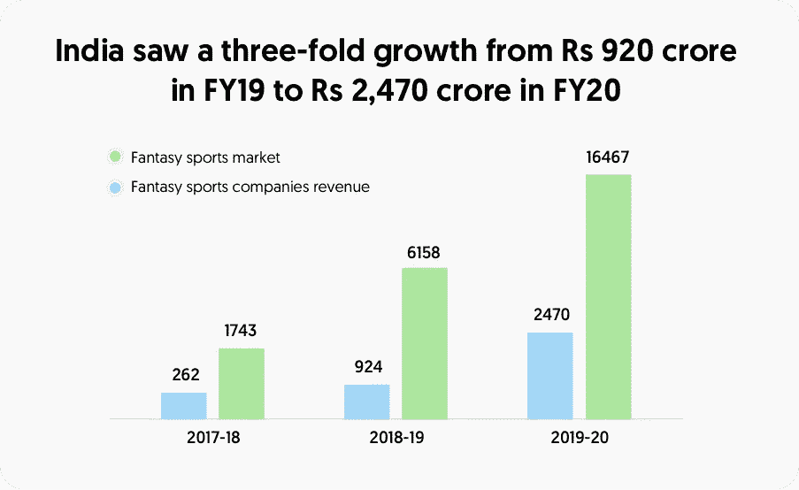

*图片来源:博客。Vinfotech*

这种突然的增长可以归功于 Dream11 和 Gamezy 等平台的出现，这些平台成功地将幻想体育生态系统与板球相结合，并通过以印度顶级板球运动员为特色的广泛宣传确保了最受欢迎的回忆。为了这个项目的目的，我们将使用 **Dream11.com 的**平台来选择我们的 playing 11。 ***Dream11*** 是一个梦幻体育游戏平台，为用户提供梦幻板球、曲棍球、足球、卡巴迪和篮球联赛。它多年来的成功使它被归类为印度博彩业的第一只独角兽。

# 团队选择的传统方法

在这种虚拟体育平台上选择球队的通常方法是考虑球员最近的表现，并根据被选球员在即将到来的比赛中的表现进行选择。这需要一个人能够访问所有球员最近表现的数据，并且在考虑选择谁之前为每个球员进行多场比赛并做笔记可能是一项乏味的任务。这一过程由于某些限制而变得更加复杂，例如对某一特定位置所选球员的最低和最高限额，或者从一个队中所选球员的最高限额。另一种选择团队的方法是完全凭直觉；然而，这种性质的方法将伴随着高风险。随着 Dream11 推广其 **'Khelo Dimag Se'** 活动，我们将利用 Python 的功能来利用机器学习算法和优化技术的力量，以确定将最大化我们积分的最佳 11。

# 场景

我们将从 IPL 2021 和 WT20 2021 的比赛中创建我们的基础数据。这将包括玩家在梦里的 11 分以及他们在各自比赛中的统计数据。使用来自基础数据的信息，我们将尝试预测澳大利亚和新西兰之间 WT20 决赛的最佳比赛。

# **进场**

> 我们的目标是编写一个程序，为我们提供 Dream11.com 上最好的 11 人，以及选择谁作为队长和副队长的建议。

我们将分 6 步完成:

1.收集所有 IPL 2021 和 WT20 2021 比赛的 Dream11 积分数据，直到超级 12 赛段结束

2.收集参加这些比赛的所有球员的比赛数据

3.建立一个模型，将玩家的统计数据作为输入，并将梦的 11 点作为这场比赛的输出。让我们将这个模型命名为— ***点 _ 模型***

4.此外，收集即将到来的比赛中竞争的两个队的球员名单。

5.对于所有这样的玩家，提取过去两年 T20Is 的统计数据，并为每个玩家建立单独的预测模型。该模型将获取特定比赛各自的统计数据，并尝试预测下一场比赛中将要得分的得分、将要进行的比赛、将要进行的投球和将要进行的击球

6.使用在先前步骤中为每个玩家获得的预测统计数据作为先前创建的的 ***points_model*** 的输入，然后进一步预测玩家在下一场比赛中将获得的梦幻 11 分

7.使用优化技术，选择最好的 11 个将最大限度地提高我们的点

# 创建基础数据

## 数据收集

为了确定我们将用来预测梦 11 点的模式，我们首先需要数据。因为这是一个我们从头开始构建的工具，所以我们没有任何我们想要的格式的数据。因此，需要收集数据，为了了解我们的数据收集方法，让我们首先了解 Dream11 的积分系统。

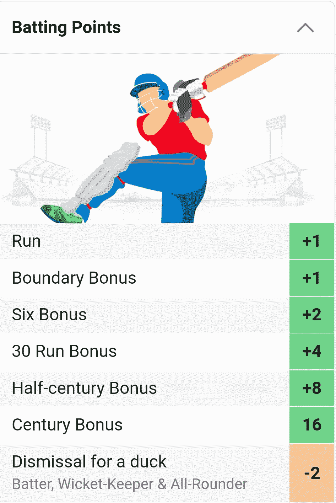

资料来源:Dream11.com

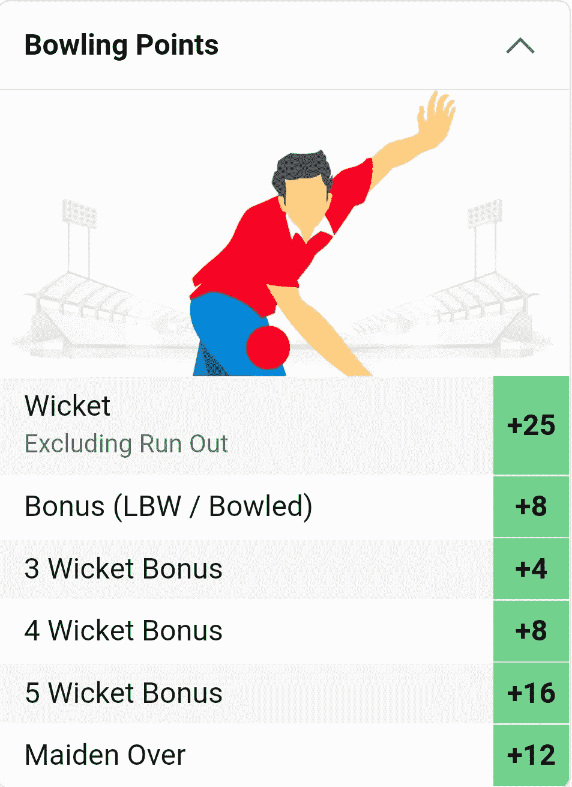

资料来源:Dream11.com

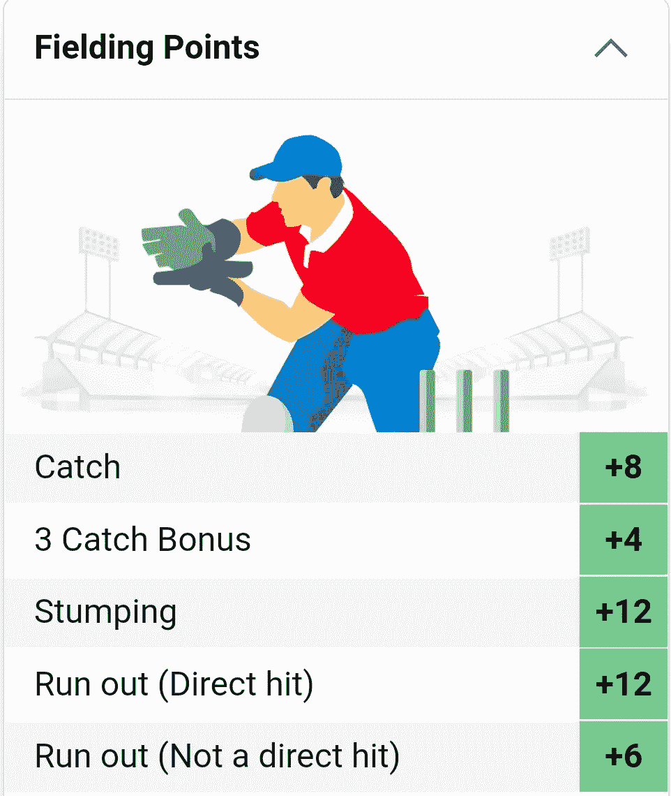

资料来源:Dream11.com

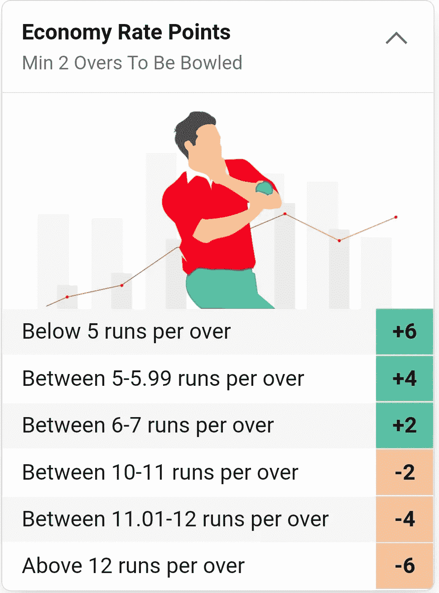

资料来源:Dream11.com

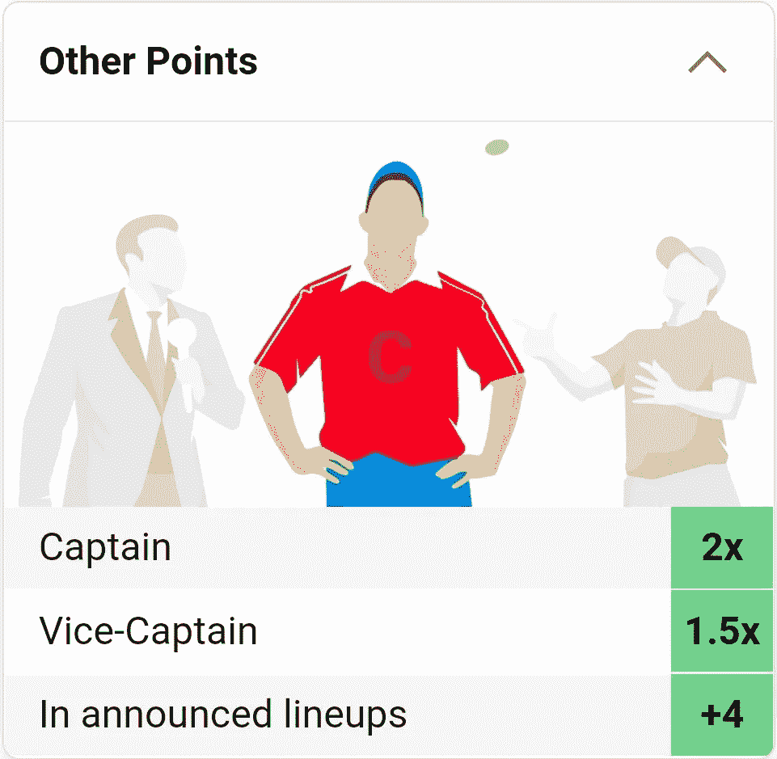

资料来源:Dream11.com

从上面，我们知道了决定比赛得分的因素。因此，对于我们的模型，我们需要为其中的所有球员收集以下数据点——**得分、打球、出局或未出局、击球命中率、50 分、100 分、得分 4s、得分 6s、击球点数%、投球次数、得分率、经济率、保龄球平均水平、保龄球命中率、给定 4s、给定 6s、保龄球点数%、球队、位置、积分和选择百分比。**

我们将使用两个来源来获得上述数据点——Dream11.com 和 Cricmetric.com

1.  Dream11.com

**我们的第一步将是使用 Selenium 从 Dream11.com 提取以下信息。**

1.  **比赛**
2.  **运动员**
3.  **位置**
4.  **信用**
5.  **选择率**
6.  **梦想 11 点**

**我们从 IPL 2021 *(整场比赛)*和 WT20 2021 *(直到超级 12 赛段结束)*的每场比赛中提取所有球员的这些数据点，最终得到 2228 个数据点。**

**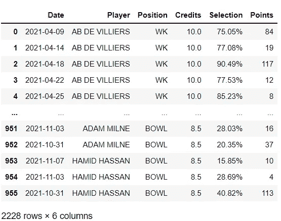**

****2。Cricmetric.com****

**接下来，对于我们从 Dream11 网站收集数据的所有玩家，我们现在将收集在各自的比赛中促成这些分数的统计数据。为了获得所需的统计数据，我们将参考一个名为**cricmetric.com**的网站，在那里我们将分别搜索在 IPL 和 T20 WC 比赛期间每个球员的 T20 和 T20I 击球和保龄球统计数据。我们将使用下面这段代码:**

**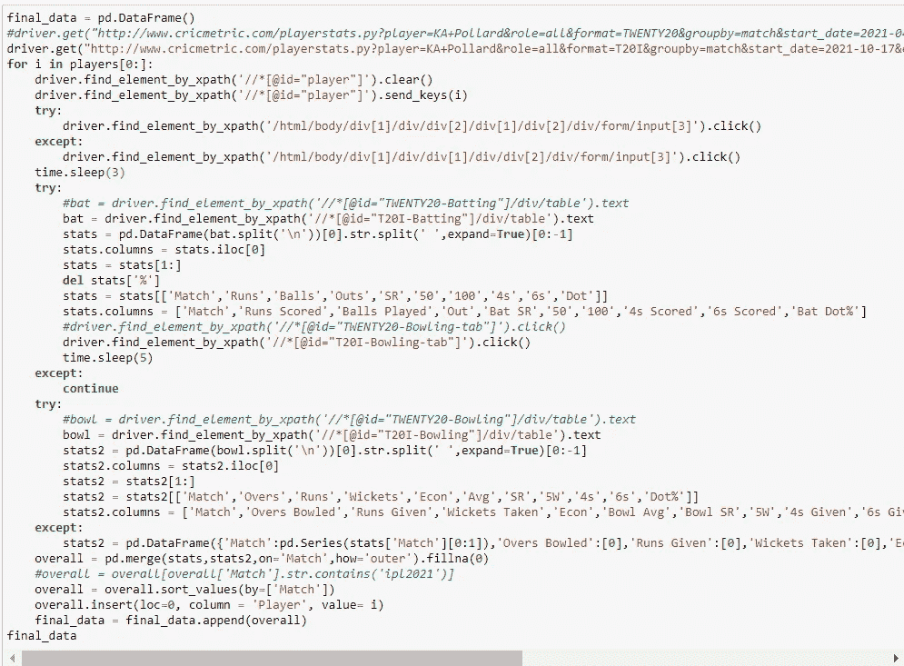**

**对从两个来源获得的数据进行映射，得到如下格式的数据帧:**

**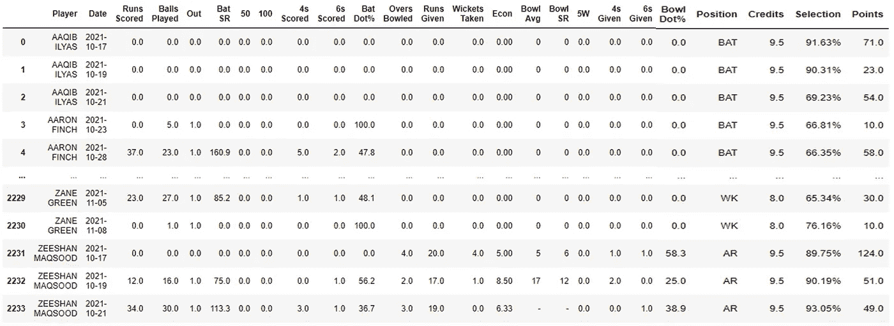**

## **数据预处理**

## ****1。虚拟变量****

**在我们上面得到的表格中，一个重要的列是分类变量，即球员位置。为了能够在我们的模型中使用这个变量，我们首先必须将它转换成一个分类变量。为此，我们添加了三个新列——Position _ BAT、Position_BOWL 和 Position_WK。**

## ****2。添加新列****

**由于我们早些时候了解了 Dream11 的计分机制，我们将处理当前的数据框架，以纳入所有必需的元素。我们进一步派生二进制输入列— 30 次运行奖励、50 次运行奖励、100 次运行奖励、Duck、3 个小门奖励、4 个小门奖励、5 个小门奖励。我们的数据框已经准备好了，我们可以建立我们的第一个模型，即 ***points_model*** 。**

**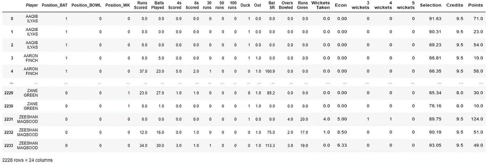**

# **模型结构**

**所有数据点就绪后，我们开始构建模型。我们的目标是找到一个模型，可以采取运行，三柱门，等投入。并根据梦想 11 点提供合理的输出。因此，我们将使用线性回归算法，并试图达到 80%以上的准确性。我们将首先按照默认的 80:20 的比例将数据框分为训练集和测试集，然后将训练集放入回归模型。**

**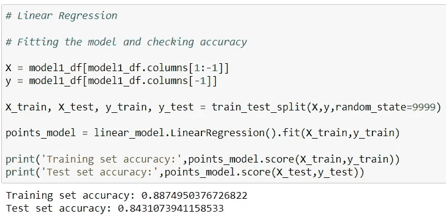**

**我们的模型给出了相当不错的准确度，训练集为 88.7%，测试集为 84.3%。**

# **表演时间—应用我们的模型！**

****

**约根德拉·辛格在 [Unsplash](https://unsplash.com?utm_source=medium&utm_medium=referral) 上的照片**

## **数据收集**

**我们现在将测试我们的模型，看看它在新的比赛中表现如何。我们将检验模型的比赛是澳大利亚和新西兰之间的世界杯决赛。就像我们获得我们的基本数据的细节一样，我们将从 Dream11.com 提取比赛的名称、位置、锦标赛积分、积分、选择百分比和球队。对于世界杯决赛，我们得到以下数据帧。**

**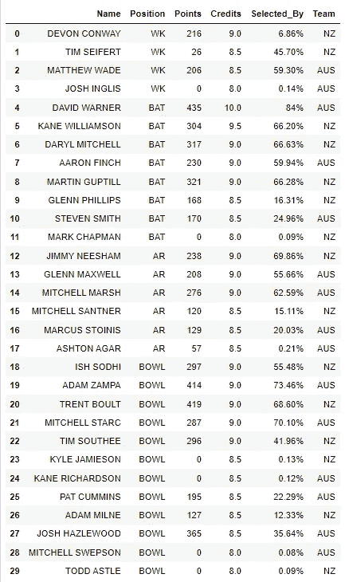**

**现在我们已经到了项目最关键的阶段。为了能够预测这场比赛的分数，我们需要单个球员的统计数据，我们可以使用这些数据作为输入。由于我们的目标是在比赛开始前选择一支球队，我们需要输入最能代表球员在即将到来的比赛中表现的数据。**

**有几种方法可以做到这一点；但是，出于我们的目的，我们将遵循以下步骤:**

**1.从 cricmetric.com**提取 T20Is 中每个球员过去两年的数据****

****2.使用*添加新的得分栏，以及下一场比赛中打出的球。移位(-1)* 功能。我们将它们分别标注为 ***next_runs*** 和 ***next_balls*** 。目标是使用前一场比赛的击球统计数据来预测下一场比赛的得分和击球****

****3.类似地，添加三个新列，包括投球次数、给定跑垒次数和下一场比赛的三柱门次数。我们将它们分别标注为****next _ runs _ given***和 ***next_wkts*** 。目标是使用前一场比赛的保龄球统计数据来预测下一场比赛的投球次数、跑垒次数和击球次数*****

*****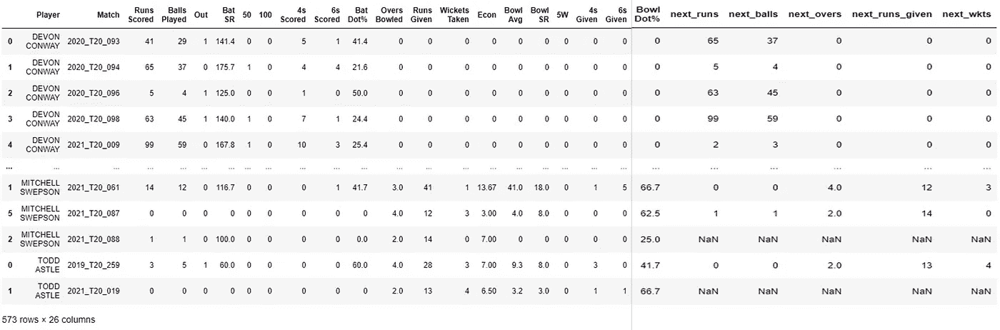*****

*****4.一旦以我们期望的格式获得了数据帧，我们将采用一种技术，在这种技术中，模型学习得分、打球、击球等的模式。，在下一场比赛中，根据上一场比赛的统计数据为每个球员单独计算。每个球员各自的模型将根据他们在半决赛中的表现来预测他们在世界杯决赛中的表现*****

*****5.当预测变量多于观测值时，岭回归是比最小二乘回归更好的预测变量。由于这在大多数玩家的情况下是真实的，并且考虑到我们需要一个通用的模型，我们将在这里使用岭回归进行预测。如前所述，我们将每个玩家的数据按照 80:20 的比例分成训练集和测试集。然后，我们将为[0，100]范围内的每个 alpha 值计算训练集和测试集的模型准确性。然后，我们将使用**值来拟合模型，该值为训练集和测试集提供最高的平均准确度*******

*****6.基于每个人的模型，将预测下一场比赛中要得分的得分、要打球的得分、要投球的得分、要得分的得分和要得分的得分*****

*****用于预测下一场比赛得分和打球数的输入— ***得分、打球数、出局数(不管是否出局)、击球得分、50 分、100 分、4 分、6 分、击球点数%********

*****用于预测下一场比赛的投球次数、给定跑垒次数和击球次数的输入— ***投球次数、给定跑垒次数、击球次数、经济率、保龄球平均水平、保龄球 SR、给定 5W、4s、给定 6s 和保龄球点数%********

*****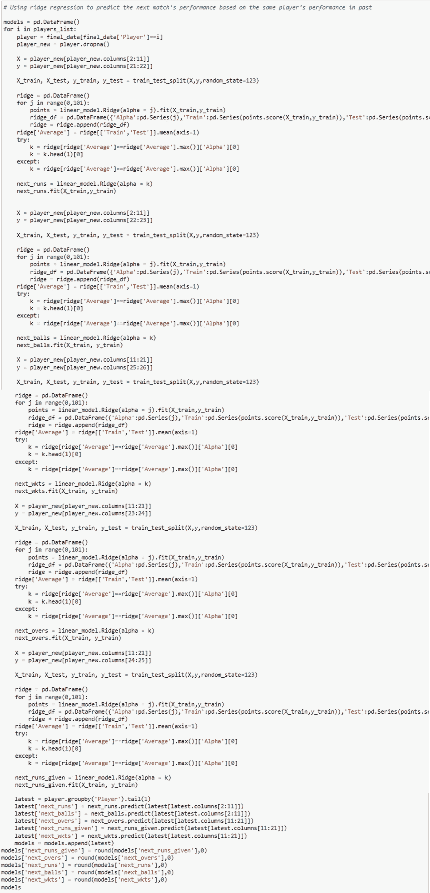*****

*****上面这段代码将为我们提供每个球员在之前比赛中的击球和保龄球统计数据，以及世界杯决赛的预测统计数据。我们进一步将结果与之前从 Dream11.com 获得的数据进行映射，以完成我们的数据框架。*****

*****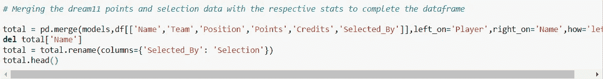**********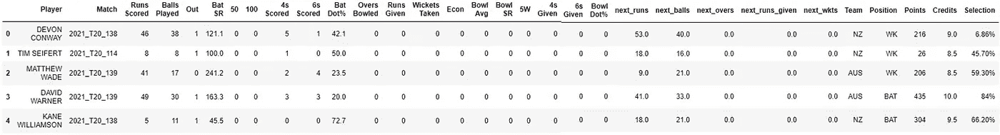*****

*****让我们也来看看一些保龄球手的数据。*****

*****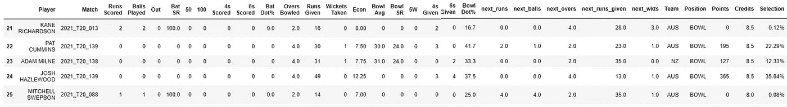*****

## *****数据预处理*****

*****现在我们已经有了下一场比赛的预测统计数据，我们需要预处理这个数据帧，将它转换成可以输入到 ***points_model 的格式。*** 由此可见，我们将*****

*****1.为球员位置添加虚拟变量*****

*****2.派生列— ***30 分奖励、50 分奖励、100 分奖励、鸭、三柱奖励、四柱奖励、五柱奖励、击球率和保龄球经济率********

*****3.在将输入输入到模型中之前，我们还需要三个额外的列。这些是— ***4s 进球，6s 进球和出局(解散与否)*** 。就像跑垒和三柱门一样，我们必须预测一个球员会打出多少个 4 和 6，以及他是否会被罚下。同样，有许多方法可以做到这一点，但我们将使用线性回归模型的四和六和逻辑回归模型的解雇。我们将使用我们的基本数据集为每个人创建三个不同的模型，输出为得分的 4 分的数量、得分的 6 分的数量以及球员是否被解雇*****

*****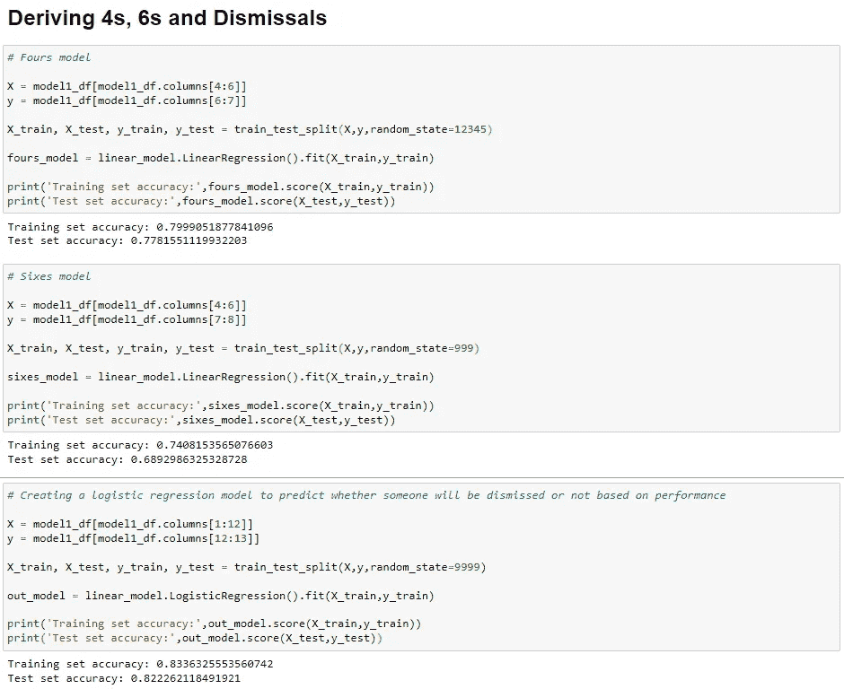*****

## *****预言；预测；预告*****

*****现在一切就绪，让我们来预测***十指交叉*！*******

*****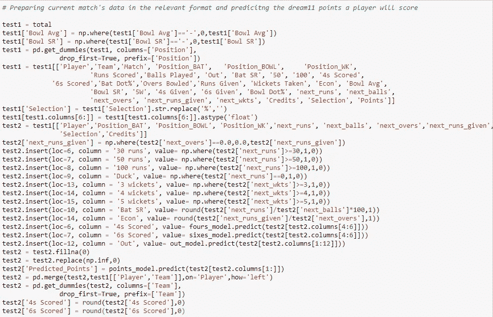*****

*****让我们看看我们的模型在暗示什么。*****

*****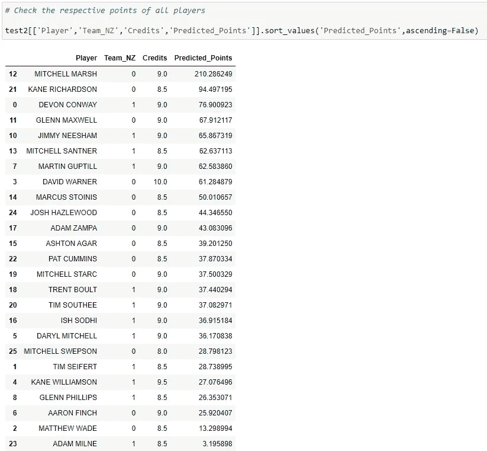*****

*****我们的模型表明，米切尔·马什即将进行一场疯狂的比赛*(他确实做到了！).然而，这是整个阵容的名单，并不是每个人都会成为 11 人名单的一部分。抛硬币后，Dream11 给你 30 分钟时间从 22 名参赛选手中选择你的队伍。因为我们有 11 名球员的信息，我们将把自己限制在那一批。******

*****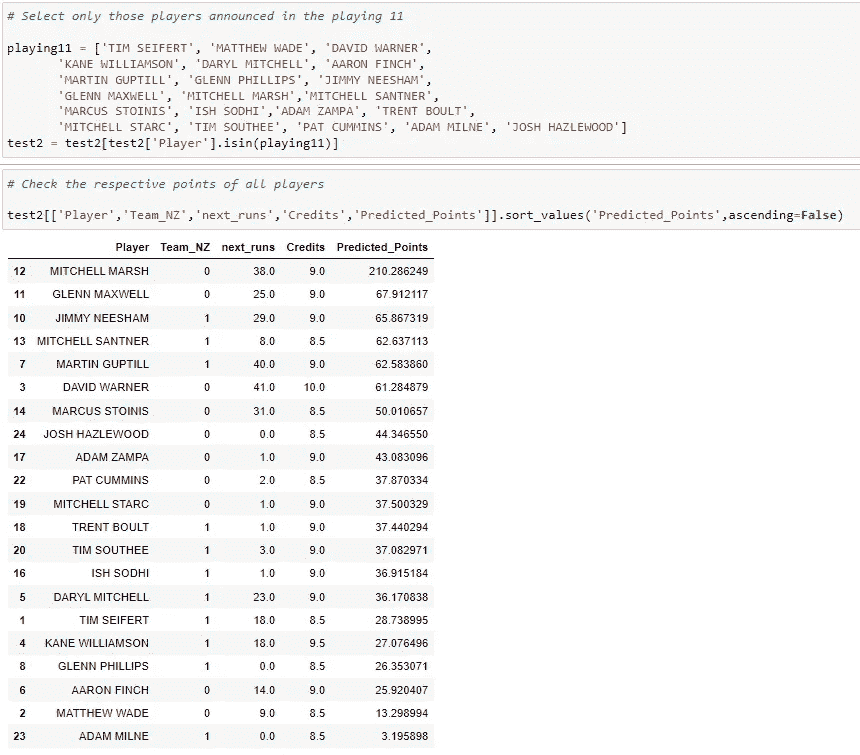*****

## *****优化模型*****

*******到目前为止，一切顺利！我们有 22 名球员的名单，他们参加了世界杯决赛，并以他们的表现预测了他们的梦想 11 分。然而，考虑到 Dream11 的团队选择规则中列出的几个限制，我们只能从这个批次中选择 11 个。让我们来看看我们必须处理的所有**约束**:*******

1.  ***最少 3 名，最多 6 名击球手***
2.  ***最少 3 人，最多 6 人***
3.  ***最少 1 个，最多 4 个***
4.  ***最少 1 名，最多 4 名全能选手***
5.  ***11 名球员***
6.  ***信用总额在 100 以内***
7.  ***一队最少 4 人，最多 7 人***

***这现在成了我们要解决的经典优化问题。我们的目标是在遵守上述约束的同时最大化我们的预测点。***

***我们将使用纸浆库来初始化我们的线性规划问题，并随后如下定义目标函数和约束:***

***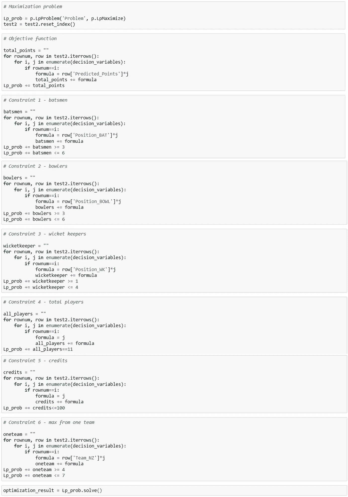***

***最后……我们实现了我们的梦想！在这场比赛中最大化我们分数的队伍如下:***

***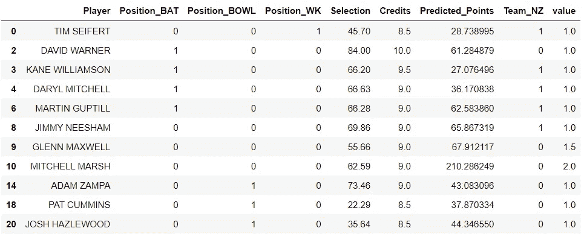***

***让我们进一步探索我们选择的团队的更好的方面。***

***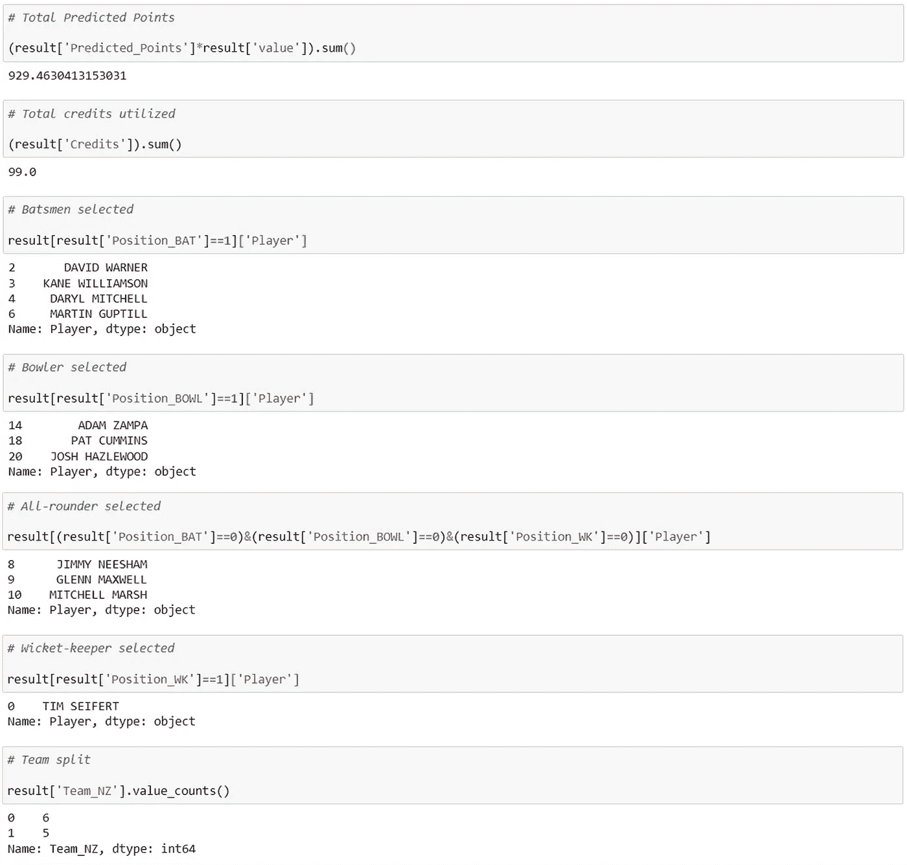***

***我们模型的建议符合选择标准。***

## ***船长和副船长的选择***

***不管选择哪支球队，对任何人来说，最大的游戏规则改变将是队长和副队长的选择。被我们选为队长的球员得分翻倍，被选为副队长的球员得分 1.5 倍。***

***根据预测得分，选择得分最高的 2 名球员担任队长和副队长似乎是理所当然的。然而，这些仅仅是预测，在给定的日子里，实际的表现如何总是有不确定性的。Dream11 通过提供每场比赛创建 20 支球队的机会，在某种程度上为你提供了一个防止这种不确定性的选择。我们将使用该功能为同一组 11 名球员选择 20 种队长和副队长组合，这将使我们的预测点数最大化。***

***下面的代码将创建 11！由 11 名球员组成的队长和副队长组合。机长将被赋值为 2，副机长被赋值为 1.5，其余的被赋值为 1。每个玩家的预测点数将与每个组合的相应值相乘并相加。从所有组合中，我们将获得得分最高的前 20 个组合，如下所示:***

***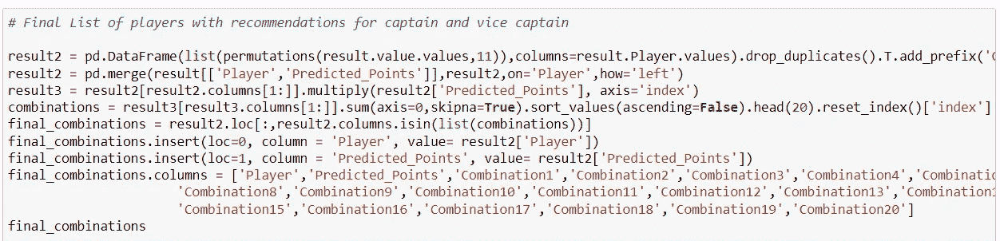******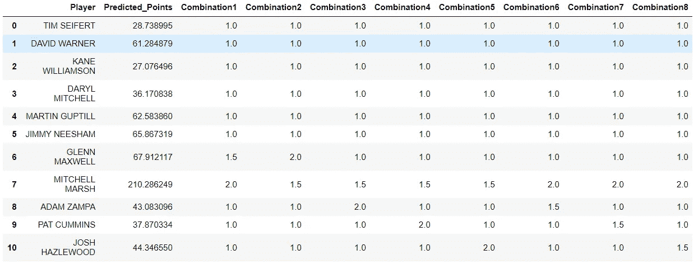******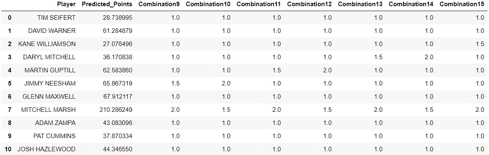******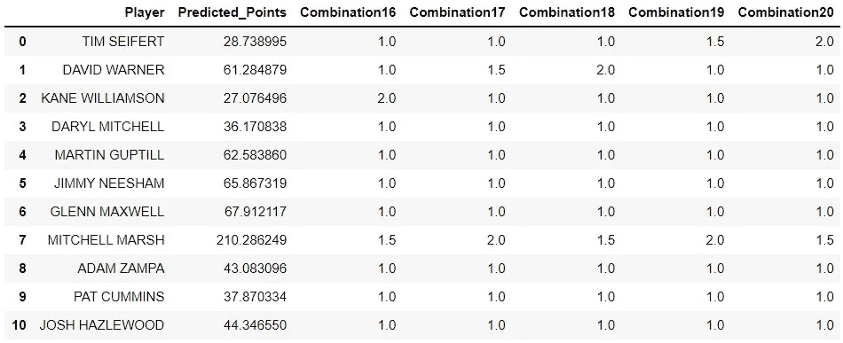***

*****为了解释上面的**——在组合 1 中，我们的模型建议我们让米切尔·马什担任队长，格伦·麦克斯韦尔担任副队长。在 12 号组合中，建议让马丁·古普提尔做队长，米切尔·马什做副队长。***

***所以我们有它！我们已经设法处理了一些数据，并使用机器学习模型为我们在 Dream11 上的幻想联盟选择了一个由 11 名球员组成的团队。由于我们测试模型的比赛已经发生，我们可以检查我们的建议与球场上的实际表现相比如何。***

# ***检查模型性能—与实际 Dream11 数据进行比较***

***在每场比赛结束时，Dream11 都会发布一个名为**梦之队**的东西，这是这场比赛中产生最高分数的 11 名球员的最佳组合。让我们来看看这场比赛的梦之队。***

***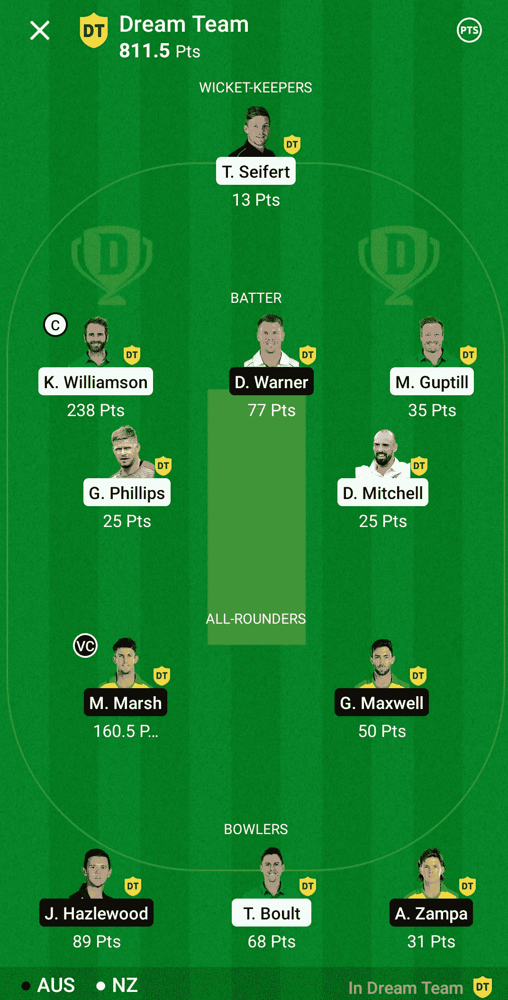***

***资料来源:Dream11.com***

***如你所见，我们的模型准确地推荐了 11 个玩家中的 9 个。唯一不同的是，我们的模型建议我们选择帕特·卡明斯和吉米·尼舍姆，而不是特伦特·博尔特和格伦·菲利普斯。***

***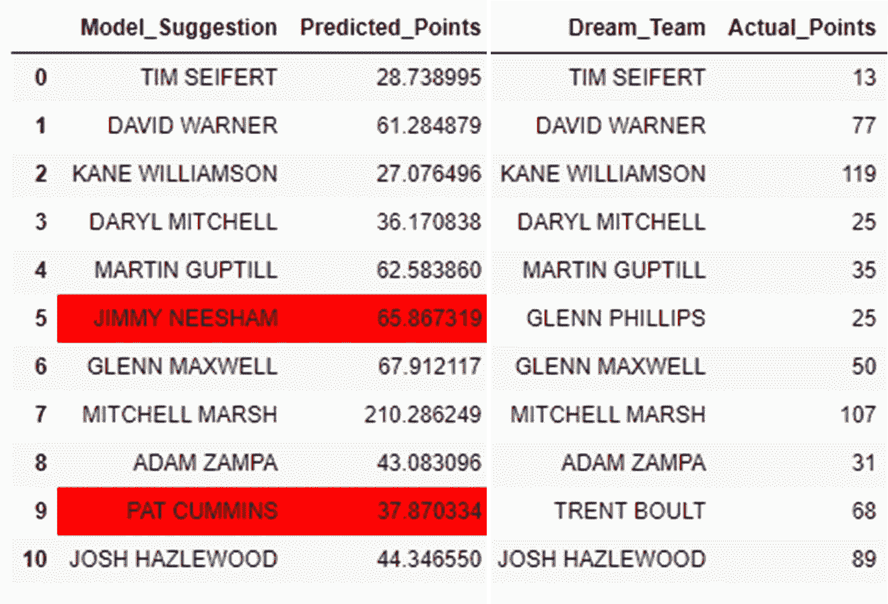***

***虽然个别点与实际点相差很大，但我们不会太在意，因为我们的目标是最大化总点。让我们看看我们之前得到的 20 个组合中的每一个组合的实际得分，并将其与预测得分进行比较。***

***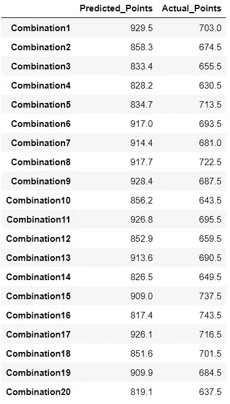***

***我们本可以获得最高分——743.5 分(通过组合 16 ),而且确实获得了可观的利润。我们试图设计一个科学的团队选择方法进展顺利，我们非常接近顶峰，即梦之队，在实际点。***

# ***缺点***

***与梦之队 68 分的差距可以归因于我们的模型选择吉米·尼舍姆而不是格伦·菲利普斯，选择帕特·卡明斯而不是特伦特·博尔特。Neesham 在这种形式下出色的全面记录导致了比 Glenn Phillips 更好的预测统计，Glenn Phillips 对于国际板球来说是相对较新的，同样的情况也反映在两个*(如下所示)*之间的预测分的巨大差异上。然而，在第二种情况下，选择帕特·卡明斯而不是特伦特·博尔特仅以 0.43 分之差被击败！***

***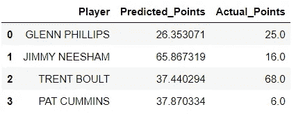***

***嗯，这是一个边缘游戏，就像他们在板球中说的那样。最终，743.5 分和 805.5 分之间的差距仅为 0.43 分，这个分数足以让 T2 在全球排名第二！***

# ***潜在应用***

***1.正如所展示的，这可以是一个伟大的工具，以帮助决策，而玩幻想板球。由此产生的建议旨在使玩家的利润最大化***

***2.板球队也可以使用这种性质的工具来为即将到来的比赛选择他们的比赛。我们的模型表明 Kane Richardson 可能会获得第二高的分数，这表明如果他参加比赛，他可能会有一场非常好的比赛。基于我们的模型所建议的所有球员在实际比赛中表现良好的事实，他会被考虑入选吗？***

# ***限制***

***像每一个模型一样，这也有一些我发现的限制。下面列出了其中的一些:***

***1.某些球员在他们的 IPL/州/特许球队的特定位置上比赛，然后在他们的国家队的不同位置上比赛。这可能会导致下一场比赛的预测数据完全错误。Venkatesh Iyer 代表 KKR 在 6 号位开始比赛***

***2.板球的美妙在于它的不可预测性！趋势可能会在比赛日发生变化，我们模型的建议可能会与实际表现大相径庭。米切尔·斯塔克在 4 轮比赛中得了 60 分，尽管在那之前他是世界杯上最好的投球手之一。凯恩·威廉姆森以 177.08 的好球率打出了辉煌的一局，尽管在此之前他的回报平平***

# ***结论***

***当然，通过尝试替代算法或试验其他/更多参数，还有进一步改进的余地。然而，通过这个项目的过程，我们意识到了机器学习模型在在线游戏领域应用的巨大潜力*(也是从玩家的角度)*。虽然创建这样一个工具的整个过程初看起来可能很复杂，但从长远来看，它拥有简化决策的巨大潜力。***

***我在这个想法上花了很多时间，我希望你喜欢阅读这篇文章。如果你觉得这很有趣，**请鼓掌**和**跟我来**获取我所有未来文章的更新。欢迎在下面留下您的评论，或者通过邮件直接联系 aksbehera@gmail.com**的**。***