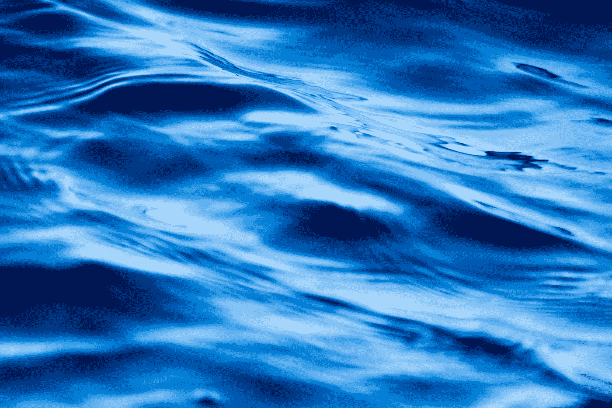
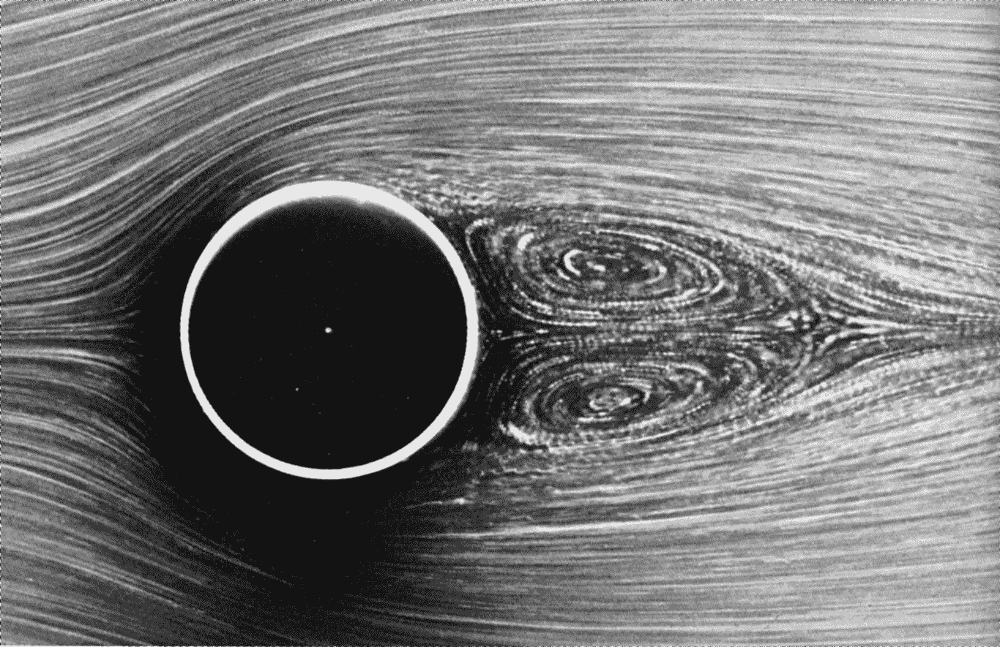

# 流体力学领域中的机器学习简介

> 原文：<https://medium.com/analytics-vidhya/a-short-introduction-of-machine-learning-in-the-field-of-fluid-dynamics-71531f5ee02c?source=collection_archive---------11----------------------->

流体动力学在几乎每一个万亿美元的行业中都扮演着核心角色:健康、国防、交通、能源。

Vansh Juneja 在 [Unsplash](https://unsplash.com?utm_source=medium&utm_medium=referral) 上拍摄的照片

# 流体动力学涉及的主要任务是什么？

*   **模型降阶**或得到模型降阶。
*   **控制**流体流动。
*   弄清楚使用什么传感器来测量( **sense** )流体流量。
*   **关闭**型号以降低复杂性。

而且几乎所有的任务都可以转化为硬优化问题，其主要特点是:

*   **高维度**
*   **非线性**
*   **非凸面**
*   **多尺度**

这些优化问题非常具有挑战性，这增加了计算流体动力学领域进展甚微的事实。

但是让机器学习擅长解决这些问题的是，机器学习实际上是通过优化从数据中创建模型。

现在，为什么*高维*？这是因为流体有许多自由度，而模拟一个有几十亿个自由度的湍流是一件相当乏味的工作。

它是*非线性的*，因为它是由一个非线性偏微分方程表示的，就像斯托克方程一样。

这些结合起来使得这些优化问题非常*非凸*，结果是有许多许多局部最小值，但是我们使用机器学习中的合并技术来解决这个问题，并在这些动态任务中获得牵引力。

流体动力学中使用的机器学习模型应该更加**可解释**和**可推广**，因为它的应用可能会用于高度保持精确度的安全关键情况。

因此，我们在寻找数学上定义为:

*   **稀疏**:以至于像 *F=MA* 或者 *E=MC* 这样的术语很少。
*   **低维**:这样它们就不像流体动力学那样有几十亿的自由度。
*   **对噪声和干扰、新信息等的鲁棒性**。

# 历史和应用

历史上，机器学习源于优化，而优化又受到流体动力学的启发。为了解决流体动力学中的问题，非常需要对样本进行优化，因此优化理论开始生效。

让我们讨论一下利用机器学习在流体动力学方面带来的一些进步:

1.  **模式存在**作者**泰拉等人，2017**

模式存在于非常非常复杂的流动中，就像天空中云的流动一样。在自然界中，有一些非常复杂的大流量，类似于简单得多的基本流量，可以建模并进行稳健模拟。这是机器学习进入流体动力学的第一个影响。许多机器学习都专注于提取、表征或利用大数据(如图像数据或流场数据)中的低维或主导模式。

照片由 [Zbynek Burival](https://unsplash.com/@zburival?utm_source=medium&utm_medium=referral) 在 [Unsplash](https://unsplash.com?utm_source=medium&utm_medium=referral) 拍摄

因此，我们提取流体流动模式的一个常用算法是 **POD** ( **固有正交分解** ) / **PCA** ( **主成分分析**)，其中，如果我们从原始流场中减去平均流量，并执行奇异值分解或 PCA，我们可以将原始流体流动有效地表示为仅仅几个本征流场的总和。

2.**稳健主成分分析？**作者**坎迪斯等人，2011 年**

在论文中，作者采用了经过圆柱体的低雷诺数相干流，并添加了大量的盐和胡椒污染，因此每个像素都有被完全破坏的随机机会，而不是附加噪声。通过使用现代优化技术的鲁棒统计算法，她能够将流分解为真正的低秩分量，其特征是只有几个 POD 模型和所有盐和胡椒噪声。因此，她能够将数据分离成我们想要的干净数据和噪音。

流过圆柱体

3.**数据时代的湍流建模**作者**kart hik Duraisamy**等人 2018

从 **Kolmogorov 湍流能量级联，1940** 我们可以推断出现实世界的流体在空间和时间上可能有许多数量级。但是模拟所有的尺度在计算上是昂贵的，因此，我们可以近似地计算较小尺度的模型如何影响我们真正关心的较大能量尺度的模型。这是**闭包建模**的巨大领域，是当前十年的研究焦点。

在本文中，作者讨论了在*雷诺平均纳维尔-斯托克斯* ( **RANS** )技术中进行闭合的过程，以模拟湍流特性的假设。他们结合了统计推断和机器学习策略来制作模型。前者提供了使用数据驱动技术的模型校准的坚实框架，而后者提供了基于大量一般特征的函数公式化的灵活性。

4.**林小微等**利用具有嵌入不变性的深度神经网络**进行雷诺平均湍流建模，2016**

**冉**的闭包模型侧重于封闭模型，以解决我们不想完全解决的小规模和快速术语。因此，作者所做的不是创建一个大的深度神经网络，这是一个显而易见的事情，他们所做的是建立一个带有额外张量输入层的自定义层的模型，允许他们编码或加强关于流体流动的先验物理知识。流体流动不仅仅是无结构的电影或图片，它还涉及到更多的物理学，如动量守恒、对称性等。他们所能做的是将这些对称性和不变性直接嵌入到他们的神经网络中，这样他们的模拟在结构上就是物理的。

5.**增强！具有机器学习的 RAISR 清晰图像**作者 **Peyman Milanfar 等人，2016 年**

通过训练图像数据集或流场，它输出流场的低分辨率版本或下采样版本，并从相同的图像重建具有更多细节的更高质量的图像。类似于闭合问题的是超分辨率问题，其中我们从失真的流场输入图像中对输出进行降噪并重建细节。

该算法充当一个*插值器*，其中输入视频中的帧随机夹杂着噪声，我们从视频中随机抽取帧来训练该算法，然后我们用训练数据中出现的一些帧进行测试。

在*外推*任务中，这对于许多流动问题来说更加现实，比如如果我们想用它来预测未来的天气，或者下个月地球周围的流场将会如何，这被称为未来外推问题。这些问题很难解决，模型产生的结果会随着时间的推移而退化。

6.**近壁湍流**的神经网络建模 **Milano 和 Koumoutsakos，2002**

**恰当正交分解(POD** s) **/主成分分析** ( **PCA)** 可以写成一个浅层单隐层自动编码器神经网络。因此，我们可以将 **PCA** 集成到一个神经网络中，更好的是，我们可以概括或扩展该神经网络，使其具有许多隐藏层和非线性激活函数。因此，我们可以构建这些深度自动编码器，以更好地压缩或减少信号，作为输入，我们可以获得高分辨率的流场图像，中间层将是主导或相干结构的潜在变量。在解码器中，这些变量将用于估计整个图像。所以有这个压缩和解压缩流场的信息瓶颈。

在我们通过 **POD** 或**自动编码器**提取这些模式后，比方说对于流场，我们可以在低维坐标中获得非常非常简单的表示，然后我们可以使用数据驱动的方法使用这些坐标，如 **SINDy** (非线性动力学的稀疏识别)来构建非常高效的模型，以了解这些模型如何纯粹为了测量数据而随时间演变( **Loiseau 和 Brunton，2018** )。

# 流控制

有了模型和提取模式后，最终目标之一是实际控制流体，不是说我们只是想了解它和建模，而是我们还想操纵流动。所有这一切都是因为对流场和控制律进行了非常原则性的优化，并考虑到了一些目标，这些目标来自现实世界，即我们是否想要增加升力，或减少阻力，或增加燃烧室中的混合，因此没有魔法，所有这些都是优化问题，可以通过机器学习工具越来越好地解决。

**复杂物理系统在线学习的深度模型预测控制**由 **Beiker，Peitz 等人，2019** 表明，在非常复杂的流动系统的情况下，他们所做的不是使用过于昂贵的纳维尔-斯托克斯方程，而是使用机器学习来建立这些快速、准确、可实时用于反馈控制的代理模型。在这种情况下，他们使用了模型预测控制。

# 结论

最后，需要指出的是，很多机器学习和流体建模和控制确实是从生物学中得到启发的，所以很多机器学习都来自于想要了解我们的生物系统， 我们的大脑和神经系统是如何如此无缝地工作来做出决策，理解和与世界互动的，在流体力学中，我们有一些希望，我们可以实际上与复杂的流体互动，理解，建模和控制，因为生物学在某种意义上提供了存在的证据，证明与这些非常非常湍流的复杂流场互动是可能的。