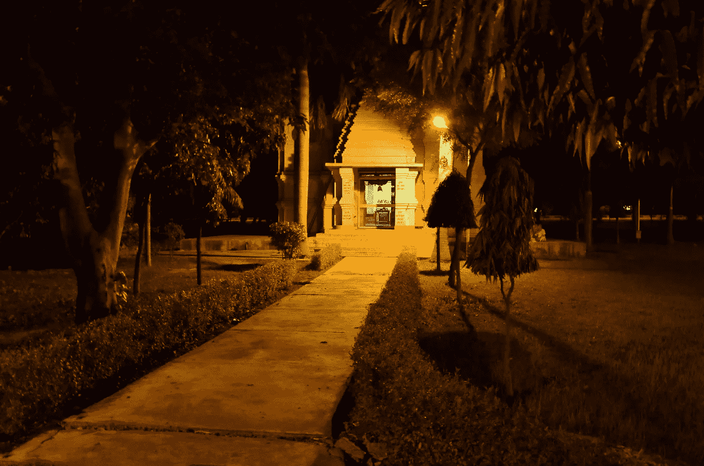

# StyleGAN 简介

> 原文：<https://medium.com/analytics-vidhya/a-short-introduction-of-stylegan-898fe781937?source=collection_archive---------4----------------------->

比哈尔邦达尔班加

生成模型(GAN)一直是深度学习领域的利基和难以掌握的领域。控制输出图像的不同特征一直是一个具有挑战性的研究课题。StyleGAN 是一种解决这方面问题的方法。它与 GAN 的传统架构保持距离，并引入了一种新的方法来生成高分辨率的合成图像，同时对不同的特征进行合理的控制…