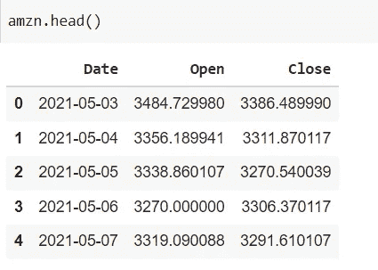

# 使用 Python 的简单日夜策略

> 原文：<https://medium.com/analytics-vidhya/a-simple-day-and-night-strategy-using-python-a36c18578161?source=collection_archive---------2----------------------->

在股票交易中，交易者总是有策略的。策略是我们交易时遵循的一套规则，以最小化风险和最大化利润。这有助于成为一个更有纪律的交易者，并且总是带着计划进入市场。

在本文中，我们将介绍其中一种交易策略——日夜交易策略，并向您展示使用 python 实现该策略的算法。

日夜策略是基于这样一种理论，即股票价格的主要变动发生在一夜之间，而不是在交易时间。

以下策略之所以有效，是因为有证据表明，市场的开市和收盘对短期价格走势、交易量和波动性有影响。

我们将用 python 实现一个计算股票隔夜回报率的计算机程序。在这里，我们将测试我们对亚马逊和苹果股票的策略。

在这个程序中，你输入你想投资亚马逊和苹果的金额，还输入投资日期。该计划给你每天的利润或损失，直到当前日期，最后告诉你当前的投资价值和总利润。

注意:这仅用于教育目的。

完整的代码可以在这里找到。

 [## 莫莫-森派/日间-夜间战略

### 算法交易策略。在 GitHub 上创建一个帐户，为 momo-senpai/Day-NightStrategy 开发做出贡献。

github.com](https://github.com/momo-senpai/Day-NightStrategy) 

通过下面的 6 个步骤，你可以为自己建立一个日夜策略实施算法

**制定策略的指令:**

以下是执行隔夜策略的步骤:

**第一步**:首先我们将为这段代码导入必要的模块。使用的模块有:

1.  熊猫:用于创建数据框
2.  Yfinance:用于访问股票数据
3.  日期时间:用于访问日期和时间

要在您的系统上安装这些模块，请使用 pip 安装程序。

现在导入模块。

**步骤 2** :现在我们将接受用户输入的投资金额和投资日期。

**第三步**:我们会下载亚马逊和 AAPL 从投资之日到当前日期的股票数据。为了下载数据，我们使用:

yf.download(ticker，start_date，end_date)其中 ticker 是股票的符号，对于亚马逊是 AMZN，对于苹果是 AAPL。

数据会是这样的。

**第四步**:清理数据。对于这种策略，我们只需要股票的开盘价和收盘价。因此，我们将删除所有其他列。

删除不必要的列后的数据

**步骤 5** :现在我们将计算每一天的隔夜回报率百分比。计算隔夜回报的逻辑是用前一天的收盘价减去当天的开盘价。所以是:

(打开—上一页。收盘)/上一周。关闭* 100

注意:这里 shift(-1)用于获取前一个值。

**第六步**:最后一步是计算每天的盈亏，当前投资价值，总利润%。并将其打印到输出中。

**最终输出:**

亚马逊的最终输出

苹果公司的最终产量

**性能分析**

从上表可以看出，无论是苹果还是亚马逊，昼夜策略都比简单的长期持有策略(即购买并永远持有)带来了更好的回报。你可以使用这种策略，在收市前买入，第二天开市时卖出

在⅞案例中，日夜策略击败了长期持有策略，在更长的时间框架内可以获得更好的回报。这再次证明了大多数股票价格变动都是在一夜之间发生的。虽然这是一个伟大的战略，但它仍然有一些缺点。

利弊:

这种策略的一些优点是:

*   它不受市场时间波动的影响。
*   在营业时间，动量和流动性都很高，所以交易没有困难。
*   资本面临短期风险。

这种策略的一些缺点包括:

*   受财务报告的影响很大。
*   不能免于新闻引起的价格变化。

可以通过以下方式改进这一战略:

*   把周末作为回报的一个因素。
*   考虑到新闻和财务报告的变化。
*   使用订单数据进行回溯测试。

还有许多其他算法交易策略非常容易理解和实施，类似于日夜策略。其中一些包括:

*   基于趋势的策略:根据确定的趋势进行交易。
*   套利交易:利用不同市场的价格差异。
*   均值回归:基于价格波动后回到均值的理论。

感谢您的阅读。希望这篇文章对你有所帮助，也希望它能给你一个模板，让你将来学习和编写自己的策略。