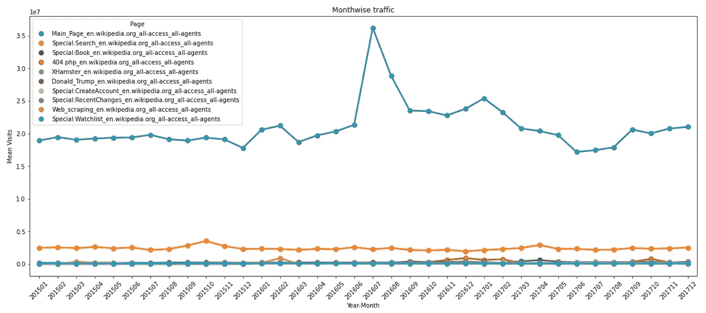
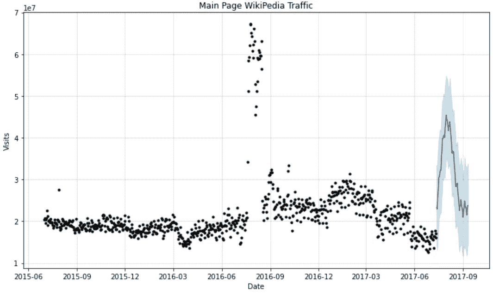

# 关于时间序列预测的简单而深入的指南

> 原文：<https://medium.com/analytics-vidhya/a-simple-in-depth-guide-on-time-series-forecasting-786ee86cf67c?source=collection_archive---------2----------------------->

时间序列(x =日期，y =访问次数)

欢迎来到我的博客，这篇文章是关于时间序列分析和预测的。

让我们来理解两个术语:
**:时间序列是按时间组织的数据点的集合。
**预测**:是一种根据历史数据预测未来的技术。**

****简介:****

**我们不都想预测吗？不管是股票市场还是金属价格等等，我都愿意。它还帮助企业为未来做好准备，制定计划，了解需求，并据此进行投资。**

****项目概述:****

**感谢 [Kaggle](https://www.kaggle.com/c/web-traffic-time-series-forecasting/data) 提供数据集。数据包含 2 年多来每天对英文维基百科网站的访问。此外，我们可以知道流量是来自桌面(PC)还是移动或蜘蛛(网络爬虫)。目标是能够使用机器学习模型预测交通。**

****问题解决方法:****

**我将从理解数据开始，使用可视化和探索性数据分析进行深入研究，然后使用时间序列模型预测访问量，最后使用一个指标来检查哪个模型具有更好的性能。**

****第一部分:**交通格局如何？当我们看整体与桌面或移动与蜘蛛(网络爬虫)时，情况是否相似？**

**最初我认为，他们中的大多数人会有相似的趋势/模式，但数据显示并非如此。
查看图表(下面的图 1 & 2)，可以清楚地看到整体流量模式是由桌面(PC)驱动的，而移动&蜘蛛是扁平的。
从整体流量来看，除了 2016 年初出现巨大峰值之外，从第 08 个月到第 12 个月，流量逐年增加。**

****

**图 1:维基百科页面的访问趋势(整体而言，桌面和移动)**

****

**图 2:维基百科页面的访问趋势(总体而言，蜘蛛)**

****第二部分:**排名前 10 的页面有哪些？我们能推断出什么共同的模式吗？**

**总体流量是桌面、移动和蜘蛛的组合。为了避免重复计算，我们将在这里查看整体访问。**

****

**图 3:流量和访问趋势排名前 10 的页面**

**以下是按访问维基百科页面的降序排列的前 10 个页面。
I)Main _ Page _ en . Wikipedia . org
ii)Special:Search _ en . Wikipedia . org
iii)Special:Book _ en . Wikipedia . org
iv)404 . PHP _ en . Wikipedia . org
v)XHamster _ en . Wikipedia . org
VI)Donald _ Trump _ en . Wikipedia . org
VII)Special:create account _ en . Wikipedia . org
VIII)Special:recent changes _ en . Wikipedia . org**

**看上面的图 3，维基百科主页是总流量和趋势的主要贡献者。其余 9 个维基百科页面是一致的。**

****第三部分:**建模前的数据准备**

**因为主页的流量最高&这个模式与所有维基百科页面的模式相似，所以我会预测“主页”**

**在开始时间序列数据建模之前，我们需要注意两件事情。**

****I)分解**:我们需要将时间序列数据分解成若干组成序列:
a)趋势:反映序列的长期进展。趋势可能是增加/减少/非线性的
b)周期性的:时间的这个组成部分反映了重复但非周期性的波动。波动的持续时间取决于时间序列的性质。
c)季节性:这种成分存在于时间序列受季节性因素影响的任何时候，例如:黑色星期五/网络星期一等期间的销售增长…
d)噪声:这种成分描述随机的、不规则的影响。这代表去除上述三个分量后的残差。**

****II)平稳时间序列:**是一种性质不依赖于观察时间的时间序列。
一般来说，一个稳定的时间序列没有可预测的长期模式。时间图将显示系列大致水平(尽管一些循环行为是可能的)，具有恒定的方差。**

**首先，让我们将时间序列分解成多个部分，如上所述:**

****

**图 4:时间序列的季节性分解**

**从左图可以看出，趋势表明，流量会随着时间的推移而增加。
在所有 2 年以上的每日数据中，我们在初始部分看到季节性峰值。
残差似乎是静止的。**

**除了可视化，让我们在数据集上执行一个统计测试“增强的 Dickey-Fuller (ADF)测试”。
我们以 90%/95%/99%的置信度运行该测试，以检查时间序列是否平稳。**

****

**图 5: ADF 测试，用于检查时间序列是否平稳**

**这个测试证实了我们的时间序列数据是稳定的，我们可以继续建模。**

****第四部分:**拟合模型**

**我将数据分为训练和测试，根据训练数据拟合模型，并根据测试数据预测模型&通过比较实际数据和预测数据，看看模型的表现如何。**

**我将使用三个模型:
萨里马克斯
Fb 先知
LSTM**

****A) SARIMAX:
SARIMAX** 是 ARIMA 模型的延伸，带有季节性成分。ARIMA 代表自回归综合移动平均线。**

**在开始建模之前，让我解释一下这个模型中涉及的元素。
1)趋势元素——有 3:
p:趋势自回归顺序。
d:趋势差序。
问:趋势移动平均线下单。
2)季节性因素——有 4:
P:季节性自回归顺序。
D:季节性差异订单。
问:季节性移动平均订单。
m:单个季节周期的时间步数。**

**SARIMAX 模型的符号为 SARIMAX(p，D，q)(P，D，Q)m**

****SARIMAX 超参数调谐:****

**我们做超调，找出最佳的趋势/季节因素，以尽量减少 AIC。(赤池信息准则)。我们选择具有最小 AIC 的元素的模型，以减少模型中的偏差。**

****

**图 6: SARIMAX 超参数调整**

**我们用上述元素拟合 SARIMAX 模型&下图显示了实际值与模型预测值的对比。**

****

**图 7: SARIMA 预测数据(红色)**

****B)FB Prophet:** Prophet 是一款来自脸书的开源工具，用于时间序列预测。它基于一个可分解的加性模型，其中非线性趋势与季节性相适应，它还考虑了假期的影响。**

**我们根据训练数据拟合模型，并根据测试数据进行预测。下图显示了先知模型的预测。**

****

**图 8 : Prophet 模型——带有上限和下限的预测数据(蓝线)**

****C) LSTM:** LSTM 代表长期短期记忆，用于深度学习领域。正是各种各样的递归神经网络(RNNs)能够学习长期依赖性，尤其是在序列预测问题中。**

**让我们看看 LSTM 是如何预测下面的数据的。**

****

**图 9:使用 LSTM 模型的预测(蓝线-实际，红线-预测)**

****第 5 部分:SARIMAX 模型诊断****

**我们的模型虽然不完美，但残差图表明残差正态分布在 0 附近&表明模型是好的，如下图 10 所示。**

****

**图 10 : SARIMAX 诊断**

****第 6 部分:模型评估****

**拟合模型、训练和预测是建模的一部分。让我们了解一下这三个模型的表现。
我们将使用一个度量标准，均方根误差 **(RMSE)。** RMSE 是衡量模型预测定量数据误差的标准方法。**

****

**图 11:模型评估**

**通过评估 RMSE，我们可以看到，与我们拟合的其他两个模型相比，SARIMAX 模型的 RMSE 最低。**

****结论:****

1.  **数据由英文维基百科页面流量组成。**
2.  **通过探索数据，发现，页面是主题 _ 语言 _ 访问类型 _ 代理类型的组合**
3.  **从视觉效果来看，整体流量模式包含季节性，由桌面(PC)驱动(移动和蜘蛛是平的)**
4.  **在所有页面中，主页对总流量的贡献与主页相似。**
5.  **分解流量，发现数据有上升趋势和季节性。从 ADF 测试来看，我们的流量是稳定的**
6.  **为建模准备数据，并使用 SARIMAX、FbProphet 和 LSTM 拟合模型，SARIMAX 具有较低的 RMSE 值，因此是预测时间序列数据的更好模型**

****改进/后续步骤****

**>我们可以考虑对数据求差(单差或双差)或对数据进行对数变换，拟合模型，看看时间序列预测是否会变得更好。**

**>第一次尝试拟合 LSTM 模型时，我对数据集进行了整形。我们可以尝试通过缩放和反转数据以及拟合模型和预测的其他参数来转换数据。**

**希望这是信息和有用的。根据您分析时间序列数据的经验，您有什么看法？欢迎建议。**

**要查看更多关于分析和编码的内容，我的 github 链接是[这里](https://github.com/prasannakr/Web_Traffic_Forecast)。**