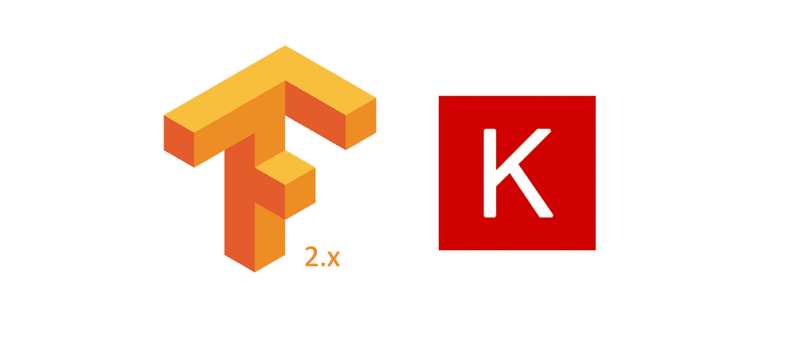

# tensorflow 2 的 keras 简单介绍

> 原文：<https://medium.com/analytics-vidhya/a-simple-intro-to-keras-for-tensorflow-2-330fd35a0c9e?source=collection_archive---------22----------------------->



tensorflow 2 船上有 keras！ **tf.keras**

T2 的 Keras 项目 T3 的目标是为人类创造一个简单的编程界面。tensorflow 现在在其自己的库中包含了一个 keras 版本，这一事实可以作为这一成功的证据。

这是一个关于 Keras 工作流的简要介绍性指南，特别是针对模型设计的三种 API 风格。见此[其他职位](https://towardsdatascience.com/3-ways-to-create-a-machine-learning-model-with-keras-and-tensorflow-2-0-de09323af4d3)一步一步的教程。

# Keras 工作流程

在 Keras 中，训练 ML 模型应该感觉类似于使用 sklearn 分类器。API 提供了设计、编译、拟合和评估简单和复杂机器学习架构的方法。Keras 的美源于它的简单。培训流程的典型结构是:

1.  设计模型架构
2.  使用优化器、损失和度量选择来编译模型
3.  为给定数量的时期训练模型

让我们看一些真实的代码来看看这个结构的运行情况(来自 [tensorflow 网站](https://www.tensorflow.org/overview)):

在上面的例子中，使用了一个非常简单的模型架构。根据所需的复杂程度，有三种设计模型的方式(所谓的 API 风格):

## [顺序 API](https://www.tensorflow.org/guide/keras/sequential_model)

在这种方法中，我们首先实例化一个*TF . keras . models . sequential*类，然后我们简单地添加我们想要的所有层来创建所需的架构。下面的例子是一个简单的卷积架构。

定义输入大小后，所有后续大小都将从应用的操作中推断出来。在本例中，最大池层将图像大小减半，而卷积层由于没有填充，将 x 和 y 轴上的大小减少了每侧内核大小的一半。

为了验证模型结构，可以使用 *model.summary()* 命令。它提供了以下摘要:

```
Model: "Keras Test CNN"
_________________________________________________________________
Layer (type)                 Output Shape              Param #   
=================================================================
conv2d (Conv2D)              (None, 26, 26, 32)        320       
_________________________________________________________________
max_pooling2d (MaxPooling2D) (None, 13, 13, 32)        0         
_________________________________________________________________
conv2d_1 (Conv2D)            (None, 11, 11, 64)        18496     
_________________________________________________________________
max_pooling2d_1 (MaxPooling2 (None, 5, 5, 64)          0         
_________________________________________________________________
conv2d_2 (Conv2D)            (None, 3, 3, 64)          36928     
_________________________________________________________________
flatten (Flatten)            (None, 576)               0         
_________________________________________________________________
dense (Dense)                (None, 64)                36928     
_________________________________________________________________
dense_1 (Dense)              (None, 10)                650       
=================================================================
Total params: 93,322
Trainable params: 93,322
Non-trainable params: 0
_________________________________________________________________
```

查看*“输出形状”*列，我们可以确认我们的计算，因为每个 *conv2d* 层将 x 和 y 维度减少 2 (kernelsize！= 3)并且每个 *max_pooling2d* 层将它们平分。你是否注意到输出图形的第一个尺寸总是*无*？这是因为它将在编译时由 batchsize 设置。

最后一列*“Param #”*表示该层添加到模型的可训练参数的数量。这可能是评估模型复杂性的一个非常重要的指标。

尽管顺序风格使用起来非常方便，但它不允许构建更复杂的体系结构，例如剩余网络。为了允许更多的控制，可以使用函数式 API。

## [功能 API](https://www.tensorflow.org/guide/keras/functional)

层可以被看作函数或可调用函数，它们接受一个张量并产生一个张量。按照这种逻辑，机器学习模型也可以通过将它们的返回值相互馈送来从链接层创建。通过这样做，我们创建了一个有向图，tensordata 沿着这个有向图流动。

这允许模型设计者构建剩余连接、共享层，甚至多个输入或输出。在下面的例子中，定义了一个简单的剩余网络。

如第 9 行所示，模块 2 的输出是输入 x 和两个卷积层的结果之和。这不可能用顺序方法来实现。

注意你如何定义一个*角。输入*项，非常类似于 *tf.placeholder.* 最后，模型实例由输入层和输出层构成，输出层位于定义图的叶节点。

## [子类化](https://www.tensorflow.org/guide/keras/custom_layers_and_models)

复杂性的高潮是子类化。这种 OOP 模式允许你实现你自己的层，并修改你的模型的每一个行为。这可以通过编写一个扩展 *keras.layers.Layer* 并实现所有必要方法的类来实现。

> 您可以将子类化与顺序或函数 API 风格结合起来！

在实现一个定制层之后，您可以简单地将它链接到您的功能/顺序风格模型中，并使用默认的方法来实现！

## 结论

总而言之，Keras 工作流使得在 tensorflow 中设计、训练和评估模型变得很容易。通过使用函数式 API 和子类化，可以实现更复杂的架构。

感谢阅读！如果你喜欢这个，请鼓掌几下:)