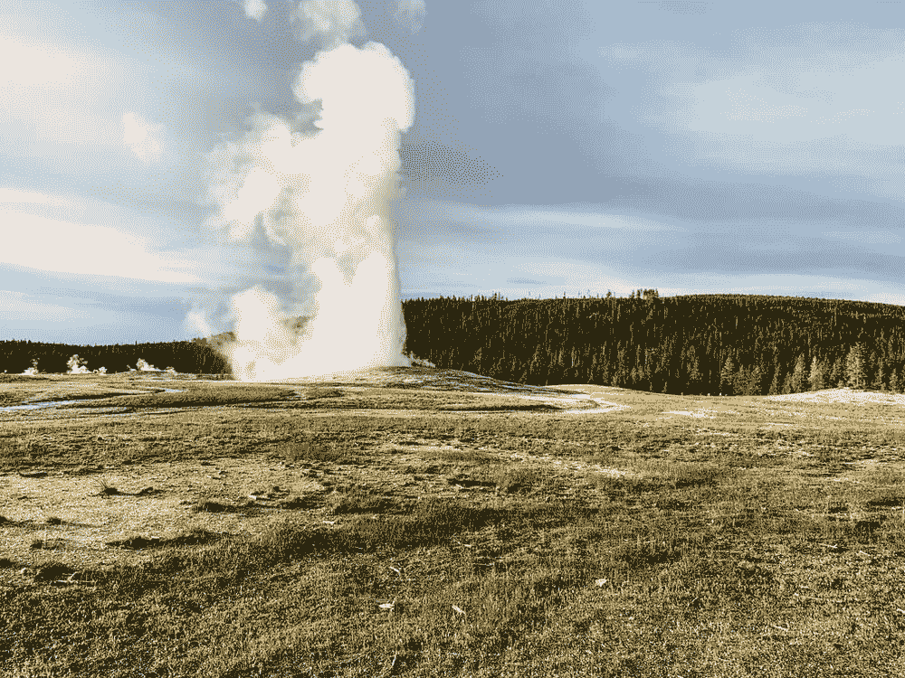
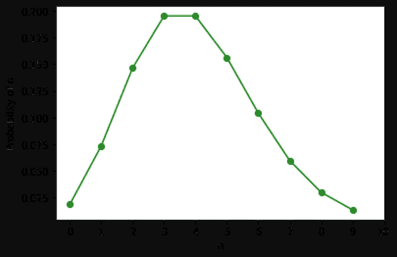

# 泊松分布的简单概述

> 原文：<https://medium.com/analytics-vidhya/a-simple-overview-of-poisson-distribution-1e3292bfb0b3?source=collection_archive---------13----------------------->

想象一下，你听说过某个遥远的地方有一个天然喷泉。间歇泉随机喷射，有一种流行的观点认为，如果你碰巧在一个小时内看到 3 个间歇泉，它会给你带来好运。好吧，你不相信所有这些东西，但仍然想体验一下，然后向你的朋友吹嘘你确实碰巧在一个小时内看到了 3 个间歇泉。所以，你决定去那个地方。你开了很长一段路，然后你终于到达了那个地方，你急切地等着看第一个喷泉。一旦你看了，你会等着看你是否足够幸运在一个小时内再看两次。突然，你接到妈妈的电话。她希望你马上回家，因为一些客人要来了，她非常需要你在家。现在，你进退两难了！你一路开车到这个地方来体验这种自然现象，看看你是否足够幸运，能在一小时内瞥见这种现象发生三次。你很想等等看但是值得等吗？

所以，你走到附近的一个小社区，和当地人交谈。他说，根据过去的经验，间歇泉平均每小时喷发 4 次。但这还不够。你想知道你在一小时内看到 3 个喷泉的几率。突然，你想起了你的数据科学家朋友，你给他打电话，告诉他你的困境。当他听到当地人告诉你的关于普通喷口的情况时，他变得很兴奋！他说那是λ值，然后他给你发了下面的公式，让你用 4 代替𝜆，用 3 代替 x。

你看着配方，惊叹不已！你没有心情做任何计算，你让你的数据科学家朋友做必要的数学计算，让你最终知道是否值得你留下或离开。然后，他给你发来以下他通过 Python 执行的代码截图。

他告诉你这个概率只有 0.195，这意味着你在一个小时内看到三个间歇泉的概率只有 19.5%，所以你最好离开这个地方回家，这样你至少可以逃避你母亲的咆哮。

现在你问他他是如何得出这个概率的，他会告诉你这是通过一种叫做泊松分布的离散概率分布得出的。

泊松分布以法国数学家丹尼斯·泊松命名，是以固定的时间或空间间隔发生的若干事件的概率分布。为了计算这个概率，你需要事先知道平均概率，即在特定的时间或空间间隔内成功的平均次数，并且事件的发生是相互独立的。在上面的故事中，这只不过是基于附近当地人提供的过去数据的每小时平均喷水次数，这个值通常用希腊符号𝜆表示，发音为“lambda”。𝜆 = 4 的概率分布如下，从图中可以看出，通过 Python 代码可以看出，出现 3 次的概率为 0.195。

既然你已经理解了泊松分布，而且很少有机会去体验你将要经历的事情，你回到家里，决定改天在你真的有很多时间的时候来同一个地方！