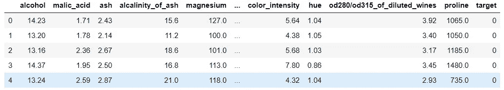
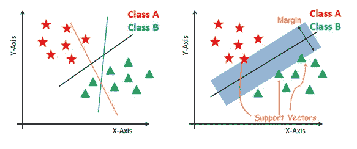
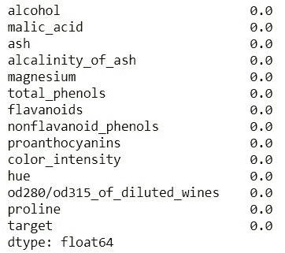
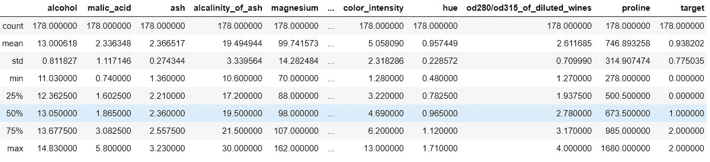
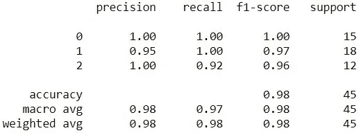
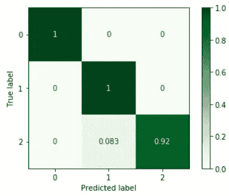
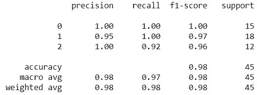
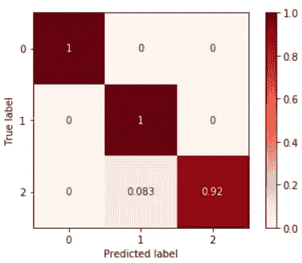

# Sci-kit Learn 管道的简单演练

> 原文：<https://medium.com/analytics-vidhya/a-simple-walkthrough-with-sci-kit-learns-pipeline-46cdf6e53354?source=collection_archive---------4----------------------->


# 管道的基本概述

流水线在机器学习系统中很常见，有助于加速和简化一些预处理情况。它们用于将多个估计器链接成一个，从而自动化机器学习过程。这非常有用，因为在处理数据时通常有固定的步骤顺序。当涉及到分离基本模型并比较它们以查看哪一个可能为特定的一个或多个指标提供更好的结果时，它们也是有用的，但是访问管道的某些部分也可能是棘手的。一个模型的管道框架相当简单。

# 我们的示例数据

我们将在本演练中使用的数据将是葡萄酒质量数据集，我们可以从 Sci-kit Learn 的库中获得。如果你想继续，这里有这个博客的 Jupyter 笔记本的链接。让我们继续导入我们将使用的必要库:

```
# importing libraries
import pandas as pd
import numpy as np
from sklearn import datasets
```

现在，让我们将数据加载到数据帧中，并将功能名称分配给正确的列:

```
# loading in the data
wine = datasets.load_wine()# Creating a dataframe
df = pd.DataFrame(wine['data'])# Assigning the correct feature names for each column in the df
df.columns = wine['feature_names']# Adding the target to our dataframe
df['target'] = wine['target']df.head()
```



查看 df 的头部

# 我们将使用的模型类型

```
from sklearn.svm import SVC
```



我们将使用 Sci-kit Learn 的支持向量机分类器模型。SVC 的主要目标是以尽可能好的方式分离给定的数据集。这两个最近点之间的距离称为边距。目标是在给定的数据集中选择一个在支持向量之间具有最大可能间隔的超平面。它对自己训练出来的数据没有任何假设。它还要求对数值数据进行要素缩放，并且对数据集中的任何空值都很敏感。我们还应该注意到，它对异常值非常健壮。

**该型号的优点包括**:

*   适用于变量多于观测值的数据集
*   良好的性能
*   几种情况下良好的现成模型
*   可以逼近复杂的非线性函数

**缺点包括**:

*   需要长时间的培训
*   需要调整来确定哪个核对于非线性支持向量机是最佳的

因为 SVC 模型对数据集中的空值很敏感，所以让我们确保没有空值。我们可以通过调用以下命令来查看数据集，以确保没有空值:

```
# Viewing the percentage of null values in each column
df.isna().mean()
```



```
# Viewing the values within each column
df.describe()
```



df.describe()结果在此图中被有意缩短

请注意，每列中的数字数据有不同的范围。在拟合模型之前，我们需要对数据进行缩放。在我们开始使用 Sci-kit Learn 的管道对象之前，让我们先在不使用管道的情况下设置和训练一个 SVC 模型。

# 基于缩放的训练和测试数据训练 SVC

```
from sklearn.preprocessing import StandardScaler
from sklearn.model_selection import train_test_split
```

在扩展数据之前，我们必须首先将数据分成训练集和测试集。我们将导入更多的库，然后创建变量来保存特性和标签。

```
# Separating the features and target variable
X = df.drop(columns='target')
y = df['target']# Creating train and test sets and setting seed
X_train, X_test, y_train, y_test = train_test_split(X, y, random_state=42)
```

现在，我们可以使用 StandardScaler 对象来缩放训练和测试数据:

```
# fitting the scaler to the training features, and creating new variables to hold the scaled train and test features
scaler = StandardScaler()
X_train_scaled = scaler.fit_transform(X_train)
X_test_scaled = scaler.transform(X_test)
```

实例化 SVC 模型:

```
svm = SVC()
svm.fit(X_train_scaled, y_train)
```

创建我们的预测以与测试集标签进行比较，并测量模型的准确性:

```
y_pred = svm.predict(X_test_scaled)print(metrics.classification_report(y_test, y_pred))
```



我们的 SVC 模型的分类报告

似乎模型表现得极其出色，准确率在 98%左右。让我们来看一个混淆矩阵:

```
metrics.plot_confusion_matrix(svm,X_test_scaled,y_test,
normalize=’true’,cmap=’Greens’);
```



SVC 模型的混淆矩阵

似乎这个模型在区分类 1 和类 2 时遇到了一点困难。我们可以对此进行更详细的阐述，并调整模型的参数，但是让我们实现 Sci-kit Learn 的管道对象！

# 使用 Sci-kit Learn 的管道

```
from sklearn.pipeline import Pipeline
```

为了实例化管道对象，我们可以说:

```
pipe = Pipeline()
```

在括号中，我们必须指定预处理步骤和模型，以便在管道中使用。为了得到比上述单元格更具体的信息，我们可以说:

```
pipe = Pipeline(steps=[(‘scaler’, StandardScaler()), ('svm', SVC()])
```

管道对象中的**步骤**参数接受一个元组列表。每个元组包含*名称和一个转换器或模型的实例。*我们给每个变压器或型号起的名字可以是任何东西，它们只是为了清楚地识别变压器/型号。元组的顺序很重要——我们希望确保在将数据输入模型之前对其进行缩放。

现在，我们已经创建了管道并定义了步骤，我们可以使管道适合训练集，并使用测试集对其进行评估:

```
X_train, X_test, y_train, y_test = train_test_split(X, y, random_state=42)pipe.fit(X_train, y_train)
```

创建我们的预测以与测试集标签进行比较，并测量流水线模型的准确性:

```
# Creating  
y_pred_pipe = pipe.predict(X_test)print(metrics.classification_report(y_test, y_pred_pipe))
```



现在让我们看看与我们的流水线模型相关的混淆矩阵:

```
metrics.plot_confusion_matrix(pipe, X_test, y_test, normalize=’true’, cmap=’Reds’);
```



请注意，我们生成的两个混淆矩阵包含完全相同的结果——这是因为我们在创建训练集和测试集时定义了相同的随机状态。这很好，因为这告诉我们，我们用来训练和评估模型的两种方法给出了相同的结果。使用管道有助于执行所需的应用步骤顺序，创建方便的工作流程，确保工作的可重复性。如果您有任何问题，请随时联系我们。感谢阅读！