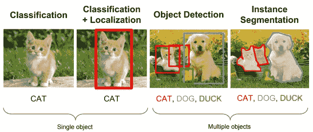

# 收集深度学习图像数据集的简单方法

> 原文：<https://medium.com/analytics-vidhya/a-simple-way-to-collect-your-deep-learning-image-dataset-4ead47b6826c?source=collection_archive---------3----------------------->

深度学习已经成为解决许多挑战性问题的首选方法。我们知道，通过足够的训练，深度网络可以分割和识别图像中的“关键点”。

> 如果一个非常简单的机制足够大，就会产生神奇的效果。

因此，这种运转良好的深度学习**需要大量的数据**。训练数据越多，模型的准确性越好。

但是我们从哪里得到这些数据呢？获得良好注释的数据可能既**昂贵**又**耗时**。雇人手动收集图像并给它们贴标签**一点效率都没有**。而且，在深度学习时代，**数据无疑是你最有价值的资源**。

在这里，我展示了一种收集深度学习图像数据集的简单方法。

[bing-images](https://github.com/CatchZeng/bing_images) 是一个 Python 库，用于**获取图像 URL**并使用**多线程**从[Bing.com](https://bing.com/)下载。它具有以下特点

*   支持**文件类型**滤镜。
*   支持[Bing.com](https://bing.com/)滤镜*滤镜。*
*   下载使用**多线程**和自定义线程池大小。
*   支持**纯**获取图片 URL。

# 演示

创建一个演示项目，这里称为*图像采集器*。

# 安装 bing 图像

## 要求

*   安装[谷歌 Chrome 浏览器](https://www.google.com/chrome/)。
*   从[这里](https://chromedriver.chromium.org/downloads)下载`chromedriver`。
*   将`chromedriver`添加到路径中。

# 获取图像 URL

获取图像网址*。py*

奔跑

# 使用多线程下载

*download.py*

奔跑

# 下载方形黑白图像

下载-square.py

详细代码在[**https://github.com/CatchZeng/bing_images**](https://github.com/CatchZeng/bing_images)**。**再见！