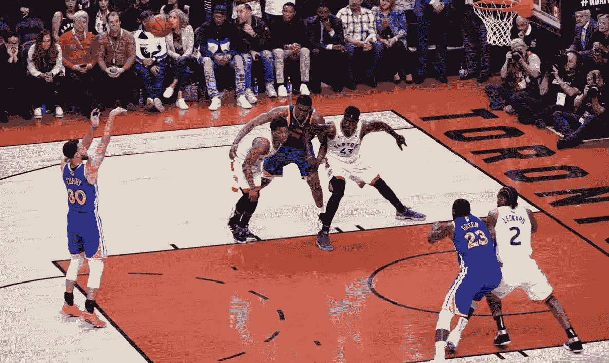

# 一项统计分析，以确定在 NBA 是否存在“超级巨星偏见”。

> 原文：<https://medium.com/analytics-vidhya/a-statistical-analysis-to-determine-if-theres-a-such-thing-as-superstar-bias-in-the-nba-fc699f5d1791?source=collection_archive---------12----------------------->

> 2020 年 1 月 3 日补充说明:我收到了很多关于这篇文章的反馈，特别是关于控制拍摄位置的反馈。我将进行额外的分析来控制这个变量。

罚球是这项运动中不需要任何力量、速度或智力的一个方面…