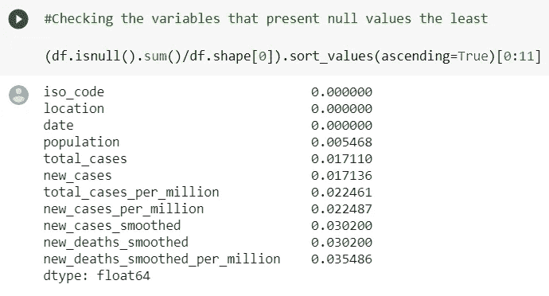
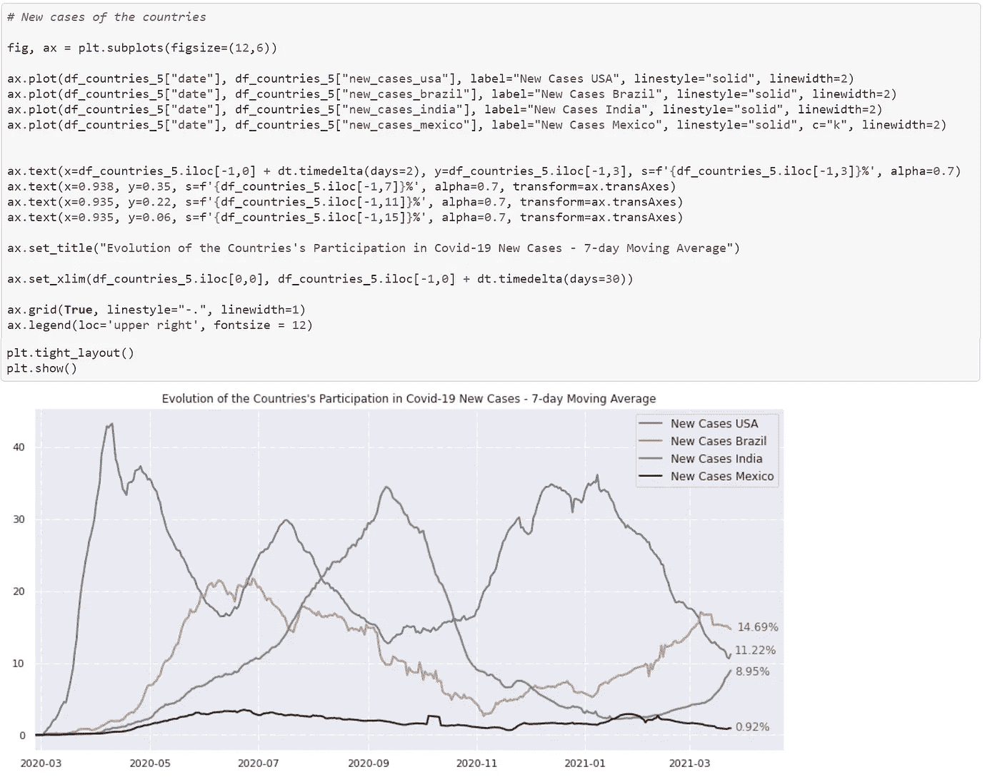

# 使用 Pandas 和 Matplotlib 逐步分析 Covid19 场景(包括清晰代码)

> 原文：<https://medium.com/analytics-vidhya/a-step-by-step-analysis-of-covid19-scenario-using-pandas-and-matplotlib-clear-codes-included-1185a49d19c1?source=collection_archive---------1----------------------->

2020 年冠状病毒爆发可以被认为是上个世纪世界面临的最大挑战之一。我在 3 月 25 日写了这篇文章，全世界死亡人数是 2.745.702。与许多人的想法相反，与其他疾病相比，Covid 的预后并不可怕。2014 年西非爆发的埃博拉疫情中，15 至 44 岁患者的死亡率约为 70%(是的，只有十分之三的患者能够存活！).新冠肺炎的问题在于它的传染性。与埃博拉等其他疾病不同，一旦感染就需要住院治疗，对许多人来说，新冠肺炎是一种短暂而温和的疾病，有些人甚至没有症状。这样，被感染的人可以四处移动并感染许多其他人。这种疾病起源于中国，在一个如此全球化的世界里，它很快出现在每一个大洲。我不需要描述这种疾病有多严重……我相信每个正在阅读这篇文章的人都目睹了新冠肺炎给许多国家带来的混乱。新冠肺炎疫情不是世界面临的第一次疫情，但它肯定是我们第一次能够通过技术，当然还有数据来战胜它。因此，这是一个很好的机会来分析和了解这种疾病。对于这个分析，我们将使用两个 Python 库:Pandas 来操作数据，Matplotlib 用于数据可视化。这是一个简单的探索性数据分析(EDA ),但还可以做很多工作，您将看到这些库是多么容易使用和强大。

这项工作包括:

*   数据集的整体分析
*   通过条形图分析新冠肺炎病例和死亡总数最高的国家。
*   世界病例和死亡总数的演变分析。
*   从第一例病例到现在对巴西新冠肺炎情景的分析。
*   比较美国、印度、巴西和墨西哥的总病例数、新增病例数和死亡数的 7 天移动平均值。

如果您正在开始您的数据科学世界之旅，这项工作是一个很好的机会，让您编码并了解更多关于 Pandas 和 Matplotlib 的信息。

# 数据采集

本分析中的数据来自 ourworldindata.org 网站[。数据关系到全世界，直到 3 月 25 日。需要强调的是，新冠肺炎是一种新疾病，例如，不可能告知 Covid 病例的确切数量。没有一个组织能做到这一点。这一数据的主要来源是欧洲疾病预防和控制中心(ECDC)。这些数据也是从各种来源收集的，如联合国、世界银行、全球疾病负担、Blavatnik 政府学院等。).有关数据源的更多信息可在此处找到](https://ourworldindata.org/)[。](https://github.com/owid/covid-19-data/blob/master/public/data/owid-covid-codebook.csv)

# 可变字典

该数据集包含 59 个变量。你可以在这里对这些变量[进行详细描述。](https://github.com/owid/covid-19-data/blob/master/public/data/owid-covid-codebook.csv)

# 导入数据集

如前所述，本分析中使用的数据集是在`ourworldindata.org`获得的。你可以在这里下载这些数据。。让我们将数据从`csv`格式导入到变量`df`中。

图 1 —导入数据集。

# 探索性数据分析

在这一部分，我们将探索我们的数据集。熊猫图书馆有一些方便的命令来实现它。我们开始吧！

# 全面分析

我们通过*来看看数据。*方法头()。

图 2——数据的第一印象。

图 3 显示了我们的数据集有多大…

图 3 —数据集大小。

让我们通过了解数据集的列来看看变量。

图 4 —数据集变量。

属性 *dtypes* 可以向我们显示这个数据集中每个变量的类型。图 5 只显示了数据集中总共 59 个中的 12 个。

图 5 —变量类型。

嗯…现在我们对这个数据集的样子有了更好的了解…我们可以计算出数据集有多大( *df.shape* )、变量的名称( *df.columns* )以及数据集中存在哪种变量( *df.dtypes* )。通过查看前 5 行，可以看到我们的数据集中有大量的空值。我们现在就去做。让我们看看数据集中空值的百分比。

图 6-数据集中每个要素的空值百分比。

在我们的数据集中，空值的百分比变化很大。一些变量，如日期和位置，不存在空值。另一方面，关于住院治疗的信息(icu 患者、每周 icu 入院人数等)几乎不存在，其特征是超过 90%的空值。让我们来看看出现空值最多和最少的十个变量。

图 7 —呈现较高空值百分比的特性。

图 7 —呈现较低空值百分比的特性。

遗漏了更详细的信息，但是非常重要的信息，例如`new_cases`和`new_deaths`几乎是完整的，因此可以在该数据中分析很多信息。

要做的一件重要事情是将数据集中的日期设置为*日期时间*格式，这样我们就可以通过日期来操作数据集……让我们将日期转换成这种格式。

图 8 —将日期转换成日期时间格式。

# 分析新冠肺炎死亡人数和病例数最高的国家

到目前为止，我们对数据集只有初步印象。最后，我们将探索和提取有关新冠肺炎疫情的信息。让我们利用熊猫图书馆来了解哪些国家出现了较高的死亡和 Covid 病例数。

图 9-死亡人数最多的国家。

图 10 —病例数最高的国家。

可以看到该数据集中存在大陆要素。让我们删除它们，创建一个只包含位置、日期、死亡总数和病例总数的新数据框。

图 11 —新数据框。

这是更好地了解世界上新冠肺炎情景的第一步。但是，有一种更好的方法来显示这些信息。我们来策划一下吧！为此，让我们使用`Matplotlib`库。让我们首先绘制一个病例和死亡总数的直方图。Seaborn 库只被导入到更好的 Matplotlib 布局(`sns.set()`)。

图 12 — Matplotlib 代码表示世界上最高的死亡和病例总数直方图。

图 13-世界上死亡人数和病例数最高的国家。

嗯……在第一项分析中，通过比较病例数和死亡数，可以对这些国家的死亡率有一个很好的了解。例如，比较印度和巴西，很明显巴西的死亡率更高。预计一旦印度人口超过 10 亿，其病例数将会更高。巴西的人口是印度的四分之一，尽管如此，巴西的死亡人数和病例数都比印度高。在这个简单的分析中，同样值得注意的是，墨西哥的死亡率也很高。它甚至不在病例数最高的五个国家之列，但却造成了近 20 万人死亡！另一方面，法国和俄罗斯等欧洲国家的死亡率较低。英国是欧洲死亡率最高的国家，美国是全世界病例和死亡人数最多的国家。

现在我们来分析一下这些国家的发病数和死亡数的演变。但首先让我们看看全球死亡和病例总数。

# 世界新冠肺炎病例和死亡的演变

要做的第一件事是对新冠肺炎全球情况进行分析，以获得与世界相关的数据集部分(考虑总死亡数和病例数)，这可以由基本熊猫指挥部`.loc[]`完成，如图 14 所示。该图中还显示了图形的 Matplotlib 代码。

图 14-新冠肺炎总病例和死亡的全球分析的 Matplotlib 代码。

因为我们的数据变化很大，新冠肺炎的病例和死亡人数已经用对数标度表示。这一结果表明，死亡人数的增加与病例数的增加是一致的。2020 年 2 月出现了更高的病例和死亡增长。这可能与冠状病毒爆发的开始有关，当时没有人知道这种疾病有多严重以及如何治疗。然而，在欧洲，冬天是病毒性疾病更常见的时候。

图 15-按常规和对数比例计算的世界病例和死亡总数。

# 新冠肺炎在世界上的巴西情景分析

现在让我们绘制巴西新冠肺炎的演变图，与世界上病例和死亡人数排名前五的国家进行比较。让我们记住，这些数据来自 3 月底，当时巴西正在疫情经历最糟糕的情况。图 15 显示了图形代码。代码的第一部分是在小数据集中分离与日期和地点(国家)相关的病例数和死亡数。第二部分是创建一个具有 2 个副情节的图形，以及考虑图形轴的每个国家的总病例和死亡的情节。

图 16 — Matplotlib 代码，用于世界前 5 个国家的总病例和死亡分析。

图 17-前 5 名国家的死亡和病例总数。

众所周知，新冠肺炎首先袭击了东方国家、欧洲以及后来的美国和南美国家。巴西第一例是什么时候？让我们看看数据集的最开始…

图 18-在巴西发现首例新冠肺炎病例。

嗯……通过这个简单的命令，可以看到巴西的首例新冠肺炎病例是在 2 月 26 日报告的。让我们看看巴西第一例艾滋病死亡是什么时候发生的。

图 19-在巴西发现首例新冠肺炎死亡病例。

对…让我们看看巴西从第一例到第一例死亡用了多少天。

图 20—从巴西出现第一例新冠肺炎病例到第一例死亡的天数。

下一个分析将是前 3 个国家在新冠肺炎死亡和病例中的参与程度。为此，我们将使用[华夫饼图表](https://pywaffle.readthedocs.io/en/latest/)进行可视化。我们开始吧！

图 21—华夫饼图表中使用的数据。

图 22 —世界上 Covid 病例数量最多的国家的贡献。

华夫饼图表让我们很好地了解了这些国家的贡献。但是，让我们创建一个简单的数据框，其中包含贡献率。

图 23 —在华夫格图中每个国家占总病例的百分比。

太好了…让我们对死亡总数做同样的分析。

图 24—世界上 Covid 死亡人数最多的国家的贡献。

图 25—在华夫格图中每个国家总死亡人数的百分比。

# 7 天滚动平均分析

现在让我们来看看这些国家一年中病例和死亡数量的变化。为了完成这项任务，让我们考虑一个 7 天滚动平均图。

第一件事是创建一个包含世界和其他国家全部数据的数据框。让我们开始吧。

图 26 —为 7 天滚动平均分析创建数据框。

很好…以下步骤总结如下:

*   计算每一栏中每个国家的参与情况；
*   用零填充被零除后留下的空值；
*   应用一个等式将每一列转换为 7 天平均值；
*   在用零计算移动平均值后填充空值。

图 27 —国家参与 7 天滚动平均分析。

图 28 —填充空值。

现在，让我们使用命令`.apply(lambda x … )`使每一列成为 7 天滚动平均值。

图 29——使各列成为其自身的 7 天移动平均值，并填充空值。

最后，我们已经完成了数据集的准备…让我们绘制出这些国家的总病例数和新增病例数以及死亡人数。

图 30——国家参与新冠肺炎病例总数的演变——7 天移动平均数。

图 31-国家参与新冠肺炎总死亡人数的演变-7 天移动平均数。

总病例数和总死亡数的 7 天移动平均数表明，与巴西、印度和墨西哥相比，美国的参与率要高得多。让我们做同样的事情来想象新的病例和死亡。

图 32——国家参与新冠肺炎新病例的演变——7 天移动平均数。

在最后一张图中，可以看到截至 4 月份，美国在全球的新增病例比例达到了 40%以上。当然，当时其他国家的贡献超过了巴西和印度，这两个国家的参与度不到 5%。

一年中每个国家的参与情况有很大不同。美国出现三个新病例高峰。美国今年新增病例的减少肯定与美国政府实施的大规模疫苗接种有关。另一方面，巴西政府还不能像美国那样快地给国民接种疫苗。此外，巴西出现了另一种传染性更强的 Covid 变异体。巴西今天出现了世界上最多的新冠肺炎新病例。实际上，巴西的疫情已经完全失控了。在印度，新病例在 10 月初之前一直在增加，然后其参与度在 2021 年 2 月之前一直在下降。众所周知，印度出现了冠状病毒的新变种，现在新病例的数量已经增加。在整个疫情，墨西哥参与新病例的比例没有太大变化，现在墨西哥占世界新病例的不到 1%。现在让我们分析一下这些国家的新增死亡人数。

图 33-国家参与新冠肺炎新增死亡的演变-7 天移动平均。

上图显示了美国、印度、巴西和墨西哥全年新增死亡人数。美国、巴西和墨西哥出现了两波新冠肺炎，而印度只出现了一波。截至 5 月，美国占全球新增死亡人数的 35%以上。今年年初，美国开始大规模接种疫苗，因此新增死亡人数呈指数下降。另一方面，巴西新增死亡人数大幅增加，如今该国占全球死亡人数的四分之一。这个悲惨的数字与疫苗接种缓慢和政府控制疫情的措施不力有关。今天，巴西每个州的公共和私人卫生系统都在崩溃。

# 结论

这项工作分析了由 [Our World in Data](https://ourworldindata.org/) 发布的新冠肺炎数据集，考虑了以下步骤:

*   总体探索性数据分析:首先对数据集进行分析。知道数据集的大小，有哪些变量，变量的类型是什么，一些变量的最小值和最大值，每个变量的空值百分比等。
*   对新冠肺炎病例数和死亡数较高的国家的分析:使用柱状图直观显示数据。
*   世界新冠肺炎情景分析:世界病例和死亡总数的演变图。
*   比较世界上巴西的新冠肺炎情景:病例和死亡总数的演变，考虑病例数最高的国家，重点关注巴西。例如，通过熊猫指令操纵数据，可以知道自巴西出现首例新冠肺炎病例以来，该国在多少天后出现首例死亡病例。
*   对病例和死亡人数最多的国家的分析:每个国家的参与情况与世界其他国家的比较(使用华夫图)，每个国家在一年中的参与情况，以及考虑 7 天移动平均数的每日病例和死亡人数。

这项工作的目标已经实现:使用 Python 库从真实世界的新冠肺炎数据集中分析和获取信息。这项工作给了我一个很好的机会去实践和学习更多关于熊猫和 Matplotlib 的知识。从这个新冠肺炎数据集获得的所有信息中，可以谈论和讨论更多的东西，但是这项工作的主要目标是真正展示如何使用这些库，因此在这项工作中只给出了更初步的结论。你可以在[我的 Github](https://github.com/JoaoSiqueiraDS/Joao_Siqueira_Portifolio) 中找到这个项目和其他项目。