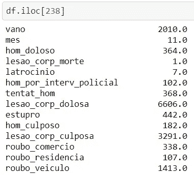

# 使用熊猫图书馆的逐步探索性数据分析

> 原文：<https://medium.com/analytics-vidhya/a-step-by-step-exploratory-data-analysis-using-pandas-library-6dec9335ec5a?source=collection_archive---------11----------------------->

巴西的里约热内卢无疑是世界上最美丽的城市之一，也是游客最多的城市之一。它的人民是如此友好和热情。我已经在 Barra da Tijuca 海滩体验过日落，我可以说那个海滩的能量是非常特别的。多么神奇的城市啊！

然而，里约热内卢每天都面临另一个现实:暴力。每个人都知道它存在于里约。但是，这种暴力有多严重呢？有这么糟糕还是只是媒体在暴力报道中夸大其词？让我们来看看里约警方数据库中的数据。这种探索性数据分析(EDA)的目的是表明，通过只使用熊猫图书馆可以做很多事情。当然，通过使用其他库，如 Matplotlib 或 Seaborn，数据可视化可以变得更好。然而，对于快速的初步分析，Pandas 可以提供对数据集的很好理解。希望你喜欢这个分析。

# 数据采集

本分析中的数据来自**里约热内卢公共安全部**。这项分析考虑了里约热内卢州从 1991 年到 2019 年的不同犯罪和地点。

# 导入数据

要做的第一件事是导入 Pandas 库，并定义要在此分析中使用的数据框。数据集是一个 csv 档案，可以通过“read _ CSV”Pandas 命令轻松读取，如图 1 所示。

图 1 —导入 Pandas 库并定义数据框(df)。

# 第一次看数据集

此分析的第一步是先看一下这个数据框架，并熟悉它。让我们开始吧。

首先，让我们看看数据集有多大。这可以通过显示数据集属性“shape”来实现。

图 2 —数据集的变量和输入的数量。

既然我们已经知道了数据集的维度，那么了解其中呈现的变量是一个好主意。让我们开始吧。这些变量与里约发生的各种犯罪有关，当然，它们是葡萄牙语的。

图 3 —数据集中存在的所有变量。

这种分析中的另一个重要步骤是了解每个变量的类型，这在清理数据时肯定会对我们有帮助。命令`df.dtypes`显示数据集分为整型和浮点型变量。

好的……我们已经在 EDA 方面取得了相当大的进步。现在，让我们看看我们的数据集，并真正了解它是如何构成的。我们可以通过使用方法`.head()`来实现。数据框中的前两列( *vano，mes* )分别表示年份和月份。其他栏目涉及不同种类的犯罪。

图 4 —数据集的前 5 行。

有趣的是，有些变量有很多缺失数据。鉴于数据集中出现的长时间间隔，我们可以提出一些假设来解释这种缺失，以及我们如何绕过它继续探索数据集。

*   记录的数据相当陈旧(自 1991 年以来)，这些罪行可能没有记录。数据缺失并不意味着犯罪没有发生。不过，有一些方法可以处理这些缺失的数据。我们很快就会看到它。
*   不幸的是，今天在巴西，数据没有得到应有的重视。想象一下 30 年前的现在！我们还必须考虑当时记录这些数据的格式。它们是否被正确记录并在扫描期间丢失？还是这些信息的文档总是很粗心？

在我们决定如何处理丢失的数据之前，让我们检查它们在整个数据集中的比例。这可以通过以下命令完成:`(df.isnull().sum()/df.shape[0])*100`

图 5-每个变量缺失值的百分比。

从上图中可以看出，一些变量在相当大的比例上存在缺失值，例如与自行车相关的犯罪`roubo_bicicleta`，其中 80%以上为空值。

由于数据是随着时间的推移而结构化的，因此一种更适合实际情况的分析方法是从开始记录数据的日期开始分析数据。

此外，还有其他查看和探索数据的方式，例如:

*   年度犯罪数字。
*   每月每起犯罪的数字。
*   犯罪类别(危害生命、危害遗产等。)

# 里约热内卢暴力事件的统计信息

是时候检查一下这个数据框的一些统计数据了。该 EDA 中使用的数据集呈现了多种犯罪，分为两类:针对财产的犯罪和针对人身的犯罪。在这里，我们将探究每个类别的一个例子。让我们看看我们能从这些 EDA 中获得什么信息。

Pandas 库提供了一个方便的方法来显示一些非常重要的统计参数，即`df.describe()`方法。让我们使用它！

图 6 —数据集的统计信息。

该数据集中的第一个罪行是谋杀(与 *hom_doloso* 相关)。平均每月发生 504.5 起谋杀案，最高记录为 831 起。正如所看到的，可以获得其他统计数据。

# 侵犯财产罪

在项目的这一部分，让我们关注汽车抢劫( *roubo_veiculo* )和偷车( *furto_veiculo* )统计。这是巴西大城市的普遍问题。由于我们有抢劫、偷窃、找回车辆的数据，因此有可能获得警方是否能够打击这类犯罪的相关信息。让我们用`.mean()`的方法找出这些犯罪和车辆追回的平均数。

图 7 —一些重要变量的平均值。

现在让我们计算一下考虑到被抢和被盗车辆的找回车辆的百分比。

图 8-计算回收车辆的百分比。

如图 8 所示，里约有近 43%的车辆被回收。我们来计算一下被劫车辆的最大和最小数量，以及这些事件发生的时间。这可以通过使用方便的熊猫命令`.loc[]`和`.iloc[]`来完成，如图 9 所示。

图 9-被劫车辆的最大和最小数量。

最后一项分析表明，被劫车辆的最大数量是这些年平均值的两倍。事情发生在 2018 年 3 月。最小数量的情况也是如此:比平均值低两倍。然而，这一被劫车辆的最低数量发生在 1991 年初，因此，正如 EDA 之前所指出的，这一时期的数据可能没有很好地登记。最后这个结论是不可信的。

所以，让我们用这个熊猫法——`.nsmallest()`。`iloc[]`还有——看看能不能找到更可信的信息。

图 10-被劫车辆数量最少的输入。

图 11-输入号码 238 的信息。

嗯……最后一项分析指出，2010 年 11 月是被劫车辆数量最少的月份。它展示了 1413 辆被劫车辆。

让我们来看看这最后一个变量在这十年中的分布情况…让我们画出来！

图 12—2010 年至 2019 年被劫车辆数量。

这个简单的分析表明，在过去的十年里，车辆抢劫案增加了很多。

让我们为车辆回收做同样的事情。

图 13—2010 年至 2019 年回收车辆的数量。

结果表明，车辆追回的增加与车辆抢劫的增加成正比。这清楚地表明，警方已经能够打击这种犯罪。

# 侵犯人身罪

谋杀、严重攻击、强迫性犯罪、非强迫性犯罪、绑架、简单攻击和恐吓、殴打、家庭暴力……术语“侵犯人身罪”指的是一系列广泛的刑事犯罪，通常涉及身体伤害、身体伤害威胁或其他违背个人意愿的行为。

在这一节，我们来探究一下里约热内卢的谋杀案数量。我们先来看看一个月内最大的杀人数量( *hom_doloso* 在数据框中)( *mes* )。

图 14 —一个月内的最大谋杀数量。

谋杀案的最高数量是 831 起，发生在 1995 年 1 月。让我们找出最少谋杀发生的时间。

图 15 —一个月内的最低谋杀数量。

2015 年 6 月，仅报告了 272 起谋杀案。这是自 1991 年以来的最低数字。最大值和最小值变化很大。它的平均值是多少？通过熊猫图书馆很容易找到:

图 16——每月谋杀案的平均数。

这第一个分析表明谋杀变化很大…让我们看看这个变量是如何变化的。让我们绘制一个直方图来做到这一点…

图 17——谋杀数量及其频率。

上图给出了一些重要信息，例如:

*   近 70 个月的时间里，在这一年期内，每月发生 500 至 550 起谋杀案。
*   不到 10 个月的时间里只有 800 起谋杀案。
*   不到 20 个月的时间里每月不到 300 起谋杀案。

让我们找出发生 800 起以上谋杀案的月份和发生 300 起以下谋杀案的月份。这可以通过 Pandas 命令`.iloc[]`轻松实现:

图 18——找出谋杀发生的最大和最小次数。

最后，让我们画出这些年谋杀案的分布图。

图 19 —历年谋杀案数量。

最后一张图清楚地表明，谋杀总数逐年下降。

# 结论

这个 EDA 中使用的数据集有很多变量，给了我们很多可能性。在这篇简短的分析中，只分析了两种类型的犯罪:车辆抢劫和谋杀。

起初，人们意识到 90 年代初的数据不真实，因为它出现了许多缺失值。因此，对于车辆抢劫的分析，只考虑了过去十年的数据。该分析表明，被劫车辆的数量因月份而异，每月最大和最小被劫车辆数量分别约为 5000 辆和 1000 辆。分析还显示，42%的被劫车辆被追回。然而，在过去的十年里，车辆抢劫的数量在增加。找回的车辆数量也是如此。这表明警方已经能够打击这类犯罪。关于谋杀数量，平均每月发生 504 起谋杀。这里发生了与车辆抢劫不同的行为:自 90 年代初以来，谋杀数量一直在下降。1995 年这种犯罪的最高数量为 831 起，2015 年发生的最低数量为 272 起。

最后，EDA 是一个很好的练习，可以让我们看到这种分析是多么简单，仅仅使用 Pandas 库的简单命令就可以给我们提供如此多的信息。它向我们展示了里约热内卢在过去 30 年里确实面临着残酷的现实。然而，警方显然已经能够反击该市的犯罪。这只是一些信息，还可以从这个数据集中获得更多信息。

我开始了我作为数据科学家的职业生涯，随着我发展更多的技能和有更多的想法，我肯定会发表更多的文章。在 [**中**](/@joaovitormarques22/about) 上关注我或者在 Github 上访问我的 [**作品集**](https://github.com/JoaoSiqueiraDS/Joao_Siqueira_Portifolio) 。