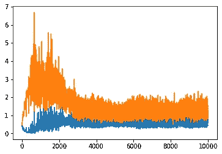
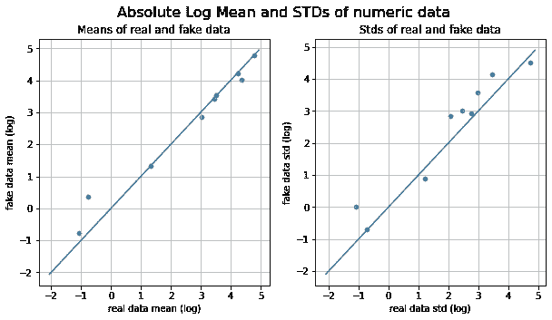
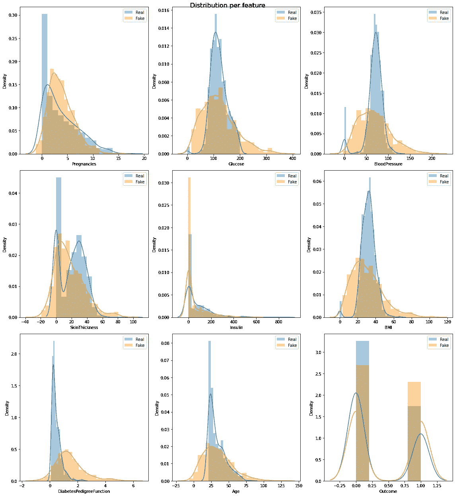
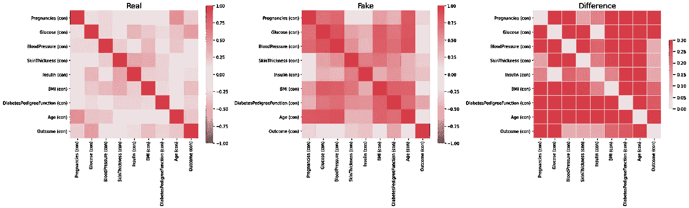
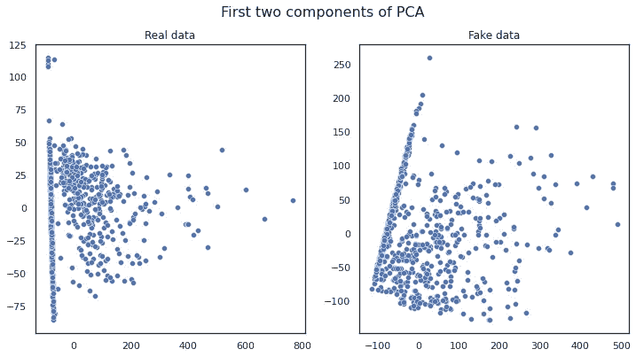

# 使用 GANs 生成表格合成数据集的分步指南

> 原文：<https://medium.com/analytics-vidhya/a-step-by-step-guide-to-generate-tabular-synthetic-dataset-with-gans-d55fc373c8db?source=collection_archive---------0----------------------->

# 目标

在本文中，我们将指导如何使用 GANs 生成表格合成数据。预计生成的数据将与模型训练和测试的真实数据相似。

# 介绍

在机器学习工作中，我们经常会遇到数据不足以训练模型，需要更多人工数据的情况。GANs 是由 Ian Goodfellow 等人提出的深度学习架构。2014 年(1)。GANs 可以从零开始生成合成数据，由两部分组成:生成器和鉴别器。发生器用于从输入随机噪声中产生假数据；鉴别器用于区分样品是真的还是假的(由发生器产生)。鉴别器的性能用于更新和优化发生器和鉴别器。目前流行应用 GANS 生成图像数据，但关于表格数据的文章并不多。原因之一是非图像合成数据难以评价质量。在本帖中，我们将尝试从头开始生成一维合成数据。

# 资料组

糖尿病数据集来自 Kaggle 公共数据集:[https://www.kaggle.com/uciml/pima-indians-diabetes-database](https://www.kaggle.com/uciml/pima-indians-diabetes-database)

# 真实数据集的基本精度

在本节中，我们将使用真实数据来训练随机森林模型，并获得模型的准确性。从真实数据训练的模型的准确度被用作与生成的假数据进行比较的基础准确度。完整的代码可以在 git repo 中找到:https://github . com/fzhurd/FZ work/tree/master/medium/gans post

我们首先输入所有请求的 python 模块，将 csv 文件作为 Dataframe 读取给 pandas，并粗略地浏览数据集。

```
import numpy as np
import pandas as pd
import os
import matplotlib.pyplot as pltfrom keras.models import Sequential
from keras.layers import Dense
from numpy.random import randn
from matplotlib import pyplot
from sklearn.model_selection import train_test_split
from sklearn.ensemble import RandomForestClassifier
from sklearn import metricsdata = pd.read_csv('/content/diabetes.csv')
print (data.shape)
print (data.tail())
print (data.columns)
```

糖尿病数据集包括 9 列:妊娠、血糖、血压、皮肤厚度、胰岛素、身体质量指数、糖尿病、糖尿病功能、年龄和结果。结果列将是标签。

```
(768, 9)      
Pregnancies  Glucose  ...  Age  Outcome 763           10      101  ...   63        0 764            2      122  ...   27        0 765            5      121  ...   30        0 766            1      126  ...   47        1 767            1       93  ...   23        0  [5 rows x 9 columns] Index(['Pregnancies', 'Glucose', 'BloodPressure', 'SkinThickness', 'Insulin',        'BMI', 'DiabetesPedigreeFunction', 'Age', 'Outcome'],       dtype='object')
```

我们将使用除结果列之外的所有列作为特征来训练模型。结果列将用作模型的标签。

```
features = ['Pregnancies', 'Glucose', 'BloodPressure', 'SkinThickness', 'Insulin', 'BMI', 'DiabetesPedigreeFunction', 'Age']label = ['Outcome']X = data[features]
y = data[label] 
```

真实数据集被分成训练和测试数据集。对随机森林分类器模型进行了训练和精度评估。

```
X_true_train, X_true_test, y_true_train, y_true_test = train_test_split(X, y, test_size=0.30, random_state=42)clf_true = RandomForestClassifier(n_estimators=100)
clf_true.fit(X_true_train,y_true_train)y_true_pred=clf_true.predict(X_true_test)print("Base Accuracy:",metrics.accuracy_score(y_true_test, y_true_pred))print("Base classification report:",metrics.classification_report(y_true_test, y_true_pred))
```

我们得到真实数据的基本模型的精度大约是 0.76；精度在 0.82 左右。从真实数据训练的模型的准确度将是在进一步的步骤中与从生成的假数据训练的模型进行比较的基础准确度。

```
Base Accuracy: 0.7575757575757576 Base classification report:               precision    recall  f1-score   support             
0       0.82      0.81      0.81       151            
1       0.65      0.66      0.65        80 accuracy                           0.76       231    
macro avg       0.73      0.74      0.73       231 
weighted avg       0.76      0.76      0.76       231
```

# 生成合成数据

从这一节开始，我们将开始使用 GANs 生成假数据。第一步，我们定义一个 generate_latent_points 函数，它将在潜在空间中产生随机噪声，并被整形到与生成器模型的输入相匹配的维度。

```
def generate_latent_points(latent_dim, n_samples):
    x_input = randn(latent_dim * n_samples)
    x_input = x_input.reshape(n_samples, latent_dim) return x_input
```

我们定义 generate_fake_samples 函数来产生假数据。生成器的输入将是创建的潜在点(随机噪声)。生成器将预测输入随机噪声并输出一个 numpy 数组。因为是假数据，所以标签会是 0。

```
# use the generator to generate n fake examples, with class labels
def generate_fake_samples(generator, latent_dim, n_samples):
    x_input = generate_latent_points(latent_dim, n_samples)
    X = generator.predict(x_input)
    y = np.zeros((n_samples, 1))

    return X, y
```

我们将定义另一个函数来生成真实样本，它将从真实数据集中随机选择样本。真实数据样本的标签是 1。

```
# generate n real samples with class labels; We randomly select n samples from the real data
def generate_real_samples(n):
    X = data.sample(n)
    y = np.ones((n, 1)) return X, y
```

我们将用 Keras 模块创建一个简单的序列模型作为生成器。输入维度将与输入样本的维度相同。内核将由‘he _ uniform’初始化。该模型将有 3 层，其中两层将由“relu”功能激活。输出层将由“线性”函数激活，输出层的维度与数据集的维度相同(9 列)。

```
def define_generator(latent_dim, n_outputs=9):
    model = Sequential()
    model.add(Dense(15, activation='relu',  kernel_initializer='he_uniform', input_dim=latent_dim))
    model.add(Dense(30, activation='relu'))
    model.add(Dense(n_outputs, activation='linear')) return model
```

我们可以通过输入一些参数值来检查发电机型号的信息。

```
generator1 = define_generator(10, 9)
generator1.summary()
```

发电机模型的输出如下:

```
Model: "sequential" _________________________________________________________________ Layer (type)                 Output Shape              Param #    ================================================================= dense (Dense)                (None, 15)                165        _________________________________________________________________ dense_1 (Dense)              (None, 30)                480        _________________________________________________________________ dense_2 (Dense)              (None, 9)                 279        ================================================================= Total params: 924 Trainable params: 924 Non-trainable params: 0 _________________________________________________________________
```

在我们定义了生成器之后，下一步我们将定义鉴别器。鉴别器也是一个简单的序列模型，包括 3 个密集层。前两层由“relu”函数激活，输出层由“sigmoid”函数激活，因为它将区分输入样本是真(True)还是假(False)。

```
def define_discriminator(n_inputs=9):
    model = Sequential()
    model.add(Dense(25, activation='relu', kernel_initializer='he_uniform', input_dim=n_inputs))
    model.add(Dense(50, activation='relu'))
    model.add(Dense(1, activation='sigmoid')) # compile model
    model.compile(loss='binary_crossentropy', optimizer='adam', metrics=['accuracy'])

    return model
```

我们可以通过输入一些参数值来检查鉴别器模型的信息。

```
discriminator1 = define_discriminator(9)
discriminator1.summary()
```

鉴别器摘要的输出如下:

```
Model: "sequential_7" _________________________________________________________________ Layer (type)                 Output Shape              Param #    ================================================================= dense_15 (Dense)             (None, 25)                250        _________________________________________________________________ dense_16 (Dense)             (None, 50)                1300       _________________________________________________________________ dense_17 (Dense)             (None, 1)                 51         ================================================================= Total params: 1,601 Trainable params: 1,601 Non-trainable params: 0
```

在定义了发生器和鉴别器模型之后，我们将定义 Gan 模型。它还是一个时序模型，并将生成器与鉴别器结合起来。注意:鉴别器模型重量必须是不可训练的。

```
# define the combined generator and discriminator model, for updating the generatordef define_gan(generator, discriminator):
    # make weights in the discriminator not trainable
    discriminator.trainable = False model = Sequential() # add generator
    model.add(generator) # add the discriminator
    model.add(discriminator) # compile model
    model.compile(loss='binary_crossentropy', optimizer='adam') return model
```

我们将制作一个 plot_history 函数，以在图中显示最终的发生器和鉴频器损耗。

```
# create a line plot of loss for the gan and save to file
def plot_history(d_hist, g_hist):
    # plot loss
    plt.subplot(1, 1, 1)
    plt.plot(d_hist, label='d')
    plt.plot(g_hist, label='gen')
    plt.show()
    plt.close()
```

最后，我们将训练生成器和鉴别器。对于每个时期，我们将结合半批真实数据和半批虚假数据，然后计算平均损失。组合模型将基于 train_on_batch 函数进行更新。经过训练的发电机将被保存以备将来使用。

```
# train the generator and discriminator
def train(g_model, d_model, gan_model, latent_dim, n_epochs=10000, n_batch=128, n_eval=200): # determine half the size of one batch, for updating the  discriminator
    half_batch = int(n_batch / 2)
    d_history = []
    g_history = [] # manually enumerate epochs
    for epoch in range(n_epochs):

    # prepare real samples
    x_real, y_real = generate_real_samples(half_batch) # prepare fake examples
    x_fake, y_fake = generate_fake_samples(g_model, latent_dim, half_batch) # update discriminator
    d_loss_real, d_real_acc = d_model.train_on_batch(x_real, y_real)
    d_loss_fake, d_fake_acc = d_model.train_on_batch(x_fake, y_fake)
    d_loss = 0.5 * np.add(d_loss_real, d_loss_fake) # prepare points in latent space as input for the generator
    x_gan = generate_latent_points(latent_dim, n_batch) # create inverted labels for the fake samples
    y_gan = np.ones((n_batch, 1)) # update the generator via the discriminator's error
    g_loss_fake = gan_model.train_on_batch(x_gan, y_gan) print('>%d, d1=%.3f, d2=%.3f d=%.3f g=%.3f' % (epoch+1, d_loss_real, d_loss_fake, d_loss,  g_loss_fake)) d_history.append(d_loss)
    g_history.append(g_loss_fake) plot_history(d_history, g_history) g_model.save('trained_generated_model.h5')
```

我们输入 latent_dim 值为 10 来开始训练。

```
# size of the latent space
latent_dim = 10# create the discriminator
discriminator = define_discriminator()# create the generator
generator = define_generator(latent_dim)# create the gan
gan_model = define_gan(generator, discriminator)# train model
train(generator, discriminator, gan_model, latent_dim)
```

根据您的计算机，培训过程将需要几分钟时间，具体如下:

```
.........
>9991, d1=0.858, d2=0.674 d=0.766 g=0.904 
>9992, d1=1.023, d2=0.833 d=0.928 g=0.816 
>9993, d1=0.737, d2=0.863 d=0.800 g=0.910 
>9994, d1=0.780, d2=0.890 d=0.835 g=0.846 
>9995, d1=0.837, d2=0.773 d=0.805 g=0.960 
>9996, d1=0.762, d2=0.683 d=0.723 g=1.193 
>9997, d1=0.906, d2=0.515 d=0.710 g=1.275 
>9998, d1=0.814, d2=0.412 d=0.613 g=1.228 
>9999, d1=0.701, d2=0.668 d=0.685 g=1.105 >10000, d1=0.461, d2=0.814 d=0.638 g=1.097
```

发生器损耗和鉴别器变化绘制如下:蓝色-鉴别器损耗；橙色-发电机损失



# 用模型评估生成的假数据的质量

我们已经在上述步骤中成功地训练了生成器。在本节中，我们将使用经过训练的模型生成假数据，并测试假数据的质量。首先，我们将加载经过训练的生成器模型。

```
from keras.models import load_model
model =load_model('/content/trained_generated_model')
```

我们将使用经过训练的发电机模型创建假数据。假数据是 750 行。然后，我们将创建的假数据转换为熊猫数据帧。

```
latent_points = generate_latent_points(10, 750)
X = model.predict(latent_points)data_fake = pd.DataFrame(data=X,  columns=['Pregnancies', 'Glucose', 'BloodPressure', 'SkinThickness', 'Insulin', 'BMI', 'DiabetesPedigreeFunction', 'Age', 'Outcome'])data_fake.head()
```

5 行假数据信息的输出如下:

```
Pregnancies Glucose BloodPressure SkinThickness Insulin BMI DiabetesPedigreeFunction Age Outcome 
3.042421 84.372429 41.264584 15.499371 75.576080 16.862654 0.643298 30.715979 0.131986
2.379814 65.569473 34.632591 9.681239 153.032700 14.792008 0.301202 11.963096 -0.200955
-0.212970 104.455383 40.059303 9.538709 0.783831 20.410034 0.439094 13.447835 0.229936 
12.437524 257.148895 125.773453 2.465484 1.408619 50.760799 0.756833 113.432060 0.949813 
3.571342 34.856190 30.242983 17.523539 1.804614 18.132822 0.289309 23.509460 -0.023842
```

真实数据中的结果列是 0 或 1。因此，我们需要将生成的假数据的值映射到 0 或 1。

```
outcome_mean = data_fake.Outcome.mean()data_fake['Outcome'] = data_fake['Outcome'] > outcome_mean
data_fake["Outcome"] = data_fake["Outcome"].astype(int)
```

我们将在假数据中做同样的特征工程。标签是结果列。

```
features = ['Pregnancies', 'Glucose', 'BloodPressure', 'SkinThickness', 'Insulin', 'BMI', 'DiabetesPedigreeFunction', 'Age']label = ['Outcome']
X_fake_created = data_fake[features]
y_fake_created = data_fake[label]
```

我们将使用虚假数据训练随机森林分类器模型，并获得准确性。它将用于与基本模型精度进行比较。

```
X_fake_train, X_fake_test, y_fake_train, y_fake_test = train_test_split(X_fake_created, y_fake_created, test_size=0.30, random_state=42)clf_fake = RandomForestClassifier(n_estimators=100)
clf_fake.fit(X_fake_train,y_fake_train)y_fake_pred=clf_fake.predict(X_fake_test)print("Accuracy of fake data model:",metrics.accuracy_score(y_fake_test, y_fake_pred))print("Classification report of fake data model:",metrics.classification_report(y_fake_test, y_fake_pred))
```

该模式的输出如下:

```
Accuracy of fake data model: 0.88 Classification report of fake data model: precision    recall  f1-score   support             
0       0.86      0.94      0.90       127            
1       0.92      0.80      0.85        98 accuracy                           0.88       225    
macro avg       0.89      0.87      0.88       225 
weighted avg       0.88      0.88      0.88       225
```

用生成的假数据训练的新模型的准确率在 0.88 左右；与用真实数据训练的模型相比，在 0.75 左右。与真实数据相比，假数据模型似乎仍然是扭曲的。

# 使用 Table_evaluator 评估生成的假数据的质量

Table_evaluator 是一个库，用于评估合成数据集与真实数据集的相似程度。它适用于评估生成的合成数据。首先，我们将安装 table_evaluator 模块。

```
!pip install table_evaluator
```

安装完成后，我们将使用 table_evaluator 分析结果列，并与真实数据中的结果列进行比较。

```
from table_evaluator import load_data, TableEvaluatortable_evaluator = TableEvaluator(data, data_fake)
table_evaluator.evaluate(target_col='Outcome')
```

相似之处的输出如下。我们可以发现生成的合成数据与真实数据相似。假列和真列之间的平均相关性为 0.9359，相似性得分约为 0.6011。

```
Correlation metric: pearsonr

Classifier F1-scores and their Jaccard similarities:
                                     f1_real  f1_fake  jaccard_similarity
index                                                                    
LogisticRegression_real_testset       0.7467   0.6333              0.5075
LogisticRegression_fake_testset       0.4867   0.9267              0.3514
RandomForestClassifier_real_testset   0.7267   0.6133              0.4634
RandomForestClassifier_fake_testset   0.4467   0.9200              0.2658
DecisionTreeClassifier_real_testset   0.7200   0.6333              0.4634
DecisionTreeClassifier_fake_testset   0.4600   0.8733              0.3043
MLPClassifier_real_testset            0.6800   0.5600              0.3393
MLPClassifier_fake_testset            0.3800   0.9133              0.2000

Miscellaneous results:
                                         Result
Column Correlation Distance RMSE         0.4230
Column Correlation distance MAE          0.3552
Duplicate rows between sets (real/fake)  (0, 0)
nearest neighbor mean                    1.5898
nearest neighbor std                     0.7154

Results:
                                                Result
Basic statistics                                0.9364
Correlation column correlations                 0.1430
Mean Correlation between fake and real columns  0.9337
1 - MAPE Estimator results                      0.3912
Similarity Score                                0.6011 {'1 - MAPE Estimator results': 0.3911924307763016,
 'Basic statistics': 0.9364221364221365,
 'Correlation column correlations': 0.1430372959033057,
 'Mean Correlation between fake and real columns': 0.9336602090844196,
 'Similarity Score': 0.6010780180465408}
```

使用 table_evaluator 工具，我们还可以通过可视化绘图探索真实数据和合成数据，如下所示:

```
table_evaluator.visual_evaluation()
```



# 摘要

从模型精度评估和 table_evaluator 评估可以得出结论，部分特征与真实数据非常接近。其他一些功能需要进一步训练。我们可以在模型训练和数据标准化方面进一步努力，以获得更好的结果。

# 参考

1.  [https://arxiv.org/abs/1406.2661](https://arxiv.org/abs/1406.2661)
2.  [https://machine learning mastery . com/how-to-develop-a-generative-adversarial-network-for-a-dimension-function-from-scratch-in-keras/](https://machinelearningmastery.com/how-to-develop-a-generative-adversarial-network-for-a-1-dimensional-function-from-scratch-in-keras/)