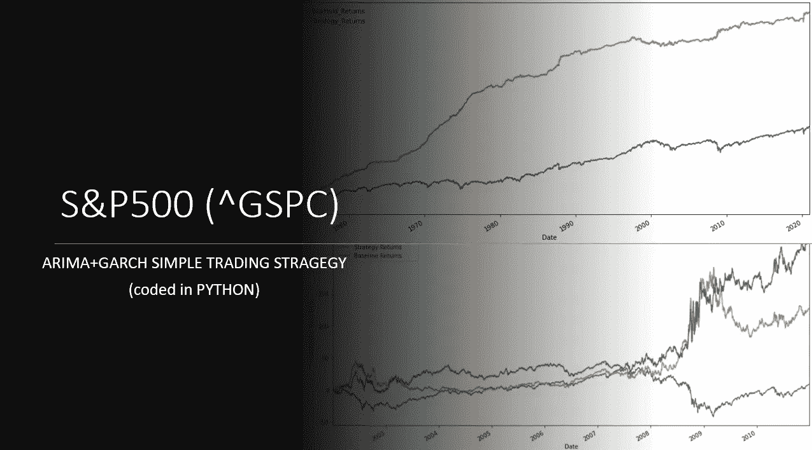

# 使用 ARIMA + GARCH 模型在 Python 中逐步实现交易策略

> 原文：<https://medium.com/analytics-vidhya/a-step-by-step-implementation-of-a-trading-strategy-in-python-using-arima-garch-models-b622e5b3aa39?source=collection_archive---------1----------------------->

## 利用功能齐全的 ARIMA+GARCH python 实现，并使用简单的可视化和比较框架在不同市场进行测试。

图片作者。

## 更新