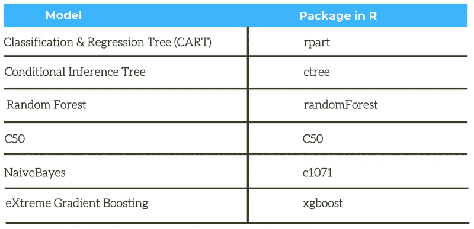
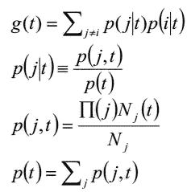
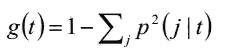
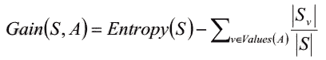
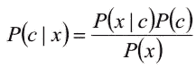
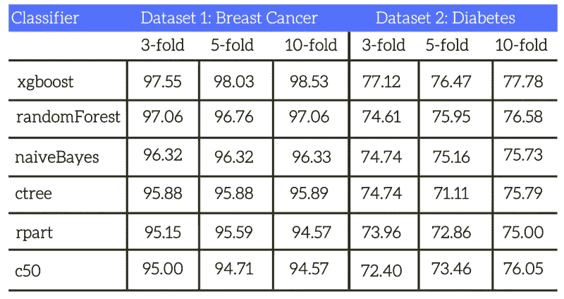
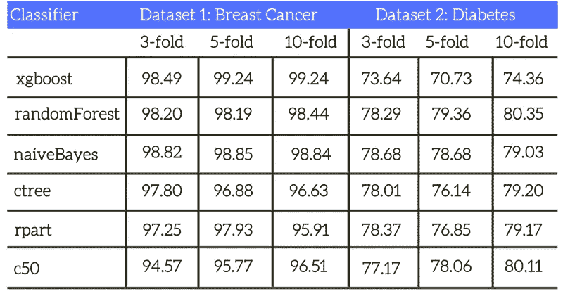
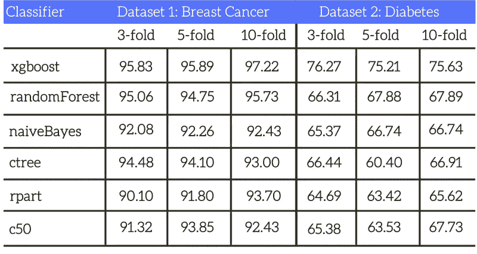

# 医学数据 R 包分类技术的比较研究

> 原文：<https://medium.com/analytics-vidhya/a-study-on-performance-of-classification-techniques-on-medical-data-using-r-packages-a892157d8da4?source=collection_archive---------18----------------------->

米利安·耶西耶在 [Unsplash](https://unsplash.com/?utm_source=unsplash&utm_medium=referral&utm_content=creditCopyText) 上拍摄的照片

# **简介**

医疗保健信息系统捕获数据库中的数据，用于研究和分析。数据量的增长使得传统的手动研究分析效率低下。这导致了健康研究中自动决策支持系统的发展。为了这个目的，许多计算机化数据分析的方法已经被考虑和检验。数据挖掘的主要目的是帮助决策者理解不同情况下的特征，并通过分析可用数据来预测未来事件。众多数据挖掘技术之一是**分类**方法。

[**分类**](https://machinelearningmastery.com/types-of-classification-in-machine-learning/) **将数据集中的每个成员识别到预定义的一组类或组中**。分类是发现将数据项映射到几个预定义类别之一的学习函数。虽然数据挖掘传统上与从大量数据中提取知识有关，但现实世界中的数据挖掘技术面临着从较小的数据集中提取知识的问题。基于数据集和分类方法的集合，数据挖掘器面临两个问题。第一个问题是为一个给定的数据集归纳出最准确的模型，第二个问题是在看不见的数据上具有所提出的模型的真正准确性。有不同的分类器可用，选择最准确的 [**分类器**](https://dzone.com/articles/introduction-to-classification-algorithms) 是一个基本问题。但是，在较小的数据集中实现较高的准确性存在问题，这可以通过使用 k 折叠交叉验证来实现。因此，本工作研究了 k 在交叉验证中的影响，以在*乳腺癌和 ***皮马印度*** ***糖尿病*** 数据集分类中获得更好的结果。*

# ***方法和材料***

****乳腺癌*** 数据集包含由九个属性表征的 699 个实例。 ***皮马印第安人糖尿病*** 有 768 个实例，由八个特征描述，用于预测糖尿病的存在或不存在。这些模型在 [R](https://www.r-project.org/) 中可用，这是一个在 GNU GPL 下授权的开源软件。*

*K-fold 用于测量[预测模型](https://en.wikipedia.org/wiki/Predictive_modelling)的准确性。在 k 重交叉验证方法中，原始样本被分成 k 个大小相等的子集。在 k 个子集中，保留一个子集作为测试模型的验证数据，剩余的 k-1 个子集用作训练数据。其中一个子集用作测试集，其他 k-1 个子集聚集在一起形成训练集。然后计算所有 k 次试验的平均准确度。使用 k-fold 交叉验证的优点是测试整个数据集。*

*在本研究中，使用 3 重、5 重和 10 重交叉验证将数据分为两类，即**训练**和**测试**。在每个 k-fold 中完成训练集之后，生成一个模型，基于该模型测试测试集。我们研究的数据集 ***乳腺癌*** 和 ***皮马印第安人糖尿病*** 均取自*[***ml bench***](https://cran.r-project.org/package=mlbench)*包。下表 1 简要描述了研究中使用的分类器。***

******

*****表 1:使用的机器学习模型*****

# ***分类和回归技术***

***分类和回归树技术使用带有预先分配的类别的历史数据来生成决策树。然后用它对新数据进行分类。决策树是通过将训练结果迭代地分成子组或树部分来从训练数据构建的。对于每个内部树节点，根据特征值设置划分条件。该算法试图找到产生最“纯”的数据细分的分裂，即分裂产生最能区分观察值的子组。CART 中构建决策树使用的杂质(或纯度)度量是[**基尼指数**](https://en.wikipedia.org/wiki/Gini_coefficient) 。***

***节点 *t 处的基尼指数 g (t)* 定义如下:***

****

**上式中 ***，I，j*** 为目标变量的类别，**【πⱼ】***，* ***j*** 为类别的先验概率 ***j*** ， ***Nⱼ*** 为根节点中类别的样本数。此外，基尼指数用于在树生长期间寻找分裂的改进，只有在节点 t 和根节点中具有分裂预测值有效值的那些记录用于分别计算***【nⱼ(t】*****【nⱼ】***。基尼指数的方程式也可以写成:***

****

**决策树算法为数据生成一个简单易懂的模型。通过从树根开始，然后迭代地向下移动与观察特征匹配的分支，从模型中为新的观察做出预测。最终，我们到达了树的一个叶子节点。叶节点标有我们将要预测的类。决策树对噪声很敏感，因此训练数据中微小的变化会导致不同的决策树，并产生不期望的结果。购物车算法通过*[***rpart***](https://cran.r-project.org/web/packages/rpart/)*包实现。****

*****讨论**:决策树容易理解和解释；布尔逻辑可以解释分类和回归结果；无论数据集的大小如何，它们都易于实现，并且可以处理属性值类型(数值型、分类型)的可变性。然而，构造最优决策树的问题是 NP 完全的。与单个决策树相关联的另一个问题是，它们往往难以适应和概括。决策树的集成通过在构建个体树和创建一组这样的随机化树时引入随机性元素来减轻过度拟合。***

# ***条件推理树***

***Hothron 等人介绍了一种对 rpart 方法的改进，用于构建决策树，称为条件推理树。条件推理树通过使用统计 p 值来解决 rpart 的过拟合和变量选择偏差。
[**算法**](https://www.rdocumentation.org/packages/partykit/versions/1.1-1/topics/ctree) 可以概括为三个步骤:***

1.  *****检验任何解释变量和响应之间的独立性的全局零假设。**
    (a) *停止如果这个假设不能被拒绝(p > 0.05)。*
    (b) *否则选择与
    响应关联最强的输入变量。这种关联是通过与单个输入变量和响应的部分零假设测试相对应的 p 值来衡量的。****
2.  ****在选择的输入变量中执行二进制分割。为了在选定的输入变量中找到最佳的二进制分割，该算法使用排列测试。默认停止标准确保包含少于 20 个观测值的组不会被拆分，并且拆分后的组将包含至少 7 个观测值。****
3.  ****反复重复步骤 1)和 2 ),直到达到停止标准。****

****讨论**:条件推理树提供了一些优于传统方法(如 CART)的优势。首先，变量选择是无偏的。第二，人们不必为了避免过度拟合而修剪结果。第三，该算法还提供了 p 值，显示人们对每一次分裂的信心程度。为了获得 p 值，它使用置换。条件推理树算法通过[***ctree***](https://rdrr.io/cran/party/man/ctree.html)**R 包实现。****

# ****随机森林****

****随机森林是一种流行和通用的预测模型。它的算法是基于决策树的。随机森林方法通过在所谓的集成分类器中嵌入大量决策树来提高决策树的稳定性和准确性。例如，随机森林可能包含 100 棵决策树。每个决策树都是在来自训练集的引导样本上训练的。通过让所有决策树创建一个预测并进行平均或多数投票来获得预测。将此过程应用于决策模型被称为 [**打包**](https://machinelearningmastery.com/bagging-and-random-forest-ensemble-algorithms-for-machine-learning/) 。它可以提高稳定性和准确性。R "[***Random Forest***](https://cran.r-project.org/web/packages/randomForest/index.html)***"***包中使用的创建随机森林的算法实现如下。****

1.  ****预定义数量的决策树被训练。****
2.  ******对于每一棵树，从训练集中抽取一个引导样本。然后在引导样本上训练该树，在每次分裂时仅从固定数量的随机选择的特征中进行选择。******
3.  ******可以从随机森林中做出预测，方法是向所有单独的决策树提供新的测试观察，然后平均它们的预测或进行多数投票。******

******信息增益**用于根据目标概念确定属性分离训练数据的程度。它基于信息论中常用的一种度量方法，即熵。用布尔目标概念在训练数据 S 的集合上定义， *S* 的**熵被定义为:******

********

****其中 p₊是 s 中正面例子的比例，p₋是反面例子的比例。根据属性 a，信息增益是在划分集合 S 的实例时熵的预期减少。其定义如下****

********

****其中*值(A)* 是属性 a 的所有可能值的集合，Sᵥ是 s 中属性 a 的值为 v 的示例的子集。等式中的第一项是原始数据集的熵。第二项描述了使用属性 a 对数据集进行分区后数据集的熵。它只不过是每个子集 Sᵥ的熵之和，这些熵是根据属于该子集的示例数量进行加权的。****

******讨论**:它不需要输入准备，执行隐式特征选择，并且在较大数据集上高效运行。已经观察到随机森林对于一些具有噪声分类的数据集过度拟合。随机森林算法的主要限制是，大量的树可能会使算法在实时预测时变慢。****

# ****C50****

****C50 算法是 C4.5 算法的扩展。C50 模型的工作原理是基于给出最大信息增益的场来分割样本。由第一次分割定义的每个子样本然后基于不同的字段再次分割。该过程重复进行，直到子样本不能被进一步分割。最后，审查最底层的分割，那些对模型的价值没有显著贡献的分割将被删除或删减。该算法通过[***C50***](https://cran.r-project.org/package=C50)*R 包实现。*****

*******讨论** : C5.0 处理数据集中的多值属性和缺失属性。数据的微小变化会导致不同的决策树(尤其是当变量的值彼此接近时)。在小规模的训练集上效果不是很好。[的优势](https://en.wikipedia.org/wiki/Ross_Quinlan)是几个数量级的速度，内存效率，更小的决策树，加速，对不同属性加权的能力，以及筛选。*****

# *****朴素贝叶斯*****

*****朴素贝叶斯分类器基于贝叶斯定理，并假设预测器之间相互独立。朴素贝叶斯模型易于构建，没有复杂的迭代参数估计，这使得它对非常大的数据集特别有用。尽管简单，朴素贝叶斯分类器通常表现得令人惊讶地好，并被广泛使用，因为它通常优于更复杂的分类方法。贝叶斯定理提供了一种计算后验概率的方法， ***P(c|x)*** ，从 ***P(c)*** ， ***P(x)*** ， ***P(x|c)*** 。朴素贝叶斯分类器假设预测值对给定类的影响独立于其他预测值。这种假设被称为类条件独立性。*****

********

****其中 ***P(c|x)*** 为一类给定预测器的后验概率， ***P(x|c)*** 为似然，即一个预测器给定类的概率， ***P(c)*** 为该类的先验概率， ***P(x)*** 为预测器的先验概率。一个简单的贝叶斯分类器由两部分组成。第一个分量 g 是有向非循环图(DAG ),其顶点对应于随机变量 ***X ₁，..，X ₙ*** 。第二个分量θ描述了每个变量的条件分布，给出了它在 g 中的双亲。****

******讨论**:尽管有很强的特征独立性假设，朴素贝叶斯分类器有几个特性使它出奇的好。训练一个模型需要少量的数据。它具有快速的建模能力和评分能力，可用于二分类和多分类问题。这是一个稳定的算法，因为训练数据的小变化不会使模型发生大的变化。****

# ****XGBoost****

****XGBoost 是“极端梯度推进”的缩写。这是一个梯度推进决策树的实现。Boosting 分类器属于集成模型；基本思想是聚合数百个不太精确的基于树的模型，以形成一个非常精确的模型。该模型通常在每一步迭代生成一个新的基于树的模型。模型按顺序添加，直到不能再进一步改进。该算法通过*[***xgboost***](https://cran.r-project.org/package=xgboost)*R 包实现。******

*******讨论**:增加新的弱学习器，修正所有之前树的残差。这产生了更强大的预测建模算法，可能比随机森林更强大。*****

# *****性能赋值*****

*****在这一部分中，我们分析了所有六个机器学习模型在训练和测试数据集上的预测结果。在本研究中，我们使用了**三重**、**五重**和**十重**交叉验证技术来研究绩效指标。从准确性、敏感性和特异性方面对性能指标进行评估。使用混淆矩阵来评估这些度量。混淆矩阵包括关于由分类器应用的实际和预测分类的信息。一个**真阳性(TP)** 结果表示一个实例被正确地分类到那个类，而**假阴性(FN)** 表示一个实例被错误地分类到那个类。**真阴性(TN)** 表示从类中正确拒绝的实例的数量，而**假阳性(FP)** 是从类中错误拒绝的实例的数量。*****

*******准确度**定义为正确分类的病例数之比，等于 TP 和 TN 之和除以病例总数。*****

*******灵敏度**指正确分类的阳性率，等于 TP 除以 TP 和 FN 之和。灵敏度可以被称为真阳性率。*****

*******特异性**指正确分类阴性的比率，等于 TN 与 TN 和 FP 之和的比值。*****

*****因此，通过计算其准确性、敏感性和特异性来评估分类器。*****

**********

*******表 2:六个机器学习模型的平均准确率*******

**********

*******表 3:六种机器学习模型的平均敏感度*******

**********

*******表 4:六种机器学习模型的平均特异性*******

# *****我们的结果*****

*****在本节中，我们分析了所有六个机器学习模型在*乳腺癌和 ***皮马印第安人糖尿病*** 数据集上的预测结果。不同分类器之间的准确度比较如表 2 所示。对于 ***乳腺癌*** 数据集， ***xgboost*** 模型优于其他机器学习模型。 ***xgboost*** '模型在 10 重交叉验证中达到了 ***98.53%*** 的准确率。对于 ***皮马印第安人糖尿病*** 数据集， ***xgboost*** 在 10 重交叉验证中达到最高准确率*77.78%。因此，我们可以得出结论，就预测精度而言，在六种不同的机器学习技术中，' ***xgboost*** '模型是更好的选择。*******

# ****最后的想法****

****本文对六种不同的机器学习模型进行了比较研究。研究结果证实了***【xgboost***】技术比其他分类器产生更好的结果。k 重交叉验证用于衡量不同机器学习模型的鲁棒性。据观察，在***【3 重】、5 重*** 和 ***10 重*** 交叉验证技术***【xgboost】***技术在准确性方面优于其他分类器。此外，我们试图评估 k 的影响，并发现有时增加或减少 k 值时精度水平保持不变。因此，我们可以得出结论，增加或减少 k 值不会增强结果。它仅仅增加了计算成本。****

******感谢阅读！******

****如果你觉得这篇文章有帮助，那么请把它发给其他人。****

****https://youtu.be/OSwuhYfMwWY ✅learn 过着社交焦虑的生活⇾****