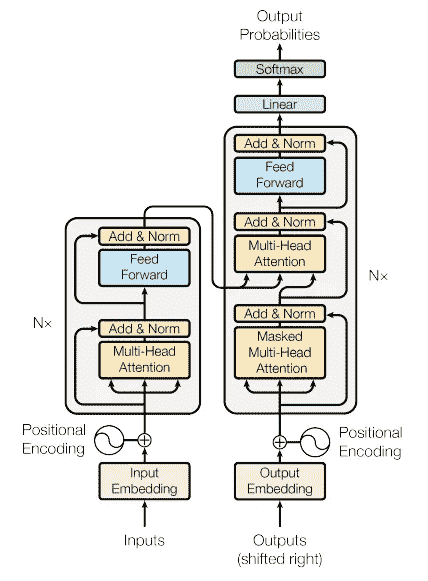
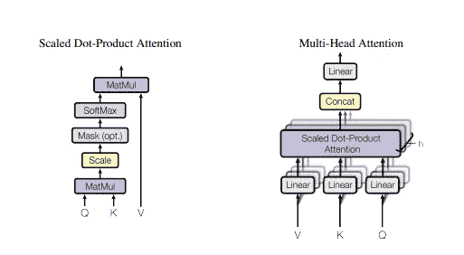
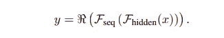
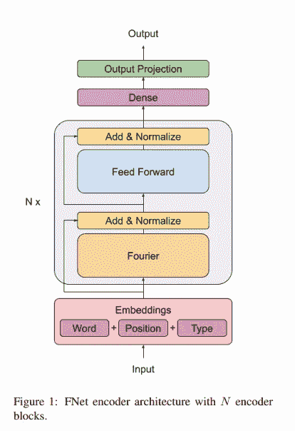
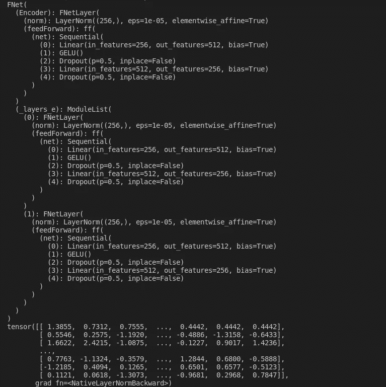
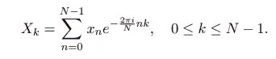

# 编码器突然变了！

> 原文：<https://medium.com/analytics-vidhya/a-sudden-change-to-the-encoder-368fd9a72bc7?source=collection_archive---------25----------------------->

# [theamitnikhade](https://medium.com/u/8cc2ede908a6?source=post_page-----368fd9a72bc7--------------------------------)

游览:【amitnikhade.com 


[ [演职员表](https://unsplash.com/photos/liAwyJ64wHE?utm_source=unsplash&utm_medium=referral&utm_content=creditShareLink)

> 《变形金刚》自问世以来，由于其重要的舞台表演而广受欢迎。他们统治了 NLP 和计算机视觉。基于变形金刚的模型一直是最受欢迎的。

## 概观

[**注意力是你所需要的一切**](https://arxiv.org/abs/1706.03762) 。本文描述了编码器和解码器堆叠在一起的变压器架构。这两种架构都包括[规范化](/@urvashilluniya/why-data-normalization-is-necessary-for-machine-learning-models-681b65a05029#:~:text=Normalization%20is%20a%20technique%20often,dataset%20does%20not%20require%20normalization.)、[前馈](https://en.wikipedia.org/wiki/Feedforward_neural_network)和[注意](https://www.analyticsvidhya.com/blog/2019/11/comprehensive-guide-attention-mechanism-deep-learning/#:~:text=The%20attention%20mechanism%20emerged%20as,natural%20language%20processing%20(NLP).&text=The%20encoder%20LSTM%20is%20used,state%20of%20the%20LSTM%2FRNN.)层。转换器最大的优势是它们的并行性。注意力在变形金刚机制中起到了至关重要的作用，负责其整体优化

[并行化](https://www.computerhope.com/jargon/p/parallelization.htm#:~:text=Parallelization%20is%20the%20act%20of,the%20next%2C%20then%20the%20next.)取代了 [seq2seq](https://www.analyticsvidhya.com/blog/2020/08/a-simple-introduction-to-sequence-to-sequence-models/) 机制，这是可行的，因为与早期的序列对序列模型相比，位置编码和注意力导致了更快的训练。



变形金刚模型建筑[ [来源](https://miro.medium.com/max/856/1*ZCFSvkKtppgew3cc7BIaug.png)

## 编码器

编码器由相同的 *n* 层堆叠而成，其中编码器的每个子层由多头关注和一个具有一定归一化的前馈网络组成。作为输入传递给编码器的向量是单词和位置嵌入的。

## 解码器

解码器有点类似于编码器，但稍有修改，如双关注层，其中第二关注层接受来自编码器和前一解码器关注层的输入，该输入进一步通过前馈网络。

## 注意力来了

首先，由于图片在处理数据时对某些因素的关注，它引起了人们的注意。简单地说，注意力以这样的方式学习上下文向量，即它使用余弦相似性从输入序列中提取和映射重要的和相关的信息，并给它分配更高的权重，这导致更精确的预测。它解决了编解码机制中的[消失梯度](https://machinelearningmastery.com/how-to-fix-vanishing-gradients-using-the-rectified-linear-activation-function/)问题。

在变压器的编码器部分，**自关注**用于关注输入序列，以便从中提取重要数据。

## 有许多头的野兽



多头注意力和成比例的点积注意力[ [来源](https://miro.medium.com/max/513/1*7Aye1P2QcS2wMhuSzQzZbA.png)

提供给注意力的输入是三个参数的形式，称为查询、键和值，即 *(Q，K，V)。*所有三个值都是相同的向量。在编码器自我关注。注意力层多次并行循环计算。这些计算中的每一个都被称为注意头。所有这些注意力计算结合在一起产生一个最终分数。在变压器架构中有三个注意事项。编码器自关注处理编码器的输入序列并关注自身，解码器自关注关注解码器的目标序列，编码器-解码器自关注关注解码器的输入序列。

这种关注被谷歌取代，因为它昂贵的计算需求以及训练模型所需的时间是巨大的。当他们用[快速傅立叶变换](https://en.wikipedia.org/wiki/Fast_Fourier_transform)做同样的尝试时，与自我注意相比，模型在更短的时间内得到训练，而精确度相似。

## 2021 年 5 月 9 日

谷歌用傅立叶变换代替了伯特自我关注

[FNet:将令牌与傅立叶变换混合](https://arxiv.org/abs/2105.03824)提出在编码器中用简单的标准非参数化傅立叶变换代替自我关注可以大规模地加速它，并且具有良好的准确性。快速傅立叶变换是离散傅立叶变换的优化版本。它从输入的信号中提取有用的特征。它在 GPU 上运行速度快 7 倍，在 TPU 上快 2 倍。这是混合令牌最有效的方法。此外，当通过快速傅立叶变换处理数据时，很少的信息丢失，这使得它更加有益。

FFT 首先由[库利和图基](https://en.wikipedia.org/wiki/Cooley%E2%80%93Tukey_FFT_algorithm) (1965)讨论，它主要用于信号处理，将信号分解成其组成频率，也用于图像处理，将图像分解成其正弦和余弦分量。FFT 对深度学习的贡献由来已久，它的一些应用是加速卷积、傅立叶 RNN 等。

**傅立叶变换**子层对序列维度应用 1D 傅立叶变换，对隐藏维度应用 1D 变换。



## FNET 编码器架构

> FNet 是具有多个层的层标准化 ResNet 架构，每个层由傅立叶混合子层和跟随其后的前馈子层组成。[【来源】](https://arxiv.org/pdf/2105.03824.pdf)



FNet 编码器架构[ [来源](https://arxiv.org/pdf/2105.03824.pdf)

上面的模型架构是带有傅立叶变换的[伯特模式](https://blog.google/products/search/search-language-understanding-bert/) l

编码器的架构保持不变，只是通过用傅立叶变换代替自关注进行了小的改变。这只是混合输入标记的另一种很酷的方式，它为前馈层提供了最重要的细节。模型中的线性变换加速了训练，性能良好。在我们的神经网络中，不存在我们偶然看到的权重概念，可学习的权重在训练中发挥作用。这也是增加加速度和使模型轻量化的一个因素。

## 履行

```
**# FNet Encoder**import torchfrom torch import nnfrom torch.nn import functional as Fclass ff(nn.Module):
    def __init__(self, dim, hidden_dim, dropout): super().__init__() self.net = nn.Sequential( nn.Linear(dim, hidden_dim), nn.GELU(), nn.Dropout(dropout), nn.Linear(hidden_dim, dim), nn.Dropout(dropout) ) def forward(self, x): return self.net(x)class FNetLayer(nn.Module): def __init__(self, dim, hidden_dim, dropout): super().__init__() self.norm = nn.LayerNorm(dim) self.feedForward = ff(dim, hidden_dim, dropout) def forward(self, x): residual = x **x = torch.fft.fft2(x, dim=(-1, -2)).real # Here it is** x = self.norm(x+residual) x = self.feedForward(x) x = self.norm(x+residual) return xclass FNet(nn.Module): def __init__(self, dim, hidden_dim, dropout, layers): super().__init__() self.Encoder = FNetLayer(dim, hidden_dim, dropout) self._layers_e = nn.ModuleList() for i in range(layers): layer = self.Encoder self._layers_e.append(layer) def forward(self, x): for e in self._layers_e: x = e.forward(x) return xmodel = FNet(dim=256, hidden_dim=512, dropout=.5, layers=2)print(model)x = torch.randint(1, 20, size=(20, 256))output = model(x)print(output)
```

[](https://github.com/AmitNikhade/FNet_Encoder) [## AmitNikhade/FNet _ 编码器

### 快速傅立叶变换的变压器编码器。为 AmitNikhade/FNet_Encoder 开发做出贡献，创建一个…

github.com](https://github.com/AmitNikhade/FNet_Encoder) 

本质上，傅立叶变换只是将输入编码为嵌入的线性组合(我们将其作为位置和单词嵌入提供给编码器)。这些组合嵌入进一步与前馈网络中的非线性混合。与创造奇迹的自我关注相比，这只是一个简单的算法。

## 输出

下面是带有输出的模型摘要。



在下面的 python 代码中，我们只实现了没有位置嵌入的编码器和最终的密集层。从 torch 库中导入的快速傅立叶变换层将矢量化的输入序列变换为一维离散傅立叶张量。其中 *dim* 是序列长度， *hidden_dim* 是模型隐藏维数离散傅立叶变换由以下公式定义。



> 如果我们在 GPT 使用 FFT 会怎么样？请在下面评论意见。

在 [GLUE benchmark](https://gluebenchmark.com/) 中，带自我关注的谷歌 BERT 仅比带快速傅立叶变换的 Bert 精确 8%,但 FFT 在 GPU 中的计算速度快 7 倍

简单来说，[傅立叶变换](https://en.wikipedia.org/wiki/Fourier_transform)是一种将复杂的时间信号变换成由频率定义的更简单的子分量的算法。

## 关于我

[](https://www.linkedin.com/in/theamitnikhade/) [## Amit Nikhade - JSPM 拉贾什胡莎工程学院-马哈拉施特拉邦阿科拉

### 在我的杯子里装了很多咖啡，为普通智力革命而工作。我是一个热爱享受的人…

www.linkedin.com](https://www.linkedin.com/in/theamitnikhade/) 

## 参考

 [## 你需要的只是关注

### 主导序列转导模型是基于复杂的递归或卷积神经网络在一个…

arxiv.org](https://arxiv.org/abs/1706.03762) 

## 结论

希望这些文章能让你理解 Google Research and team 发布的确切研究，我试着让它更直截了当、更简单，这样就容易理解了。谢谢你。