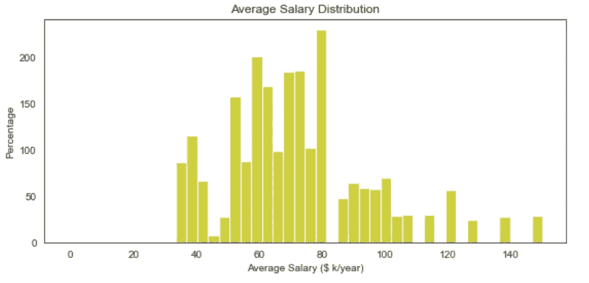
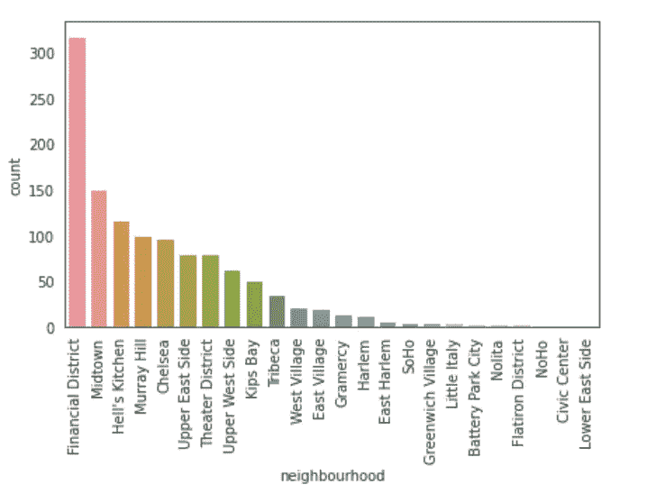
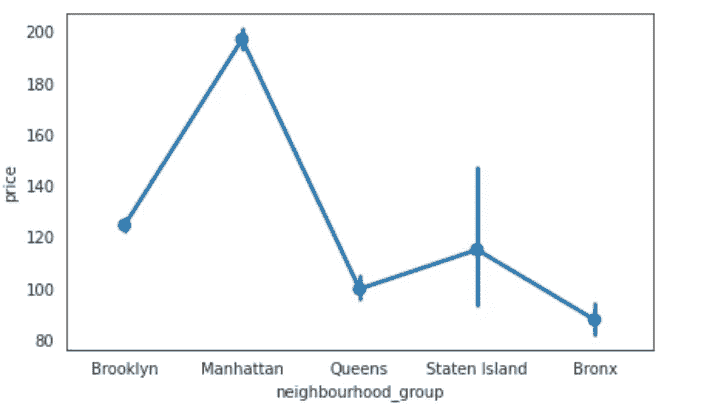
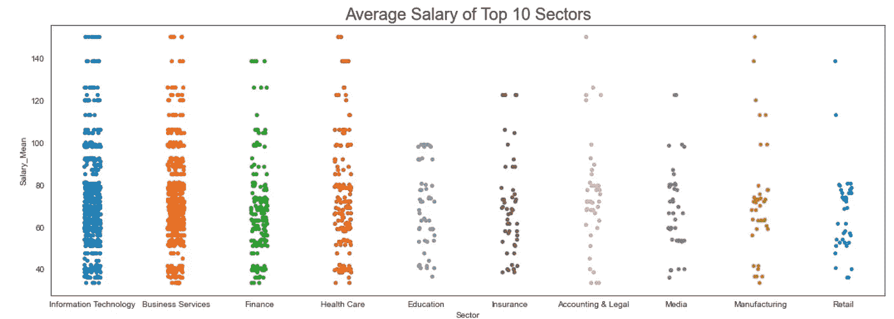
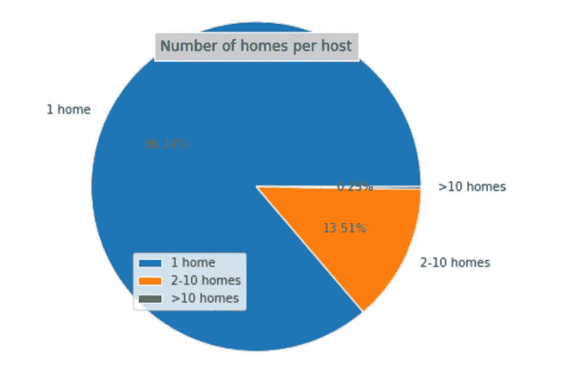
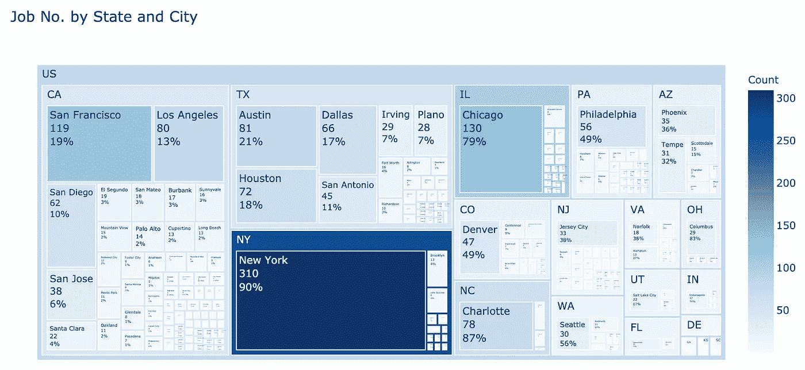
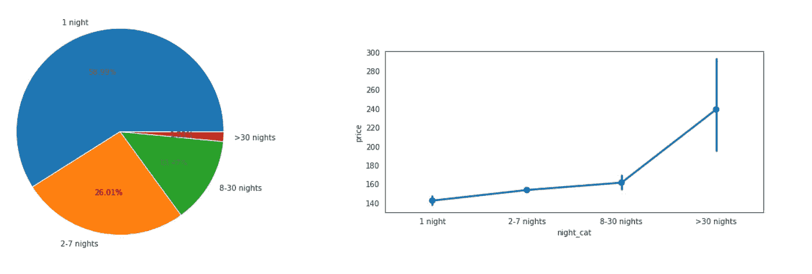
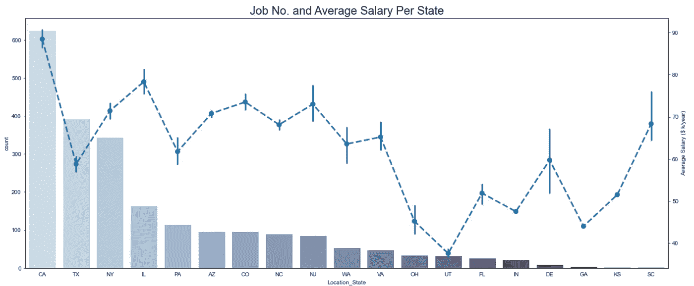
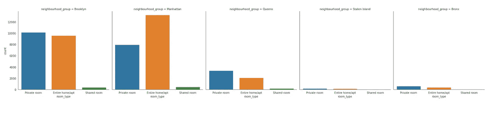

# 初学者可视化实践总结

> 原文：<https://medium.com/analytics-vidhya/a-summary-of-visualization-practices-for-beginners-8e921a90f8b8?source=collection_archive---------25----------------------->

这是在处理不同类型的数据时可以使用的一些可视化方法的总结。在我的前两次 EDA 尝试中，我尝试了多种可视化实践，所以这里我将总结一下我的尝试，以供将来参考。

以下是我的两个尝试:
谁，哪里，什么——2019 NYC Airbnb 分析

[https://www . ka ggle . com/juliayyy/who-where-and-what-2019-NYC-airb-b-analysis](https://www.kaggle.com/juliayyy/who-where-and-what-2019-nyc-airb-b-analysis)

美国数据分析师工作中的 EDA、可视化和 NLP

[https://www . ka ggle . com/julianyy/EDA-visualization-NLP-on-us-data-analyst-jobs](https://www.kaggle.com/juliayyy/eda-visualization-nlp-on-us-data-analyst-jobs)

我主要用了以下 3 个包:

1.  Matplotlib
2.  海生的
3.  plotly.express

总的来说，我觉得可视化的核心永远是要有意义。虽然漂亮的外观使报告更具可读性，但我们最好也要谨慎使用花哨的方法。因此，在本文中，我想根据不同的用户案例总结如下技术类型:

1.  数数
2.  比较不同类别的数量
3.  一个类别的对比成分
4.  一起绘制多个图形

以下是详细情况:

## **1。计数数字(通常探索一列)**

做 EDA 的时候，数数可能是最常见的任务。
例如，我们可能想查看所有工作的工资分布。或者，我们想知道每个主机拥有多少 airbnb 房屋。所以基于不同的目的我们还可以进一步划分任务来分配和统计&等级。

**分布类型:**
目的:查看某一类别的整体数字分布。
工具:Seaborn (distplot | histplot)，matplotlib(hist)

代码:
Seaborn:

```
sns.histplot(df['column'], color = 'y')
```

[https://seaborn.pydata.org/generated/seaborn.histplot.html?highlight = hist # seaborn . hist plot](https://www.kaggle.com/discussion/url)



或者 Matplotlib 也可以完成这项工作:

```
df['column'].hist(bins=n)
```

[https://matplotlib . org/3 . 1 . 1/API/_ as _ gen/matplotlib . py plot . hist . html？highlight = hist # matplotlib . py plot . hist](https://www.kaggle.com/discussion/url)

**计数&等级类型:**

目的:对每种类型的数字进行计数并按降序/升序排列
工具:Seaborn (countplot，barplot)，matplotlib(barplot)

Seaborn:

```
sns.countplot(df["column"], order=[list])
sort_list = df["column"].count().sort_values(ascending = False).head(n) # to sort the column
order_list = [x for x in sort_list.index]
```

[https://seaborn . pydata . org/generated/seaborn . count plot . html？highlight = count plot # seaborn . count plot](https://www.kaggle.com/discussion/url)



或者我们也可以使用 Matplotlib 来完成这个任务:

```
df["column"].plot(kind="bar", title = "")
```

## 2.比较不同类别的数量(通常浏览多个列)

当我们有连续变量时，如工资、审核数量等。我们可能想要比较不同类别的数字。由于对细节的需求程度不同，我们有不同的绘图方式:

**紧凑型** :
目的:了解对比的大致情况
工具:Seaborn (pointplot)

Seaborn:

```
sns.pointplot(x="column1" ,y="column2", data=df)
```

[https://seaborn . pydata . org/generated/seaborn . point plot . html？highlight = point plot # seaborn . point plot](https://www.kaggle.com/discussion/url)



**详式** :
目的:比较中位数，清楚 IQR。
工具:Seaborn(矩形图、小提琴图)

Seaborn 箱线图:

```
sns.boxplot(x='column1',y = 'column2', data=, whis =n, order =[list], palette="" )
```

[https://seaborn.pydata.org/generated/seaborn.boxplot.html?highlight = box plot # seaborn . box plot](https://www.kaggle.com/discussion/url)


或者，如果我们想显示变量的分布密度(例如:薪水)，我们也可以选择带状/群集图:
工具:Seaborn (stripplot，swarm plot)

Seaborn stripplot:

```
sns.stripplot(x = df['column1'], y = df['column2'], order =[list] )
```

[https://seaborn . pydata . org/generated/seaborn . strip lot . html？highlight = strip plot # seaborn . strip plot](https://www.kaggle.com/discussion/url)



## 3.一个类别的对比成分

做 EDA 的时候，我们总想看看一个品类的组成部分是什么，占总的比例是多少。所以根据组件的数量，我们可以使用不同的绘图方法。
**少数组分类型** :
目的:对比单一图层类别中少数不同组分的百分比
工具:Matplotlib (Piechart)

```
plt.pie(df['column'].value_counts(), labels =[list], autopct = "", radius = n)
```

[https://matplotlib . org/3 . 1 . 1/API/_ as _ gen/matplotlib . py plot . pie . html？highlight = pie # matplotlib . py plot . pie](https://www.kaggle.com/discussion/url)



**复杂组件类型:**
用途:对比一个多层类别中多个不同组件的百分比
工具:Plotly。快速(树形图)

```
fig = px.treemap(df, path=['column1', 'column2', 'column3'], values='', color= '')
fig.data[0].textinfo = 'label+text+value+percent parent'
fig.show()
```

[https://plotly.com/python/treemaps/](https://www.kaggle.com/discussion/url)



## 4.一起绘制多个图形

有时，我们可能希望一起显示相同/不同类型的图，以便进行比较或提供更多信息。所以在这里我想把绘制策略分类如下:
**相同组件不同信息** :
工具:Matplotlib(Piechart)+Seaborn(point plot)

```
fig,(ax0,ax1) = plt.subplots(nrows=1,ncols=2, sharey=False, figsize=(20,4))
ax0.pie(df['column'].value_counts(), labels =[list], autopct = "", radius = n)
sns.pointplot(x='column1',y="column2", data=df, ax = ax1)
plt.show()
```



或者
我们也可以在一个图形中结合计数图和点图:

```
plt.figure(figsize = (20,8))
sns.countplot(df["column"], order=[a list])
ax2 = plt.twinx()
sns.pointplot(x="column1" ,y="column2", data=df ,order=[a list])
plt.show()
```



**信息相同的不同组件:**
工具:Seaborn (catplot / relplot)

```
sns.catplot(x="column1",data=df, kind="count", col = "column2") plt.show()
```

https://seaborn.pydata.org/generated/seaborn.catplot.html?highlight = cat plot # seaborn . cat plot



以上是我从两个可视化项目中得到的主要收获，要点是在处理不同的数据类型时对我的想法进行分类和组织。我觉得商业分析师/数据分析师的任务总是像为客户打磨珠宝，所以在处理不同的材料时，我们需要选择不同的技术和策略。这个话题会随着我以后的尝试不断更新。