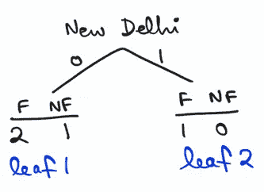

# 决策树分类器的一个超简单解释

> 原文：<https://medium.com/analytics-vidhya/a-super-simple-explanation-to-decision-trees-classification-803cdab695a?source=collection_archive---------14----------------------->

# **目标**

通过这篇文章，我试图实现的是对基本 ML 概念的全面介绍(希望能发展成一个完整的系列)。在可能的范围内，这些概念将通过在 Python 上进行的和/或手工制作的玩具示例来说明。我的主要信息来源(和灵感)是非常有趣、非常博学的乔希·斯塔默。以防万一，我没有像他在视频教程中那样公正地解释这个概念，我会在最后附上视频供您查看。

# **观众**

任何数据科学新手/对 ML 基础感到生疏。

# **什么是决策树？**

决策树是一种非常直观和简单的算法，用于分类目的。

# **他们可以使用哪些类型的数据作为特征？**

*   数字的
*   分类
    -二进制
    -多类

# **玩具示例**

因为一次处理多种数据类型不会增加问题的复杂性(除了像我们这样手动解决问题时，会变得非常漫长和令人疲惫)，所以我们会立即处理上述所有数据类型的问题。

考虑以下问题:

我们需要根据以下因素来预测一个人是适合(F)还是不适合(NF):

*   他们的年龄(数字)
*   他们是否每周至少吃一次披萨(绝对——二元)
*   他们居住在哪个城市(分类-多类)

其中分类变量 0 =否，1 =是。

决策树现在以降序创建拆分，以区分适合和不适合；即通过拆分如何有效地减少混淆。混乱程度的下降可以用基尼指数或熵来衡量。在本文中，我们将计算 GI。下面是我们将用来计算分割的最佳特征序列的公式。

由分割产生的总 GI 越低，分割在分离类别方面就越好。

**数字**

**年龄:**

步骤 1:按升序排列年龄:

第二步:找出后续年龄之间的平均年龄:

步骤 3:当数据在新创建的平均年龄上分割时，找到 GI:

因为完全相同的计算适用于年龄<= 30, we can skip to Age <= 40.

**分类**

**双星**

***披萨:***

TGI = (TGI 的年龄<= 40) = 0.33.

**多类**

***城市:***

班加罗尔

TGI =(年龄< = 25 岁的 TGI)= 0.25。

孟买

TGI =(40 岁以下的 TGI)= 0.33。

新德里

TGI =(40 岁以下的 TGI)= 0.33。

班加罗尔或孟买

TGI =(40 岁以下的 TGI)= 0.33。

班加罗尔或新德里

TGI =(40 岁以下的 TGI)= 0.33。

孟买还是新德里

TGI =(年龄< = 25 岁的 TGI)= 0.25。

以下是我们研究结果的总结:

从这张表中我们可以看出 https://github.com/sreevidyaraman/Decision-Tree 的年龄。

**结论**

我们已经看到了简单决策树的内部机制，它似乎工作得很好。然而，决策树的问题是，尽管它们在适合的数据上工作得很好，但当用于预测看不见的数据时，性能会受到沉重打击，这给了我们进入[随机森林](https://lnkd.in/gXKc3EE)的完美过渡。

最后，令人惊叹的乔希·斯塔默视频！

**参考文献**

[1] Starmer，与 Josh 一起进行 StatQuest。*回归树木，解释清楚！！！* YouTube，2019 年 8 月 20 日，[https://www.youtube.com/watch?v=g9c66TUylZ4.](https://www.youtube.com/watch?v=g9c66TUylZ4.)

# **Conclusion**

So we’ve seen the inner mechanisms of the humble Decision Tree, and it seems to work beautifully. The problem with Decision Trees however, is that although they work well on the data that they are fitted on, performance takes a heavy hit when used to predict unseen data, which gives us the perfect segue into [Random Forests](https://lnkd.in/gXKc3EE).

And finally, the amazing Josh Starmer video!

# **References**

[1] Starmer, StatQuest with Josh. *Regression Trees, Clearly Explained!!!* YouTube, 20 Aug. 2019, [https://www.youtube.com/watch?v=g9c66TUylZ4.](https://www.youtube.com/watch?v=g9c66TUylZ4.)