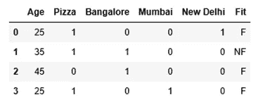
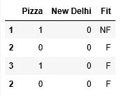
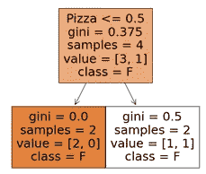
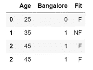
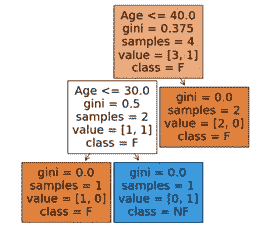
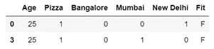
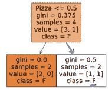
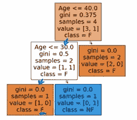

# 随机森林分类器的一个超简单解释

> 原文：<https://medium.com/analytics-vidhya/a-super-simple-explanation-to-random-forest-classifier-d73c9a3307ee?source=collection_archive---------18----------------------->

# **目标**

这篇文章是*超级简单解释*系列的第二部分，旨在，你猜对了，对 ML 概念进行超级简单的解释。我尝试用一个手工制作的例子来做这件事，这个例子将引导您完成构建随机森林所涉及的决策过程，这样当您在 Python 上实现两行代码时，您就知道后端发生的神奇的确切性质。

# **观众**

任何数据科学新手/对 ML 基础感到生疏。

**什么是随机森林？**

随机森林是一堆集合在一起的决策树。

它们是对决策树的改进，因为它们更加灵活；不同的树可以说明不同类型的特征组合。此外，通过聚集来自众多决策树的结果，随机森林的预测更加稳健。

随机森林的泛化能力通过两种方式实现:

1.为每棵树中的观察值赋予不同的权重(不同于决策树，决策树为所有观察值赋予相同的权重)

2.仅使用随机的特征子集来构建每棵树(不像决策树，它使用所有的特征来构建树)

# **他们可以使用哪些类型的数据作为特征？**

*   数字的
*   类别
    -二进制
    -多类

# **玩具示例**

让我们继续我们的[决策树博客](https://lnkd.in/g8kyvcU)中的例子。下面讨论的构建个体决策树的确切机制可以通过参考前面提到的博客来理解。

我们需要根据以下因素来预测一个人是适合(F)还是不适合(NF):

*   他们的年龄(数字)
*   他们是否经常吃披萨(分类-二元)
*   他们居住在哪个城市(分类-多类)

其中分类变量 0 =否，1 =是。

**第一步。对每棵树中的观察值赋予不同的权重**

这是通过创建引导数据集来实现的；也就是说，我们通过替换重采样来构建与原始数据集大小相同的数据集。这意味着在我们的引导数据集中会有重复的行。

乍一看，这似乎有点奇怪；我们的模型多次看到同一个观察值有什么意义？通过将我们的树暴露给相同观察的多个实例，我们给这些重复的样本更高的权重。你会问，我们为什么想要这个？

虽然在理想的情况下，我们的训练数据将是我们测试数据的完美表示，但这并不是我们实际处理的数据集中发生的情况。在我们处理的数据集中，我们的训练数据中的一些模式将比我们的测试数据中的更普遍/更不普遍。为了说明这种可能性，我们基于不同的数据集构建决策树，这些数据集为每棵树中的不同行(也称为模式)赋予更高的权重，从而允许学习更加一般化，并减少过度拟合的机会。

尽管在真实的场景中，会构建数百个决策树，但为了便于说明，我们在示例中只构建两个树。让我们继续构建两个自举数据集和它们对应的决策树。

该算法首先采用**N =****sqrt(# features)**(在我们的例子中= sqrt(5) ≈ 2)，然后尝试高于和低于该值的# features，以找到构建决策树的随机特征的最佳数量。让我们从构建具有两个随机特征的树开始:

**构建第一棵决策树**

第一个包含两个要素的随机子集的引导数据集。

我们可以看到新德里特征没有帮助我们区分适合和不适合，因此它没有用在我们的第一个决策树中。

**构建第二棵决策树**

具有两个要素的随机子集的第二个引导数据集。

看起来该决策树能够在不使用 Bangalore 功能的情况下区分适合和不适合。

**第二步。来自树的聚合预测**

现在我们已经有了两个决策树，我们可以汇总它们的结果来得出我们的最终预测。这种 **b** 脱壳和**聚集**的结合就是俗称的**装袋**。

请注意，在我们的每个引导数据集中，有一行被遗漏了；第一种情况是第 0 行，第二种情况是第 3 行。这不是偶然的；一般来说，自举过程中会遗漏 1/3 的数据。这些行组合在一起构成了开箱数据集。

袋外数据集

衡量我们的随机森林性能的一种方法是在我们的随机森林中运行 Out-of-Bag 数据集，看看它的表现如何。

通过第一个决策树运行第 0 行，我们预测个人是合适的。

通过第二个决策树运行第 0 行，我们预测个人是合适的。

这两棵树一致预测个体是适合的，这是正确的。如果是平局，那么我们的随机森林会任意选择任何一个预测。这使得我们的 OOB 误差(OOB 数据集被错误分类的比例)= 0。

顺便提一下，我们的 OOB 数据集中的两行将以相同的方式评分，因为我们的随机森林中使用的唯一两个要素是 Pizza 和 Age，这两个要素对于两行都是相同的。这对我们来说很简单，不需要第二个例子。

顺便提一下，使用两个特性的子集对我们来说效果很好。如果没有，我们将继续构建 N=1，N=3，… N=5 的两个树的集合，并在产生最小 OOB 误差的 N 上结束。

您可以在这里找到我们手动构建随机森林的玩具示例的代码，以及如何使用实际的 Python 包构建随机森林的代码:[https://github.com/sreevidyaraman/Random-Forest](https://github.com/sreevidyaraman/Random-Forest)。

# **结论**

随机森林很棒。通过增加灵活性和减少过度拟合，它们是对决策树的巨大改进。正如我们在玩具示例中看到的，基本上有两个主要的超参数需要确定；树的数量和构建树的要素的数量。

像往常一样，Josh Starmer 是这个深入，但(希望)简单解释的灵感。这个解释的一个可能更有趣的版本可以在:

# **参考文献**

[1] Starmer，与 Josh 一起进行 StatQuest。StatQuest:随机森林第 1 部分——构建、使用和评估。YouTube，2018 年 2 月 5 日，[https://www.youtube.com/watch?v=J4Wdy0Wc_xQ.](https://www.youtube.com/watch?v=J4Wdy0Wc_xQ.)