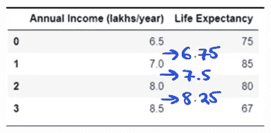
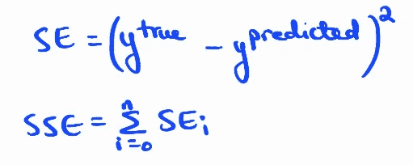
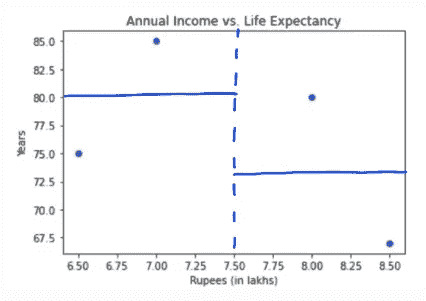

# 回归树和随机森林回归子的简单解释

> 原文：<https://medium.com/analytics-vidhya/a-super-simple-explanation-to-regression-trees-and-random-forest-regressors-91f27957f688?source=collection_archive---------10----------------------->

# **目标**

通过这篇文章，我试图实现的是对基本 ML 概念的全面介绍(希望能发展成一个完整的系列)。在可能的范围内，这些概念将通过在 Python 上进行的和/或手工制作的玩具示例来说明。我的主要信息来源(和灵感)是非常有趣、非常博学的乔希·斯塔默。

# **观众**

任何数据科学新手/对 ML 基础感到生疏。

# **什么是回归树(又名。决策树回归器)？**

回归树是一种非常直观和简单的算法，用于处理具有连续 Y 变量的问题。

# **他们可以使用哪些类型的数据作为特征？**

*   数字的
*   分类
    -二进制
    -多类

# **玩具示例**

在这个玩具示例中，我们试图根据年收入来预测预期寿命。为了简单起见，我们只有一个连续的 X 变量。如果你想知道如何处理分类变量，你可以查看[一个对决策树分类器](https://lnkd.in/g8kyvcU)的超级简单的解释，它有详细的手工计算。

显然，线性回归在这里不起作用。看起来年收入的增加只会在一定程度上导致预期寿命的增加，之后预期寿命开始下降。倒 U 形比直线更适合这个数据。

那么回归树是如何计算出在哪里进行分割的呢？

**第一步。对 X 变量(收入)进行升序排序。**
已经做了。

**第二步。求后续 x 之间的平均值。**
这些均值是分割的潜在阈值。因此，在本例中，我们不需要进行三次以上的拆分来进行最终预测。

如果你读过[对决策树分类器](https://lnkd.in/g8kyvcU)的一个超级简单的解释，那么步骤 1 & 2 你会很熟悉。

**第三步。计算对应于 x 中每个分裂的平均 Ys(预期寿命)和误差平方和(SSEs)。**

*在 X=6.75 上拆分:*

*在 X=7.5 上拆分:*

*在 X=8.25 上拆分:*

显然，X = 8.25 时的分割导致最低的 SSE (=50)，因此这将是分割的第一个阈值。

我们看到图中的节点和树叶也提到了 MSE，所以让我们快速看一下这是怎么回事。

当我们在节点上时，我们还没有做任何分割。在这一点上，天真的预测是平均预期寿命= (75 + 85 + 80 + 67)/4 = 76.75。

与这一天真的预测相对应，所有观测值的 MSE 为:

分割后，树叶中的 MSE 为:

**第三步。对每一片叶子分别重复步骤 2，直到我们建立起一个完整的决策树。**

因为我们没有限制我们的树的长度，它做出完美的预测，所以每片叶子的 MSE 是 0。

# 随机森林回归量

事情是这样的。乍一看，这似乎是一个适合任何具有连续因变量的数据的出色算法，但事实证明，决策树非常容易过度拟合(它们非常适合训练数据，但不太适合测试数据)。为了缓解这个问题，我们可以建立随机森林。关于随机森林如何工作的详细讨论，请阅读[对随机森林分类器的超级简单解释](https://lnkd.in/gXKc3EE)。随机森林分类器和随机森林回归器之间有两个确切的区别:

1.  **决定拆分的方式。**在随机森林分类器中，分裂基于熵，而在随机森林回归器中，分裂基于 MSE。
2.  **聚合方法**。在分类问题中，随机森林采用所谓的“多数投票”,其中对跨树观察最常见的预测是观察的最终预测。另一方面，在回归问题中，跨树预测的平均值将是观测值的最终预测值。

这些计算的乏味真的让人欣赏这些算法在 Python 上工作的速度，不是吗？您可以在:[https://github.com/sreevidyaraman/Regression-Tree](https://github.com/sreevidyaraman/Regression-Tree)找到构建和可视化回归树的代码。

[1]对于那些不喜欢线性回归的人来说，你并不孤单。我有经济学硕士学位，但线性回归仍然会让我出错。但是我很快会写一篇关于它的文章，它会澄清围绕这个话题的许多困惑。但就目前而言，你知道线性回归在这里不起作用就足够了，因为收入和预期寿命之间的关系不是线性的。

# 参考

[1] Starmer，与 Josh 一起进行 StatQuest。*回归树木，解释清楚！！！* YouTube，2019 年 8 月 20 日，[https://www.youtube.com/watch?v=g9c66TUylZ4.](https://www.youtube.com/watch?v=g9c66TUylZ4.)