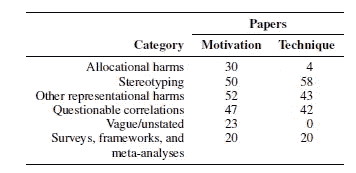

# 自然语言处理系统中的“偏差”综述

> 原文：<https://medium.com/analytics-vidhya/a-survey-of-bias-in-natural-language-processing-systems-4745a3f81f9d?source=collection_archive---------27----------------------->

来源:自然语言处理中的偏差[8]

本文是对 Blodgett 等人的论文“语言(技术)就是力量:对自然语言处理中偏见的批判性调查”的简要评论。作者选择了 146 篇研究自然语言处理中偏见的论文。他们指出了这些研究缺陷的几个标准，并将它们分为六类。然后，他们还通过分析社会等级和语言之间的关系，提出了 3 条建议来克服现有文献的不足。他们不仅关注某种偏见如何变得有害，还关注这种偏见对谁有害以及为什么有害。

1.  **论文选择:**146 篇相关论文的选择方法总结如下:
    a)首先，他们排除了所有涉及演讲的论文，仅限于文本内的讨论。
    b)然后使用 [ACL 选集](https://www.aclweb.org/anthology/)(目前包含 63756 篇关于计算语言学和自然语言处理的论文)来查找 2020 年 5 月之前发表的包含关键词“偏见”或“公平”的论文。c)在社会背景下使用“偏见”的论文被认为是相关的，在所有其他背景下讨论“偏见”的论文被排除在外。
    d)研究得到的论文集的引用图，以保留解决 NLP 系统中的偏见的任何论文，这些论文或者被已经存在的论文集引用，或者被任何已经存在的论文集引用。
    e)为了最终确定论文的选择，人工调查了机器学习、自然语言处理和人机交互领域的主要会议和研讨会，以找到任何其他讨论 NLP 系统中偏见的论文，但作者发现所有相关论文都被较早地包括在内。
2.  **论文分类:**论文的分类基于之前创建的危害分类法，该分类法区分了分配危害和代表性危害(Barocas 等人，
    2017；克劳福德，2017)。分配性伤害是指资源不均衡地分配给不同的社会群体。当一个群体比其他群体受到更好的对待，或者一个群体失去人性时，代表性伤害就会发生。作者将这一分类扩展到以下六个不同的组:

a) *分配危害*

b) *刻板印象*重申对社会群体的负面概括

c) *其他代表性损害*如对不同社会群体的歪曲

d) *系统行为和特定社会群体语言特征之间可疑的相关性*

e)对研究中的偏见描述含糊不清或没有描述

f)调查、框架和元分析

作者提供了一个表格，详细说明了属于这些类别的论文的数量。

图 1:146 篇论文的分类[Blodgett 等人，2020]

**3。调查结果:NLP 中偏差分析的问题**

**3.1** **问题源于论文的动机**

作者发现有些论文没有动机或动机模糊，有些论文有多重动机。然而，它们往往未能提供“歧视”、“偏见”和“不公正”等术语的精确定义。近三分之一的论文动机集中于系统性能，而非规范问题。即使论文描述了使用特定系统的明确原因，也不总是清楚被描述为“偏见”的实践在多大程度上、对谁以及如何有害。

作者还讨论了不同研究小组对偏倚的不同定义之间的不一致问题，以及这种不一致如何导致减轻偏倚的技术不一致。他们还解释了过于关注偏见的下游影响的作品如何缺乏对代表性伤害的关注，例如，由于主导语言规范而在搜索结果中不存在。

**3.2** **源于技术的问题**

除了关于刻板印象的论文之外，许多研究工作提出了一些定量技术，但没有考虑 NLP 之外的任何关于偏见的文献。此外，作者发现了动机和技术之间的不匹配，例如，30 篇论文中只有 4 篇在动机中提到了减轻分配伤害的技术。

此外，大多数现有的工作集中于数据集或系统预测中的偏差作为偏差的来源，但未能解决 NLP 系统中的开发和部署步骤作为潜在的偏差来源。

**4** 。**NLP 系统中偏差分析的建议:**作者为 NLP 社区提出了以下关于解决 NLP 系统中偏差的建议:

4.1 语言和社会等级:应该关注使用语言的更广泛的社会背景，以及语言的信仰如何影响社会。例如，由于社会的反黑人污名，毒性检测系统经常错误地将非裔美国英语标记为比主流英语更具毒性。因此，在性别和种族背景下较少非人性化和更具包容性的"性别公平"语言被提出来减少社会中不同群体之间的不对称。NLP 社区应该意识到语言、社会等级和 NLP 系统中意识形态的共同产物，以便现有的不平等不会被技术重申和重建。NLP 研究人员应该研究语言规范、标准与非标准语言规范(以及这种差异背后的原因)、语言的母语与非母语使用以及 NLP 系统的目标受众、数据的收集和注释、NLP 系统的评估标准、语言意识形态的转变(“坏”语言是否意味着 NLP 系统不能轻松地通过它？)，以及 NLP 系统造成的最关键的代表性伤害。

**4.2“偏见”的概念化:**研究人员发现，在某些情况下，偏见是简单明了的，但定义不一致的偏见可能会影响读者的判断。研究人员必须精确地定义“偏见”,具体说明偏见的来源，它对人群的有害影响，造成这些伤害的方式，以及偏见有害的原因。此外，他们还应该调查这种偏见的社会和行为价值。

**4.3 实践中的语言使用:**NLP 研究人员应该更多地研究人机交互、社会计算和社会语言学方面的作品，以更多地了解 NLP 系统如何以不同的方式影响不同的社区。他们应该研究社区应该如何对 NLP 系统作出反应，NLP 系统故障对他们的影响，由于审查或监督导致的语言资源的不当分配，以及 NLP 系统开发中的决策过程如何通过改革来解构技术人员和社区之间现有的权力关系。

**5。以案例为例的建议**

作者展示了一个案例研究:在非裔美国英语(AAE)的背景下分析偏见的作品。现有的工作显示了语言识别系统、依存解析器和毒性检测系统如何不完善和不正确地在 AAE 上工作(Jorgensen 等人，2015，2016；Blodgett 等人，2016，2018；戴维森等人，2019；Sap 等人，2019)。然而，这些作品都没有深入研究种族等级和意识形态的历史；因此未能将对 AAE 的偏见与说该国语言的人联系起来，这些人是源于种族等级制度的种族主义和语言不平等的受害者。作者还提到了展示 AAE 教在教育系统、司法和住房方面受到惩罚的作品。如果 NLP 系统中的种族偏见仅仅被认为是一个表现问题，那么对 AAE 现有污名的强化就会被忽视。

最后，我对本文的观察和理解是，NLP 社区考虑了美国种族等级的历史，以理解说 AAE 语的社区如何遭受与不是为 AAE 设计的 NLP 系统的交互。NLP 系统不仅应该适应主流的语言实践，还应该为不同的语言变体提供平等的机会，使其成为更具包容性和人性化的技术。

**关键参考:**

1.  阿尔特姆·阿布扎列夫。2019.GAP 共指消解共享任务:来自第三方解决方案的启示。《自然语言处理中的性别偏见研讨会论文集》，107-112 页，意大利佛罗伦萨。
2.  艾达。2018.关于残疾人的写作指南。ADA 国家网络。https://bit.ly/2KREbkB[。](https://bit.ly/2KREbkB)
3.  Oshin Agarwal、Funda Durupinar、Norman I. Badler 和 Ani Nenkova。2019.单词嵌入(也)编码了人类的性格刻板印象。《词汇和计算语义学联合会议论文集》，第 205-211 页，明尼苏达州明尼阿波利斯。
4.  H.萨米·阿里木。2004.你知道我的 Steez:一项关于美国黑人语言社区风格转变的民族志和社会语言学研究。美国方言学会。
5.  H.编辑 Samy Alim、John R. Rickford 和 Arnetha F. Ball。2016.种族语言学:语言如何塑造我们对种族的观念。牛津大学出版社。
6.  桑迪普·阿特里。2019.性别歧义代词共享任务:通过证据汇集提高模型可信度。《自然语言处理中的性别偏见研讨会论文集》，T4 佛罗伦萨。
7.  Pinkesh Badjatiya、Manish Gupta 和 Vasudev Varma。2019.使用基于知识的归纳消除仇恨言论检测任务的刻板偏见。《国际万维网会议论文集》,第 49-59 页，加利福尼亚州旧金山。
8.  [https://www . lof fler . com/blog/what-is natural-language-processing-and-why-it-matter](https://www.loffler.com/blog/what-is-natural-language-processing-and-why-does-it-matter)