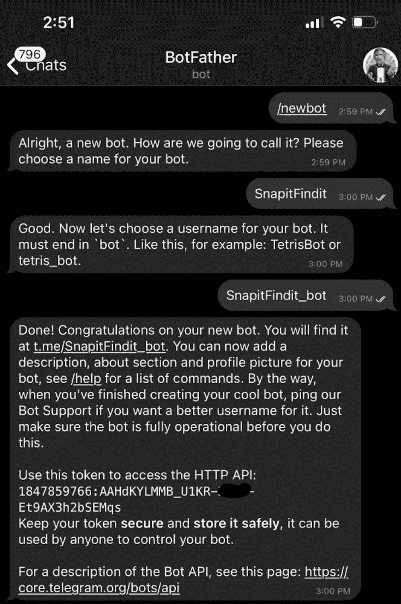
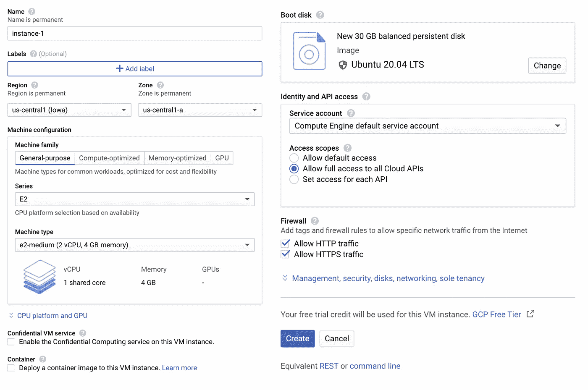
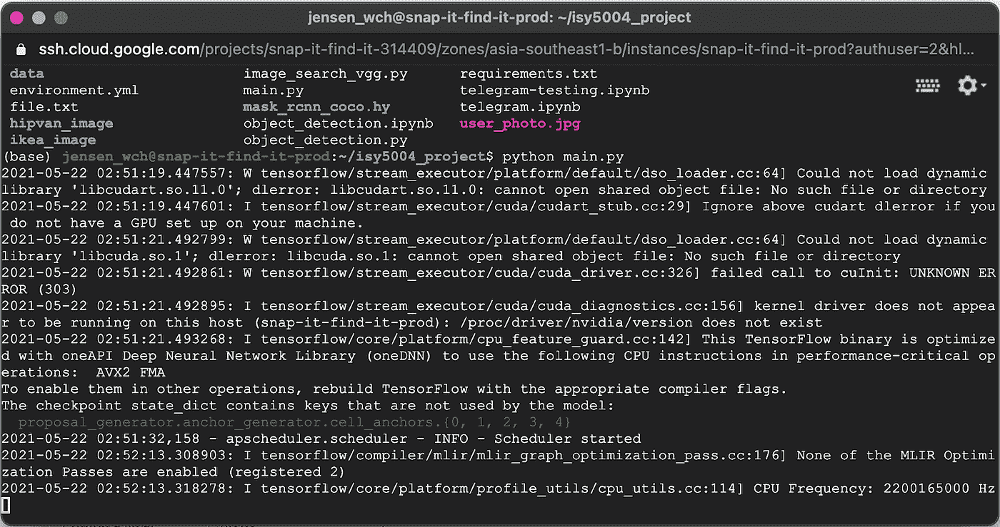

# 具有计算机视觉能力的电报机器人

> 原文：<https://medium.com/analytics-vidhya/a-telegram-bot-with-the-power-of-computer-vision-f415fd2efae8?source=collection_archive---------11----------------------->

## Snap-it Find-it:您的购物伴侣机器人

这是一系列由 4 名新加坡国立大学硕士研究生(理学硕士。工业 4.0 中)谁在拿 ISY5004 智能传感系统。以下是我们将要分享的内容的快照:

*   Web 报废、使用 CNN 的特征提取和图像搜索。
*   [使用 YOLOv3 进行物体检测。](/@renxiang91/object-detection-using-yolov3-51baa2bbac94)
*   [使用 Detectron2 进行目标检测和背景去除。](https://jzys-low.medium.com/object-detection-and-background-removal-with-detectron2-2242a863cc51)
*   [使用各种 CNN 模型的进一步改进。](https://haomingkoo.medium.com/helping-machines-visualize-our-world-f1c489bb2da9)
*   [电报机器人和云托管。(本帖)](https://jensen-wong.medium.com/a-telegram-bot-with-the-power-of-computer-vision-f415fd2efae8)

> 感谢您阅读我们帖子的最后一篇文章。现在，我们有了所有的元素，让我们来建造一个电报机器人，并把它们集成在一起，好吗？

在 Medium 上有很多教你如何创建电报机器人的帖子，你可以搜索并阅读。但是我将向你展示它的简化版本…首先，你需要向*机器人父亲*注册一个新的机器人。

与机器人通信需要令牌，请私人保管令牌。

创建机器人后，您可以与机器人父亲聊天，以更新个人资料图片、命令、描述等。

现在，您需要为 Telegram API 安装一个非常好的包装器，它叫做 [python-telegram-bot](https://github.com/python-telegram-bot/python-telegram-bot) ，可以使用以下代码安装:

在此之后，我们可以开始将我们所有的辛勤工作整合到 main.py 中，这也是我们的 Telegram bot 脚本:

您可以参考几个示例电报机器人脚本:

 [## python 电报机器人/python 电报机器人

### 这个文件夹中有一些小例子来展示用 python-telegram-bot 编写的机器人是什么样子的。有些机器人专注于…

github.com](https://github.com/python-telegram-bot/python-telegram-bot/tree/94a9b7f9831524c648f0ccfe140332db149552d3/examples) 

下面快速看一下用户如何与[***Snap-it Find-it***](https://t.me/SnapitFindit_bot)电报机器人交互:

snap-it Find——用户只需拍张照片并上传，就可以搜索宜家和 Hipvan 的类似产品。

> 伊奥拉！就是这里！现在最好把这个机器人放在云上，这样我们就不用在我们的电脑上运行了，不是吗？让我们把它部署到[谷歌云计算](https://cloud.google.com/compute)上吧！

这是我们在 Google 云计算上设置虚拟机时使用的设置。

调配虚拟机后，我们可以通过 SSH 连接到虚拟机，并安装以下依赖项:

现在我们可以上传或 git 拉资源库，并使用 ***屏幕*** 在后台运行 ***main.py*** 脚本，这样脚本就不会在与 SSH 断开连接后停止。([参考 StackOverflow 上的这篇帖子](https://stackoverflow.com/questions/48221807/google-cloud-instance-terminate-after-close-browser))

仅此而已！

这个项目你可以参考我们的 [GitHub](https://github.com/jensen8786/snap-it-find-it) 。

*特别感谢新加坡国立大学系统科学研究所教授、* [*景甜博士*](https://www.linkedin.com/in/ikanchi/) *和* [*任宏博士*](https://www.linkedin.com/in/jen-hong-tan-ph-d-804b282b/) *的教导和指导，使我们的项目得以成功！*