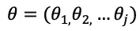
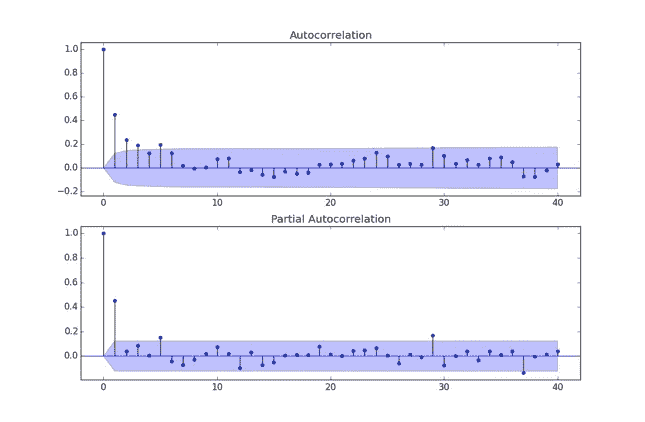

# ARIMA 模型的全面介绍

> 原文：<https://medium.com/analytics-vidhya/a-thorough-introduction-to-arima-models-987a24e9ff71?source=collection_archive---------2----------------------->

[鸣谢:作者](/)

ARIMA 模型及其变体是时间序列预测的一些最成熟的模型。这篇文章将对 ARIMA/ARMA 模型，以及它们如何工作背后的数学原理做一个全面的介绍。

# ARIMA 模型

**ARIMA(自回归移动平均)**模型是一种非常常见的时间序列预测模型。它是更简单的 **ARMA(自回归移动平均)**模型的更复杂的扩展，其本身只是两个更简单的组件的合并:

*   **AR(自回归):**模型试图根据过去的值预测未来的值。AR 模型要求时间序列是平稳的。
*   **MA(移动平均线):**模型试图根据过去的预测误差来预测未来值。MA 模型假设自回归模型可以逼近给定的序列。这不要和*移动平均线*混淆，移动平均线是一个平滑过程，而不是一个预测模型。

## **AR 模型**

我们可以开始将 AR 模型定义为:

然而， *AR* 模型接受一个命令， *p* ，该命令将规定在回归中使用多少个先前的时间步长。

一个 *AR(p)* 模型可以表示为:

这最终可以表示为:

因此:

系数将被估计。

## **马型号**

我们可以将并购模型定义为:

因此，与 *AR* 模型相比， *MA* 模型是系列的当前值相对于先前观察到的白噪声误差项的线性回归。

类似于 *AR* 模型， *MA* 模型也采用一个订单项， *q* ，它将规定考虑多少个先前误差。

一个 *MA(q)* 模型可以表示为:

这可以最终确定为:

因此:

系数将被估计。

## ARMA 模型

一个 *ARMA* 模型仅仅是之前描述的两个 *AR* 和 *MA* 模型的合并。回顾它们的定义，我们可以将一个 *ARMA* 模型表达为:

*p* 和 *q* 分别是 *AR* 和 *MA* 型号的订单。

## ARIMA 模型

**ARIMA(自回归综合移动平均线)**模型是 *ARMA* 模型的扩展，增加了一个积分组件。

*ARMA* 模型必须作用于*平稳*时间序列。平稳时间序列是统计属性(如平均值和方差)不随时间变化的序列。不幸的是，现实世界中的大多数时间序列都不是平稳的，因此必须经常对它们进行转换以使它们平稳。转变的过程被称为整合。

[信用](https://www.oreilly.com/library/view/hands-on-machine-learning/9781788992282/15c9cc40-bea2-4b75-902f-2e9739fec4ae.xhtml)

所采用的转换过程被称为差分，其中我们取系列的给定 *d 次*差，直到系列稳定。我们可以在下面的图像中看到这一点，其中一个非平稳时间序列通过对序列进行二阶差分进行转换:

[信用](https://www.r-bloggers.com/2017/09/time-series-analysis-in-r-part-2-time-series-transformations/)

因此， *ARIMA* 模型最终可以用符号表示:

# ARIMA 参数估计

虽然 *ARMA* 和 *ARIMA* 模型相对简单，但需要正确的参数估计以确保它们正常运行。我们需要能够估计φ和θ参数，以及找到模型的最佳阶数 *p* 和 *q* 。

## ACF & PACF 的订单选择

可以说，识别一个 *ARMA/ARIMA* 模型的适当阶次的最常见方法是使用 **ACF(自相关函数)**和 **PACF(部分自相关函数)**。

*   **ACF:** 自相关函数计算给定时间序列的自相关。自相关是由 *k* 时间步长分隔的时间序列的观测值之间的相关性。
*   **PACF:** 偏相关函数计算关系的强度，并考虑任何中间滞后。

ACF 和 PACF 都可以绘制任意数量的滞后，这很容易使每个滞后对给定观测值的自相关强度可视化。

以下是时间序列的 ACF 和 PACF 图示例:

[信用](https://stats.stackexchange.com/questions/134487/analyse-acf-and-pacf-plots)

上图显示了时间序列中给定滞后的自相关强度，滞后在 x 轴上，各自的自相关在 y 轴上。阴影区域是 5%的统计显著性余量。

通过观察峰值，我们可以看到时间序列中哪些先前的滞后点与当前的观察结果最相关。回想一下 *AR* 模型使用以前的观察值来预测未来值，我们可以得出结论，我们应该因此查看与当前观察值最相关的以前的点。值得注意的是，差分量 *d* 项不是这样选择的。

此外，我们还可以利用一些常见的经验法则:

*   如果 PACF 图显示一个锐截止点和/或滞后-1 自相关为正，那么考虑在模型中增加一个 *AR* 项。PACF 截止的滞后是指示的*或*项的数量。
*   如果 ACF 图显示锐截止和/或滞后-1 自相关为负，考虑在模型中增加一个 *MA* 项。ACF 切断的滞后是指示的 *MA* 项的数量。

如上例所示，在 lag-1 处有一个非常尖锐和强有力的正尖峰，表明(对于此系列)在给定时间步长的观测值与其之前的时间步长高度相关。有一个明显的截止点，基本上没有其他滞后以任何显著的方式相关。因此，我们可以推断，我们至少应该使用一个 *AR(1)* 模型。

至于 ACF，在本例中，它在滞后-1 处也有一个强有力的正尖峰，没有其他显著相关的滞后。因此，我们将给予 *MA* 模型 1: *MA(1)* 的顺序。

请注意两个图中的第一个大尖峰。这是永远不要考虑的，因为这是在滞后-0 时的观测值的相关性，这根本不是滞后。这当然是观察本身，它显然会与自身完全相关。

总之，我们可以使用上面的图表，按照一些规则，尝试确定 *AR* 和 *MA* 流程的正确顺序。

## 根据信息标准选择订单

使用*信息标准*是在给定时间序列上识别 *ARMA/ARIMA* 模型最优订单的另一种方法。典型地，这涉及**赤池的信息准则(AIC)** 和**贝叶斯信息准则(BIC)** 。

AIC 可以表示为:

通过最小化 AIC 可以找到正确的顺序。

BIC 可以表示为:

类似于 AIC，也可以通过最小化 BIC 来找到适当的顺序。

通常不单独使用 AIC 和 BIC 来寻找模型参数。更常见的是使用这样的标准从已经存在的候选模型集合中选择更优的模型。

## 模型参数估计

ARMA/ARIMA 模型最重要的方面无疑是φ和θ系数的估计。对这些算法的实际深入研究变得相对复杂，超出了本文的范围。然而，关于这种参数估计的一些最常用算法的额外解释可以在下面看到:

*   [尤尔·沃克估计](http://www-stat.wharton.upenn.edu/~steele/Courses/956/Resource/YWSourceFiles/YW-Eshel.pdf)
*   [最小二乘法](https://math.unice.fr/~frapetti/CorsoP/Chapitre_4_IMEA_1.pdf)
*   [最大似然估计](https://math.unice.fr/~frapetti/CorsoP/Chapitre_4_IMEA_1.pdf)

# 进一步阅读/参考

## 模型

为您的 ARMA/ARIMA 模型需求提供额外的信息和资源

*   [估算模型参数](http://www.phdeconomics.sssup.it/documents/Lesson12.pdf)
*   [AR 和 MA 订单估算](https://people.duke.edu/~rnau/411arim3.htm)
*   [拟合 ARIMA 模型](https://blog.minitab.com/blog/starting-out-with-statistical-software/fitting-an-arima-model#:~:text=The%20ACF%20stands%20for%20Autocorrelation,PACF%20for%20Partial%20Autocorrelation%20function.&text=Our%20PACF%20slowly%20tapers%20to,lags%20slowly%20degrading%20towards%200.)
*   [更多估算/订单选择](https://otexts.com/fpp2/arima-estimation.html)
*   [更多参数估计](https://www.stat.berkeley.edu/~bartlett/courses/153-fall2010/lectures/11.pdf)
*   [参数估计讲座](https://www.youtube.com/watch?v=IcxMywGiWUc)
*   [用于 ARMA 的 ACF/PACF](http://www.maths.qmul.ac.uk/~bb/TimeSeries/TS_Chapter6_2_1.pdf)

## 额外信息

关于时间序列概念的额外信息的大量资源

*   里特维克马斯
*   [时间序列平稳性](https://www.youtube.com/watch?v=oY-j2Wof51c)
*   [时间序列整合](https://www.statisticshowto.com/order-of-integration/#:~:text=If%20you%20have%20unit%20roots,series%20integrated%20of%20order%20k.)
*   [ACF/PACF](https://www.youtube.com/watch?v=DeORzP0go5I&t=0s)