# 霍尔特-温特斯预测的全面介绍

> 原文：<https://medium.com/analytics-vidhya/a-thorough-introduction-to-holt-winters-forecasting-c21810b8c0e6?source=collection_archive---------0----------------------->

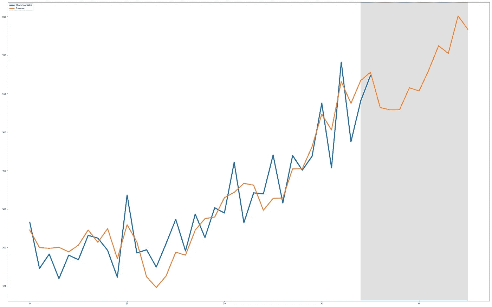

霍尔特-温特斯法——也称为三重指数平滑法——是一种非常流行且相对简单的时间序列预测方法。本文将从某种程度上全面介绍 Holt-Winters 方法的数学和理论，并从头开始使用 Python 实现。

# 霍尔特-温特斯法

霍尔特-温特斯方法是一种非常常见的时间序列预测程序，能够包括趋势和季节性。霍尔特-温特斯法本身是其他三种更简单的方法的结合，所有这些方法都是平滑法:

*   **简单指数平滑(SES):** 简单指数平滑假设时间序列在水平上没有变化。因此，它不能用于包含趋势和/或季节性的序列。
*   **霍尔特指数平滑法(HES):** 霍尔特指数平滑法比简单指数平滑法更进一步，因为它允许时间序列数据具有趋势成分。霍尔特指数平滑法仍然无法处理季节性数据。
*   **温特指数平滑法(WES):** 温特指数平滑法是霍尔特指数平滑法的扩展，最终考虑到了季节性。温特的指数平滑法被称为霍尔特-温特斯法。

因此，Holt-Winters 方法通常被称为三重指数平滑法，因为它实际上是建立在彼此之上的三种平滑方法的组合。

# 简单指数平滑

简单的指数平滑法不考虑任何趋势或季节性。相反，它假设时间序列数据只有一个级别， *L.*

## 更新方程式

我们可以将简单的指数平滑法定义为:

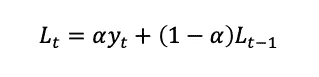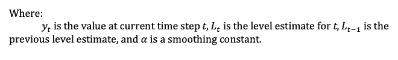

这个等式被称为*级别* *更新等式*，因为它*基于先前的级别估计来更新*当前时间步长的级别。因此，该方程是递归的，因为每个水平估计必须使用之前的每个估计来计算。

α称为平滑常数。平滑常数的取值范围为 0 ≤ α ≤ 1，它决定了过去的值在当前级别估计值中所占的权重。这是由于级别更新等式的递归性质，就像我们开始展开该等式一样，我们会看到每个先前值的权重呈指数下降:

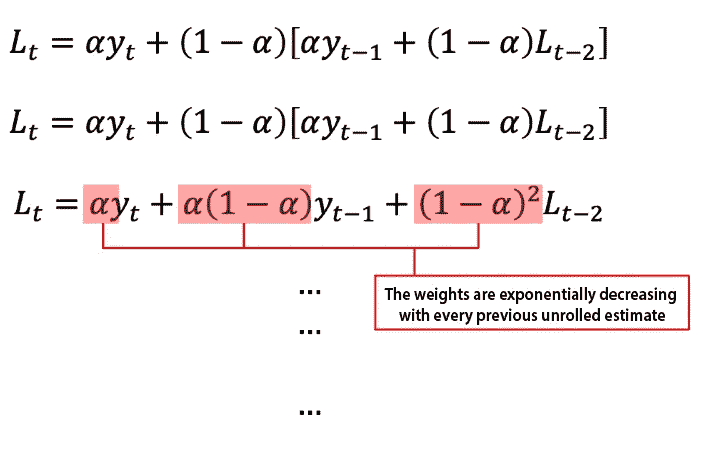

展开将一直持续到第一个时间步。由于我们显然无法计算第一个时间步长的级别，(因为我们没有以前的级别可以回顾)，我们将通过将第一个级别设置为第一个时间步长的值来开始整个序列。

*SES* 方法本质上只是所有时间步长的加权平均值，权重*呈指数*衰减。因此得名:简单的*指数*平滑。

## 履行

我们将在 Python 中实现简单的指数平滑，并看一些例子。

回想一下等式，简单的指数平滑可以实现为:

```
from typing import Listdef simple_es(series: List, alpha: float) -> float:
    if len(series) < 2:
        return series[0]

    return (alpha * series[-1]) + ((1 - alpha) * ses(series[:-1], alpha))
```

像级别更新等式一样，我们可以看到 Python 实现随后也是递归的。第一级估计值设置为第一个数据点的值，这是我们的基本情况。

## 预测

使用 *SES* 方法进行预测时，未来时间步长就是当前时间步长的级别。因此，预测*是在时间步 *t.* 的水平 *L**

例如，我们将把我们的 Python *SES* 实现应用于一些真实世界的数据:

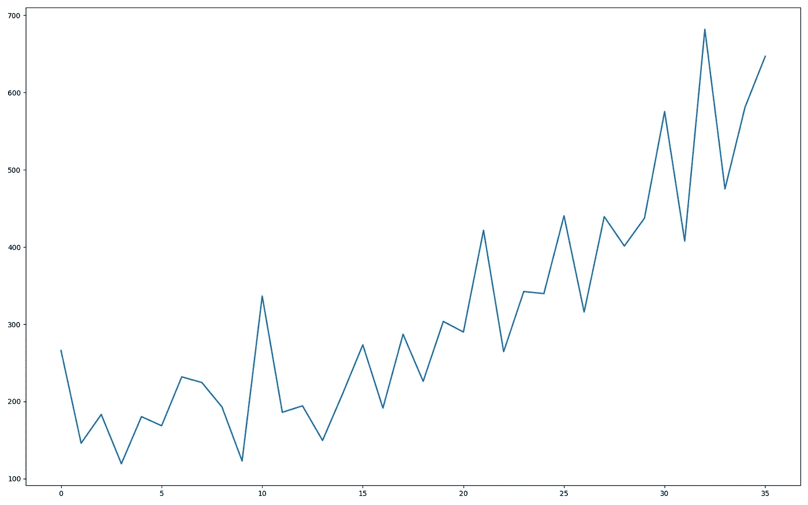

上面是一组 3 年内洗发水的销售情况，每个时间点都是一个月的销售情况。数据可以在这里[下载。](https://raw.githubusercontent.com/jbrownlee/Datasets/master/shampoo.csv)

让我们在使用我们的 SES 时隐藏最后一个月，因为我们希望能够将我们的预测与实际情况进行对比。

由于 *SES* 预测仅仅是在时间步长 t 的估计水平，用我们的 *SES* 实现的预测简单如:

```
forecast = simple_es(data[:-1], alpha=0.2)
```

在这种特殊情况下，alpha 参数没有优化，而是快速手动选择，因为 0.1-0.4 左右的 alpha 通常是一个很好的经验法则。

我们现在将根据实际情况绘制预测图，以获得更好的可视化效果:

```
plt.figure(
    figsize=(16, 10)
)

data = pd.read_csv('../data/shampoo.csv')["Sales"]
data = data.values.tolist()final_months = (34, 35)
forecast = ses(data[:-1], alpha=0.2)plt.plot(data, linewidth=2, label='Shampoo Sales')
plt.plot(final_months,
         [data[-2], forecast],
         label='Forecast')plt.axvspan(*final_months, facecolor='grey', alpha=0.25)plt.legend()
plt.show()
```

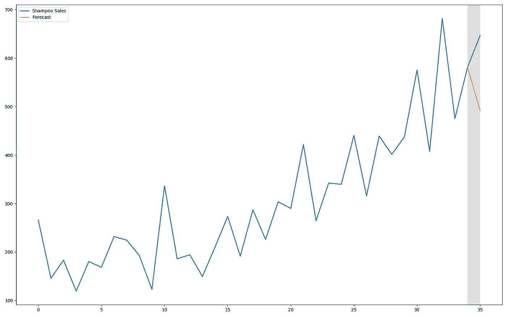

灰色条代表预测的月份。毫不奇怪，预测是可怕的——完全相反的方向。这是意料之中的，因为简单的指数平滑就是这样:简单。它没有考虑任何趋势或季节性，因此从一开始就注定了这个特定的数据集。

SES 仍然是一种平滑方法，为了更好地了解它是如何工作的，我们可以绘制每个估计水平:

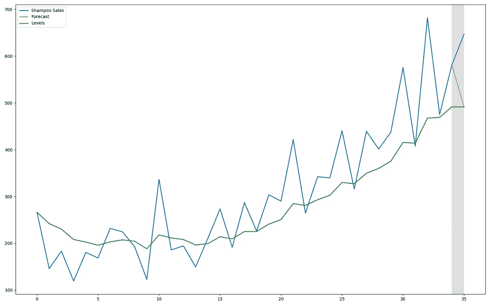

可以清楚地看到平滑作用。

为了改进预测，必须使用一种能够结合趋势的更复杂的方法。

# 霍尔特指数平滑法

霍尔特的指数平滑法比简单的指数平滑法更上一层楼，能够考虑趋势成分。霍尔特的方法通常被称为双指数平滑法。

霍尔特的方法通过假设时间序列既有水平又有趋势，扩展了简单的指数平滑。因此，使用霍尔特方法的预测可以定义为:

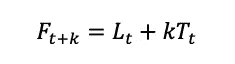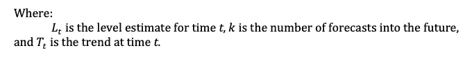

正如我们所看到的，它实际上只是原始 *SES* 方法的简单简化，只是包含了趋势、 *T* 分量。

但是，需要注意的是，时间序列有两种类型，每种类型都有各自略有不同的预测公式:

*   **可加:**在可加时间序列中，时间序列是其组成部分的总和。
*   **乘法:**在乘法时间序列中，时间序列是其分量的乘积。

预测方程必须符合特定类型的时间序列:

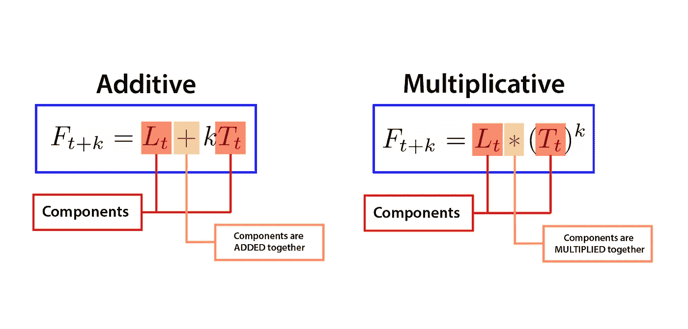

因此，我们必须首先确定时间序列的类型，然后进行相应的预测。

## 更新方程式

给定时间 *t* 的趋势估计可计算为 *:*

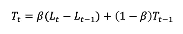

该方程被称为*趋势更新方程*，因为它*基于先前水平估计值之间的差异来更新*当前时间步长的趋势估计值。人们可能会注意到，它非常类似于简单指数平滑中的原始*水平更新方程*。

类似于*水平更新方程*,*趋势更新方程*也有自己的参数β。β是趋势方程自身的平滑常数，因此或多或少类似于之前在 *SES 中看到的α平滑常数。*

β的值域也是 0 ≤ β ≤ 1，它决定了给定趋势估计值的调整速度。

## 履行

正如前面简单的指数平滑一样，我们将在 Python 中实现 Holt 的指数平滑，并查看一些示例。

回想一下*趋势更新方程*，霍尔特的指数平滑可以实现为:

```
def holt_es(series: List, alpha: float, 
            beta: float, initial_trend: float) -> float: if len(series) < 2:
        return initial_trend

    l_t = ses(series, alpha)
    l_t_prev = ses(series[:-1], alpha)

    trend_t_prev = hes(series[:-1], alpha, beta, initial_trend)

    return (beta * (l_t - l_t_prev)) + ((1 - beta) * trend_t_prev)
```

霍尔特指数平滑的 Python 实现建立在我们之前的 *SES* 函数的基础上，因为它给了我们水平估计。 *HES* 函数是递归的，就像 *SES* 函数一样，但是请注意基本情况的不同以及添加的*“初始趋势”*参数。需要初始趋势，因为与简单的指数平滑不同，趋势序列的起点不仅仅是最早时间步长的值。相反，开始是一个趋势估计本身，计算为前两个时间步骤之间的差异。这种实现假设*加性*时间序列没有季节性成分。

## 预测

使用 *HES* 方法预测时，我们必须记住不同类型的预测——**加法**和**乘法**——并相应地选择预测方程。在我们的洗发水数据中，我们将使用*添加剂*预测方程。在代码中，这转化为:

```
initial_trend = data[1] - data[0]level_estimate = simple_es(data[:-1], 0.2)forecast = level_estimate + holt_es(data[:-1], 
                                    0.2, 0.3, initial_trend)
```

就像使用 *SES* 的例子一样，我们有意预测最终的已知值，以便我们可以将预测与实际情况进行对比。

这个例子中的 alpha 和 beta 参数没有优化，而是手动选择的。

需要注意的是，这个特定的预测示例只是针对未来的一个步骤。由于 *k=1* 我们基本上照原样取 *HES* 结果。如果我们要预测未来的多个时间步长，我们需要将趋势分量乘以期望的 *k* 步数。

我们现在将根据实际情况绘制预测图，以获得更好的可视化效果:

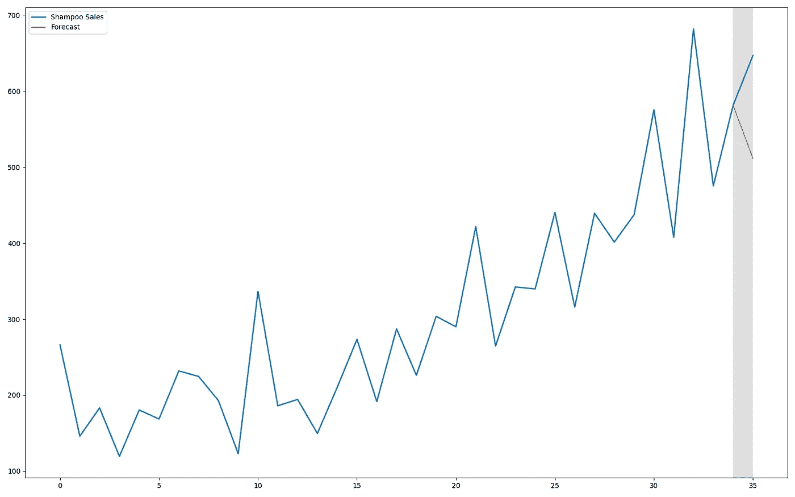

同样，灰色条是预测窗口，橙色是预测，蓝色是实际系列。

不幸的是，霍尔特的预测仍然与 SES 的预测相差不大。然而，通过绘制每个预测加上几个步骤，我们可以看到霍尔特的方法确实清楚地显示了趋势分量的捕捉:

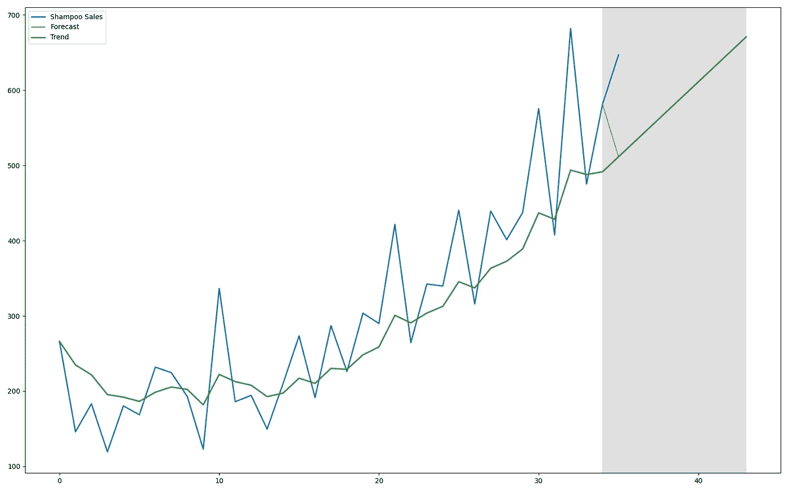

必须进行的最后一项改进是捕获季节性成分。

# 温特斯指数平滑法

温特斯的指数平滑法是霍尔特方法的扩展，最终可以捕捉到季节性因素。由于温特的指数平滑法是建立在单指数平滑法和双指数平滑法的基础上的，因此温特的方法也被称为三指数平滑法。

温特的方法假设时间序列有一个水平，趋势和季节组成部分。采用温特指数平滑法的预测可以表示为:

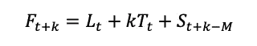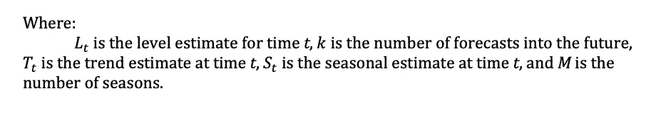

预测公式是对 *SES* 和 *HES* 方法的简化，最后增加了季节性 *S* 成分。

就像霍尔特的方法一样，预测方程对于每种时间序列类型都有多个变量:

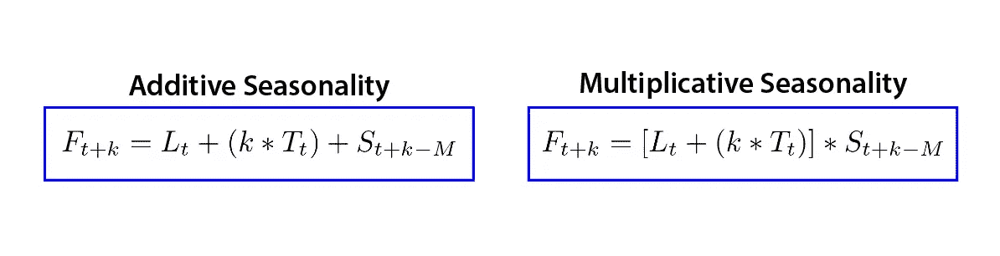

重要的是要注意，每个时间序列组件不需要表现出相同的行为。例如，乘法季节性公式显然具有乘法季节性，但是趋势部分是相加的:

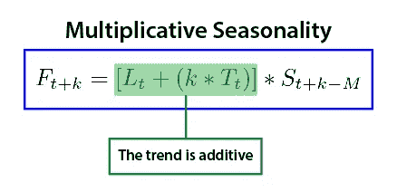

这种独立性允许不同行为的混合和匹配，以模拟许多不同类型的时间序列:

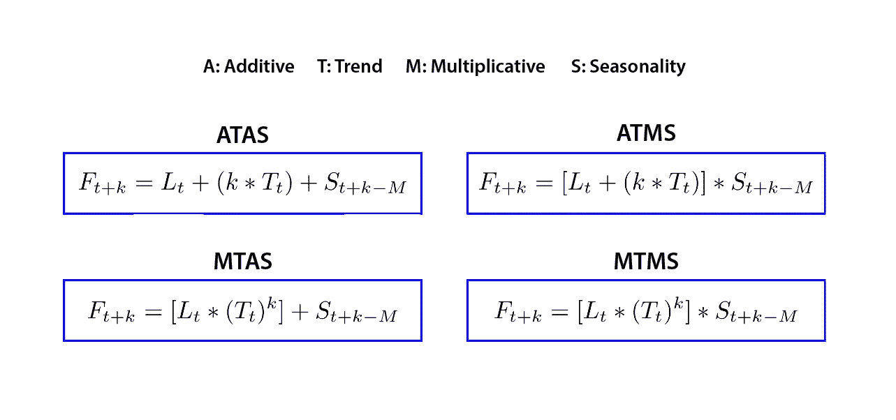

## 更新方程式

季节性因素的加入现在增加了第三个更新方程:

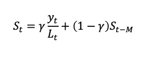

再次引入另一个平滑常数:γ。伽马平滑常数也具有 0≤γ≤1 的域。这个特定更新等式是针对具有乘法级别的时间序列的。对于添加水平，使用下面的季节性更新公式:

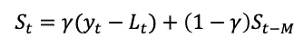

在这两个等式中，我们看到季节性估计计算要求我们从时间步长中移除级别组件，这是通过对级别的行为类型执行相反的操作来完成的。换句话说，电平分量如果是*加法*就必须减去，如果是*乘法*就必须除以。

温特的方法不仅引入了*季节性更新方程*，而且它实际上还引入了原始*水平更新方程*的修改版本。

原始的*水平更新方程*在季节性数据上不能正常工作。因此，由于假设时间序列现在具有季节性成分，水平方程必须首先对数据进行“去季节性”处理，以获得适当的水平估计。

新的*电平更新等式*可以表示为:

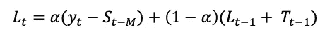

这个具体的更新方程是针对*相加的*季节性和*相加的*趋势。每种季节性类型的更新方程如下所示:

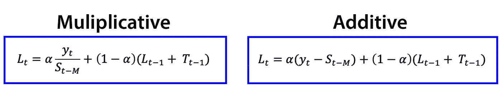

我们可以在这里看到具体的非季节性效应:

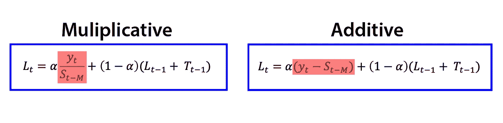

为了去除季节性成分，我们必须知道我们试图建模的时间序列的季节性类型，然后进行相反的操作。这转化为分别除以或减去乘法和加法时间序列季节性的季节性成分。

## 履行

我们终于可以用 Python 实现 Winter 的方法了，看一些例子。

回想一下我们所有的更新方程，温特的指数平滑可以实现为:

```
def winters_es(series: List,
               uppercase_m: int,
               alpha: float=0.2,
               beta: float=0.2,
               gamma: float=0.15,
               future_steps: int=1) -> List:

    i_l = [series[0]]
    i_t = [initial_trend(series, uppercase_m)]
    i_s = initial_seasonality(series, uppercase_m)

    forecasts = []
    for t in range(len(series) + future_steps):

        if t >= len(series):
            k = t - len(series) + 1
            forecasts.append(
                (i_l[-1] + k * i_t[-1]) + i_s[t % uppercase_m]
            )

        else:
            l_t = alpha * (series[t] - i_s[t % uppercase_m]) + (1 - alpha) * (i_l[-1] + i_t[-1])

            i_t[-1] = beta * (l_t - i_l[-1]) + (1 - beta) * i_t[-1]
            i_l[-1] = l_t

            i_s[t % uppercase_m] = gamma * (series[t] - l_t) + (1 - gamma) * i_s[t % uppercase_m]

            forecasts.append(
                (i_l[-1] + i_t[-1]) + i_s[t % uppercase_m]
            )

    return forecasts
```

正如我们所看到的，温特斯方法是迄今为止每一种平滑方法和方程的集合。这个具体实现是针对所有*附加*组件的，并且是受[这个](https://grisha.org/blog/2016/02/17/triple-exponential-smoothing-forecasting-part-iii/)的启发。由于实现的复杂性增加，更简单的方法是使其非递归，并在内部添加预测功能。

值得注意的是增加了*“初始 _ 趋势”*和*“初始 _ 季节性”*函数。这是由于引入了季节性因素，改变了初始条件。

具有*附加*季节性的时间序列的初始趋势可以计算为:

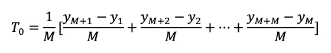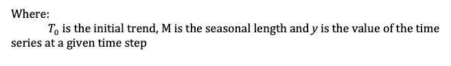

在 Python 代码中，这被翻译为:

```
def initial_trend(series: List, uppercase_m: int) -> float:
    return sum([
        float(series[i+uppercase_m] - series[i]) / uppercase_m 
        for i in range(uppercase_m)
    ]) / uppercase_m
```

本质上，这只是跨季节趋势平均值的平均值。

至于初始季节性，可以计算为:

```
def initial_seasonality(series: List, uppercase_m: int) -> List:
    initial_season = []
    n_seasons = int(len(series)/uppercase_m)

    season_averages = [sum(
        series[uppercase_m * i:uppercase_m * i + uppercase_m]
    ) / uppercase_m for i in range(n_seasons)]

    initial_season.extend([
        sum([series[uppercase_m*j+i]-season_averages[j] 
             for j in range(n_seasons)]) / n_seasons 
        for i in range(uppercase_m)
    ])

    return initial_season
```

请注意，与其他初始状态不同，初始季节性是一个向量。这是因为我们需要从至少一个完整的赛季开始。

我们首先计算每个季节的平均水平，然后用每个时间步长除以该时间步长对应季节的平均水平。最后，对每个季节的结果进行平均，我们得到了初始的季节性向量。完整的[数学解释](https://www.mdpi.com/2227-7390/8/2/268/htm)变得相当复杂，因此将在本文中省略。

霍尔特-温特斯方法的完整实现:

```
from typing import * def initial_trend(series: List, uppercase_m: int) -> float:
    return sum([
        float(series[i+uppercase_m] - series[i]) / uppercase_m
        for i in range(uppercase_m)
    ]) / uppercase_m

def initial_seasonality(series: List, uppercase_m: int) -> List:
    initial_season = []
    n_seasons = int(len(series)/uppercase_m)

    season_averages = [sum(
        series[uppercase_m * i:uppercase_m * i + uppercase_m]
    ) / uppercase_m for i in range(n_seasons)]

    initial_season.extend([
        sum([series[uppercase_m*j+i]-season_averages[j]
             for j in range(n_seasons)]) / n_seasons
        for i in range(uppercase_m)
    ])

    return initial_seasondef winters_es(series: List,
               uppercase_m: int,
               alpha: float=0.2,
               beta: float=0.2,
               gamma: float=0.15,
               future_steps: int=1) -> List:

    i_l = [series[0]]
    i_t = [initial_trend(series, uppercase_m)]
    i_s = initial_seasonality(series, uppercase_m)

    forecasts = []
    for t in range(len(series) + future_steps):

        if t >= len(series):
            m = t - len(series) + 1
            forecasts.append(
                (i_l[-1] + m * i_t[-1]) + i_s[t % uppercase_m]
            )

        else:
            l_t = alpha * (series[t] - i_s[t % uppercase_m]) + (1 - alpha) * (i_l[-1] + i_t[-1])

            i_t[-1] = beta * (l_t - i_l[-1]) + (1 - beta) * i_t[-1]
            i_l[-1] = l_t

            i_s[t % uppercase_m] = gamma * (series[t] - l_t) + (1 - gamma) * i_s[t % uppercase_m]

            forecasts.append(
                (i_l[-1] + i_t[-1]) + i_s[t % uppercase_m]
            )

    return forecasts
```

## 预测

我们现在可以使用完整的 Holt-Winters 实现来做一些预测。像往常一样，我们将使用*添加剂*洗发水数据集，并预测最后的已知值，以便我们可以将估计值与实际值进行对比。

本例中的 alpha、beta 和 gamma 参数没有优化，而是手动选取的。

由于我们的 Holt-Winters 函数已经在内部返回了一个*加法*预测的结果，我们可以直接使用输出:

```
forecast = winters_es(data, 12)
```

我们现在将根据实际情况绘制预测图，以获得更好的可视化效果:

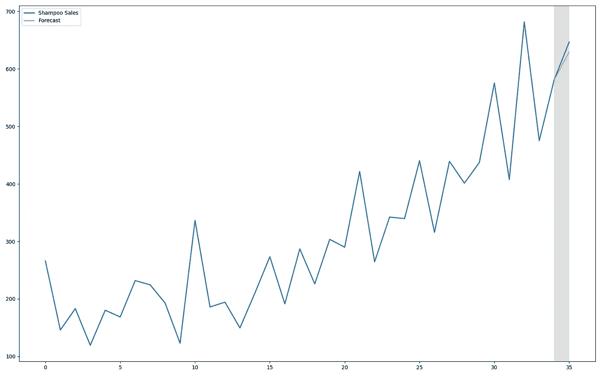

最后，一个适当的预测！为了进一步探索，让我们绘制每个预测以及未来几个步骤:

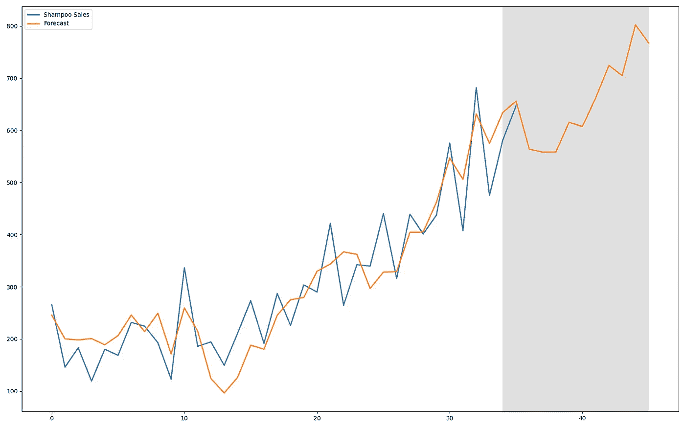

我们可以看到，现在捕捉到了一个季节性成分。

这一代的完整代码如下所示:

```
import matplotlib.pyplot as pltfrom typing import * def initial_trend(series: List, uppercase_m: int) -> float:
    return sum([
        float(series[i+uppercase_m] - series[i]) / uppercase_m
        for i in range(uppercase_m)
    ]) / uppercase_m

def initial_seasonality(series: List, uppercase_m: int) -> List:
    initial_season = []
    n_seasons = int(len(series)/uppercase_m)

    season_averages = [sum(
        series[uppercase_m * i:uppercase_m * i + uppercase_m]
    ) / uppercase_m for i in range(n_seasons)]

    initial_season.extend([
        sum([series[uppercase_m*j+i]-season_averages[j]
             for j in range(n_seasons)]) / n_seasons
        for i in range(uppercase_m)
    ])

    return initial_season def winters_es(series: List,
               uppercase_m: int,
               alpha: float=0.2,
               beta: float=0.2,
               gamma: float=0.15,
               future_steps: int=1) -> List:

    i_l = [series[0]]
    i_t = [initial_trend(series, uppercase_m)]
    i_s = initial_seasonality(series, uppercase_m)

    forecasts = []
    for t in range(len(series) + future_steps):

        if t >= len(series):
            m = t - len(series) + 1
            forecasts.append(
                (i_l[-1] + m * i_t[-1]) + i_s[t % uppercase_m]
            )

        else:
            l_t = alpha * (series[t] - i_s[t % uppercase_m]) + (1 - alpha) * (i_l[-1] + i_t[-1])

            i_t[-1] = beta * (l_t - i_l[-1]) + (1 - beta) * i_t[-1]
            i_l[-1] = l_t

            i_s[t % uppercase_m] = gamma * (series[t] - l_t) + (1 - gamma) * i_s[t % uppercase_m]

            forecasts.append(
                (i_l[-1] + i_t[-1]) + i_s[t % uppercase_m]
            )

    return forecasts if __name__ == '__main__':

    plt.figure(
        figsize=(32, 20)
    )

    data = pd.read_csv('../data/shampoo.csv')["Sales"]
    data = data.values.tolist()

    k = 10

    last_months = list(range(34, 34 + k))

    forecast = winters_es(data, 12, future_steps=10) plt.plot(data, linewidth=5, label='Shampoo Sales')
    plt.plot(forecast, linewidth=4, label='Forecast') plt.axvspan(*(last_months[0], last_months[-1]), 
                facecolor='grey', 
                alpha=0.25) plt.legend()
    plt.show()
```

# 结论

我们已经用 Python 讲述了 Holt-Winters 方法的数学、理论和实现，并提供了一个预测示例。作为三重指数平滑，它只是在双重指数平滑(霍尔特方法)和简单指数平滑的基础上分层构建。因此，该方法能够捕捉水平、趋势和季节性成分，并在预测中迅速利用它们。

Holt-Winters 方法是一种非常直观且相对简单的预测程序，能够模拟大量的时间序列。

# 进一步阅读/参考

文章来源和额外的信息为您的霍尔特-温特斯需要

*   [Python 实现](https://grisha.org/blog/2016/02/17/triple-exponential-smoothing-forecasting-part-iii/)
*   [初始赛季解说](https://robjhyndman.com/hyndsight/hw-initialization/)
*   [令人惊叹的视频系列](https://www.youtube.com/watch?v=Fqge2HDH2Co&list=PLoK4oIB1jeK0LHLbZW3DTT05e4srDYxFq&index=0)
*   [更多初始赛季解说](https://www.itl.nist.gov/div898/handbook/pmc/section4/pmc435.htm)
*   [更多霍尔特-温特斯的解释](https://bicorner.com/2015/05/02/what-is-time-seires-analysis-part-ii/)

## 额外信息

关于时间序列概念的额外信息的大量资源

*   [Ritvikmath](https://www.youtube.com/channel/UCUcpVoi5KkJmnE3bvEhHR0Q)
*   robjhyndman.com
*   [预测资源](https://otexts.com/fpp2/)
*   [我的其他文章](https://lleyton-ariton.medium.com/)