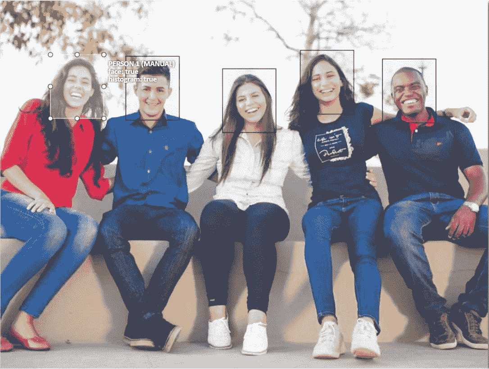

# 动态皮肤分割——一种阈值方法

> 原文：<https://medium.com/analytics-vidhya/a-threshold-approach-for-dynamic-skin-segmentation-f50f5df72a4a?source=collection_archive---------11----------------------->

***获取一个人肤色的最佳方法是检测人脸，然后获取分割位置的颜色。下面显示了一个图像示例，作为边界框注释图像。***

**(L)使用区域生长的分割，(M)使用光流的分割，(R)组合插值分割**

***概念验证(POC):*** *这里介绍的是使用基于区域生长和光流相位的方法来分割皮肤的方法之一。*

**原始图像**

***第一步:***

*我从照片中提取人脸，得到了图像的* [*直方图*](https://www.sciencedirect.com/topics/engineering/image-histogram) *。我们看到图像的背景是白色的，如下所示:*

**肤色确定为:RGB (233，213，207)**

**图像直方图如下图所示**

**图像的直方图**

*为了确定颜色区域，在直方图中寻找显示最顶部的区域。*

***第二步:***

获取图像的直方图，以便我们知道图像的光谱，例如可以确定[分割皮肤](https://www.openml.org/d/1502)的平均颜色估计。

**包围盒表面的红色通道直方图**

***第一步和第二步的控制步骤:***

# **图像分割作为确定性问题**

## 第一步:[区域生长](https://en.wikipedia.org/wiki/Region_growing#:~:text=%20The%20advantages%20and%20disadvantages%20of%20region%20growing,algorithm%2C%20so%20adaption%20might%20be%20needed%20More%20)

## 步骤 2:执行区域生长方法

# **作为随机问题的光流**

## 步骤 3:使用 [SceneNet](https://www.imperial.ac.uk/dyson-robotics-lab/downloads/scenenet-rgb-d-software/) 计算光流

# 贮藏室ˌ仓库

 [## aswinvk 28/动态皮肤分割

### cd 脚本/python execute . py-image concert.jpg & & python calculate _ optical _ flow . py-image concert.jpg & & python…

github.com](https://github.com/aswinvk28/dynamic-skin-segmentation) 

# 执行皮肤分段代码的脚本

***签出以更正提交:***

***执行脚本:***

**下面的代码执行区域生长算法，然后进行光流估计，最后通过插值将三幅图像组合成一个新的脚本** `**deterministic_stochastic.py**` **。**

**生成人/脸检测后图像的分割皮肤样本的代码**

**OpenCV**中光流模型和图像分割模型的最终插值图像

**OpenCV 中的区域生长和光流的组合将提供一个插值图像**

