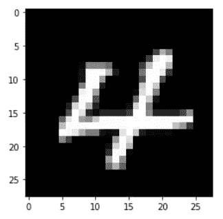
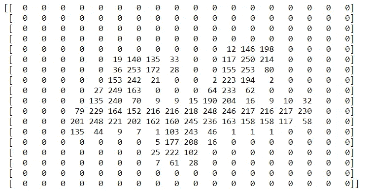

# Python 技巧#7: OpenCV — CV2: imread()和 resize() | Dev Skrol

> 原文：<https://medium.com/analytics-vidhya/a-tip-a-day-python-tip-7-opencv-cv2-imread-and-resize-dev-skrol-643b58ec214e?source=collection_archive---------16----------------------->


照片由 [Hari Nandakumar](https://unsplash.com/@hariprasad000?utm_source=unsplash&utm_medium=referral&utm_content=creditCopyText) 在 [Unsplash](https://unsplash.com/?utm_source=unsplash&utm_medium=referral&utm_content=creditCopyText) 上拍摄

在本文中，我们将学习 OpenCV 或 CV2 的一些主要用途。

OpenCV 是一个主要用于读/写和操作图像的库。

你可以在这里找到 https://pypi.org/project/opencv-python/[的官方页面。](https://pypi.org/project/opencv-python/)

***安装:*** pip 安装 opencv-python

***导入库:*** 导入 cv2

***支持的版本:*** 3.6、3.7、3.8、3.9

# 对图像的基本理解:

我们都知道图像只不过是一组像素。
每个像素都是一个数字。

基于该数字，像素的颜色将是。

例如:0 代表黑色，1 代表白色。

# 读取图像:cv2.imread()

假设我们有一个 28 X 28 像素的小图像。

```
import cv2 
##Read image 
image_path="4.png" 
img=cv2.imread(image_path,0) #Now we have the image in img variable. 
#To visualize the image we can use matplotlib.pyplot 
import matplotlib.pyplot as plt 
plt.imshow(img, cmap="gray")
```



从上面的程序中，你可以看到我们有一个图像“4.png”。
cv2.imread(filename，0) —读取并返回图像。0 表示图像的颜色。0 作为第二个参数将在灰度模式下读取图像。即，图像将仅仅是 2D 阵列，并且颜色的第三维将不会被添加。

这个图像可以使用 matplotlib.pyplot imshow(img)来可视化。如果我们没有提到 cmap 值，matplotlib 会自动给它分配一个色彩映射表。

使用 shape 属性可以找到该图像的形状，因为它是一个像素数组(同样是数字)。

让我们探索数组的值。

阵列形状为 2D 28 X 28。为了更好地查看笔记本结果中的阵列，我将图像的大小调整为 18 X 18。

```
import numpy as np 
number_arr = np.asarray(img) 
img_resized = cv2.resize(img, (18,18))
print(np.asarray(img_resized))
```



您可以看到数组中有一个数字大于 0 的 4 形状。

有意思！不是吗？尽情享受吧！

我们将看到 Python 中的一个新技巧。谢谢大家！👍

喜欢支持？只需点击心形图标❤️.

编程快乐！🎈。

## **你可能喜欢:**

## [数字图像处理——形态学运算](https://devskrol.com/2021/12/14/digital-image-processing-morphological-operations/)(腐蚀&膨胀)用 OpenCV 详细讲解

## [一天一个技巧——Python 技巧#8:为什么要归一化图像像素值或除以 255？](https://devskrol.com/2021/02/20/a-tip-a-day-python-tip-8-normalize-image-pixel-values-or-divide-by-255/)

*原载于 2021 年 2 月 11 日*[*【https://devskrol.com】*](https://devskrol.com/index.php/2021/02/11/atipaday-pythontip7/)*。*