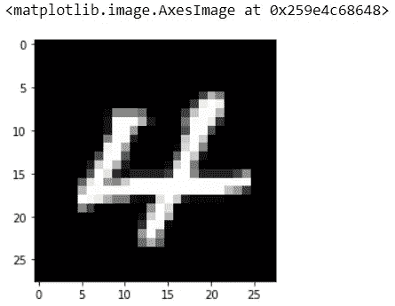

# 一天一个技巧——Python 技巧#8:为什么要归一化图像像素值或除以 255？开发控制

> 原文：<https://medium.com/analytics-vidhya/a-tip-a-day-python-tip-8-why-should-we-normalize-image-pixel-values-or-divide-by-255-4608ac5cd26a?source=collection_archive---------3----------------------->


照片由 [Hari Nandakumar](https://unsplash.com/@hariprasad000?utm_source=unsplash&utm_medium=referral&utm_content=creditCopyText) 在 [Unsplash](https://unsplash.com/@hariprasad000?utm_source=unsplash&utm_medium=referral&utm_content=creditCopyText) 上拍摄

在我们之前的帖子[一天一个技巧— Python 技巧#7: OpenCV — CV2: imread()和 resize()](https://devskrol.com/index.php/2021/02/11/atipaday-pythontip7/) 中，我们探索了一个简单的图像及其像素值。
像素值的范围从 0 到 256。每个数字代表一个颜色代码。
当按原样使用图像并通过深度神经网络时，高数值的计算可能会变得更加复杂。
为了减少这种情况，我们可以将这些值归一化到 0 到 1 的范围内。

这样数字会小，计算变得更容易更快。
由于像素值的范围是从 0 到 256，除了 0 以外的范围是 255。因此，将所有值除以 255 会将其转换为从 0 到 1 的范围。

```
import cv2 
import matplotlib.pyplot as plt ##Read image 
image_path="4.png" 
img=cv2.imread(image_path,0) 
plt.imshow(img, cmap="gray")
```

**输出:**



让我们来看看白皮泽尔的一个价值。

```
img[17,14] Output: 
253
```

我尝试使用 seaborn heatmap 来可视化数组值，下面是结果。

```
import seaborn as sns plt.figure(figsize=(30,30)) 
sns.heatmap(img, annot= True, cmap="binary")
```

输出:


在上面的输出中，值的范围是从 0 到 256。

# 标准化:

```
import seaborn as sns img = img/255 plt.figure(figsize=(30,30)) 
sns.heatmap(img, annot= True, cmap="binary")
```

输出:


在此结果中，您可以看到在“4”图像中构成笔画的像素是 0.93 或 0.99 或接近 0.99 的值。

希望你能理解我们为什么以及如何正常化简单的图像。

让我们在接下来的文章中探索更多关于图像的内容。

# 更多有趣的 Python 技巧:

[一天一个提示——Python 提示# 6——熊猫合并](https://devskrol.com/index.php/2020/10/25/a-tip-a-day-python-tip-6-pandas-merge/)

[一天一个提示— Python 提示#5 —熊猫串联&追加](https://devskrol.com/index.php/2020/10/20/a-tip-a-day-python-tip-5-pandas-concat-append/)

[在组内估算 NAN 的最佳方式—均值&模式](https://devskrol.com/index.php/2020/08/09/best-way-to-impute-nan-within-groups-mean-mode/)

[https://devskrol.com/index.php/category/python/](https://devskrol.com/index.php/category/python/)

*原载于 2021 年 2 月 19 日 https://devskrol.com**的* [*。*](https://devskrol.com/index.php/2021/02/20/a-tip-a-day-python-tip-8-normalize-image-pixel-values-or-divide-by-255/)