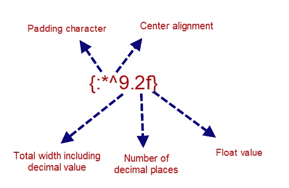

# 一天一个技巧— Python 技巧#9:关于格式的 3 件趣事{} | Dev Skrol

> 原文：<https://medium.com/analytics-vidhya/a-tip-a-day-python-tip-9-3-interesting-things-about-format-dev-skrol-c51f1dd4cd45?source=collection_archive---------3----------------------->

有些情况下，我们可能需要动态地在一个字符串的子字符串中放置一个值。

你可能认为连接字符串很容易。

例如:“患者姓名为“+患者姓名+”，年龄为“+患者年龄”

但是 Python 提供了一种很好的方式，您甚至可以格式化病人姓名和病人年龄，以对齐、填充空格或任何特殊字符，在浮点值的情况下，我们还可以格式化小数位数。

string 对象的 format 函数将以指定的格式格式化给定值，并将它们放在占位符中。{}花括号用作占位符。

# 1.如何使用格式:

```
output = "The patient's name is {}, {}.".format("firstname","lastname") 
print(output)
```

病人的名字是名，姓。

# 2.索引或命名占位符:

```
#Named arguments 
print("The patient name is {b} and age is {a}".format(a=5,b="test")) 
#Indexed arguments 
print("The patient name is {1} and age is {0}".format(5,"test"))
```

患者姓名为 test，年龄为 5 岁

# 3.字符串对齐:

占位符还接受另一个参数来对齐文本或数字。

语法:{ index/name:formatting characters }

# 对于数字格式:

1.  提供宽度的数字。
2.  % —以百分比形式提供值

```
print("The patient name is {1} and age is {0:%}".format(5.14,"test"))
```

患者姓名为 test，年龄为 514.000000%

# 字符串格式:

1.  填充填充空间的任何特殊字符
2.  < — to align left (or) > —向右(或)对齐^ —中心
3.  最小宽度的任意数字

```
print("The string value {:*^6} is output".format("a")) # * - padding, if not mentioned, empty space will be used 
# ^ - center 
# 6 - any number specifies the number of character space to use as minimum width
```

输出字符串值**a***。

# 浮点值格式:

添加一个小数点和字符“f”指定预期值是 float。

即使给定值是一个整数，如果指定了" . 2f "，也会加上" . 00 "。



```
print("The string value {:*^3.2f} is output".format(15.206)) print("The string value {:*^3.2f} is output".format(15206)) print("The string value {:*^15.2f} is output".format(15206))
```

输出字符串值 15.21
输出字符串值 15206.00
输出字符串值***15206.00****

指定“f”但发送字符串值将会引发错误。

```
print("The string value {:*^15.2f} is output".format("15206"))**---------------------------------------------------------------------------ValueError** Traceback (most recent call last)**<ipython-input-24-09127640ef53>** in <module>**----> 1** print**("The string value {:*^15.2f} is output".**format**("15206"))ValueError**: Unknown format code 'f' for object of type 'str'
```

就是这样！

这篇文章对于提示来说有点长。

然而，我希望你喜欢学习格式。

让我们在未来的技巧中探索更多关于 Python 的内容。

# 更多有趣的 Python 技巧:

[一天一个提示——Python 提示 6——熊猫合并](https://devskrol.com/index.php/2020/10/25/a-tip-a-day-python-tip-6-pandas-merge/)

[一天一个提示— Python 提示 5 —熊猫串联&附加](https://devskrol.com/index.php/2020/10/20/a-tip-a-day-python-tip-5-pandas-concat-append/)

[估算组内 NAN 的最佳方式—均值&模式](https://devskrol.com/index.php/2020/08/09/best-way-to-impute-nan-within-groups-mean-mode/)

[https://devskrol.com/index.php/category/python-tips/](https://devskrol.com/index.php/category/python-tips/)

*原载于 2021 年 9 月 3 日*[*【https://devskrol.com】*](https://devskrol.com/index.php/2021/09/03/a-tip-a-day-python-tip-9-3-interesting-things-about-format/)*。*