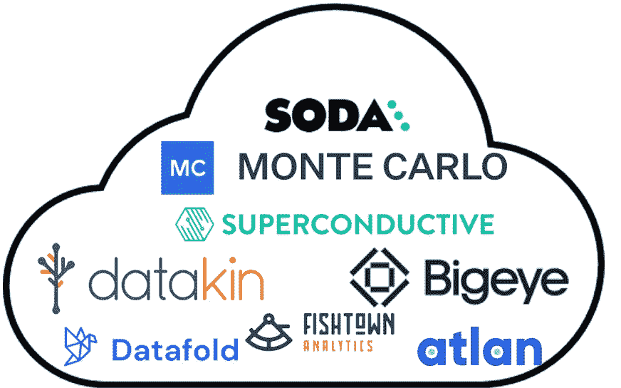
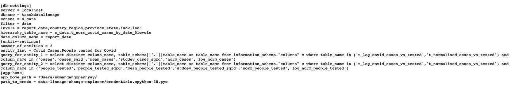
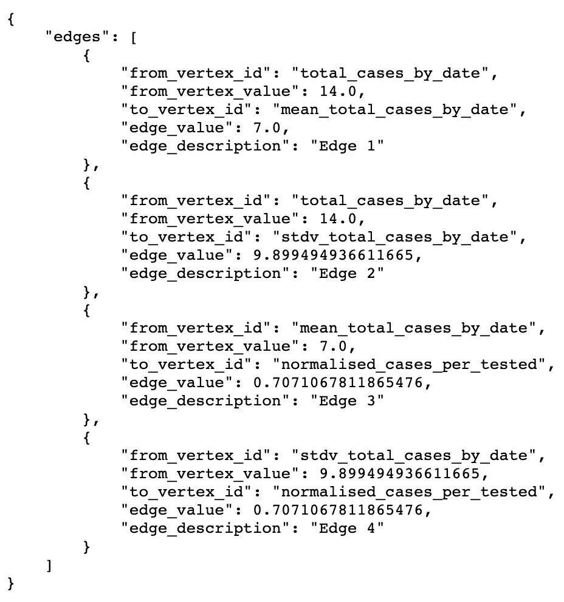
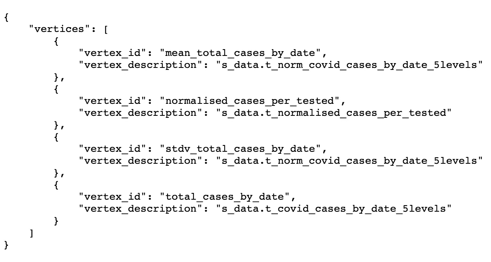
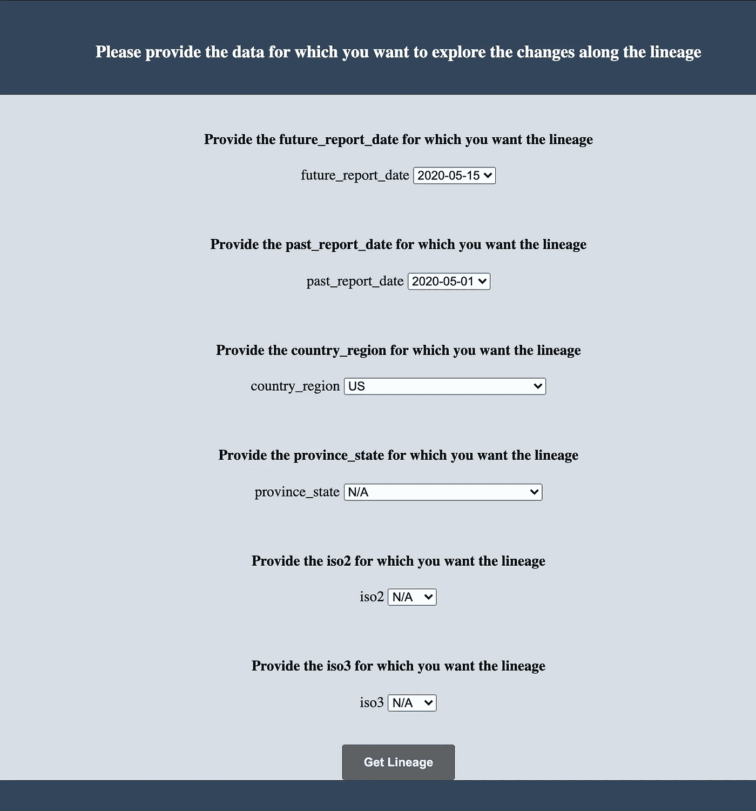
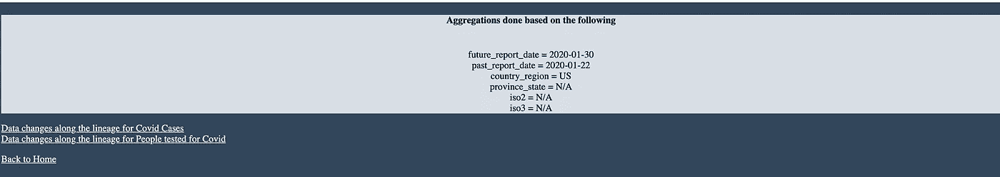
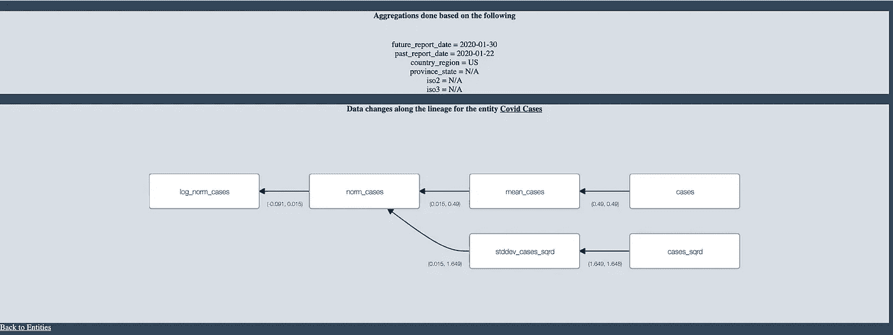

# 一种工具/框架，用于检测不同时间段之间数据实体的变化程度

> 原文：<https://medium.com/analytics-vidhya/a-tool-framework-to-detect-the-extent-of-changes-in-data-entities-between-time-periods-d48ec4e0102b?source=collection_archive---------3----------------------->

数据可观察性—当今必须具备的指标

今天，世界各地的组织利用多种工具/框架来实现在他们自己的数据环境中通过各种数据管道运行的数据的可追溯性。存在各种工具/框架来跟踪和报告管道性能，警告即将发生的 SLA 违约，并且还显示整个分布式架构中的数据产品的谱系。这些工具/框架中的一些捕获跨异构存储系统(中间数据驻留的地方)和/或计算系统(正在计算转换的地方)的数据产品的谱系。这些工具/框架为用户提供了通过整个架构中管道的各个部分进行数据移动的高度可见性。

可用于数据可观察性的工具/框架

这个博客的目的是展示一个工具/框架，它可以用来跟踪数据实体在选择的时间周期内的变化。

该工具/框架的用户可以自由选择需要跟踪的时间段、数据实体和转换谱系。用户可以选择跟踪多个实体，还可以定义跟踪谱系的各种聚集级别。

一旦配置了这些用户特定的选择，该工具/框架就以有向图的形式提供信息，该有向图可以从右向左阅读，根节点在最左侧。根节点表示数据实体在其沿袭中的最终形式。根节点右侧的节点表示应用于数据实体的各种转换。这些转换以广度优先的方式显示在图表中。图中最右边的节点表示实体在其谱系中开始旅程的来源。连接节点的边将显示应用于数据实体的转换值的百分比变化。

通过跟踪从实体的源到目的地的变化程度，用户可以精确定位管道中可能存在潜在错误/数据质量问题的转换。

该框架期望用户提供以下信息作为配置

*   保存转换(用户想要跟踪的)的数据库表和列
*   json 文件中编码的实体和相关转换的沿袭(一次性活动)
*   用户希望比较实体及其转换的日期
*   用户感兴趣的各种级别的聚集

## 从哪里获得所需的数据

本博客使用的数据(*新冠肺炎活动. csv &新冠肺炎案例. csv* )可从

 [## 新冠肺炎活动-新冠肺炎数据集-数据-资源-中心

### 病例和死亡数据的全球时间序列。

数据世界](https://data.world/covid-19-data-resource-hub/covid-19-case-counts) 

## 正在使用的技术堆栈

使用的主要编程语言是 Python 和 SQL ( **该工具/框架可以与 PostgreSQL 或 Snowflake** 一起工作)。用户界面是使用 flask 框架构建的。在撰写本文时，还没有这个工具/框架的 docker 映像，但是，很快就会有了。

## 设置事物

应用程序启动的初始配置条目

 [## 主 sumaniitm/data-lineage-change-explorer 上的 data-lineage-change-explorer/config . txt

### d b-settings]server = localhost dbname = track data lineage schema = s _ data filter = date levels =…

github.com](https://github.com/sumaniitm/data-lineage-change-explorer/blob/main/config.txt) 

这是一个文本文件，在特定标题下有键值对。它遵循 python *configparser* 模块的要求。数据库信息在主机名(*服务器*)、数据库名(*数据库名*)和*模式*、*过滤器*(这是多余的，将在未来的增强中删除)和*级别*字段保存用户想要聚合数据的各种粒度级别。 *hierarchy_table_name* 字段保存有不同级别数据的数据库表名。应用程序主登录页面中的下拉列表将使用此表填充。字段*查询*保存列出数据实体的 SQL、在转换中使用的所有各种属性，以实现实体和存储所有这些的表。配置文件中定义的每个实体都应该有一个对应的*查询*。字段*日期列名*是数据库中日期列的名称。 *entity_list* 字段保存用户想要跟踪的数据实体的列表。定义*实体列表*和*查询*时必须小心。实体的顺序应该与实体 SQL 的顺序相匹配，以便正确显示每个实体的沿袭。该框架将为用户提供一个中间页面来导航到他/她选择的实体。 *app-home* 部分下的详细信息指的是应用程序运行的位置(一旦应用程序在未来的增强中作为 docker 映像可用，这将被替换)以及应用程序将用来连接到数据库的*凭证*字节码文件的位置

## 边和顶点

接下来是关于边的初始信息，它展示了数据实体通过转换从源到目的地的旅程。用户需要以 json 的形式提供这些信息

edge json 包含被跟踪的数据实体的列名

 [## 主 sumaniitm/data-lineage-change-explorer/edges _ entity _ 1 . JSON

### 该存储库试图使用广度优先搜索来跟踪谱系中的数据漂移/变化

github.com](https://github.com/sumaniitm/data-lineage-change-explorer/blob/main/json_files/edges_entity_1.json) 

用户必须将这个 json 复制到另一个 json 中，这将形成用于比较两个日期的查找，在这两个日期之间比较数据实体的变化。初始配置中列出的所有实体都需要进行类似的设置。初始边缘值可以是任何值，**工具/框架将在运行时填充这些值**。边缘描述仅用于文档目的。

在运行时，应用程序还将基于用户提供的初始配置创建顶点(即存储初始配置中提到的数据实体的源、转换和目的地的数据库表列)的 jsons，并且还将验证顶点是否被正确地称为边。

验证失败将记录在控制台中，并且不会生成结果。

顶点 json

 [## 主服务器上的 data-lineage-change-explorer/vertices _ entity _ 1 . JSON…

### 该存储库试图使用广度优先搜索来跟踪谱系中的数据漂移/变化

github.com](https://github.com/sumaniitm/data-lineage-change-explorer/blob/main/json_files/vertices_entity_1.json) 

## 核心处理逻辑

该应用的核心是基于有向图的广度优先搜索。数据实体的目的地是有向图的根节点，并且通向目的地的所有变换和源是使用广度优先搜索遍历的有向图的非根节点。基于从用户提供的初始配置导出的边和顶点，生成的图作为邻接表存储在存储器中。flask 应用程序连接到数据库并查询层次表以检索级别的数据，并向用户呈现以下界面

应用程序的登录页，用户可以在其中选择汇总级别

选择未来和过去的日期是强制性的，因此总是填充默认值，但是，所有其他级别都是可选的，可以跳过。点击*获取世系*按钮，应用程序将根据日期和其他选择的等级从数据库中检索信息。将为初始配置中定义的所有实体检索类似的相关信息。用户将看到一个中间页面，他/她可以选择详细调查所选的实体。中间页面还提醒用户在登录页面中选择的数据。

中间页面

源值、变换值和目标值的差值以百分比计算，并存储为边的标签。使用 python *dagre-d3* 库渲染最终图像。最后一页还会提醒用户在登录页面中选择的数据。这有助于用户记住开始时所做的选择。

有向图的最终渲染图像，显示数据沿边缘变化的程度

## 伪代码

应用程序首先连接到 PostgreSQL 数据库，并根据用户提供的配置构建 vertex json。构建 vertex json 之后，应用程序获取用户在配置中提到的各种聚合级别的数据。一旦用户提交了数据和聚集级别的选择，应用程序就会更新边，并分别使用当前日期和旧日期的值来查找 jsons。一旦这些 jsons 被更新，邻接矩阵也会根据旧值和当前值之间的百分比差用相应的值进行更新。这些操作的完成触发了广度优先搜索算法，并准备了具有百分比差作为边缘标签的边缘的最终列表。边的列表是元组的 python 列表，并且元组的内容是源顶点、目的地顶点以及源顶点和目的地顶点的值的百分比差。然后这个列表被传递给 html，并使用 *dagre-D3* python 库显示。应用程序可以基于传递给 *app.py.* 中的 *BuildJsons* 类的值连接到 PostgreSQL 或雪花数据库

 [## 主 sumaniitm/data-lineage-change-explorer 上的 data-lineage-change-explorer/app . py

### 该存储库试图使用广度优先搜索来跟踪谱系中的数据漂移/变化

github.com](https://github.com/sumaniitm/data-lineage-change-explorer/blob/main/app.py#L25) 

## 结论

这个工具/框架的目的是在用户选择的最精细的粒度级别上建立数据可观察性。这个应用程序的主要优点是它能够根据用户的选择对数据差异进行布局。**一旦设置了初始配置，用户无需担心运行数据管道的代码知识，这是因为即使用户不知道管道的代码，他/她也可以通过查看渲染图和沿边缘的百分比来查明数据中的潜在问题(源、目的地或中间转换)**。采用这种应用程序的工作量很小，而且它在观察数据实体随时间的漂移方面提供了很大的价值。

## 源代码

 [## GitHub-sumaniitm/data-lineage-change-explorer:这个存储库试图跟踪数据…

### 该存储库试图使用广度优先搜索来跟踪谱系中的数据漂移/变化

github.com](https://github.com/sumaniitm/data-lineage-change-explorer)