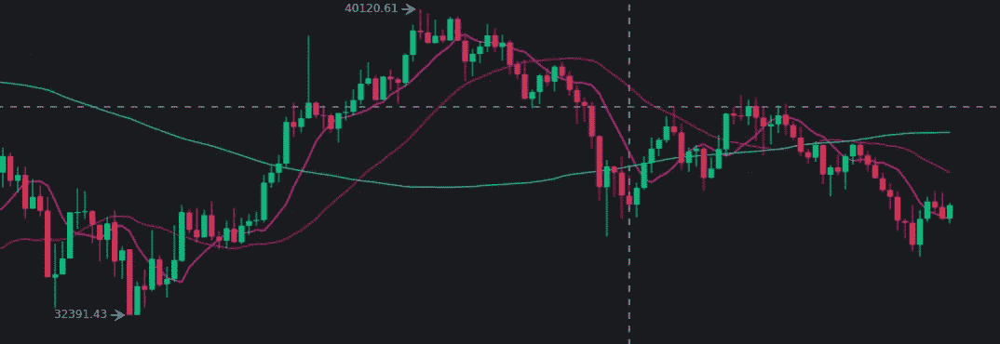

# 币安期货的 python 代码交易机器人

> 原文：<https://medium.com/analytics-vidhya/a-trading-bot-in-python-code-for-binance-futures-c006fdc9db12?source=collection_archive---------1----------------------->

有没有可能编写一个 python 程序来进行交易？是的，它是。
是否有利可图？嗯，看情况。

今天，我想编写一个 python 交易机器人，它可以自动执行所有操作。

# 战略

这个想法是检查两个技术指标:周期=7 的加权移动平均线(WMA7)和…