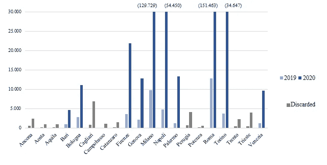
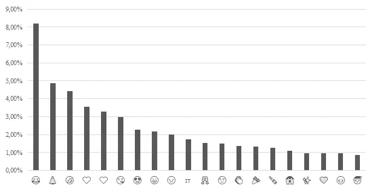
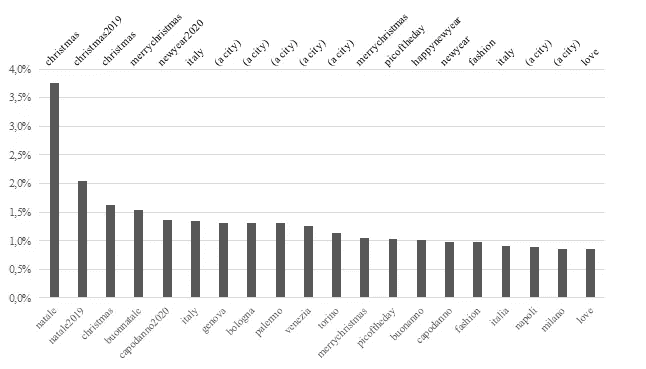
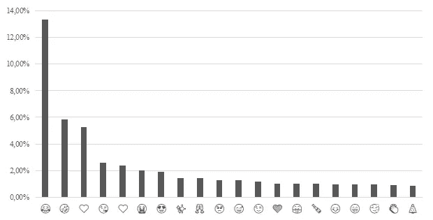
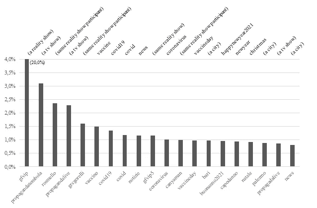
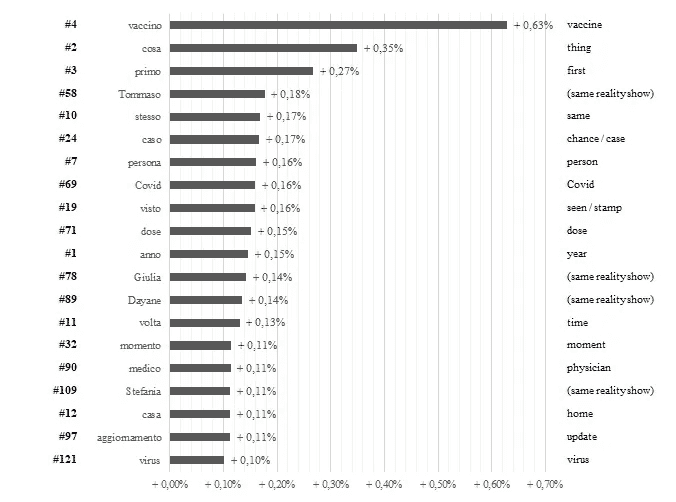
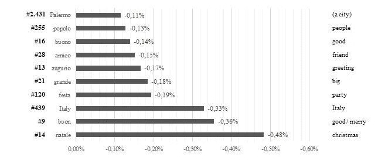
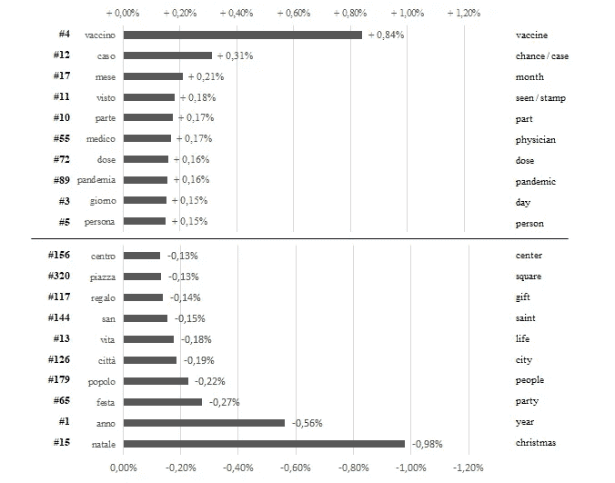

# 推特圣诞颂歌

> 原文：<https://medium.com/analytics-vidhya/a-twitter-christmas-carol-28a8f41ef38f?source=collection_archive---------26----------------------->

## 或者:意大利推文是如何表现节日的？


[Unsplash](https://unsplash.com?utm_source=medium&utm_medium=referral) 上[视觉](https://unsplash.com/@visuals?utm_source=medium&utm_medium=referral)的照片

我们正面临着一个奇怪的时代:当新冠肺炎在世界各地肆虐，引发卫生危机，许多企业濒临破产的时候，每个人都在努力应对封锁措施和随之而来的孤独。自然地，在节日期间，这些挣扎成为一个话题，这就是这篇文章的由来:我们如何处理*(不在)*传统聚会和家庭时间？

Twitter 是试图回答这个问题的可用来源之一，这就是为什么我开始检索 2019 年和 2020 年 12 月 20 日至 1 月 1 日(含)从几个意大利城市发布的推文。我收集了 1，462，741 条基于时间和地理的推文，将收集范围限制在 20 个意大利地区的首府。

我将简要解释检索和清理分析过的语料库的方法，但本文将主要关注结果，而不是作为教程，所以显示的代码只是为了突出关键步骤。

## 方法学

第一步是访问 Twitter 数据，对于这个范围，我使用了 [Twint](https://github.com/twintproject/twint) ，一个强大的 OSINT 工具来访问时间轴，而不使用 Twitter API。

```
c = twint.Config()
c.Pandas = True
for year in ['2019', '2020']:
    c.Since = str(year) + '-12-20'
    c.Until = str(int(year)+1 + '-01-02'
    for city in cities: #List of cities to be scraped
        c.Near = city
        twint.run.Search(c)
        df = twint.storage.panda.Tweets_df
```

这段代码是 Twint 配置，由两个循环构成，遍历两年和城市列表，收集所有可用的 tweets 并存储到 Pandas 数据帧中。



每座废弃城市的推特数量(图片由作者提供)

因为抓取不是基于标签或关键词，所以收集的数据非常嘈杂。所以接下来的步骤是清理数据，这个过程是基于在三种情况下删除推文:

1.  意大利语以外的语言，通过使用 Twitter 的嵌入式*语言*字段。
2.  短于 75 个字符和/或 10 个单词的推文(标签和提及除外)。
3.  来自其他服务(如 Instagram)的自动帖子。

通过仅保留 2019 年和 2020 年发推文超过 1000 条的城市，对所得数据集进行了额外过滤。通过这种过滤，我能够丢弃 20 个城市中的 10 个，从而获得 2019 年的 43.714 条推文，总共 1.014.456 个词，以及 2020 年的 443.971 条推文，共有 10.535.977 个词。推特可用性之间的差异可能由几个因素造成:2020 年期间推特高级搜索的更新，推特用户的“生理”增长，以及 [Twint 抓取](https://github.com/twintproject/twint/issues/666)中可能的不一致。然而，在上述清理之后，数据集似乎足以面对两年之间的内容相对权重。

第三步集中在实际的 tweet 内容上:清理文本以执行词性(POS)标记。在此之前，我从所有过滤的推文中提取了表情符号和标签。前者是通过基于 [this gist](https://gist.github.com/akkez/99ceeae2f13c9d8d9be7df0279e2c438#file-emoji-py) 的正则表达式获得的，该表达式列出了所有可用的 unicode 字符，而后者已经由 Twint 存储在 DataFrame 中。

然后，我继续进行文本清理，这保持在最低限度，包括删除链接，提及 *(@ user)* ，标签 *(# topic)* 和非拉丁字符。举个例子，大概是这样的:

```
#Remove links
text_step1 = re.sub(r'http\S+\s?', '', raw_tweet)
#Remove hashtags and mentions
text_step2 = re.sub(r'(\#(\S+)\s?)|(@(\S+)\s?)', '', text_step1)
#Remove non latin characters (keeping italian punctuation)
text_clean = re.sub(r"[^a-zA-Z0-9À-ÿ \'!?.,]", '', text_step3)#raw_tweet
"Buon 2020 a tutti ...anche a te [@](http://twitter.com/LinoGuanciale)XXXxxxXXX, che sia altrettanto importante come quello passato😘🥂 #2020"#raw_tweet (translated)
"Happy 2020 to everyone ... also to you @XXXxxxXXX, may be important as the year passed😘🥂 #2020"#text_clean
"Buon 2020 a tutti ...anche a te che sia altrettanto importante come quello passato"
```

有了干净的文本，我终于可以开始标记每个执行词性标记的单词(识别语法角色，如名词、形容词、动词等)。)和词汇化(根据上下文将单词简化为其词根，例如 walking-> walk；更好->好)。这个位是使用 [TreeTagger](https://www.cis.uni-muenchen.de/~schmid/tools/TreeTagger/) 和它的 Python 包装器: [TreeTaggerWrapper](https://perso.limsi.fr/pointal/dev:treetaggerwrapper) 完成的，其中一个标记集可从 TreeTagger 库中获得:由马尔科·巴罗尼开发的[意大利参数](https://home.sslmit.unibo.it/~baroni/collocazioni/itwac.tagset.txt)。

```
tagger = treetaggerwrapper.TreeTagger(TAGLANG="it") 
raw_tags = tagger.tag_text(text_clean)
tagged_text = treetaggerwrapper.make_tags(tags)#tagged_text
[Tag(word='Buon', pos='ADJ', lemma='buon'), #adjective
Tag(word='2020', pos='NUM', lemma='[@card](http://twitter.com/card)@'), #cardinal number
Tag(word='a', pos='PRE', lemma='a'), #preposition
Tag(word='tutti', pos='PRO:indef', lemma='tutti'), #pronoum
Tag(word='...', pos='SENT', lemma='...'), #punctuation
Tag(word='anche', pos='ADV', lemma='anche'), #adverb
Tag(word='a', pos='PRE', lemma='a'), #preposition
Tag(word='te', pos='PRO:pers', lemma='te'), #pronoun
...]
```

我不会深入研究意大利语的语法规则，但 TreeTagger 支持无单词标记化的标记方法，以基于上下文识别词条。在意大利语中，形容词和代词在名词之后是共轭的，并且单词通常具有相同的拼写，但是具有非常不同的角色，例如名词、动词和命题，因此上下文识别是至关重要的。在这一点上，我也能够清除文本中的停用词、标点符号和每一个不相关的位置，将下面的分析集中在相关的词条上。

## 过去圣诞节的推文

做完这些方法论的解释，我们来放一些结果在坑里。如果你熟悉 2015 年牛津词汇，你会喜欢上这个。



2019 年表情符号的总体使用情况(图片由作者提供)

从符号学的角度来看，表情符号——像模因一样——是传达信息和表达情感的有效方式，毕竟我们处于数字时代。显然，臭名昭著的*喜极而泣*是圣诞节期间使用最多的表情符号，注意排在第二位的*圣诞树*。

我从表情符号开始分析，因为每个象形文字都是一条信息，超越了语言和习语，可以被普遍理解。现在让我们看看标签，对于方言和地域内涵，位置实际上变得相关。事实上，标签，比文本内容多得多，与事件和受时间限制的现象有关，只要想想政治相关的内容。



2019 年标签的总体使用情况，包括翻译(图片由作者提供)

圣诞节和除夕相关的标签是最突出的，其次是几个城市。有道理。去年我们在做什么？我们在享受假期，有人在工作，有人在旅行，我们基本上玩得很开心！

## 圣诞礼物的推特

让我们回到今天，发生了什么事？在意大利，圣诞节是整个国家处于“红区”的时刻，一级防范禁闭，只允许必要的活动(食品杂货、紧急情况)，每天可以拜访一个朋友或亲戚。基本上人们大部分时间都呆在家里，最终在圣诞节或新年前夕会有一个小聚会。让我们来看看我们心爱的象形图。



2020 年表情符号的总体使用情况(图片由作者提供)

我们在看什么？去年同样的数据？不，我仔细检查过了。而除了*圣诞树*排在 20 强末尾，还有一个*大声哭脸*摇摆名次#6 之外，一切似乎都很正常。快乐的表情符号随处可见，*碰杯*和其他令人愉快的表情符号仍然相关。但是，有一个但是，我们应该记住，表达负面情绪并不常见(除了愤怒)。即使我们可以使用 Twitter 作为表达概念和情绪的手段，它仍然是一个社交媒体。根据 2017⁴.滑铁卢等人的研究，悲伤是一种私人情绪，似乎很少适合公开分享



2020 年标签的总体使用情况，包括翻译(图片由作者提供)

现在让我们看看标签，让我们做一个初步的评论:显然在意大利有很多人看真人秀。观众正在推特上直播⁵的表演，你还可以在推特上给你最喜欢的候选人投票。也就是说，让我们跳过判断，让我们不要考虑那惊人的 20%的标签。

我们在这里可以看到的是，与 *covid* 和*疫苗*相关的标签处于领先地位，假期条款紧随其后。我们已经说过标签:事件和时间有限的现象。12 月 27 日是全欧洲的疫苗日，在流行标签中找到这个标志是有意义的。

## 标签呢？

表情符号和标签是分析推文的一种有限方式。两者都代表了单一的信息:即使脱离了上下文，它们也能被理解。然而，它们不能表达复杂的概念，而且不是每个用户都在使用它们。我们进入 POS 标记是有原因的，不是吗？

通过探索性分析，我没有发现城市之间的主要差异，因此我们将通过查看标签出现最多和最少的情况来关注整个数据集。



获得最高的标签，左边是 2020 排名和翻译-(图片由作者提供)

在这里，实际上可以看到对话如何转向与 Covid 相关的问题(当然还有真人秀)*。出于已经提到的原因，疫苗*是 2019 年至 2020 年间最有收益的词条，图表上紧随其后的是 *Covid、剂量、医生*和*病毒*。



排名靠前的标签，左边是 2020 排名和翻译—(图片由作者提供)

另一方面，最衰退的词条是 c *hristmas* 和 *good/merry* ，以及其他正面标签，如 *party* 、*问候*和 *good* 。名词 POS 也显示了类似的结果，其中相关性变得更加明显:*年*是 2020 年发布最多的名词，但其在 2019 年的下降幅度仍然很大。这意味着对话发生了转变，出现了更多引人注目的话题。换句话说，它似乎代表了这样一个事实，即我们实际上是在迎接新年，并在关于疫情的更广泛的对话中谈论它。



排名上升和下降的名词位置，左边是 2020 年的排名和翻译—(图片由作者提供)

## 圣诞节的推特即将到来

显然，我不得不继续我的狄更斯式的主题，但这一章作为结论比作为预测更合适，我将长话短说。

让我们回到前两个问题。获得的数据集证实，Twitter 实际上代表了真实的假日季节。即使我们不会在推特上谈论我们的悲伤和痛苦，就像表情符号显示的那样，谈论当前的事件如何影响我们的生活也是不可避免的。我们亲自参与这种对话，当然，也是在网上。然后，每个人都找到了应对的最佳方式:有人在看真人秀，有人在分析推文。**如果表情符号不说谎** - *奇怪的句子写-* 我们实际上是在以最佳状态处理一切！

为了保持对即将到来的*圣诞节的信心，*明年回到这个主题会很棒，通过情感分析来展示隐藏在单词和表情符号背后的含义。希望能描述一个更愉快的时刻。

## 参考

[1] H. Schmid，[使用决策树的概率词性标注](https://www.cis.uni-muenchen.de/~schmid/tools/TreeTagger/data/tree-tagger1.pdf) (1994)，语言处理新方法国际会议论文集

[2] L .波因特尔，[https://perso.limsi.fr/pointal/dev:treetaggerwrapper](https://perso.limsi.fr/pointal/dev:treetaggerwrapper)

[3] M. Baroni，[词性标注(e lemmatizzazione)](https://home.sslmit.unibo.it/~baroni/compling04f/pos.pdf) (2005)

[4] S. F .沃特卢，S. E .鲍姆加特纳，j .彼得和 P. M .瓦尔肯伯格，[网络情绪表达的规范:比较脸书，推特，Instagram 和 WhatsApp](https://journals.sagepub.com/doi/pdf/10.1177/1461444817707349) (2017)，新媒体&学会，2017 年 5 月

[5] S. Schirra，H. Sun 和 F. Bentley，[单独在一起:在推特上直播电视连续剧的动机](http://web.mit.edu/bentley/www/papers/paper653.pdf) (2014)，麻省理工学院比较媒体研究