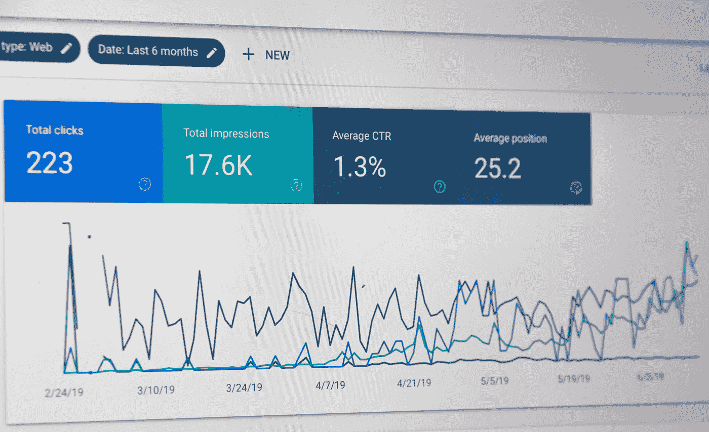

# 典型的大学数据科学课程看起来像…

> 原文：<https://medium.com/analytics-vidhya/a-typical-college-data-science-course-looks-like-76b29b71520?source=collection_archive---------37----------------------->

## 学习不同的概念、技术、软件及其在营销、金融和其他行业的实际应用

据我所知，数据是新的石油，在分析领域，更多的数据正在快速增长。数据分析、数据科学、商业分析、机器学习、人工智能都是当今用来吸引人才进入这一领域的热门词汇。大学已经看到了这种课程的上升趋势，行业对它有需求。

卢克·切瑟在 [Unsplash](https://unsplash.com?utm_source=medium&utm_medium=referral) 上的照片

大学通常涵盖广泛的主题，不会深入到某个特定的领域，但也不仅仅是介绍。这里有几个大学通常会涉及的话题

1.  统计数字

几乎每门分析课程都从基础统计学开始。基本概率，排列组合，博弈论介绍，相对概率。理解其背后的基本数学知识是重要且有益的。它重数学，但侧重于概念。

它转向回归，名义曲线，p 值，趋势线，假设检验。这些都是基本的统计概念，也用在所有的模型和算法中。

从这些概念出发，我们来到多元分析、逻辑回归、数据挖掘、支持向量机、最近邻和决策树。这些是在数据处理、预测分析以及金融模型中使用的分类模型。

以此为基础，并让一些数学爱好者进入这个领域，我们进入了机器学习和监督学习的世界，但这是一个改天再讨论的话题

2.营销

斯蒂芬·菲利普斯-Hostreviews.co.uk 在 [Unsplash](https://unsplash.com?utm_source=medium&utm_medium=referral) 上的照片

数据在营销中被广泛使用的商业领域之一。不仅仅是传统意义上的优惠券和折扣，而是更广泛意义上的客户定位，利用终身价值，降低流失率，使用定向广告来获得超过 10%的转化率。所有这些术语对初学者来说可能是行话，但在标准行业实践中却是常用的。

它从基本的营销概念开始，如什么是顾客、客户、产品、折扣、每个顾客的成本、点击率等。接下来，您将了解如何计算转化率的公式和概念，以及不同活动的行业标准。你经历了不同的场景，在线与离线，数字与印刷。然后我们得到了客户终身价值、客户保持率、流失率、回头客等核心概念。

如果我们深入研究高级市场营销科目，它将与金融、设计和技术等其他领域混合在一起，就像在企业环境中一样。所以我们会学习像现金流、配色方案、A/B 测试这样的概念；像谷歌分析这样的工具，以及如何跟踪数据。

3.程序设计语言

伊利亚·巴甫洛夫在 [Unsplash](https://unsplash.com?utm_source=medium&utm_medium=referral) 上的照片

今天的技术在商业世界中占主导地位，除了熟悉它，别无他法。不仅如此，还要随着时间和规范不断适应和变化。人们总是抱怨的一件事是车管所的事情是如何的缓慢和过时，或者政府项目是如何的无效；这是因为他们在技术上没有跟上时代，也因为他们没有竞争对手，所以他们不需要跟上时代。

在这种情况下，技术更多的是在编码或编程方面。学习一门新的语言或一种不同的方法来完成一项任务。比如，你可以用不同的语言来编译代码，比如 C，C++，C#，Java，Python 但是选择哪一个最适合这个任务真的很重要。就数据科学而言，Python、R、SQL 是最常用的。所以学习，它，熟悉命令，理解[基本命令](/analytics-vidhya/basic-commands-after-importing-data-in-python-cb6cb8d8c56b)等我们有了数据之后。

这是普通数据科学课程分成的三个主要实施和分支。课程中总会有差异和变化，然而，这可以作为走向机器学习、云计算等的基础。