# 构建一个 web 应用程序，使用 HTML 和 JavaScript 在 Spotify 上随机播放歌曲

> 原文：<https://medium.com/analytics-vidhya/a-web-app-to-play-random-songs-from-spotify-with-html-and-javascript-3ecc4dd93651?source=collection_archive---------0----------------------->

在推荐、算法驱动的发现和泡沫效应的吸引下，我踏上了构建一个简单(简单到一键操作)的应用程序的旅程，从整个 Spotify 目录中给我一首“*随机*歌曲。

> 随机，不是基于流派，情绪或任何东西。

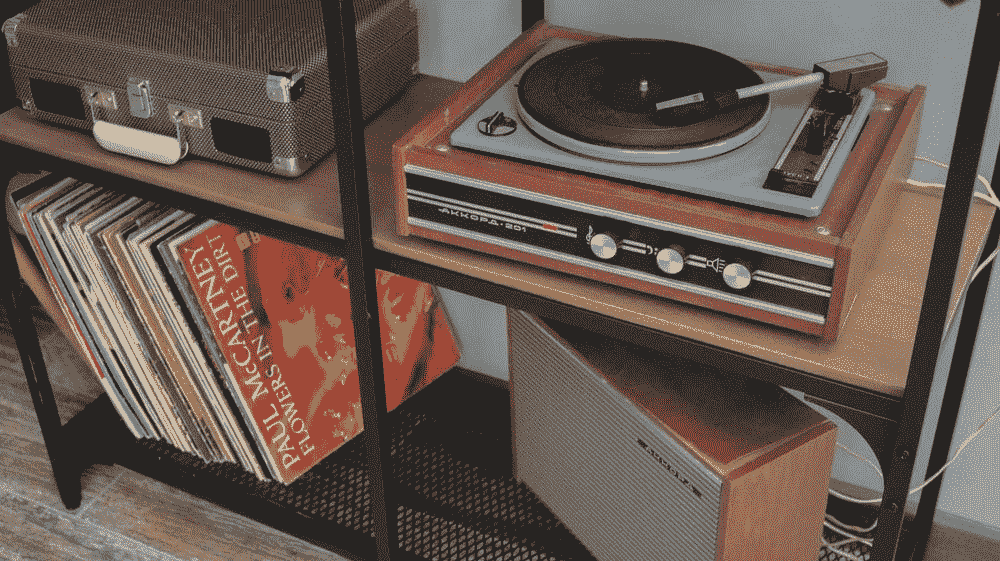

照片由[克里斯蒂娜·阿科波娃](https://unsplash.com/@akopovaks?utm_source=unsplash&utm_medium=referral&utm_content=creditCopyText)在 [Unsplash](https://unsplash.com/s/photos/vinyl-player?utm_source=unsplash&utm_medium=referral&utm_content=creditCopyText) 拍摄

为了保持开发和部署简单快速，我选择通过 [Glitch](http://glitch.com) 来构建它，并使用[这个模板](https://glitch.com/edit/#!/spotify-recommendations)来处理所有烦人但必要的事情(查看您的身份验证、令牌处理、重定向……)

这是这个应用程序的样子(你可以在这里找到它:[https://spotify-random-song.glitch.me/](https://spotify-random-song.glitch.me/#)):

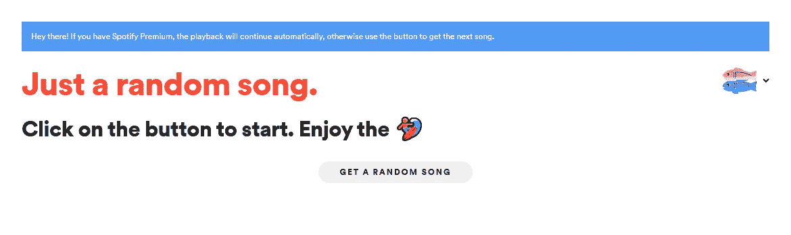

一键。

基本上就是一键。当点击它时，它会从 Spotify 中选择一首“*random”*歌曲，如果您有 Spotify Premium，它会自动开始播放，否则会提供一个播放按钮来播放歌曲。

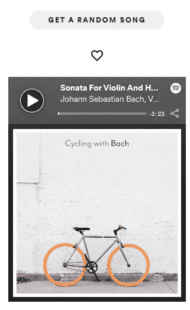

一首随机的巴赫歌曲出现了。

# 事实真相

既然我们已经看到了辉煌的用户界面，让我们深入代码了解它是如何工作的。首先，让我们看看 Glitch 的[源代码中包含的文件:](https://glitch.com/edit/#!/spotify-random-song)

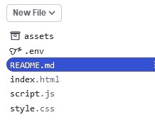

目录内容

正如你所看到的，它的结构非常简单，只有一个*文件，负责呈现用户界面和小部件，还有 ***script.js*** ，包含了验证用户身份、连接到 Spotify SDK 以及播放和保存歌曲的所有逻辑。*

## *用户认证*

*第一步是**通过 Javascript** 认证 Spotify 用户。为此，我们使用下面的代码，摘自[这里的](https://glitch.com/edit/#!/spotify-recommendations):*

*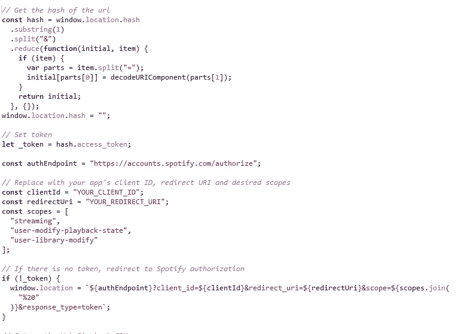*

*鉴定 Spotify*

*基本上，这段代码会在新用户第一次访问 Spotify 应用程序时，将其重定向到 Spotify 登录页面。由于用户将播放歌曲并可能将它们保存到他们自己的库中，我们需要请求“流”、“用户修改回放状态”和“用户库修改”范围。*

> ***注意:**这段代码需要安装一个 Spotify 应用程序来创建您的客户端 ID 和密码，并设置重定向 URI。如果你正在寻找如何做到这一点的信息，你可以遵循[这个指南](https://developer.spotify.com/documentation/web-api/quick-start/)。*

*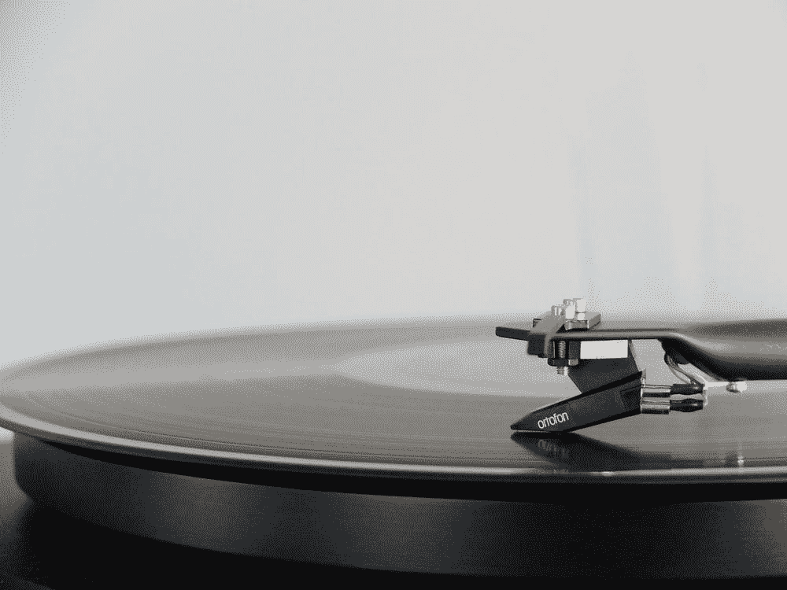*

*照片由[阿德里安·科特](https://unsplash.com/@adkorte?utm_source=unsplash&utm_medium=referral&utm_content=creditCopyText)在 [Unsplash](https://unsplash.com/s/photos/music?utm_source=unsplash&utm_medium=referral&utm_content=creditCopyText) 拍摄*

## *网络播放设置*

*用户登录后，我们可以设置 Web Playback SDK 来控制他们的 Spotify 播放器。为此，我们再次使用下面的代码，从[到这里的](https://glitch.com/edit/#!/spotify-recommendation):*

*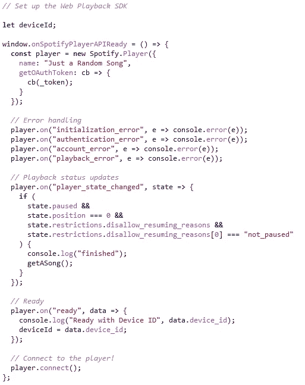*

*设置 Web Playback SDK 来控制用户的 Spotify 播放器*

*这段代码使用认证期间获得的令牌来初始化一个新的 Spotify。播放器对象，负责播放或跳过曲目。*

*现在我们已经准备好了播放器，我们可以使用下面的代码来播放一首特定的歌曲:*

*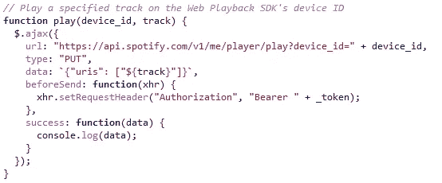*

*通过 Spotify 播放器 API 播放特定歌曲*

*上面的**播放**功能有两个输入:*

1.  *device_id:将播放曲目的 Spotify 设备；注意，这是在前面的代码块中自动初始化的，它由 web 浏览器本身表示；*
2.  *曲目:这是一首曲目的 Spotify URI，例如:*Spotify:track:6 oqtj 7 llyuiejkfx R4 muuy**

## *自定义代码:随机选择一首歌曲播放*

*随着一切的设置，我们现在可以专注于编写自定义代码来实现我们希望包含在应用程序中的功能，即**点击按钮播放随机歌曲。***

*首先，我们需要一种方法来挑选看似随机的歌曲。在这个 reddit 线程之外，我选择**生成两个字母的随机字符串**作为搜索中的查询，如“be”、“ma”、“yt”等。等等。*

*这个函数负责生成这样的查询:*

*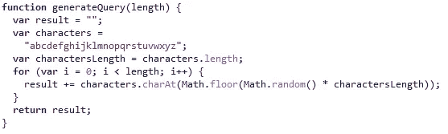*

*生成两个字母的随机字符串*

*下一步是使用生成的查询对搜索 API 端点执行 **HTTP GET 调用，在随机位置检索结果并播放它。***

*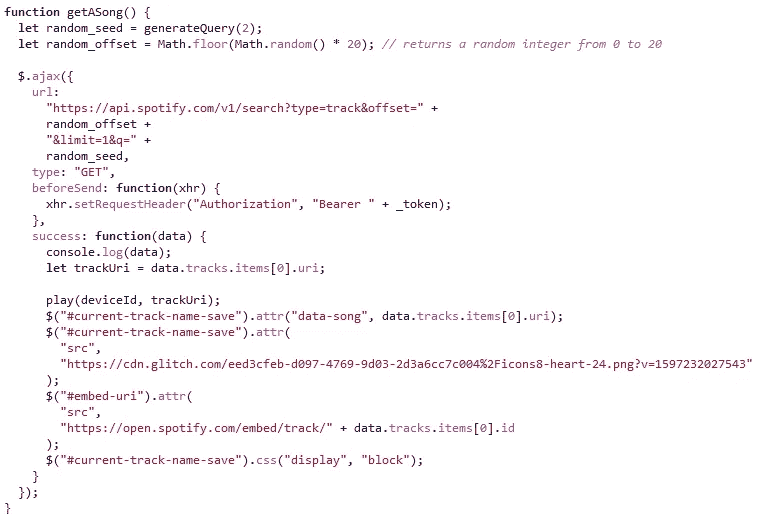*

*随机选择一首歌曲并播放。*

*上面的 **getASong** 函数首先执行对搜索 API 端点的 HTTP Ajax 调用，使用由上面的 **generateQuery** 生成的随机查询和随机偏移量作为参数。如果这个调用成功，它将调用上面看到的 **play** 函数，开始播放。此外，如果需要，它会显示一个嵌入小部件来手动启动/停止播放。*

## *最后一步:将曲目保存到用户的曲库*

*由于这个小工具的全部目的是寻找新的音乐，我们必须给用户保存曲目的可能性，以防运气来了，随机输出成为他们新的最喜欢的歌曲。*

**

*Nicola Fioravanti 在 [Unsplash](https://unsplash.com/s/photos/heart?utm_source=unsplash&utm_medium=referral&utm_content=creditCopyText) 上拍摄的照片*

*为此，我们可以编写一个函数来执行对 Tracks API 的 **HTTP PUT 调用，将歌曲添加到用户的库中:***

*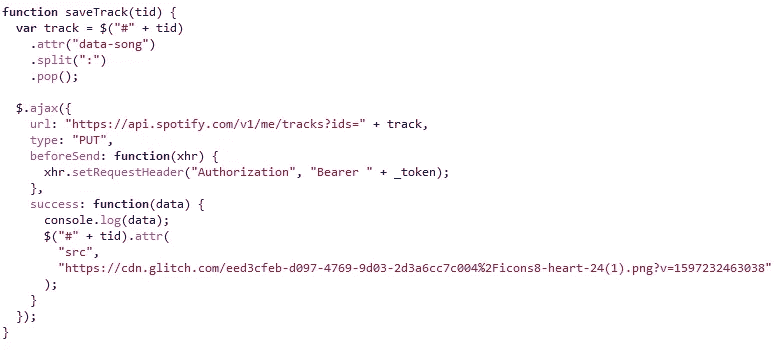*

*将曲目保存到用户资料库*

*就是这样！*

> *想要更多吗？在这篇文章中找出如何创建你自己的播放列表生成器！*

*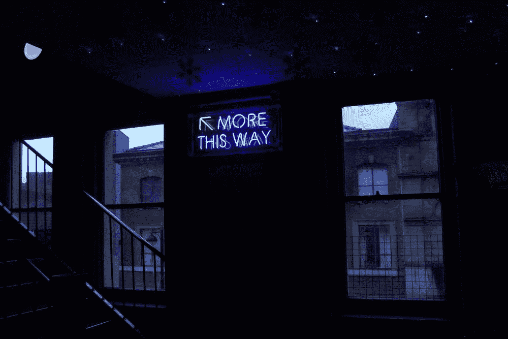*

*Miguel Orós 在 [Unsplash](https://unsplash.com/s/photos/more?utm_source=unsplash&utm_medium=referral&utm_content=creditCopyText) 拍摄的照片*

## *TL；速度三角形定位法(dead reckoning)*

*F 或者那些一路向下滚动的人，这篇帖子展示了如何**用 JavaScript** 构建一个 web 应用程序来:认证 Spotify 并设置 Web Playback SDK 来播放 Spotify 的随机歌曲；通过 Spotify API 搜索歌曲并将其保存到用户的曲库。*

## *有用的链接和来源*

*在这里，您可以找到运行该应用程序的代码:*

> *源代码:[https://glitch.com/edit/#!/spotify-random-song](https://glitch.com/edit/#!/spotify-random-song)
> 直播 app:[https://spotify-random-song.glitch.me/](https://spotify-random-song.glitch.me/#)用于 Auth &网页播放设置的模板:[https://glitch.com/edit/#!/spotify-recommendations](https://glitch.com/edit/#!/spotify-recommendations)*