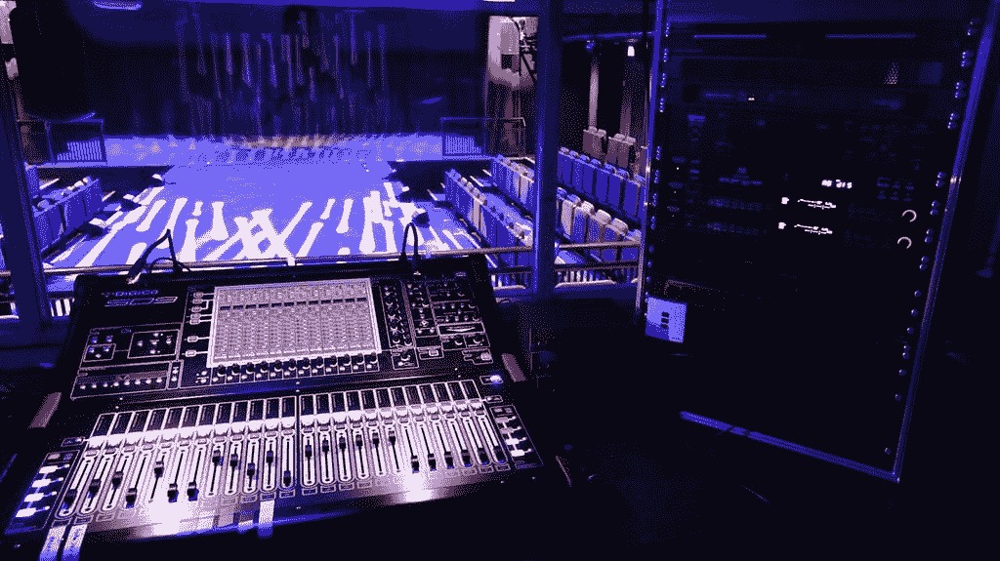

# A3！—后台版:一次尝试

> 原文：<https://medium.com/analytics-vidhya/a3-backstage-edition-an-attempt-822c99d25438?source=collection_archive---------23----------------------->

## *A3 会怎么样！如果把焦点放在后台工作人员身上会怎么样？*

从控制室看到的景色…是什么样的？(图片来源:新阿德菲剧院)

*上下文:这篇文章使用了学术研究论文的格式，因为……yay 研究？这不是我第一次使用这种格式的***，但是这篇文章比那篇稍微正式一些。我还使用了一些线框(用* [*视觉*](https://www.invisionapp.com/freehand) *制作)来说明应用程序的布局，因为我实际上不可能编写这个游戏的代码。另外要注意的是，这个技术剧场游戏如何比 Veludo Way 有一个更普遍的背景，但你总是可以想象它是恶魔教练因为错过一个线索而责骂你。各位，表演时间到了~**

# *技术剧院模拟游戏:照亮后台世界*

*虽然大多数观众都熟悉才华横溢的演员的精彩表演，但他们可能没有意识到为了成功地演出，幕后做了多少工作。技术剧场是指支持表演者的剧院制作的所有方面，如灯光、布景、声音、舞台管理、服装和布景设计(Held，2021)。与演员相比，由于技术剧院的复杂性和乏味的名声，缺乏对技术剧院的认识，导致对后台生活的复杂性缺乏欣赏。此外，没有多少学术研究关注戏剧作品，更不用说对后台文化的全面考察了。因此，在技术戏剧教育和认识方面存在差距，特别是关于后台的社会动态(Held，2021)。本文提出了一个模拟游戏，以一种可访问的、身临其境的和细致入微的方式向用户教授后台文化。游戏界面旨在增加对后台文化的欣赏，特别是在这个疫情，由于社会距离措施和减少技术剧院曝光机会，许多剧院都关了门(Nidweski，2021)。*

# *什么是技术剧场？*

*提议的游戏将模仿技术剧场的技术和社会方面。正如 Nidweski (2021)在她对女性技术剧院工作人员的采访中所显示的，不同场所之间的工作文化存在很大的内部差异。技术人员必须努力应对每一个生产场地的怪癖，而服装设计师等创造性角色必须适应每一个生产的要求。后台工作人员必须与最新设备保持同步，尤其是在数字控制台变得无处不在的情况下(Nidweski，2021)。然而，技术剧院行业有独特的结构，工艺后台身份(泰勒，2020)。例如，理解剧院行话对所有后台工作人员来说是必不可少的。后台工作人员的全黑制服有助于在表演期间融入黑暗的后台区域，在视觉上与众不同(泰勒，2020)。大多数作品都有无数的标准操作程序，需要精确的动作和通过耳机的持续交流。这些工作流程通过确保后台工作人员作为一个有凝聚力的整体工作，有助于最大限度地提高效率。因此，后台工作的技术方面具有统一的结构，而各个产品之间存在内部差异。*

*技术剧场对隐形优秀的追求，在后台文化中形成了鲜明的社会动力。Taylor (2020)研究了后台工作人员中存在的社会等级，并确定发展“我们对抗他们”的心态可能会导致部门之间的摩擦和沟通障碍。共享的工作经历可以迅速将同一个部门的员工联系在一起，让他们相互信任，在演出期间执行出色的团队合作。然而，这种紧密的联系可能会导致群体不信任那些背景不同的人，认为新来者无法理解现有群体的内部运作。当传统的技术团队和传统的创意团队互动时，这种不信任会加强，因为技术团队不认为创意人员应该告诉他们做什么，而创意人员认为技术人员在后台的地位较低，因为他们在表演期间是看不见的。然而，模糊创意和技术领域之间界限的边界案例确实存在。例如，照明设计师可能负责剧院照明的创意方面，但他们必须同样精通处理照明设备(Nidweski，2021)。最终，后台工作人员必须从这些界限模糊的角色中获得灵感，学会超越他们的差异，并记住他们的共同目标，以帮助演出继续进行。*

*技术剧院也不能免受影响社会其他部分的社会文化因素的影响。作为一个历史上男性占主导地位的行业，妇女多年来经历了偶然和系统性的歧视，这种歧视一直持续到今天(Nidweski，2021 年)。Nidweski 注意到，她的受访者记得在学校一级的作品中与许多女性戏剧技术人员一起工作，但发现自己在很大程度上是男性主导的专业戏剧人员中，这可能是由于技术戏剧工作本质上是男性的看法。对技术戏剧专业的兴趣可能会受到文化观点的影响，文化观点认为后台工作是劳动密集型的，不如办公室工作有声望。高昂的设备成本和复杂的后勤工作使得一些人很难在技术剧院自学，这使得通过剧院组织的培训机会不可或缺。许多最有经验的青年船员将他们的技能归功于大型教堂的培训，在那里他们通过学习如何使用最新的音响和灯光系统来协助崇拜表演。并不是所有的年轻人都能从教堂获得精心设置和培训的机会，这对那些希望在幼年学习技术戏剧的人造成了机会上的不平等，并可能影响后台戏剧工作人员的构成。因此，技术剧场的社会方面为探索和研究提供了肥沃的土壤。*

*该项目提出的手机游戏旨在教育年轻人了解他们自己国家的技术剧院场景。选择移动游戏界面是因为它与主要受众的熟悉程度，以及其沉浸式和可访问的用户体验的潜力。年轻人被选为目标观众，因为与更忙碌的工作成年人相比，他们可能有更多的时间和途径来体验技术剧院(Held，2021)。游戏本地化可以增加兴趣，因为玩家可能熟悉游戏中的场地。玩家在每一关扮演来自不同剧院技术部门的工作人员，模拟特定戏剧作品的技术和社会方面。完成关卡将会解锁信息丰富的“故事”奖励，更详细地探索技术剧场。该游戏的灵感来自角色扮演游戏(RPG)，玩家在游戏世界中扮演角色，并根据角色的技能进行互动。玩家的选择可以影响故事结局的视觉小说元素也被采用。RPG 和视觉小说游戏的融合准确地模拟了后台发生的社会情况，因为其他角色的反应取决于玩家的角色和动作。此外，游戏化是一种激励玩家在沉浸式游戏环境中不断学习的方式。*

# *用例*

*玩家 Izumi 希望了解更多关于专业灯光设计师如何工作的使用案例将有助于演示游戏界面的功能，以及它如何以细致入微的方式处理技术剧院的主题。这个特殊的用例是许多玩家的共同目标，需要使用游戏的许多功能。泉的用户任务是作为“歌剧魅影”剧场制作的“灯光设计师”完成一个“专业”难度的游戏关卡。该任务假设泉已经取得了足够的进展来解锁“专业”难度级别，这意味着她在游戏中不是一个完全的新手。因此，教程级别的线框不会显示。图 1 显示了完成游戏关卡的用户流程图。为了忠实于 technical theatre 对卓越和沟通的强调，可能会因为某个级别的技术部分表现不佳而不及格，或者因为冲突升级而导致沟通中断，直到无法解决为止。失败意味着玩家必须重玩一遍，失败的尝试没有任何奖励。*

**

**图一。说明玩家如何完成一关的用户流程图。**

*当 Izumi 打开游戏时，她看到的第一个页面是图 2 中的主页。主页上显示了有用的信息和一个“待办事项列表”,该列表鼓励她完成特定的任务，以促进游戏进程并获得奖励。底部的导航栏可以方便地访问游戏的其他部分。*

**

**图二。主页**

*泉还没有尝试过任何职业难度，因此在任务列表中有一个任务(“进行你的职业首次亮相！”)那鼓励她这样做。“产品”标签旁边的感叹号表示有新解锁的关卡可以玩。因此，在这种情况下，点击导航栏中的“生产”选项卡或“开始！”按钮会将 Izumi 带到图 3 中的 Productions 页面。*

**

**图三。生产页面**

*productions 页面显示了游戏多样的游戏关卡选择，以其宣传海报图片为代表，按字母顺序排序。在游戏中发现的作品从小型戏剧到大型音乐剧，包括古典和现代戏剧。这种多样性是必不可少的，因为它有助于传达技术剧院的历史演变，从几乎不需要任何技术设备的演出到使用大量数字道具的演出。Izumi 可以使用搜索栏按名称搜索产品，或使用左右箭头浏览列表。她应该点击标题为“歌剧魅影”的海报，导航到它的“选择级别”页面，如图 4 所示。*

**

**图 4。魅影的【选择等级】页面**

*“选择级别”页面提供了该产品的简短介绍，以及了解其历史的链接。每部作品都有“学校”、“社区”、“专业”三个难度等级。每一关都设置在一个特定的剧院，有些场地是基于玩家本国的真实剧院。每个剧院都有不同的设备布局和工作风格，显示出即使在一个国家的技术剧院行业也存在的内部差异。一些场馆重复，特别是在专业困难时，模拟专业水平的剧院设施如何比简单的学校剧院少。当玩家通关时，他们将会体验到技术戏剧工作者如何从经验中获得掌控。随着重复播放，来自每个地点的不可玩角色(NPC)会变得更加友好，因为他们将玩家视为船员“团队”的一部分(Taylor，2020)。特殊奖励对应于每一级获得的星星数，三颗表示 100%完成。Izumi 应该选择“专业”级别，该级别被标记为“首次制作”，因为她没有尝试过，导航到图 5 中的“选择角色”页面。*

**

**图 5。魅影的“选择角色”页面**

*每部作品都会有一些来自各行各业的角色可供选择，让玩家尽可能多地体验社会视角。一些角色不能出现在与他们无关的场所，比如社区级别的教堂。一个关卡可用的角色也依赖于制作场地，因为不同的团队可能是特定地方的常客。通过选择如图 5 所示的迷你简档来查看完整的人物简档，并且屏幕左右的箭头用作导航。对于用户任务，Izumi 应该选择名为“Ben”的角色，因为他是一名灯光设计师，并选择“Start Show”开始关卡。*

**

**图六。照明设计师游戏关卡的第 1 至 3 部分。进度通过从左到右、从上到下读取帧来显示。**

*图 6 显示了一个典型游戏级别的技术方面，它包括计划、排练和现场表演阶段，以模拟戏剧作品的工作流程。每个关卡的具体任务取决于玩家选择的角色。对于规划阶段，Izumi 需要通过向屏幕上的虚拟照明图添加灯光来完成照明图。“舞台预览”窗口显示了从剧院的灯光亭看起来的灯光效果，复制了实际技术人员在演出期间看到的效果。图 6 显示了如何在提交计划之前通过点击“Add Light”按钮并指定灯光类型、颜色和位置来添加聚光灯。游戏屏幕的所有部分都可以通过双击扩展为全屏视图，以便于查看。一旦 Izumi 对她的情节感到满意，她应该点击“提交”按钮来接收来自舞台监督(SM)的“成绩单”。她可以选择以几个点的代价重新制定计划，或者继续当前的绩效评定。为了反映性能预期的内部变化，扣分和评分标准将随着难度的增加而增加。*

*第二阶段模拟第三阶段实际演出前的技术彩排。这些阶段中的界面保留了阶段预览，用虚拟混音器替换了之前的照明图，用提示表替换了任务列表。虚拟调音台是实际设备的简化版本，以适应小型移动屏幕。制作长度持续几分钟，而不是像典型的制作那样持续几个小时，以保持玩家的兴趣。随着演出的进行，Izumi 需要根据提示表在合适的时间使用混合器来提示正确的灯光效果。她可以向下滚动以准备未来的提示，并从当前提示向上滚动以查看他们对先前提示的表现。勾号表示成功的提示，而叉号表示错过的提示。为了模拟紧张的表演时间条件(Nidweski，2021)，每错过一个线索，玩家就会失去一条生命，由红心代表。如果泉在节目结束前用完了所有的心，节目将会提前结束并被视为失败。玩家将被允许以几分的代价重做一次失败的排练，但如果他们在现场表演中失败，他们将立即被发送到“失败级别”页面，展示搞砸实际表演的严重后果。在专业难度水平上，糟糕的排练有可能会因为赌注更高而立即失败。职业难度等级也有更少的寿命和更少的误差容限。玩家可以在整个关卡中听到来自 SM 和 NPC 的通信线路，模拟实际演出中的耳机通信。台词的实际语气和内容取决于玩家角色与其他角色的关系。*

**

**图 7。照明设计师游戏关卡的第 4 部分。进度通过从左到右、从上到下读取帧来显示。**

*社交方面主要表现在玩家角色和其他角色之间的视觉小说式的对话。图 7 显示了一部成功制作的歌剧魅影的结局，其中泉的角色本被 SM 要求交换联系方式。Nidweski (2021 年)认为，网络对于技术戏剧工作者，尤其是女性，发现工作机会和提高职业地位至关重要。因此，选择用“当然！”来回应 SM 的请求将获得 SM 的联系作为额外奖励，而另一个选项则没有奖励。“总结”部分可能会出现令人不快的情况，如图 7.1 所示，玩家需要对其他同事的恶意评论做出回应。NPC 对话和敌意受玩家角色的尺度影响，决定了角色可能会目睹甚至遭受的歧视种类。*

**

**图 7.1。a 级第四部分不愉快对话的例子。**

*完成展示后的对话后，Izumi 应该会看到图 7 中的“关卡完成”页面，这标志着她的任务已经完成。每一个在关卡中获得的星星都会开启一个深入技术剧场的新故事。图 7.2 显示了一个故事选择页面，玩家可以在这里阅读他们解锁的故事。故事选择页面还包括对相关角色的简短介绍以及解锁当前锁定故事的条件。*

**

**图 7.2。声音操作员的故事选择页面**

**

**图 8。潜在冲突事件图。进度通过从左到右、从上到下读取帧来显示。**

*偶尔，Izumi 可能会遇到随机发生的“冲突小游戏”，这模拟了每次制作过程中的意外事件。玩家解决这些问题的能力会影响关卡的分数和游戏继续进行的能力。图 8 显示了 Izumi 游戏第一部分中冲突的潜在结果。在冲突随机出现时，泉会立即被引导到冲突场景。迷你游戏必须在正常游戏恢复之前完成。图 8 显示了服装和灯光部门之间的小冲突。冲突场景可能是礼貌的，也可能是敌对的，这取决于玩家的性格和他们与同事的历史互动。图 8 的敌对对话提示复制了泰勒(2020)检查的创意和技术部门之间的摩擦，通过显示服装设计师的假设，技术人员没有创意因素的意识。整个冲突中的外交手腕和冷静头脑(图 8 中没有后续对话)得到了“冲突已解决”屏幕的奖励，该屏幕列出了泉的加分和修改的任务(如果有的话)。相反，粗鲁和不合作会使冲突升级，导致扣分。图 8 还显示了冲突是如何通过不愉快的 SM 发布完成当前阶段的紧迫时间限制来延迟生产进度的。严重的冲突会导致即时关卡失败，因为角色会从制作团队中移除。冲突更经常发生在专业难度级别，对升级的惩罚更严厉，模拟了大规模制作的更高风险和不可预测性。*

# *局限性和结论*

*虽然游戏界面做出了一致的努力来准确地描绘技术剧场的复杂性和细微差别，但事实仍然是游戏需要对玩家来说是可访问的和令人愉快的。为了保持可玩性，在忠实于实际技术设备以及各种可用的对话选项方面，必须牺牲一些复杂性。后一个约束可能是一个重要的限制，因为它可能会使一些交互看起来不如用户提供的输入真实。然而，在技术模拟的基础上实现无限数量的对话选项几乎是不可能的。虽然游戏的学习曲线复制了那些技术剧院培训新手的混乱经历(Nidweski，2021)，但它可能会阻止一些玩家想要通过游戏学习更多。在游戏中为新手提供有用的指导和提示有助于缓解这个学习曲线。普通技术剧院术语和设备教程的词汇表也会帮助不熟悉它们的玩家。*

*总之，这篇文章探索了手机游戏界面的使用，让玩家沉浸在技术剧场的世界中。RPG 和视觉小说元素的混合将忠实地以有趣和可理解的方式向玩家传达技术剧场的技术方面和复杂的社会动态。该游戏未来的步骤将是充实涉及其他技术剧院角色的游戏级别的细节，模拟更广泛的社交场景，并引入更多本地化内容，如本地制作的戏剧。这种游戏可以作为丰富的内容引入学校的戏剧课程。因此，所提出的沉浸式技术剧场模拟游戏对于提高年轻人的技术剧场意识具有许多应用。*

# *参考*

*英国赫尔德(2021)。高中学生体验技术剧场的叙事探索。2021 年 11 月 14 日检索，来自[https://www . proquest . com/openview/40 acc1e 291 aeb 6 efca 1 b 527d 9 FDD C1 ef/1](https://www.proquest.com/openview/40acc1e291aeb6efca1b527d9fddc1ef/1)。*

*Nidweski，V. (2021)。透过舞台之门，聚焦“后台”工作:戏剧制作中的女性设计师和舞台工作人员。*女性历史论文*，57。于 2021 年 11 月 14 日从 https://digitalcommons.slc.edu/womenshistory_etd/57[检索。](https://digitalcommons.slc.edu/womenshistory_etd/57)*

*m .泰勒(2020)。属于后台:生产中的“我们”和“他们”。*电流日志*，(1)。检索于 2021 年 11 月 14 日，来自[https://currentsjournal.net/Belonging-Backstage](https://currentsjournal.net/Belonging-Backstage)。*