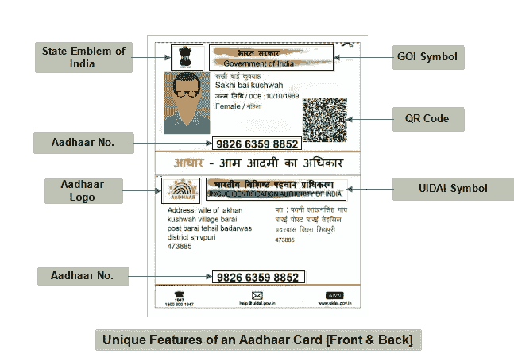
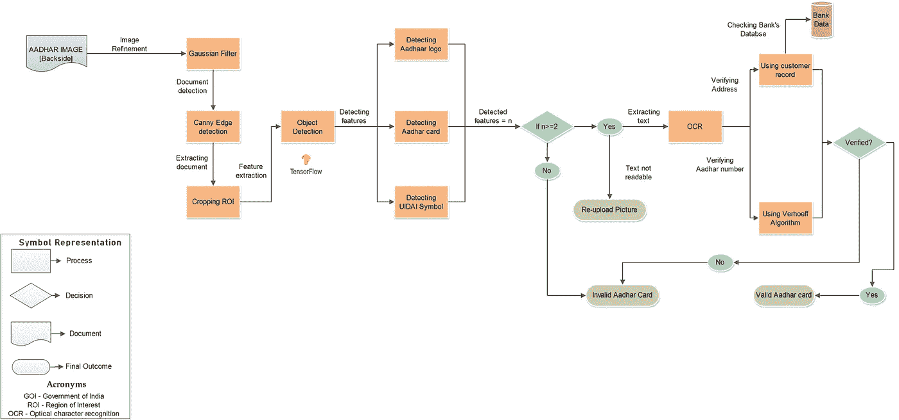
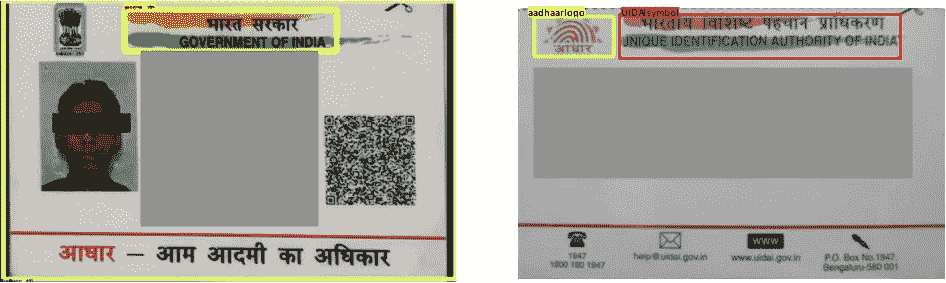

# 使用 AI-OCR 工具从正面和背面验证和提取 Aadhaar 卡信息。

> 原文：<https://medium.com/analytics-vidhya/aadhaar-card-verification-and-information-extraction-from-front-back-side-using-ai-ocr-tool-f048e9ffc685?source=collection_archive---------6----------------------->

在上一篇文章中，我们验证并提取了 Aadhaar 卡正面的文本，现在在本教程中，我们将了解如何验证并提取 Aadhaar 卡背面的有用信息。

> 前一篇文章的链接—

 [## 使用 AI-OCR 和计算机视觉工具对 KYC 的文件进行验证

### AI-OCR 是使用深度学习和计算机视觉创建的工具。这个工具在文档处理过程中很有用…

medium.com](/swlh/document-verification-for-kyc-with-ai-ocr-computer-vision-tool-3485d85d75f6) 

# **aad Haar 卡的重要性**

一张 **Aadhaar 卡**是发给**印度**每个公民的唯一号码，是一个集中的、通用的身份识别号码。Aadhaar 卡是一种生物计量文件，它将个人的详细信息存储在政府数据库中，并迅速成为政府公共福利和公民服务的基础。

因此，在本文中，我们将重点关注 Aadhaar 卡背面的验证和信息提取，因为这也是验证文档的重要步骤。

> 每个文档都有一些独特的功能，使其不同于其他文档。Aadhaar 卡的显著特点是-

1.  印度国徽
2.  GOI 符号
3.  二维码
4.  Aadhaar 标志
5.  UIDAI 符号

识别 Aadhaar 卡的特征

现在，我们已经识别了独特的特征，所以我们的下一步将是训练对象检测模型来识别这些特征并验证它们。关于如何训练一个物体检测算法，我将不再赘述，因为我已经在上一个教程中详细介绍过了，请参考:)

我使用 TensorFlow 2 对象检测 API 进行训练和验证，您可以根据您的需求和权衡使用其他深度学习框架，如 PyTorch、Keras。

## **步骤 1:文件的验证**

对象检测模型将用于验证输入文档是否是有效的 Aadhaar。如果是，我们将进行下一步，否则文档将被声明为无效，过程将结束。

## **步骤 2:使用 OCR 提取数据**

在验证提交的文档是 Aadhaar 之后，将通过光学字符识别(OCR)的方式提取 Aadhaar 上的信息。该信息将主要包含用户的地址，这可以从银行的数据库中得到验证。

> 这是从检测到验证和提取信息的完整算法的流程

流程 Aadhaar AI-OCR &计算机视觉工具

> 现在，我们的 AI-OCR 和计算机视觉工具已经准备好了。让我们看看一些输出。

物体检测算法检测到的 Aadhaar 卡正面(左)和背面(右)的独特特征。

写在文档上的文本信息也从两面提取并保存在. txt 文件中，该文件可进一步用于确认和验证过程。

## 最后结局

这种 AI-OCR 工具对所有金融机构都很有用，因为 KYC 是由印度储备银行(RBI)授权的，尤其是在后 COVID 时代，人们正在尽一切努力减少人与人之间的互动，因此这种工具将解决这两个问题，并帮助金融机构有效地简化整个流程。

## 使用的工具和技术

> [Python](https://www.python.org/)——最适合执行所有 AI 任务的编程语言。
> [谷歌云 OCR](https://cloud.google.com/vision/?utm_source=google&utm_medium=cpc&utm_campaign=japac-IN-all-en-dr-bkwsrmkt-all-all-trial-e-dr-1009137&utm_content=text-ad-none-none-DEV_c-CRE_442449535349-ADGP_Hybrid+%7C+AW+SEM+%7C+BKWS+~+T1+%7C+EXA+%7C+IN+%7C+M:1+%7C+ML+%7C+en+%7C+Vision+%7C+google+cloud+vision-KWID_43700054972142004-kwd-203288730967&userloc_1007805-network_g&utm_term=KW_google%20cloud%20vision&gclid=EAIaIQobChMIjNn96Ib26wIVwtaWCh1yuQTYEAAYASAAEgKDjPD_BwE)——从 Aadhaar 卡中提取文本&验证它。
> [Tensorflow](https://www.tensorflow.org/) —在 Aadhaar 特征上训练我们的 ML 模型。
> [贴标机](https://www.labellerr.com/) —为训练模型的图像添加注释
> [OpenCV](https://opencv.org/) —对图像进行预处理，使其格式适合继续训练步骤。
> [Docker](https://www.docker.com/) —将整个应用容器化，部署在云平台上。

技术栈

# 关于我

我是一个充满激情的程序员，愿意探索自己舒适区之外的杂务；从开发具有挑战性的大型软件到小型周末黑客马拉松。我每天都在攻读 TIET 塔帕信息技术学院的计算机科学工程。
在 [LinkedIn](https://www.linkedin.com/in/shiva-thavani-916177167/) 上联系我