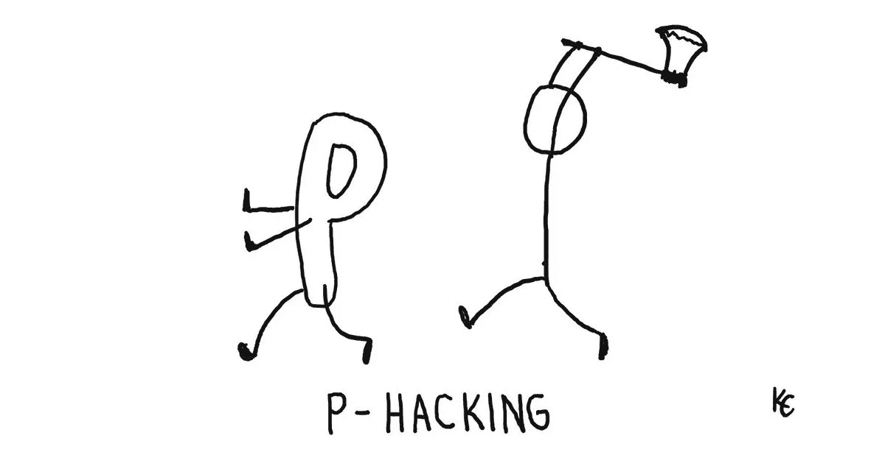
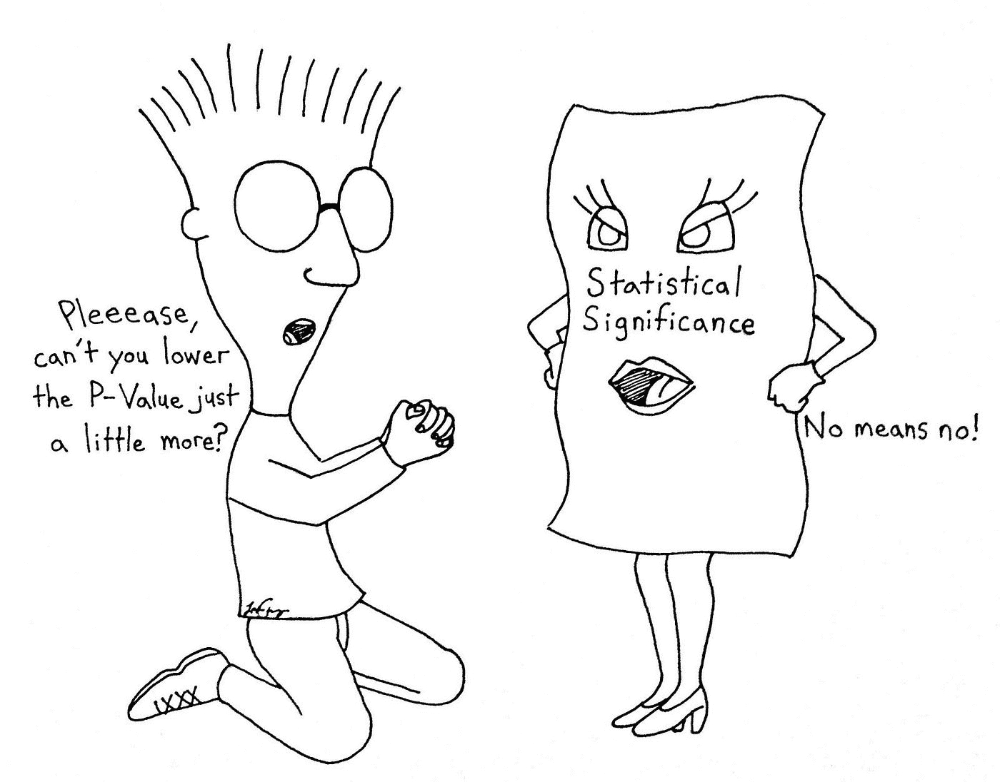
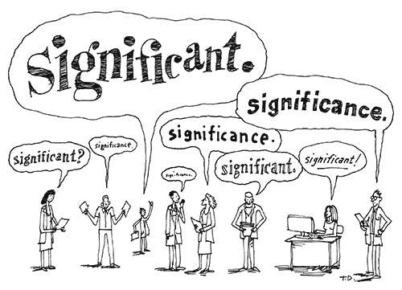

# AB-Testing 实验 p-hacking 被愚弄了整个数据科学团队的 Wolf 先生|了解 p-value 和 p-hacking

> 原文：<https://medium.com/analytics-vidhya/ab-testing-experiment-p-hacked-by-mr-wolf-who-fooled-the-entire-data-science-team-bac19c875aae?source=collection_archive---------12----------------------->

p 黑；图片来源:推特 KC

让我们从过去发生在我身上的一个有趣的案例来理解 p 值和 p 黑。一位曾和我一起工作过的实习生。姑且称他为沃尔夫·古普塔先生(身份隐去)。

# 狼先生做错了什么？

沃尔夫先生黑了一个实验。愚弄了我，团队，和管理层。🦊

# 沃尔夫先生在研究什么？

Wolf 先生正在开发一个推荐引擎数据科学模型，为了证明这是一个改进，他用一个现有的运行模型版本进行了 a-b 测试，该版本的用户数量相等。

在进行了几天(n =天)的实验后，Wolf 先生发现，与旧版本相比，他的新模型的 CTR 提高了 12%(在总数上)。

> 狼先生欢呼庆祝！！！🎊 🎉

# 进行假设检验:双向 T 检验

我请 Wolf 先生证明这不是一个事件的随机发生，请对两个模型版本的每日 CTR 分布进行双向 t 检验。

他发现 **p 值> 0.05** ，即未能拒绝零假设，这意味着两个模型是相同的。

> 沃尔夫先生震惊了😱看到这个结果，🕵️保守了这个秘密🙊。

沃尔夫先生很天真，仅仅通过观察点击率的提高就相信他的模型更好。他认为假设检验技术存在一些问题。

祈祷 p 值小于 0.05

> 向上帝祈祷🙏并对相同的分布进行多次假设检验。p 值持续变化，但仍> 0.05；他不停地祈祷，然后…

最后，他找到了 **p 值< 0.05** 🙌这意味着零假设被拒绝意味着模型是不同的。

## 他欢欣鼓舞，庆祝将测试结果截图，并与团队分享他的新模型是最好的。😎🏆

团队欢呼结果的重要性

> 每个人都意味深长地大喊呜哇！！庆祝实验获得 12%的点击率🎊 🎉

## 等等，但是沃尔夫先生黑了💣实验😂(这是我从他那里学到的，在一个更大的阶段发布和分析度量标准之后)。

永远不要像沃尔夫先生那样，如果有人问他**功效值(正确拒绝零假设的概率)**，他会让自己陷入麻烦。

如果你的实验/模型失败了，这完全没关系。失败是迈向最佳模式版本的垫脚石。一次实验的失败也给予了学习的回报。😊

> "不要因为失败而尴尬，要从中吸取教训，重新开始."—理查德·布兰森

## 我希望你能从这个博客中学到一些新的东西。如果你喜欢，点击👏并分享这篇文章。敬请期待下一期！

如果你觉得这篇文章有用，可以在 LinkedIn 上联系、关注或支持我。

 [## shaurya Uppal——数据科学家| LinkedIn

### 我是一名数据科学家，分享有趣的数据科学学习…

www.linkedin.com](https://www.linkedin.com/in/shaurya-uppal/)