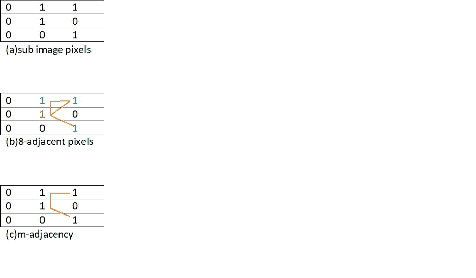

# ABCs..数字图像

> 原文：<https://medium.com/analytics-vidhya/abcs-of-a-digital-image-bffa91199582?source=collection_archive---------6----------------------->

## 描述数字图像处理中一些重要的基本定义。

# 数字图像

数字图像是由 p *个像素*组成的图像，每个像素由与其强度相对应的有限的离散数值表示。数字图像通常被称为光栅或位图图像。

# 像素

像素是数字图像中最小的单个图片元素。每个像素元素位于图像的任意坐标 *(x，y)* 。

下面解释数字图像中像素之间的几种关系。

# 像素的邻居

坐标为 ***(x，y)*** 的一个像素****p**4*(***p***)有 4 个邻居，是距离 ***p*** 单位距离的一组像素。这些像素用 ***(x+1，y)、(x-1，y)、(x，y+1)和(x，y-1)*** 表示。这些被称为水平和垂直邻居。*****

由**N**d(**p**)表示的 p 的对角邻居是一组具有坐标 ***(x+1，y+1)，(x+1，y-1)，(x-1，y+1)和(x-1，y-1)*** 的像素。

# 邻接

如果两个像素 ***p*** 和 ***q*** 相邻并且具有相似的灰度值，则称它们相邻。

设 **V** 是用于定义相邻关系的一组灰度值。在一幅图像中，两个像素 ***p*** 和 ***q*** 具有来自 **V** 的值，如果 q 在集合 N *4* (p)中，则它们是**4-相邻的**。具有来自 **V** 的值的像素 ***p*** 和 *q* 是**8-相邻的**如果 q 在集合 N *8* (p)中。

混合邻接是对 8 邻接的一种改进。具有来自 **V** 的值的两个像素 ***p*** 和 ***q*** 是 **m 相邻的**如果

a) ***q*** 是在 N*4*(***p***)还是

b) ***q*** 在 N*d*(***p***)和

c)集合 n*4*(***p***)^n*4*(***q***)没有其值来自 **V** 的像素。

考虑集合 V={1}。**图 1** 表示一组像素的 8-邻接和 m-邻接。

**图 1**

# 数字通路

从具有坐标 *(x，y)* 的像素 ***p*** 到具有坐标 *(s，t)* 的像素**的数字路径或曲线是具有坐标 *(x0，y0)，(x1，y1)…xn，yn)* 的不同像素序列，其中 *(x0，y0)=(x，y***

**这里 n 称为路径的长度。**

# **连通性**

**设 **S** 表示图像中像素的子集。两个像素 ***p*** 和 ***q*** 被称为 ***连接 **S** 中的*** ，如果它们之间存在完全由 **S** 中的像素组成的路径。对于 **S** 中的任意像素 ***p*** ，与其相连的像素集合称为 **S** 的**连通分量**。如果它只有一个连通分量，那么集合 **S** 称为**连通集合**。**

# **地区**

**设 **R** 是图像中像素的子集。如果 **R** 是连通集，则称 R 是图像的一个区域。**

# **分界线**

**区域 **R** 的边界(边界或轮廓)是该区域中具有一个或多个不在 **R** 中的邻居的像素集合。当区域包括整个图像时，其边界被定义为图像的第一和最后行和列中的像素集合。**

# **边缘**

**边缘由导数值超过预设阈值的像素形成。基于一点处灰度级不连续性的度量来识别边缘。边缘点连接在一起，形成边缘段。有时，这些边段连接在一起并形成边界，但并不总是如此。**

**在接下来的文章中，我们将讨论不同的距离度量。**

# **参考**

**Rafael C.Gonzalez，Ricahard E.Woods 的数字图像处理(皮尔逊教育)**