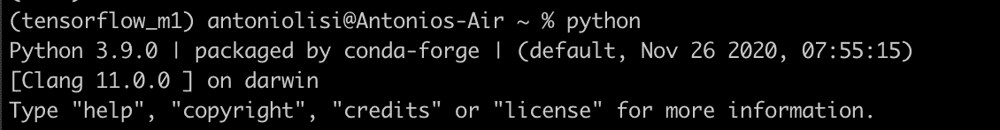
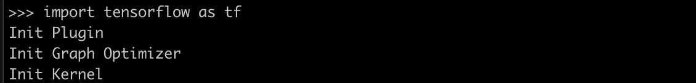
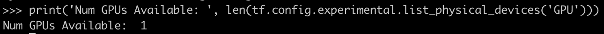
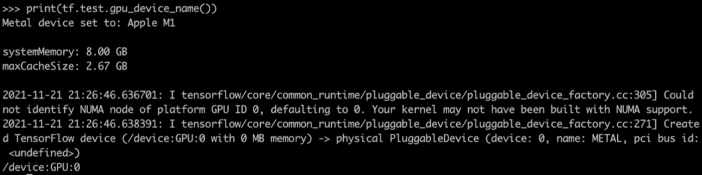

# 使用 M1 芯片加速张量流

> 原文：<https://medium.com/analytics-vidhya/accelerating-tensorflow-using-m1-chip-the-antonai-blog-2a4388e3bd36?source=collection_archive---------4----------------------->

# 安装指南


*作者安东尼奥·利斯*

# 介绍

大家好，欢迎回到另一篇数据科学博文。今天我们将讨论 M1 芯片，以及如何用它来加速张量流。

去年春天，我决定最终购买一台 M1 MacBook air。苹果真的用这台机器做到了。它非常适合日常使用，电池续航时间长，没有风扇噪音，速度惊人。

但我不仅仅是一个临时用户。我想用我的笔记本电脑完成简单的编程任务和数据科学领域的原型制作。

我可以用它做任何事情，但是安装带有 M1 芯片原生支持的 Tensorflow 就不那么简单了。因此，我认为安装指南可能对像我一样想使用 Tensorflow 来开发 M1 GPU 功能的其他人有用。

# 苹果官方指南

你可以在这里找到苹果官方的说明。所以首先我们需要有最新的 macOS 12 测试版。你可以在这里找到加入苹果测试软件程序[的说明](https://beta.apple.com/sp/betaprogram/enroll)。

然后我们需要从[这里](https://github.com/conda-forge/miniforge/releases/latest/download/Miniforge3-MacOSX-arm64.sh)下载并安装 MacOS 的 miniconda。安装完成后，确保将 conda 命令链接到您刚刚下载的命令。

因此，我们将创建一个名为 tensorflow_m1 的虚拟环境:

```
conda create --name tensorflow_m1
```

现在，我们可以激活刚刚创建的环境:

```
conda activate tensorflow_m1
```

在安装新东西和/或开始新项目之前，您应该始终创建一个虚拟环境。这是一个好习惯，万一搞砸了，可以节省你很多时间。

我们现在可以安装 tensorflow 依赖项:

```
​​conda install -c apple tensorflow-deps==2.5.0
```

我们在这里指定版本只是为了避免最新版本的错误/问题。

然后我们为 MacOS 安装 tensorflow 和 tensorflow-metal 插件:

```
python -m pip install tensorflow-macos 
python -m pip install tensorflow-metal
```

这样，我们就按照苹果官方指南做了。以下是我在执行这些步骤时遇到的主要问题:

*   如果在没有版本的情况下使用*conda install-c apple tensorflow-deps*会导致无法导入 tensor flow
*   如果你没有最新的 macOS 测试版，它根本就不能工作
*   即使按照上面的步骤，您也可能得到错误“导入 numpy c-extensions 失败”

解决 numpy 错误。我找到了这个[页面](https://stackoverflow.com/questions/58868528/importing-the-numpy-c-extensions-failed)，里面解释说你可以简单的重装 numpy。所以我只是在终端中键入了以下命令:

```
pip install --upgrade --force-reinstall numpy
```

# 最终检查

你应该可以用 M1 芯片加速张量流。为了确保一切正常，只需在终端(激活环境后)键入 python。您应该得到这样的结果:



现在可以导入 tensorflow 了:



我们可以检查它是否可以使用 GPU:



仅此而已。

我希望该指南对您有用。有任何问题，你可以通过 Linkedin 联系我。

如果你喜欢这篇文章，分享给你的朋友和同事吧！我会在下一篇文章中看到你。与此同时，要小心，保持安全，记住不要成为另一块墙上的砖。

Anton.ai

*原载于 2021 年 11 月 22 日*[*https://antonai . blog*](https://antonai.blog/accelerating-tensorflow-using-m1-chip/)*。*