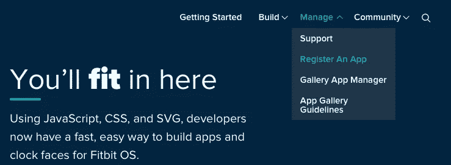
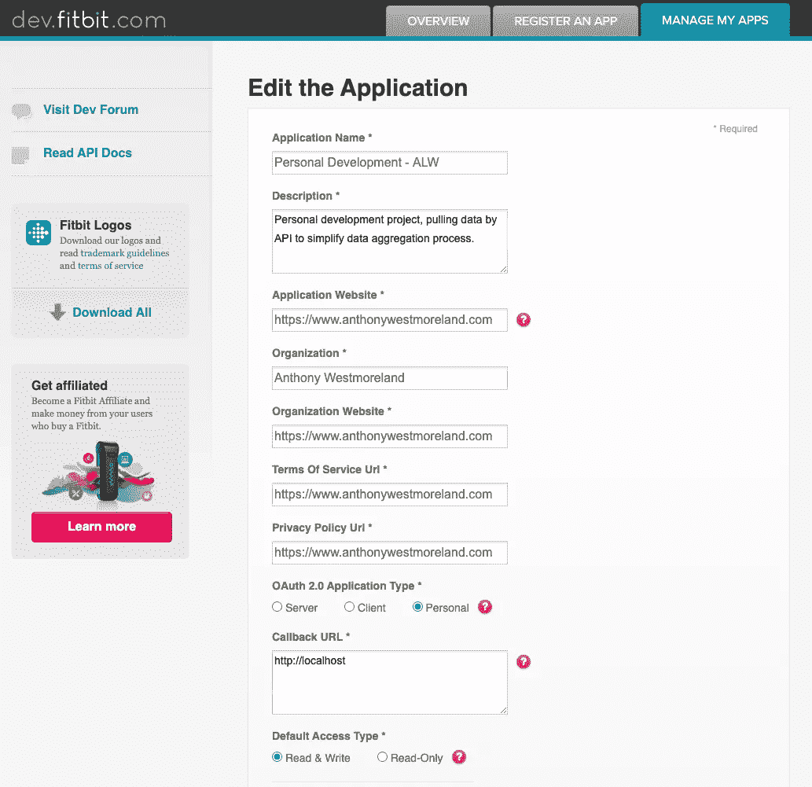
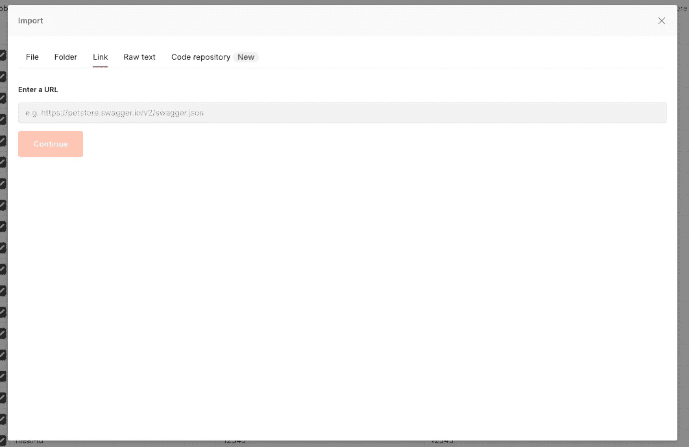
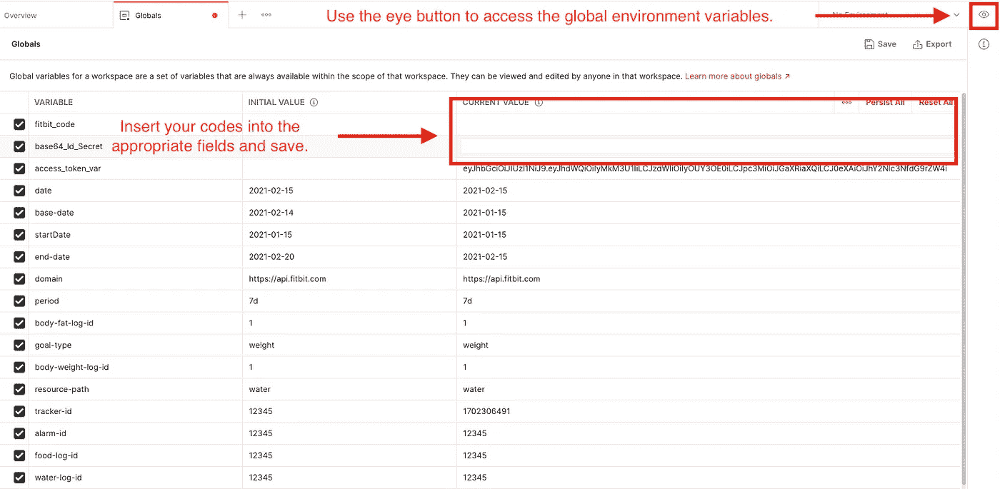
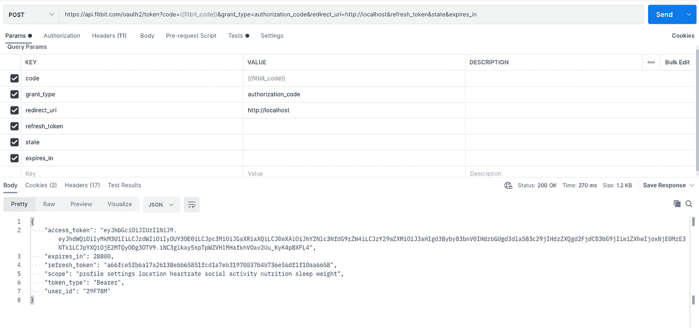

# 通过 Postman 经由 API 访问 Fitbit 数据

> 原文：<https://medium.com/analytics-vidhya/access-fitbit-data-via-api-through-postman-5730e2dc2890?source=collection_archive---------1----------------------->

亚当·伯基特在 [Unsplash](https://unsplash.com/s/photos/fitbit?utm_source=unsplash&utm_medium=referral&utm_content=creditCopyText) 上拍摄的照片

对于那些对通过 API 轻松访问 Fitbit 数据感兴趣的人来说，本指南是为你准备的。为了简单起见，我在 [Postman 中构建了一个集合，这是一个 API 开发的协作平台](https://www.postman.com)。这使得在完成最初的几个步骤后访问您的数据变得非常容易。

## 步骤 1-创建一个 Fitbit 帐户

在[accounts.fitbit.com](http://accounts.fitbit.com)创建一个 Fitbit 账户。

## 步骤 2 —注册占位符应用程序

一旦你创建了你的 Fitbit 账户，登录[dev.fitbit.com](http://dev.fitbit.com)并“注册一个应用”。

将鼠标悬停在“管理”选项卡上，然后单击“注册应用程序”按钮。

**你不需要有一个应用程序**，你可以为需要注册的字段插入虚拟数据，在下面的例子中，我用我的网站[https://www.anthonywestmoreland.com](https://www.anthonywestmoreeland.com)为任何网址字段。**唯一的要求是在“回调 URL”字段中插入“**[**http://localhost**](http://localhost)**”。**

保存您的新应用程序，并**保存您在此步骤中创建的客户端 ID 和密码**。

## 步骤 3 — Base64 编码您的客户端 ID 和密码

Fitbit API 身份验证流程使用基本身份验证来访问您数据。为了简单起见，让我们跳过所有这一切意味着什么，并获得编码的令牌。

使用步骤 2 中的客户机 ID 和客户机密码，用冒号将凭证组合起来；所以最终结果将是 clientId:clientSecret。

> 将凭据与冒号(clientId:clientSecret)结合起来，并使用 base64 编码器来创建您的基本身份验证令牌。

去[https://www.base64encode.org](https://www.base64encode.org)，粘贴你的综合凭证，点击编码按钮。您将需要保留这个 base64 编码的令牌来进行 api 请求。

## 步骤 4-获取您的 Fitbit 代码

Fitbit 认证流程也需要一个代码来访问您的数据。您需要您的客户 ID 来访问此代码。复制以下 URL 并在您看到 INSERT_CLIENT_ID_HERE 的位置插入您的 clientId，然后粘贴到您之前登录 Fitbit 帐户的同一浏览器的地址栏中。

> 【https://www.fitbit.com/oauth2/authorize?response_type=code】&CLIENT _ ID =**INSERT _ CLIENT _ ID _ HERE**redirect _ uri = http://localhost&scope = activity % 20 nutrition % 20 heart rate % 20 location % 20 nutrition % 20 profile % 20 settings % 20 sleep % 20 social % 20 weight

一旦你用你的代码导航到 URL，并按下回车键，它可能会返回“它工作了！”在网页上(Chrome)或者不在网页上(Safari)。你需要的是导航栏中的新网址，应该是这样的: [http://localhost/？code = a 50 BF 0001d 5d 7 af 04 c 0229 c 7052 f 760 a 9 B1 BD 45 # _ = _](http://localhost/?code=a50bf0001d5dd7af04c0229c7052f760a9b1bd45#_=_)。

**你会需要那个在=之后开始，在#之前结束的代码，所以从上面来看，代码是:**[**a 50 BF 0001 D5 DD 7 af 04 c 0229 c 7052 f 760 a 9 B1 BD 45**](http://localhost/?code=a50bf0001d5dd7af04c0229c7052f760a9b1bd45#_=_)**。**

## 步骤 5-使用 Postman 访问您的数据

一旦您有了 base64 编码的凭证*(步骤 3)* 和 Fitbit 代码*(步骤 4)* ，您就可以使用 [Postman](https://www.postman.com) ，一个用于 API 开发的协作平台。

复制下面的链接来导入我的 Postman Fitbit Web API 集合，[在这里你会找到一个通过链接导入集合](https://learning.postman.com/docs/getting-started/importing-and-exporting-data/#converting-postman-collections-from-v1-to-v2)的操作指南。

> [https://www.getpostman.com/collections/e1a89c9ea43d6b280410](https://www.getpostman.com/collections/e1a89c9ea43d6b280410)

一旦你打开了集合，你将需要[设置全局环境变量](https://learning.postman.com/docs/sending-requests/variables/)。**将您的代码插入合适的 fitbit_code 和 base64_Id_Secret 当前值字段并保存。**

**保存好新的全局环境变量后，打开集合底部的“Fitbit 授权码授权流”并按下发送按钮。**响应将是 200 OK，您将在响应正文的 Postman 底部看到“access_token”、“refresh_token”和其他返回的参数。

这个集合自动将 access_token 和 refresh_token 保存到全局环境变量中。完成后，您将能够对不同的 Fitbit API 端点进行后续调用。

*请注意有许多全球环境变量。每个* [*Fitbit API 端点*](https://dev.fitbit.com/build/reference/web-api/explore/) *都有唯一的参数来过滤返回的数据。您可以轻松地更改全局环境变量并保存以正确过滤您的数据。*

最后，默认情况下，access_token 持续 8 小时。如果您的工作时间超过这个时间，您可以返回到“Fitbit 授权码授权流”，在查询参数中将 grant_type 更改为 refresh_token，并在 value 字段中输入{{refresh_token}}以刷新您的访问。

希望这有助于其他人通过 API 访问他们的 Fitbit 数据，而不必拼凑一个解决方案！