# 行动！瘾君子！演员！—分析过去的事件结果

> 原文：<https://medium.com/analytics-vidhya/act-addict-actors-analysing-past-event-results-15c7312b63d?source=collection_archive---------14----------------------->

*哪个事件是 A3 最恐怖的血战！rankers？*

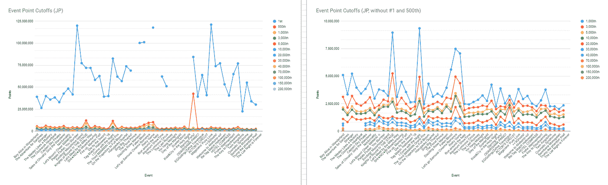

JP 结果图表

你好！这是我的 [A3 的第三部分！x Data](https://ordinarytwilight.medium.com/list/act-addict-actors-d35ff7633ea9) 系列，我们将回到过去，看看 A3 之前的排名结果！EN 和 JP 服务器！如果你不熟悉 A3！游戏，一定要看看这个系列的[序言](https://ordinarytwilight.medium.com/how-i-discovered-what-the-addict-in-act-addict-actors-really-meant-4c5631fced15?sk=6d329b2c35f15da934fd835e675b1409)的快速解释，以及这个系列的[第一部分](/analytics-vidhya/act-addict-actors-information-compilation-and-analysis-81506e70d863?source=friends_link&sk=null)，它通过汇编和分析所有角色的基本信息的不那么令人生畏的任务。同时,[第二部分](https://ordinarytwilight.medium.com/f21a9eba2e97?source=friends_link&sk=225c4fc823c66628edbd84e38cb499ed)深入研究了 A3 的得分机制，试图为团队建设找到最元的角色。这一次，我决定利用以前的事件结果，因为我想看看 JP 趋势是否有助于预测 EN 未来的大屠杀。您可能会注意到，本文假设您对 A3 有点熟悉！人物，但如果你不是[维基](https://yaycupcake.com/a3/index.php?title=Main_Page)总是一个很好的参考！

在我们直接进入数据之前，有几点需要注意:

1.  大部分排名数据来自于 [A3！subreddit](https://www.reddit.com/r/A3ActorsInTraining/wiki/event_borders) ，Yaycupcake Wiki 页面和这个令人惊讶的全面的 fanmade [电子表格](https://docs.google.com/spreadsheets/d/1ieY-501deEaJicZroXo6yWz8ZZ11TjNAY-tZAlt6lLw/edit?usp=sharing)，它作为每小时事件边界预测器和排名数据存档。
2.  制作这些表格相对简单，但是很繁琐，因为我必须从所有独立的事件页面获取数据。之后，简单的制表、格式化和图表绘制有助于分析！请点击查看完整的电子表格[！](https://docs.google.com/spreadsheets/d/10u7yHRtTEzVC8FVRe1_pcAZYaAlmjX8kyJrSR2JP6Vg/view#gid=1484104788)
3.  A3！EN 和 JP 的受欢迎程度相差很大，这可以解释后来的一些发现！作为背景，到目前为止，EN 最繁忙的活动是 1 周年纪念，估计有 17，000 名玩家，而 A3！据估计，JP 是日本同类游戏中第四受欢迎的游戏，最近超过了[750 万次下载](https://www.instagram.com/p/CRGiwIoJkVf/?utm_medium=share_sheet) …请记住，JP 比 en 大 3 岁左右，这种游戏类型在日本更为成熟！
4.  读取原始表:单元格颜色越深，下面原始表中该事件的层截止值越高。

*分析 EN 结果*

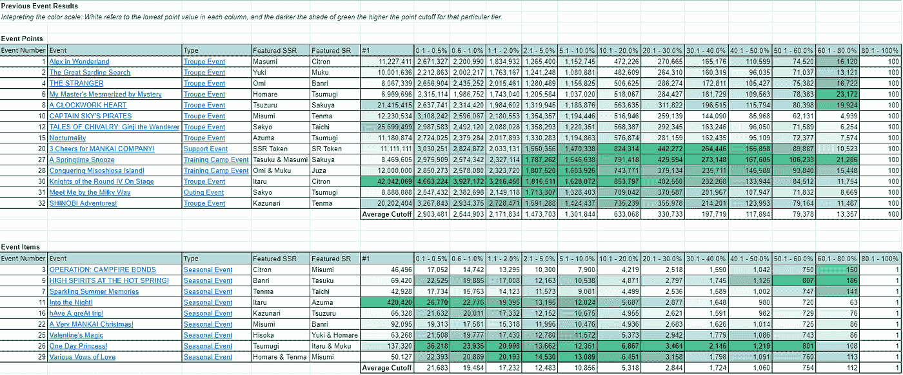

按时间顺序排列的事件。通常，我会在文章中嵌入一个 Github 的表格，但我意识到颜色让趋势识别更容易，所以使用这些截图，或者更好的是，查看完整的电子表格！

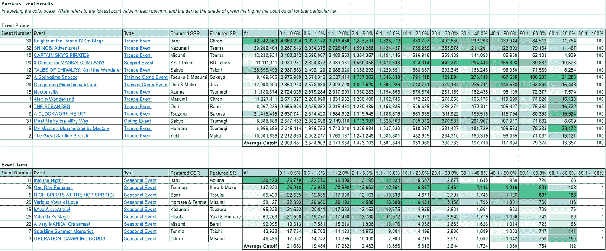

按 T1 性能排序的事件(降序)。向克尼隆致敬…

足够有趣的是，似乎后来的事件更具竞争力(1 周年纪念日起)，除了进入夜晚(因为 Itaru，事件 SSR，是目前为止两个服务器中最受欢迎的角色)。大概是因为当时 A3 还没那么知名吧？按照 T1(前 0.1%-0.5%)的性能进行排序给出了一个相当明显的梯度，这意味着一般来说，如果 T1 很可怕，其余的层可能也很可怕。舞台上的第四轮骑士(粉丝们简称它为 Kniroun)可以被看作是几乎每一个层级的大屠杀，毫无疑问…

我认为 Kniroun 严重扭曲了颜色/平均分数，因为当我更新 Reddit 信息以包括更新的事件时，相当多层级的平均分数跃升了 10 万分。为曼凯公司欢呼竞争也很激烈，但在中档……我猜人们想要 SR token 奖？事件格式可能也夸大了分数截止点，类似于训练营事件(免责声明:我没有开始玩 A3！直到[瓦伦丁的魔法](https://yaycupcake.com/a3/index.php?title=Valentine%27s_Magic_(EN_server))，所以我对更早事件的了解大多来自维基)。[训练营](https://yaycupcake.com/a3/index.php?title=Training_Camp_Events)活动(这些活动让玩家有机会获得一张非常强大的卡片作为高级活动奖励，并且与大多数活动略有不同)往往对较低等级有相当高的截止值，尽管我认为这是因为训练营领导者相当显著的统计数据提升使我们这些普通人在活动期间的生活更容易……T1 的平均表现让我认为这些活动并不疯狂受欢迎，但他们的格式有助于提高截止值。

有趣的是，似乎有一天[公主](https://yaycupcake.com/a3/index.php?title=One_Day_Princess!_(EN_server))是季节性赛事的冠军(就像普通赛事一样，但评分系统是以项目而不是分数来衡量的),从这个意义上来说，它在所有级别上都很有竞争力。我大概可以把它记在 SSR Tsumugi + SR Itaru 的活动卡上……[各种爱的誓言](https://yaycupcake.com/a3/index.php?title=Various_Vows_of_Love)也相当有竞争力，但我想那是因为双 SSR 奖。霍马雷和天马不像伊塔鲁和椿木那么受欢迎，人们可能会为克尼龙存钱，所以这可能就是为什么它没有竞争力。我想知道 Liber 是否改变了机制，使新事件更容易得分，但我没有足够的数据，情人节魔术的低竞争力似乎与这一理论不符(虽然我不是在抱怨，我喜欢那张[西索卡](https://yaycupcake.com/a3/index.php?title=Cards/Hisoka_Mikage/Full_Course_Monopoly))。

我意识到的另一件非常有趣的事情是夜晚有多可怕……硬核顶级，但低于 40%的级别(1 份 [SR 阿兹马](https://yaycupcake.com/a3/index.php?title=Cards/Azuma_Yukishiro/Wait_%27til_it%27s_Dark)的截止)是整体竞争力最弱的一些。到晚上是一个很早的事件，可能有一个较小的玩家群，休闲玩家或非 Itaru 粉丝可能在看到血腥屠杀后决定放弃。rankers 为了得到那张[兔子 Itaru SSR 卡](https://yaycupcake.com/a3/index.php?title=Cards/Itaru_Chigasaki/Once_the_Suit_is_Off)真的不择手段…

如果这些表格很吓人，我希望这些图表能有所帮助:

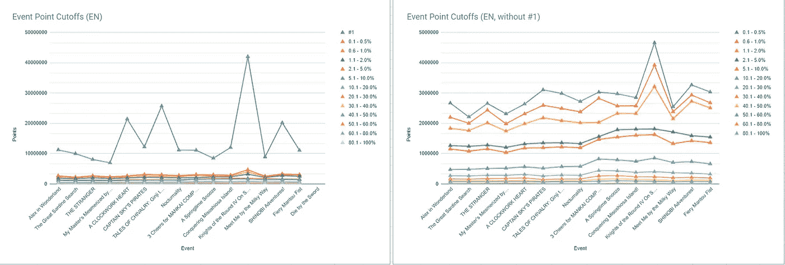

事件点截止图，右图省略了#1，以查看各层之间的差异。

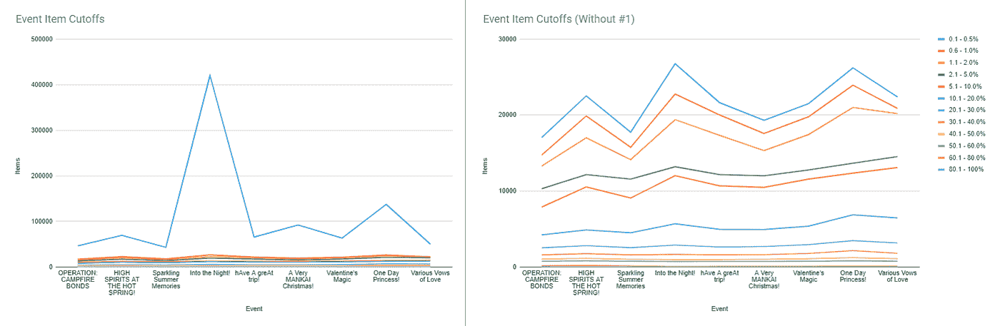

活动项目截止图表，右图省略了#1，以查看不同层级之间的差异。

这些图表向我展示了另一个有趣的趋势，即前 3 层在形状上非常接近，而其他层则相当平坦。#1 玩家自成一个联盟，但一般来说，T3 之后的等级竞争明显较低，即使该事件是一场血战。我猜这就是鲸鱼/rankers 的力量…

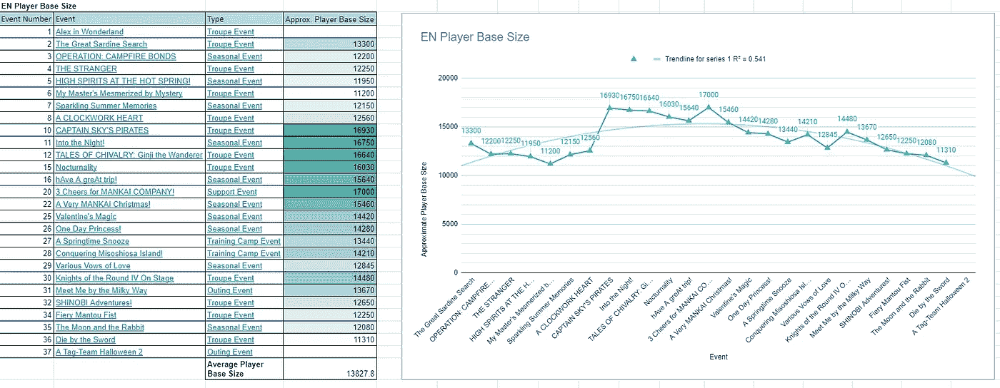

EN 播放器基本尺寸。多项式趋势线似乎对趋势进行了边际建模，但是 0.541 的 R 平方值并不是很高。

在 EN 结果分析中还有一点:出于好奇，我从[小时追踪电子表格](https://docs.google.com/spreadsheets/d/1ieY-501deEaJicZroXo6yWz8ZZ11TjNAY-tZAlt6lLw/edit#gid=994798030)中抓取了每个事件(直到死于剑下)的 EN 玩家基数估计值。如果我没有弄错的话，可以通过计算顶级玩家的数量并乘以该事件的总活跃玩家基数来计算估计值。例如，11 名玩家在[死于剑下](https://yaycupcake.com/a3/index.php?title=Die_by_the_Sword_(EN_server))的前 0.1%中，因此将该数字乘以 100%将得到该事件 11，000 名玩家的粗略估计。电子表格给出的数值是 11，310 名球员，误差幅度为+/- 10 名球员。我意识到 EN 的活跃玩家群自从一周年活动以来一直在萎缩，为曼凯公司欢呼 3。啊哦。

值得注意的是，当 Kniroun 出现时，玩家基数增加了近 2000 名玩家，这可能是因为围绕该事件的大肆宣传，也可能是因为在返回兰斯洛特·伊塔鲁排名之前暂停游戏的粉丝。

以下是我们目前所看到的对恩的总结:[伊塔鲁](https://yaycupcake.com/a3/index.php?title=Cards/Itaru_Chigasaki/Memories_are_in_the_Game)的粉丝太可怕了，祝所有准备为他的赛事分层的人好运…

*对比 EN 和 JP*

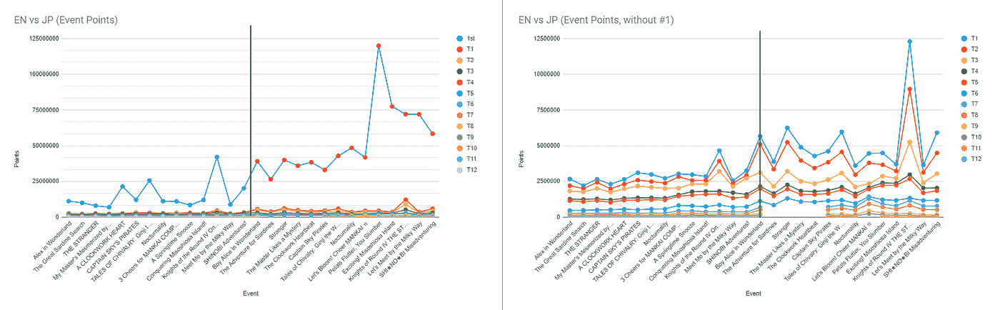

比较事件点。每个图表中间的黑线将 EN 事件(左侧)与 JP 事件(右侧)分开。右边的图表省略了第一名的分数，以便更清楚地看到等级。故事寓意:JP 玩家非常恐怖。

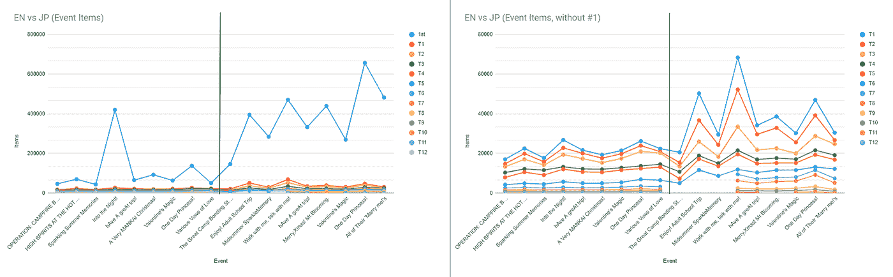

比较事件项目。每个图表中间的黑线将 EN 事件(左侧)与 JP 事件(右侧)分开。右边的图表省略了第一名的分数，以便更清楚地看到等级。

我告诉自己，我不会疯狂到去整理以前所有 JP 赛事的排名数据…但显然我可以欺骗自己，也可以欺骗某个白菜头。对于这一部分，我将比较前一部分的过去 EN 数据和 JP 数据，直到[忍者历险记](https://yaycupcake.com/a3/index.php?title=SHINOBI_Adventures!)，这是我制作电子表格时最近的 EN 事件。从那时起，工作表应该已经更新了新的事件！注意，这里不包括非排名事件，因为我只对排名数据感兴趣。

这是原始数据:

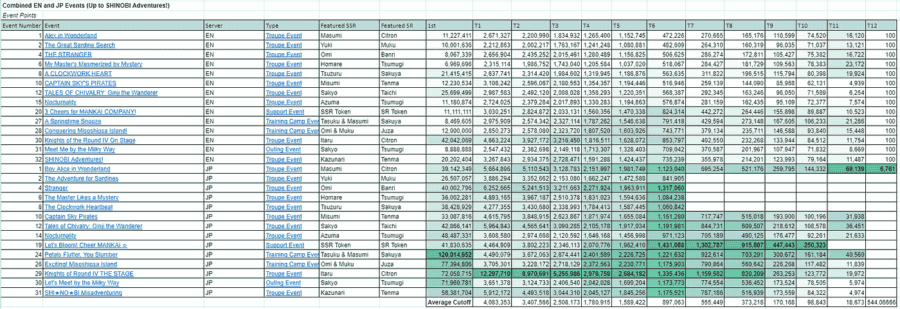

事件点，先按服务器再按事件顺序排序的事件。

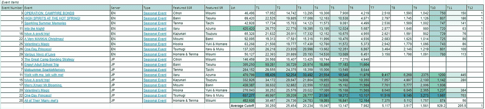

事件项目，先按服务器再按事件顺序排序的事件。

色阶遵循我为 EN 事件所做的相同的条件格式，但是现在颜色考虑了 EN 和 JP 事件。绿色越深，分数越高。我从原始数据和图表中意识到了一些事情:

1.  哇哦。JP 很吓人。颜色基本都集中在 JP 这边……考虑到 A3 明显更高的人气和玩家基数，这是有道理的！JP。
2.  看一下图表，我们可以看到我们在 EN 经历的排名恐怖与 JP 相比根本不算什么。客观地看，EN (Kniroun)上有史以来最高的事件点分数在 JP 第一名分数的*低端*…而 JP Kniroun 基本上脱离了图表。
3.  似乎在 JP 玩 EN 最近的活动(Kniroun 以后)的时候，JP 的顶级排名变得更加疯狂…事实上，在两个服务器上都观察到了活动更加竞争久而久之的趋势。
4.  通过 T1 性能对事件进行排序，我们可以确认图表所暗示的内容:JP 玩家确实完全在另一个联盟，因为跨两个服务器的最具竞争力的事件都发生在 JP。有趣的是，即使以 JP 的标准来看，en Kniroun 也比平均水平更有竞争力，而 JP 大屠杀的事件也是 EN 的大屠杀/非常有竞争力，这表明 EN 和 JP 的粉丝有非常相似的品味。我很确定有人做了一个玩家调查，根据受欢迎程度对所有角色进行排名…我想是[这个](https://www.reddit.com/r/A3ActorsInTraining/comments/h87kri/a3_playerbase_survey_results/)！它发现 EN 真的很喜欢 Itaru，Misumi 和 Tsumugi，这与他们在两个服务器上的活动有多恐怖有关。

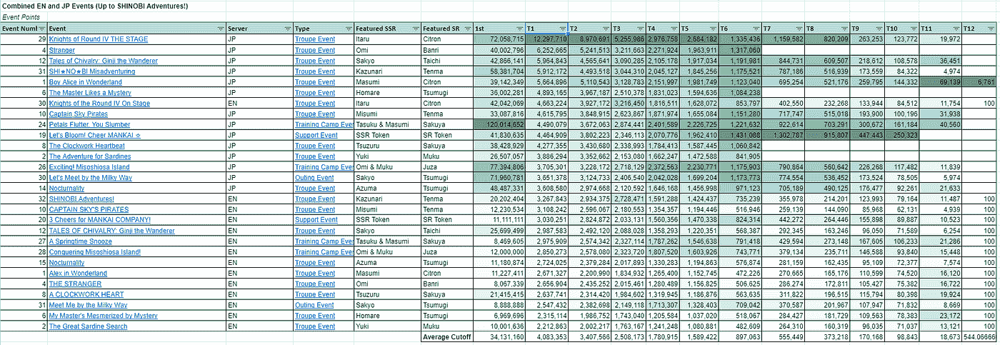

事件点，按 T1 表现排序。

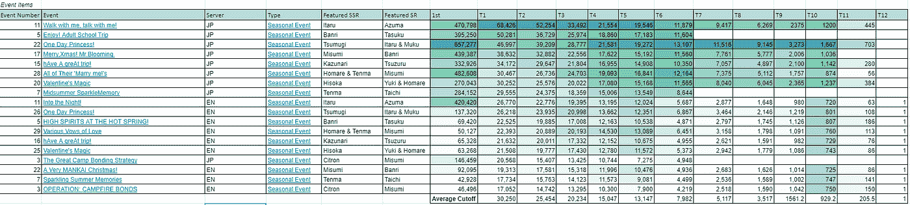

事件项，按 T1 性能排序。

我在比较两个服务器时做的另一件事是获得所有 JP 和所有 en 事件的平均截止值，并将它们进行比较，以了解 JP 到底有多可怕…

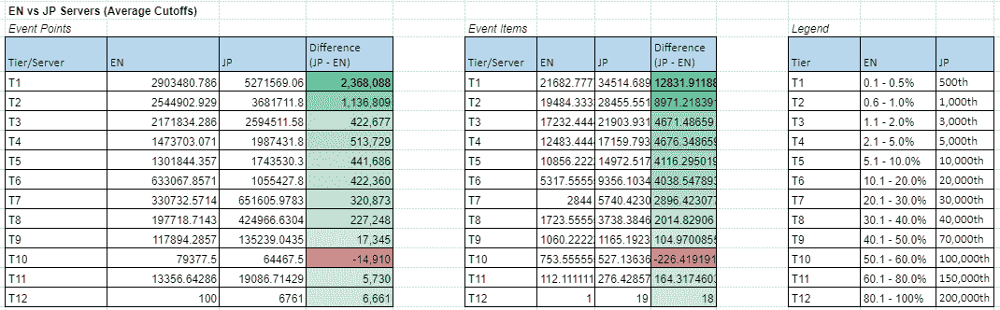

跨服务器平均截止比较。

基本上，JP 几乎在每一层都击败了 EN，除了 T10，它是前 50%-60%，其中 EN 非常非常轻微地击败了 JP。对于更具竞争性的等级，平均截止差异增加，这基本上表明 JP 竞争是可怕的，但休闲 JP 玩家可能能够获得与休闲 EN 玩家类似的奖励。当试图估计未来的 en 临界值时，这种平均点差异可能是有帮助的，但请注意，与 JP 相比，EN 并没有太多的事件，所以像 Into the Night 和 Kniroun 这样的可怕事件会比 JP 夸大 EN 的平均临界值！

本节总结:全体 JP 玩家万岁！

*进入 JP-verse(被警告，JP 剧透从这里开始！)*

事件点，按时间顺序排列的事件。右图省略了#1，以便更清楚地看到其他层。

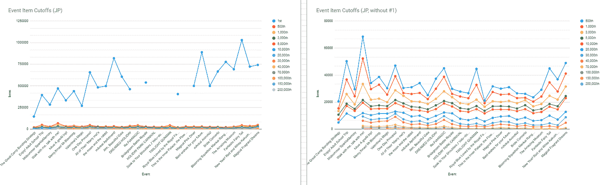

事件项，按时间顺序排列的事件。右图省略了#1，以便更清楚地看到其他层。

这一部分将深入到目前为止在 JP 中发布的所有事件，以及我对未来大屠杀的预测。JP 数据的所有原始数据和图表都可以在[这里](https://docs.google.com/spreadsheets/d/10u7yHRtTEzVC8FVRe1_pcAZYaAlmjX8kyJrSR2JP6Vg/view#gid=1821807117)找到！

首先，我将介绍一下我是如何整理 JP 事件的原始数据的，因为与 EN 的结果不同，我无法找到以前的事件汇编。

第一步:过滤掉所有不排名的事件。

基于我现有的 EN [事件列表](https://docs.google.com/spreadsheets/d/10u7yHRtTEzVC8FVRe1_pcAZYaAlmjX8kyJrSR2JP6Vg/view#gid=488570835)的结构，我制作了一个 JP 事件列表。这非常简单，因为我所要做的就是将 EN 事件的名称/链接改为 JP 事件的名称/链接，并对一些事件进行重新排序，以获得正确的运行顺序，因为 JP 事件的顺序略有不同。接下来，我只是拿出了学习，推广，重新发布和活动事件，因为他们没有排名。

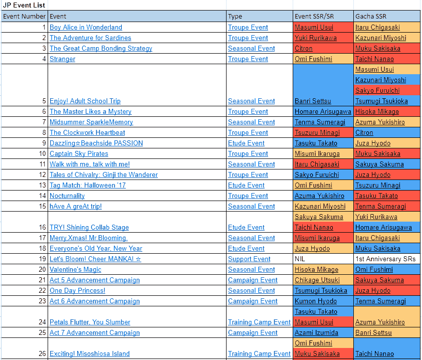

JP 活动列表

第二步:从 Yaycupcake 的维基中搜寻所有结果。

祝福那些为所有数据运行维基的人…在*大量*的复制和粘贴之后，我做了一个类似于我用于第一部分的 EN 数据的表格。同样，使用积分系统的项目与项目系统是分开的，绿色阴影越深，相对于该特定等级中的其他项目的积分就越多。

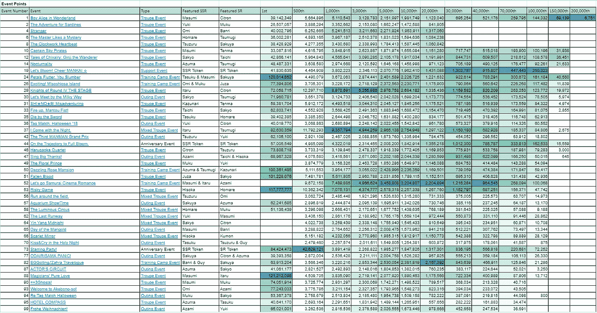

看…整个表格太大了，无法一次截屏，所以请查看电子表格！

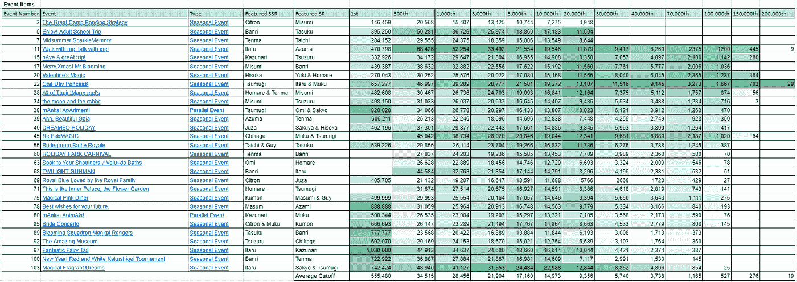

事件项目，按事件顺序排序。

您可能注意到的第一件事是，与 EN 事件数据不同，JP 数据有一些差距…似乎只有早期的事件跟踪底部 2 层，一些事件的最高分数不可用。值得注意的一件有趣的事情是，有第一名数据差距的事件似乎聚集在一起…我想知道后来发生了什么…

你可能注意到的下一件事是 JP 的排名系统与 EN 的有很大不同。JP 使用固定等级作为临界值，而 EN 使用百分比等级。这个图例有助于你转换它们，但是看到两个服务器的等级奖励是一样的，我会说 JP 的百分比有点类似于 EN(尽管可能更小，考虑到 JP 的超级竞争力)。

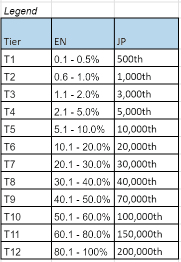

en 和 JP 层之间的转换指南。请注意，到目前为止，EN 估计最多有 20，000 名活跃玩家，因此 JP 的数字实际上是另外一回事。不幸的是，这意味着 EN 中的 T1 真的看起来更像是前 50 的选手。

除非你以前看过活动列表，否则你可能不会注意到的最后一件事是，排名数据包括活动 SRs，而列表不包括…如果你正在寻找更多你最喜欢的角色的卡片，希望这可能有点帮助！

是时候开始分析了…乍一看，我真的看不出事件的长期趋势。EN 显示了较新事件变得更具竞争性的相当强的趋势，但奇怪的是，JP 似乎相反:大屠杀往往发生在很久以前的事件中…当然，大屠杀事件的巨大分界点也摆脱了色标，这使得比较更加困难。这就是这些图表出现的原因:

事件点，按时间顺序排列的事件。右图省略了#1，以便更清楚地看到其他层。

事件项，按时间顺序排列的事件。右图省略了#1，以便更清楚地看到其他层。

看着图表，似乎我的猜测是部分正确的:最近，JP 事件点已经看到#1 排名者的疯狂程度下降，以及大多数等级的疯狂程度略有下降。然而，T2 和以下的分界点一直相当一致，所以我认为可以说 JP 的竞争水平仍然相当一致。另一方面，似乎季节性活动的竞争力可能正在增加……然而，经过仔细观察，我意识到最近的高峰是 Itaru 是 SSR ( [神奇的仙女尾巴](https://yaycupcake.com/a3/index.php?title=Fantastic_Fairy_Tail)和[神奇的芳香之梦](https://yaycupcake.com/a3/index.php?title=Magical_Fragrant_Dreams))的活动，这意味着如果不是因为 Mankai 的常驻游戏上瘾者的力量，下降趋势可能会继续存在……最近发布的[第 11 幕的华丽艺术](https://drive.google.com/drive/folders/1yIXsPfmkmW4WXg5o4kl18jKokPQpUO9C?usp=sharing)可能会重振 JP 的排名热情，所以谁知道呢？

我对 EN 数据所做的一般观察仍然适用于 JP 数据:竞争层级在形状上相互反映，而较低层级波动不大。但是，JP 中的竞争似乎比 EN 跨更多的层，因为镜像效应似乎稍微更明显。另一个观察很简单:每个人都会为 Itaru 而疯狂。

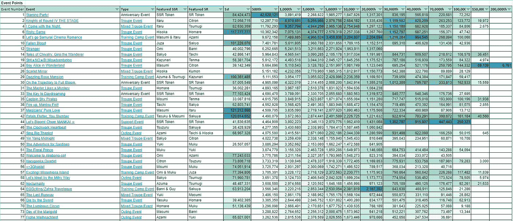

事件点，按 T1 表现排序。

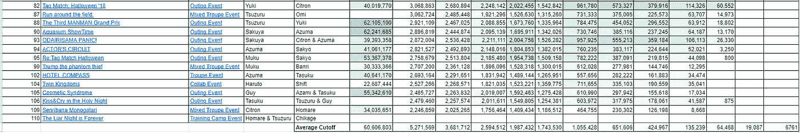

事件点，按 T1 表现排序(其余结果)。

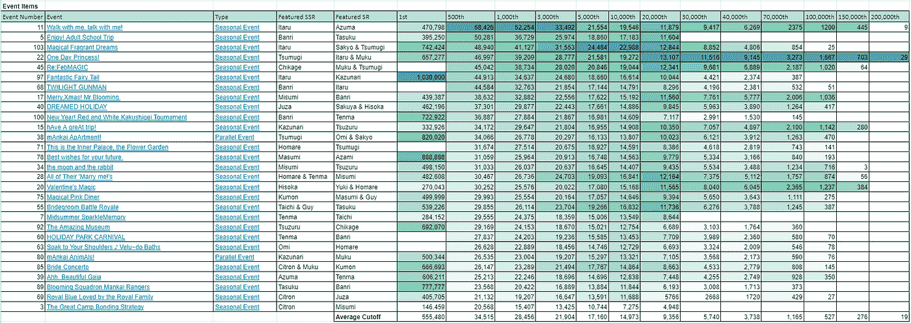

事件项，按 T1 性能排序。

按 T1 性能对事件进行排序显示，如果 T1 很可怕，则其他层也很可能很可怕。一个明显的例外是主演党(三周年纪念活动)，它有一个疯狂的高 T1 截止值，但其他平均截止值为 T2 和以下。看看特色 SSR 人物，我们可以看到 Itaru 基本上拥有榜首，而 Citron 在底部出现了很多。哎哟。奇怪的是，角色在这种排序的事件顺序中出现的顺序似乎呼应了 [A3 EN 玩家基础调查](https://www.reddit.com/r/A3ActorsInTraining/comments/h87kri/a3_playerbase_survey_results/)中的发现……当然，来自两个数据源的玩家基础是不同的，但有趣的是，列表中最末端的角色似乎是匹配的。如果你对这些数据感到好奇，我从 Reddit 帖子中抓取了结果表，并根据 JP 排名进行了排序，请让我知道你是否也看到了相似之处，或者我只是看到了一些东西…

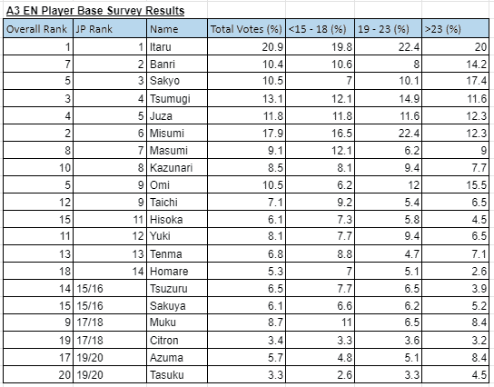

A3！基于投票者年龄的角色受欢迎程度的玩家基础调查结果，按 JP 排名排序。

让我们仔细看看热门事件:

1.  神奇的仙女尾巴的冠军设法得到了超过一百万的事件项目。考虑到平均 T1 截止点是 34，000 点……*如何。*
2.  [Kniroun](https://yaycupcake.com/a3/index.php?title=Knights_of_Round_IV_THE_STAGE) ，[我伴随着黑夜而来](https://yaycupcake.com/a3/index.php?title=I_Come_with_the_Night.)又融入黑夜([与我同行，与我交谈！不出所料，这是最可怕的大屠杀。没想到的是](https://yaycupcake.com/a3/index.php?title=Walk_with_me,_talk_with_me!)[冒险游戏](https://yaycupcake.com/a3/index.php?title=Risky_Game)。[西索](https://yaycupcake.com/a3/index.php?title=Cards/Hisoka_Mikage/Goodnight_to_you)！我真的很困惑，特别是因为西索的其他赛事并不完全是超级竞争……但我猜[猩红镜](https://yaycupcake.com/a3/index.php?title=Scarlet_Mirror)也不差。Gekkagumi 的粉丝们，祝你们好运(尤其是考虑到千影唯一的 SSR 赛事 [RE:FebMAGIC](https://yaycupcake.com/a3/index.php?title=Re:FebMAGIC) 是如何成为竞争最激烈的季节性赛事之一的)…
3.  我意识到的下一件事是:许多最具竞争性的事件发生在下一轮训练营事件中。冒险游戏和[堕落之血](https://yaycupcake.com/a3/index.php?title=Fallen_Blood)将享受完全盛开的 SSR 训练营领导人的季度奖金，特别是冒险游戏将会看到许多人使用完全盛开的 [Masumi](https://yaycupcake.com/a3/index.php?title=Cards/Masumi_Usui/Running_Through_Kyo_no_Machi) 来自[让我们去武士电影浪漫](https://yaycupcake.com/a3/index.php?title=Let%27s_go_Samurai_Cinema_Romance)，因为人们将会在 [SSR Itaru](https://yaycupcake.com/a3/index.php?title=Cards/Itaru_Chigasaki/A_Desire_That_Still_Can%27t_Be_Shaken) 之后。训练营活动非常有用，我向发布这个高风险游戏的疯狂高分的人致敬…
4.  对于季节性活动，似乎 Itaru、Banri 和 Tsumugi 占据了主导地位，像[一日公主](https://yaycupcake.com/a3/index.php?title=One_Day_Princess!)和[暮光之城枪手](https://yaycupcake.com/a3/index.php?title=TWILIGHT_GUNMAN)这样的活动以及 Itaru 活动尤其具有竞争力。

那么…未来的大屠杀？这实际上是一个非常简单的答案:留意任何以 Itaru 为事件 SSR 的事件。EN 的下一个节目是《我与黑夜同在》(第一次混合演出)，如果 JP 是任何迹象表明我们将参加一个可以让 Kniroun 为其资金而战的活动…其他活动将是下一轮训练营活动和周年纪念活动！祝大家一切顺利！

如果你对这个系列感兴趣的话，我的 A3 带来了更多的资源！——诱导精神错乱可以在这里[找到](https://drive.google.com/drive/folders/1sWp3OXWXEHKgWsbfEHtXjcvcBaHXzIgF)！此外，我制作了这篇文章的 Instagram 友好版本，可以在这个 [Instagram 指南](https://www.instagram.com/ordinarytwilight/guide/spreadsheet-nerd-collection/17869938518477930/)以及该系列的其余部分中找到，这是我使电子表格可 Instagram 化的追求的一部分！为了便于参考，下面是一些图片:

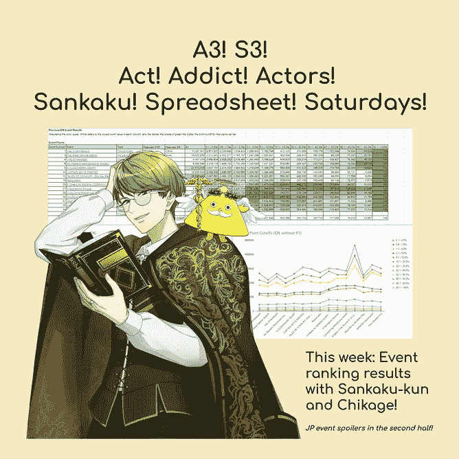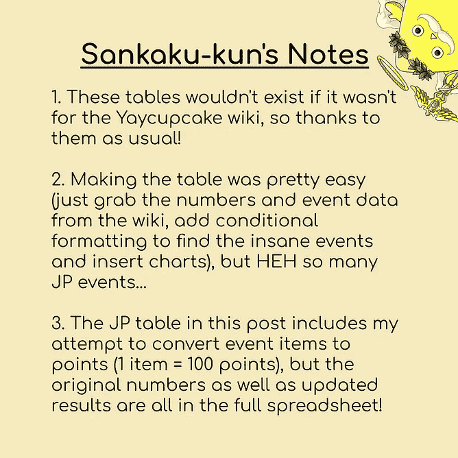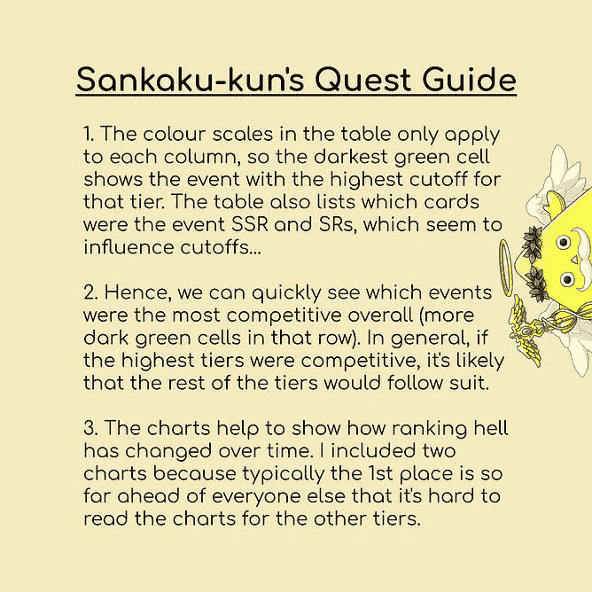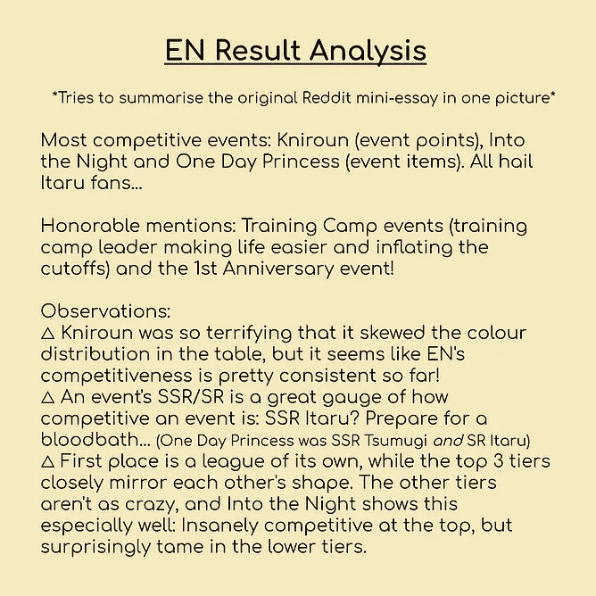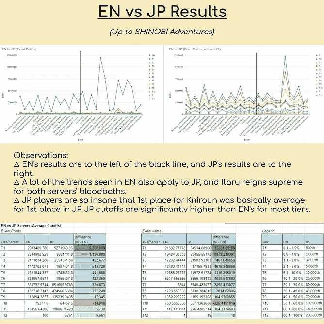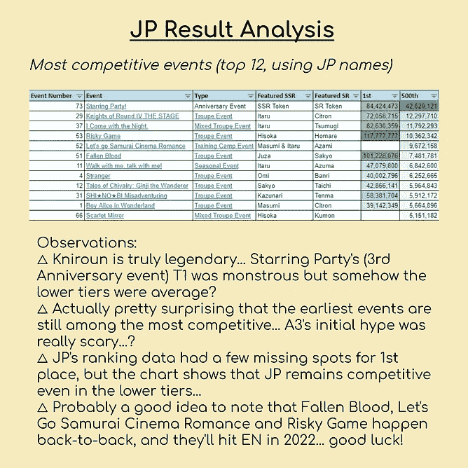

Sankaku 第 6 周！电子表格！星期六！