# 行动！瘾君子！演员！—使用 Tableau 分析 Spotify 歌曲数据

> 原文：<https://medium.com/analytics-vidhya/act-addict-actors-analyzing-spotify-song-data-using-tableau-ed7215917d23?source=collection_archive---------3----------------------->

A3！x Spotify 数据:关于歌曲流行度，Spotify 的 API 数据向我们展示了什么？

Tableau Dashboard 显示歌曲的基本摘要。

我喜欢音乐，Spotify 最近就我循环播放 A3 的歌曲的频率对我进行了点名……哎呀。这让我想到:实际上，Spotify 收集了很多数据，比如关于人们喜欢什么的数据和关于歌曲本身的数据……快速的谷歌搜索让我对 Spotify 的空前热门进行了非常有趣的分析，这启发我制作了一个 A3！-聚焦版！

是的…绝对是在这里被召唤出来的。

在这部分我的 [A3！x Data](https://ordinarytwilight.medium.com/list/act-addict-actors-d35ff7633ea9) 系列，我们将看看我处理 Spotify 的 A3 的尝试！使用 Spotify API 和 Tableau 的歌曲数据。如果你不熟悉 A3！游戏，一定要看看这个系列的[序言](https://ordinarytwilight.medium.com/how-i-discovered-what-the-addict-in-act-addict-actors-really-meant-4c5631fced15?sk=6d329b2c35f15da934fd835e675b1409)的快速解释，以及这个系列的[第一部分](/analytics-vidhya/act-addict-actors-information-compilation-and-analysis-81506e70d863?source=friends_link&sk=null)，它通过汇编和分析所有角色的基本信息。该系列的其他部分涉及团队建设和过去的事件结果等主题，所以如果你对与游戏性直接相关的数据更感兴趣，请查看这些内容！这个故事是 3 x Spotify 数据系列的第一部分，它概述了我在第 0 部分收集的 Spotify 数据: [Spotify 面向非编码人员的 API](https://ordinarytwilight.medium.com/a381db04976b?source=friends_link&sk=50872835d4397f4ca08392f20711c319)！

在我们开始之前，打开 [A3！原始数据的 Spotify 歌曲数据](https://docs.google.com/spreadsheets/d/16U4K2MNY4mI8uzgD9khtoRsp2_L0Dbru36GGx7_AHd0/edit?usp=sharing)电子表格，交互式数据可视化的 [Tableau 工作簿](https://public.tableau.com/app/profile/ordinary.twilight/viz/A3SpotifySongData/AnalysingA3SongsonSpotify)，可能还有 [A3！用于环境的播放列表](https://open.spotify.com/playlist/37i9dQZF1DWTyxueI1JMs3?si=a1d2d6f61b3d45e7)…

*数据收集*

我的分析包括了 4 个 A3 相关的 Spotify 播放列表中的近 300 首歌曲，涵盖了[官方 Spotify 播放列表](https://open.spotify.com/playlist/37i9dQZF1DWTyxueI1JMs3?si=a1d2d6f61b3d45e7)、带有[英文版](https://open.spotify.com/playlist/2QvH4E8NOwWhykQm7Rn8Zd?si=ff5df5ba0f664491)歌名的 Spotify 歌曲(考虑到国际粉丝)、[歌曲乐器](https://open.spotify.com/playlist/6xegzqMnTcMvL8sBiLNgCL?si=c1ef03333da54ed2)，以及 A3 的舞台改编[曼凯舞台](http://www.mankai-stage.jp/)的[音乐](https://open.spotify.com/playlist/5CzFv4E62VVebUBAqBXMqA?si=084c149eac984101)。数据收集于 2021 年 7 月，以下是播放列表:

A3！来自 Spotify 的歌曲

A3！器乐歌曲

曼凯舞台歌曲

A3！有英文标题的歌曲

有趣的是，这个阶段并没有我预期的那么长…首先，我在 Spotify 歌曲的一个 [Kaggle 数据集](https://www.kaggle.com/yamaerenay/spotify-dataset-19212020-160k-tracks)中搜索 A3！歌曲，希望我不必自己提取歌曲数据。不幸的是，只有艺术家的数据是可用的，因为数据集覆盖了 100 多万艺术家，但只有大约 60 万首歌曲。然而，这个数据集非常有趣，我可能有一天会重访它！

 [## Spotify 数据集 1922-2021，约 60 万首曲目

### 1922 年至 2021 年间发行的约 60 万首歌曲的音频特征

www.kaggle.com](https://www.kaggle.com/yamaerenay/spotify-dataset-19212020-160k-tracks) 

数据集还显示 A3！出于某种原因，被认为是 Spotify 流派，这使得搜索艺术家变得更加简单。在过滤了“A3”类型之后，我设法从庞大的数据集中提取了这个表格。

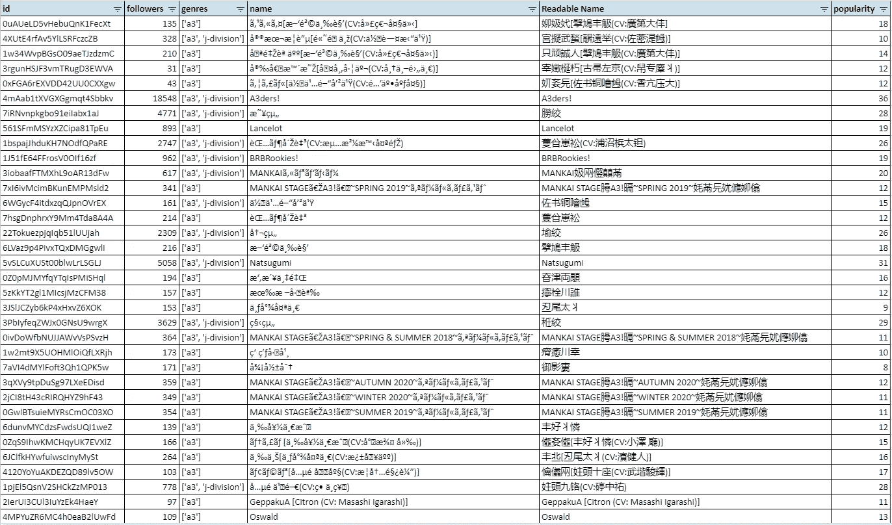

来自 Kaggle 的艺术家数据。

该表显示了每位艺术家独特的 Spotify ID、关注者、流派、受欢迎程度和姓名。我通过将原始的 Unicode 文本转换成日语字符来创建可读的名称字段。

接下来，我尝试了几个网站，这些网站都有 Spotify 播放列表分析器，并根据它们自动生成图表，效果非常好。然而，一些数据仍然丢失，所以最后我使用 Spotify 的 API 获得尽可能多的原始歌曲数据。API 以 JSON 格式返回数据，我使用在线转换器将数据转换成电子表格。最后，我清理了数据，只包含了 [A3 中的相关变量！Spotify Data (Combined)](https://docs.google.com/spreadsheets/d/16U4K2MNY4mI8uzgD9khtoRsp2_L0Dbru36GGx7_AHd0/view#gid=144930822) 工作表，并从该表中制作图表(由于它们相当大，请缩小)。关于我如何不用写一行代码就使用 Spotify 的 API 的更多细节，请查看我的指南 [Spotify 的非编码人员 API](https://ordinarytwilight.medium.com/a381db04976b?source=friends_link&sk=50872835d4397f4ca08392f20711c319)！

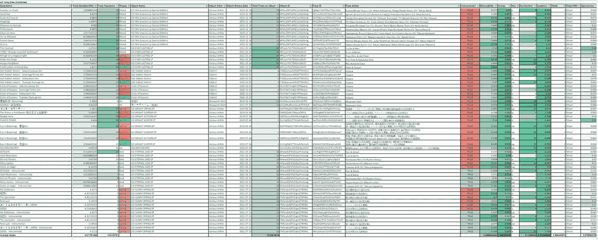

如果您打开完整的电子表格，这看起来就没那么可怕了…

*用 Tableau 实现数据可视化*

在我们进入组合数据之前，让我们看一下我从 Kaggle 数据集得到的东西，它主要包含 A3 艺术家数据。请注意，该数据集不包括 2021 年发布的歌曲，而 Spotify API 的综合数据包括了这些歌曲。

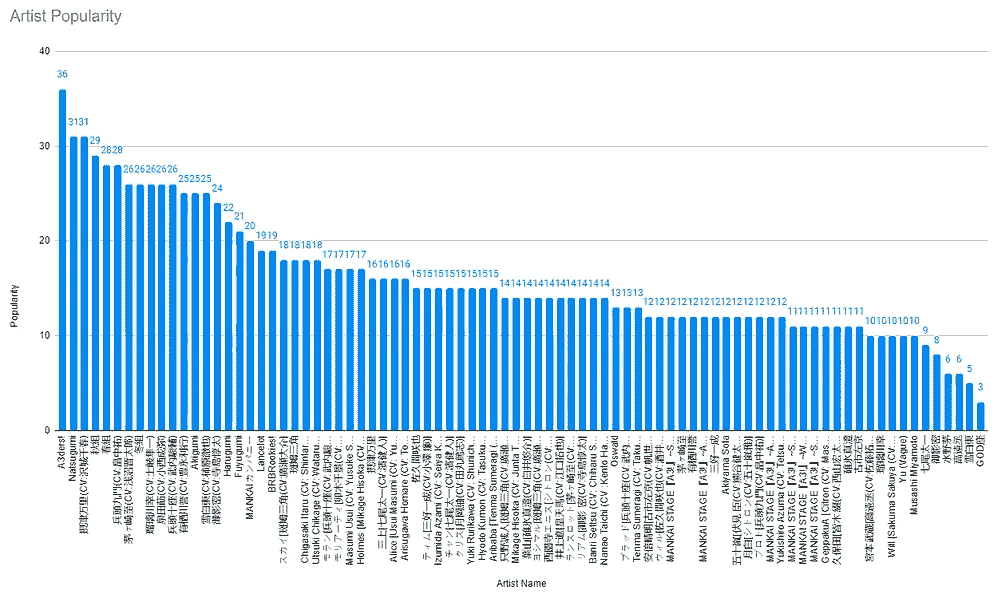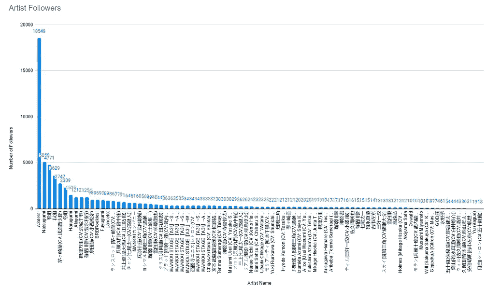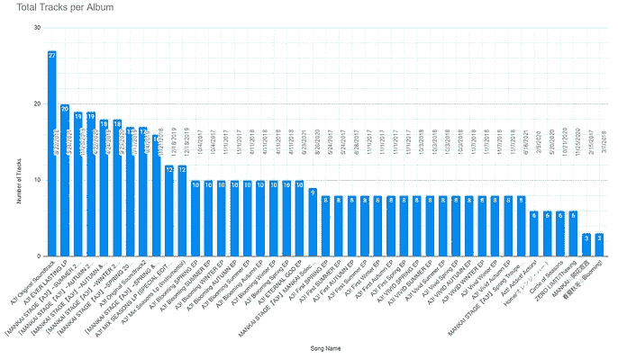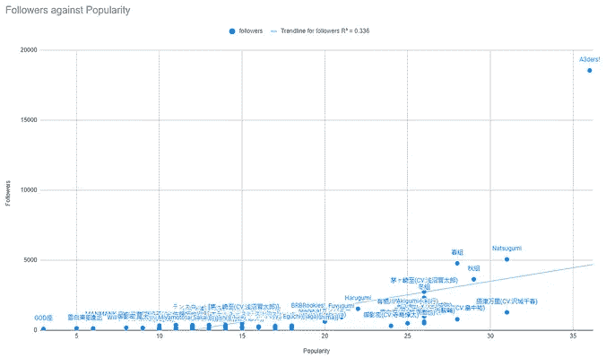

点击查看完整图表！

让艺术家分析变得非常困难的一点是，A3 的 Spotify 艺术家通常是基于个人角色或他们在歌曲中扮演的角色，这导致了一个非常长的艺术家列表。A3 歌手立即脱颖而出成为最受欢迎的歌手，可能是因为他们的歌曲是游戏和动漫的主题曲，因此是整个系列中最受认可的(任何 A3！范应该很熟悉“ *Yume o ippai sakaseyou，Kimi to pappattopato PATTO☆MANKAI！”…)* 根据 Kaggle 数据集，[夏日剧团](https://open.spotify.com/artist/5vSLCuXUSt00blwLrLSGLJ?si=e0cfa3f17d484077)是下一个最受欢迎的 A3！Spotify 艺术家，其次是 [Banri Settsu](https://open.spotify.com/playlist/1s4iox64jAc04WFTgoXO3v?si=814c24fa4a4247f3) ，我猜这使“超级超级简单模式”A3 先生成为受欢迎的独奏艺术家。然而，就追随者而言，Mankai 的首席玩家 Itaru Chigasaki 获得了最多追随者独唱艺术家的桂冠，而 A3ders 则保持了总冠。考虑到 Itaru 赛事的排名有多恐怖，我真的对关注者的数量并不感到惊讶。其他三个图表只是跟踪专辑发行日期，跟踪计数，并显示在一般情况下，追随者的数量并不真正与 A3 相关！艺术家的受欢迎程度(R 平方值为 0.336，仅对于更受欢迎的艺术家观察到轻微的相关性)。A3！原声专辑收集了所有游戏中的音乐，这解释了为什么它有更多的曲目。

如果你一直在关注这一系列的故事，你会意识到我混合使用了 Google Sheets 的本地图表和表格。然而，大多数时候我使用 Tableau 只是为了更美观，尽管谷歌的图表非常好用。然而，Spotify 数据集比我使用过的任何其他 A3 数据集都大得多，值得注意的是，这是我在这个项目中第一次深入研究不是我自己编译的数据(谢天谢地)。为了回答我为什么在 Spotify 项目中默认使用 Tableau，下面是我试图用谷歌制作图表时发生的事情:

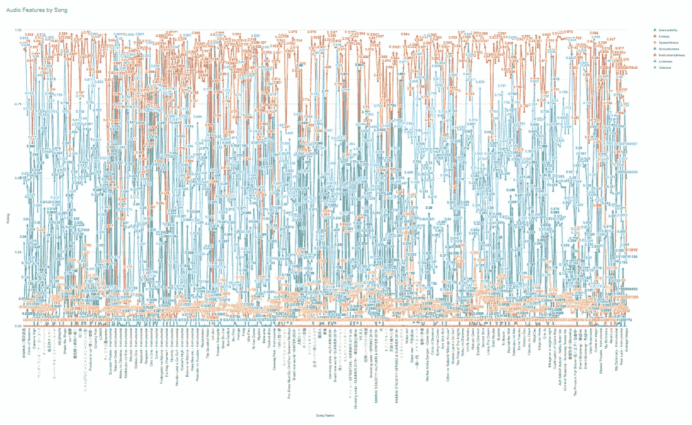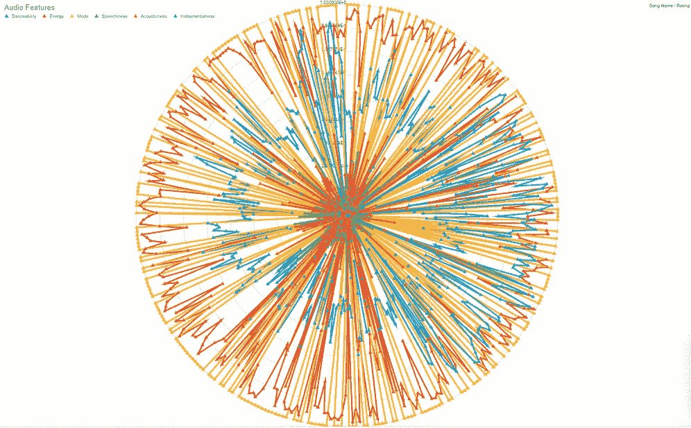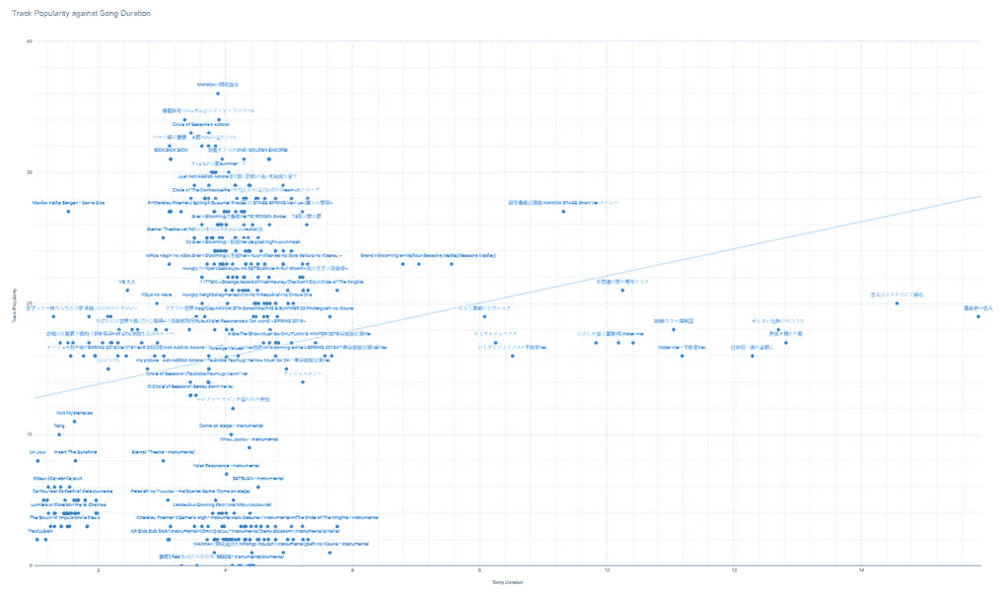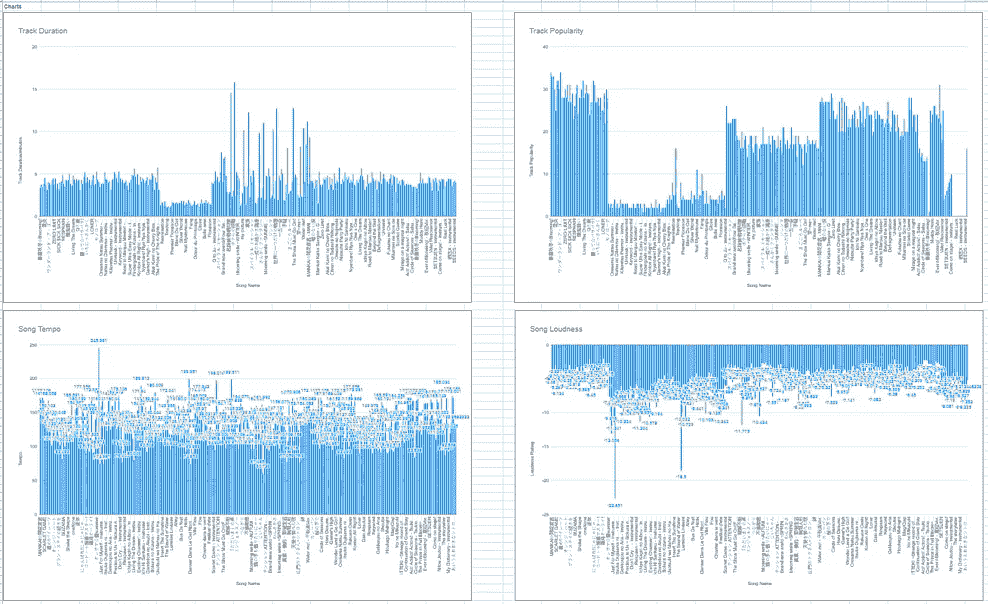

意大利面条图…

…那太乱了。再加上用 Google Sheets 设置每个图表的数据范围真的很麻烦，我决定用 Tableau 来创建我的可视化。这是您在本文开头看到的仪表板:

Tableau Dashboard 显示歌曲的基本摘要。访问工作簿，浏览图表！

这个仪表板按照通用的标准对播放列表中的所有歌曲进行分组，比如剧团、日期、模式(大调/小调)和歌曲流行度，这是我最感兴趣的。我们可以看到，到目前为止，春天剧团的歌曲最多，但这主要是因为数据集是在 [A3 之后不久收集的！阳春 EP](https://open.spotify.com/album/7MSradvQRYj5JgmZ78h96e?si=7f967abcdd4b4586) 上映，在其他团的 EP 上映之前。此外，由于剧团数量包括每个剧团成员的独唱歌曲，自然春天剧团有更多的歌曲，因为咲夜确实唱了一些额外的歌曲(例如[独白](https://open.spotify.com/track/37yUMR4J1Hz3JafJILbhcV?si=aecd35ffa75b4b96))作为 A3 的“主角”和特许经营的切入点。其他三个剧团有相对相似的唱片规模，而其他团体如混合剧团歌曲和[神扎的](https://open.spotify.com/album/4HwwdQF45zb2qcHnxLicag?si=1b97d06368904ca2)歌曲完成了名单。“所有歌曲”和“A3！音乐排行榜主要作为数据集中所有歌曲的目录。交互式标签只在 [Tableau 工作簿](https://public.tableau.com/app/profile/ordinary.twilight/viz/A3SpotifySongData/AnalysingA3SongsonSpotify)中有效，所以我希望你现在已经打开了它！自 2017 年游戏在日本发布以来，A3 一直在 Spotify 上稳步发布歌曲，专辑/EP 发布通常遵循标准的“春夏秋冬”顺序。(*Kimi to mata haru natsu aki Fuyu peeji o meku Tara—*“对，对不起。有点忘乎所以了……)

仪表板没有显示“按模式按键”图表的彩色图例，因此请注意蓝色=主要按键，橙色=次要按键！我们可以看到 A3 的很多歌曲都是 G 大调，这其实和 [Spotify 一般最常见的调](https://www.digitaltrends.com/music/whats-the-most-popular-music-key-spotify)非常契合！有趣的是，Spotify 上第二流行的键是 c 大调，但它只是 A3 唱片目录中第五常见的键。在这一点上，我可能应该指出，我绝对没有音乐理论方面的经验，所以我最多能评论的是，大调总体上听起来更快乐，这符合 A3 的大部分快乐的故事。我注意到的另一件有趣的事情是，根据 Spotify 的说法，一首歌曲的器乐版本和录音室版本可能不会有相同的音调。例如，SCARLET GAME 的器乐被归类为 D♯大调，而人声版本则是 G♯小调…

“按剧团划分的基调”图表是相同的数据，根据剧团进行着色，注意到每个剧团偏爱不同的基调是很酷的！例如，你会在 A#中发现很多冬剧团的歌曲，但几乎没有任何秋剧团的歌曲，F#则相反。这可能有助于加强每个剧团的独特形象，冬剧团和秋剧团之间的对比实际上是有道理的，因为冬剧团的成员大多是“冷静和成熟”的成年人，而秋剧团的成员是…非常有竞争力的前罪犯(曼凯的如此多样化，令人惊叹！).你会在 A 调或 B 调中发现更多的春剧团歌曲，而夏剧团似乎在这些调之间有相当均匀的分布。我所知道的是，春天的歌曲很有可能引发温暖而模糊的家庭情感，而夏天的歌曲将“通过屋顶提升共鸣”，正如 Kazunari 所说。(我想，我不太会说石田和彦语。)

“歌曲受欢迎程度”图表是 Spotify 对每首歌曲受欢迎程度的排名。根据 Spotify 和 Spotify 流行度分析，歌曲流行度在很大程度上取决于歌曲被播放的次数，以及它们最近被播放的时间，这可以更准确地捕捉当前的流行趋势。A3ders 有相当多的歌曲以 36 的受欢迎程度高居榜首，这与写作时 Spotify 上最受欢迎的歌曲之一([艾德·希兰](https://open.spotify.com/track/6PQ88X9TkUIAUIZJHW2upE?si=0c02543185fc4662)的《坏习惯》)的 97 的受欢迎程度相比相形见绌。公平地说，A3 是日本同类游戏中最受欢迎的游戏之一，但国际服务器每个事件平均只有 13，700 名[活跃玩家](https://docs.google.com/spreadsheets/d/1ieY-501deEaJicZroXo6yWz8ZZ11TjNAY-tZAlt6lLw/edit#gid=1354580104)。查看图表，我们可以看到围绕一位数流行水平和 20 多的水平的两个不同的集群，它们代表歌曲的乐器版本和普通版本。有道理的是，器乐的受欢迎程度远远低于有自己最喜欢的角色声音的版本…此外，大部分受欢迎程度为 17 的歌曲似乎来自于 A3 的曼凯舞台剧改编！剧团分布似乎相当均匀，流行度水平为 0 的春天剧团歌曲的数量不寻常，这是因为阳光明媚的春天歌曲在 2021 年 7 月制作图表时才几天。下表显示了截至 2021 年 9 月的最新赛道流行度:

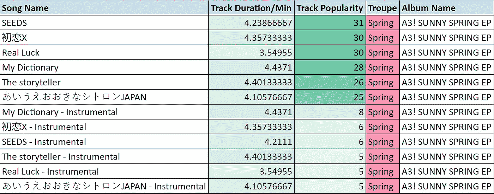

按曲目受欢迎程度排序

这可能是因为歌曲的新颖而提高了人气，但令人印象深刻的是,[种子](https://open.spotify.com/track/6vrucKEjf6fvdJIZ5b8u13?si=203b2916500c432b)的人气与秋日剧团的许多歌曲不相上下！EP 的歌曲受欢迎程度也在一定程度上表明了每个角色的受欢迎程度:千影、Masumi 和 Itaru 唱了排行榜上的前 3 首歌曲，他们是 A3 中最受欢迎的角色。与此同时， [Citron 的](https://open.spotify.com/track/3Mzg4MSRHrzy985RA5lVyp?si=af17c894b63c4a42)相对较低的受欢迎程度不幸地在这种意义上也继续存在…此外，相对于数据集的其余部分，细胞的颜色强度随着数量的增加而增加，这进一步强调了录音室歌曲和器乐歌曲之间的受欢迎程度差异。

当我们谈到受欢迎的话题时，下面的两张图片形成了我对 A3 的角色受欢迎程度在英文服务器的第一年是如何变化的快速分析。左图显示的是来自于[爱沐黑脸田鸡人气调查](https://www.youtube.com/watch?v=uvuT47FqsR0)A3 时的原始数据！in 2019 年上映 [2020 A3！EN Player Base Reddit 调查](https://www.reddit.com/r/A3ActorsInTraining/comments/h87kri/a3_playerbase_survey_results/)，由一个粉丝进行，收集了 704 个回复。

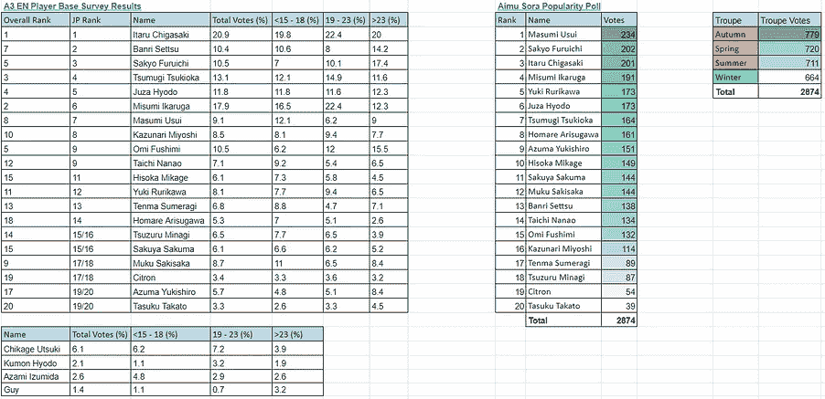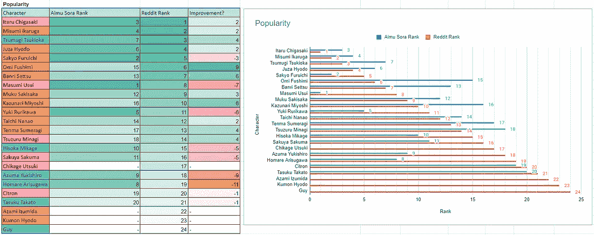

A3 的空头分析！2019–2020 年 EN 人物人气。

我们可以看到角色的受欢迎程度是如何随着时间的推移而变化的(尽管每次民意调查的人群之间可能会有差异)，我们可以预计角色和歌曲的受欢迎程度将随着时间的推移而继续变化(除了 Itaru，他可能不会很快放弃他的桂冠)！例如，我预计千影的受欢迎程度现在会高得多，考虑到 en 服务器已经知道他的角色将近一年，并考虑到他的种子的受欢迎程度有多高。他的第一首独唱《T4》也获得了高于平均水平的 27 分的人气。与此同时，被低估的角色如香橼和 Tasuku 仍然需要更多的爱…尽管应该注意到香橼的歌曲可能有点后天习得的味道，略带孩子气的感觉和非常屠杀的日本人。(亲爱的李柏，请让他有一天好好唱首独唱歌曲，就像他为[Yoi no Mikazuki](https://open.spotify.com/track/2vMWoK34XkfemDUEVmLKRv?si=449da6e4eb104d0f)……)

*分析 A3 的 Spotify 音频功能*

Spotify 在 API 数据中包含了许多歌曲指标，如拍号、持续时间、速度和一些被称为“音频特征”的奇怪测量。我找到了一篇[文章](/@boplantinga/what-do-spotifys-audio-features-tell-us-about-this-year-s-eurovision-song-contest-66ad188e112a)，它分析了欧洲电视网的歌曲*(是时候推动我的欧洲电视网议程了)*，并包含了一些关于这些指标衡量的描述。同时，这是我从 Spotify 上找到的(你可能会从原始数据电子表格的[介绍页](https://docs.google.com/spreadsheets/d/16U4K2MNY4mI8uzgD9khtoRsp2_L0Dbru36GGx7_AHd0/edit#gid=0)中认出这个解释，如果你不知道，就去看看):

1.  可跳舞性:描述一首曲目在音乐元素组合的基础上适合跳舞的程度，包括速度、节奏稳定性、节拍强度和整体规律性。
2.  配价:描述一首曲目所传达的音乐积极性。高价曲目听起来更积极(例如，快乐、愉快、欣快)，而低价曲目听起来更消极(例如，悲伤、沮丧、愤怒)。
3.  能量:代表强度和活动的感知度量。通常，高能轨道感觉起来很快，很响，很嘈杂。例如，死亡金属具有高能量，而巴赫前奏曲在音阶上得分较低。
4.  速度:轨道的整体估计速度，单位为每分钟节拍数(BPM)。在音乐术语中，速度是给定作品的速度或节奏，直接来源于平均节拍持续时间。
5.  响度:轨道的整体响度，以分贝(dB)为单位。响度值是整个轨道的平均值，可用于比较轨道的相对响度。
6.  语速:这可以检测音轨中是否存在口语单词。越是类似语音的录音(例如脱口秀、有声读物、诗歌)，属性值就越接近 1.0。
7.  乐器性:预测音轨是否不包含人声。“Ooh”和“aah”在这种情况下被视为乐器。Rap 或口语词轨道明显是“有声的”。
8.  活跃度:检测录音中是否有观众。较高的活跃度值表示音轨被现场执行的概率增加。
9.  声音:一种置信度，从 0.0 到 1.0，表示音轨是否是声音的。
10.  Key:估计的音轨的整体 key。整数使用标准音高分类符号映射到音高。例如，0 = C，1 = C♯/D♭，2 = D，等等。
11.  调式:表示音轨的调式(大调或小调)，音阶的类型，其旋律内容来源于此。大调用 1 表示，小调用 0 表示。(我把它们转换成更易读的字母标度，例如 A♯大调。)
12.  持续时间:音轨的持续时间，以毫秒为单位。
13.  拍号:估计的轨道整体拍号。拍号(拍子)是一种符号约定，用于指定每个小节(或小节)中有多少拍。

每个变量衡量的简短形式:

1.  情绪:可跳性、效价、能量、节奏
2.  特性:响度、语音、乐器性
3.  语境:活性，声音
4.  片段、状态、小节、节拍、音高、音色等等(我不会用到这些，因为我的重点是比较歌曲而不是分析单首歌曲。)

既然我们已经解决了复杂的解释，让我们看看结果吧！

音频特征数据概要

1.  *按指标平均:*此图表试图通过将每个指标的团队平均值与其他指标进行比较(从 0 到 1 进行测量，1 为该指标的最高值)来获得每个团队特有声音的总体感觉(例如，秋季团队有许多摇滚歌曲)。总的来说，数据库中的大多数歌曲都不是器乐(有道理，因为器乐歌曲占了不到一半的曲目)，原声或“演讲”(也有道理，A3 没有很多说唱)。Spotify 上的 A3 曲目大多是录音室版本，这也解释了活跃度评分低的原因。平均而言，可跳性和效价并不是很高，这很有趣，因为我认为 A3 的歌曲能量水平相对较高，所以它们会更高。仔细看看这些指标是如何计算的有助于解释事情。例如，可跳舞性依赖于歌曲的节拍有多规律，而 A3 的大多数歌曲一般都不会重复。Valence 或多或少地衡量了每首歌的“总体氛围”，即使 A3 的情绪在很大程度上是积极的(全剧团歌曲的高 valence 分数表明了这一点)，也有相当多的歌曲会被认为是相当忧郁的，尤其是那些基于戏剧的歌曲(尖锐地盯着冬季剧团)。我们确实看到春天和夏天比秋天和冬天有更多积极向上的歌曲！秋天相对较低的价格可能是因为它的许多歌曲带有攻击性的音调…
2.  *按剧团平均:*这张图表的数据与上一张图表相同，但这次平均得分是按剧团分组的，以便更清楚地了解每个剧团的声音。基于所有组合的分数分布，我们可以看到这些组合在他们的歌曲上有着非常相似的基础 DNA，在他们的平均指标上有着非常小的差异。我想这是有道理的，因为许多歌曲都属于同一个 Spotify 流派( [J 区](https://open.spotify.com/playlist/1W1ZU2KC8ycl8BY7naUBlm))！我对每个剧团的声音:春天是一个温暖而模糊的家庭，夏天是一个聚会，秋天是一个狂热的摇滚乐队，冬天像合唱团一样和谐…
3.  *拍号:*注意数字显示的是每小节的拍子数！A3 的大多数歌曲每小节有 4 拍，类似于 Spotify 上的大多数歌曲。也有相当多的歌曲每小节 8 拍，少数每小节 3 拍，然后还有[的合同](https://open.spotify.com/track/5IcQkN0mvtQSl8Txoky4WI?si=a14e32e75dae46bc) (6 拍)和[的特罗伊迈莱到库哈库](https://open.spotify.com/track/0l8Y8erXwWiKgeqXXqzKIw?si=10c01baee5b64111) (1 拍)作为离群值。Spotify 的评估准确吗…？老实说，我不能说。我真的不懂乐理。一点也不。哎呀。
4.  *节奏、曲目时长和流行度:*我们这里有三张看起来很吓人的图表，但实际上它们都在说同一件事:这三个变量并不真正相关。A3 的大多数歌曲持续 4 分钟左右，在 100-150 BPM 范围内。图表显示了一种区分歌曲类型的简洁方法。例如，具有低流行度的歌曲更可能是乐器，并且具有异常高的持续时间(例如 14 分钟)的歌曲最可能来自舞台改编，其中歌曲可以持续整个场景。我真的找不到很多剧团特有的趋势，尽管我想我可以说冬季剧团的歌曲可能有平均速度较慢的趋势。

我试图找出任何指标之间的任何关联，结果得到了这个可怕的散点图矩阵(请注意，如果您试图加载图表，Tableau 可能会滞后)！那么…我找到什么了吗？

吓人的散点图矩阵

简而言之，答案是否定的，没有太多特别强的相关性。然而，通过大调/小调来划分趋势线确实显示了歌曲所处的调会影响某些相关性！乐器与能量图(第二行，左起第五个图表)显示了一个特别显著的趋势线差异，尽管大调和小调样本量的巨大差异可能会影响分布。

那么…结论是什么，医生？A3 是由什么组成的！歌曲流行？我们已经看到一首歌的流行可能更依赖于谁在唱这首歌，而不是这首歌本身…我想这就是我现在能得出的结论！这个项目教会了我很多关于处理稍微大一点的数据集和 API 的知识，非常有趣！下一站将是尝试分析个别歌曲，看看是什么让他们滴答作响，但这是另一天的故事…如果你还和我在一起，非常感谢你阅读这篇文章，我希望你也会喜欢 A3 的歌曲！也许有一天你也会认识到这一点:

"*阿雅 meguriaeta ne
you koso MANKAI kam panii ~(啪啪啪，啪啪啪，啪啪啪！)"*