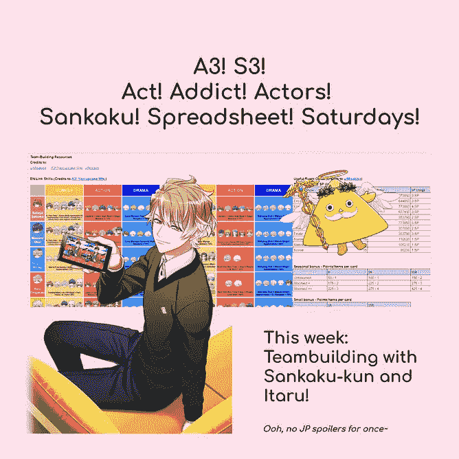
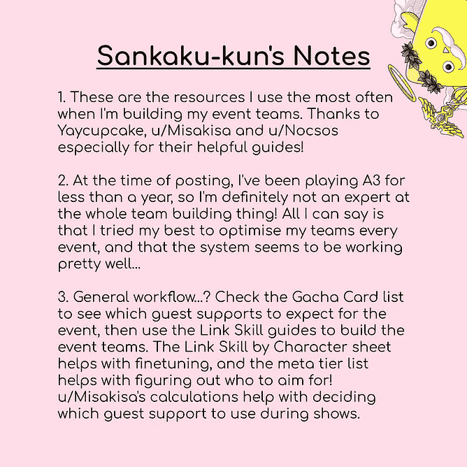
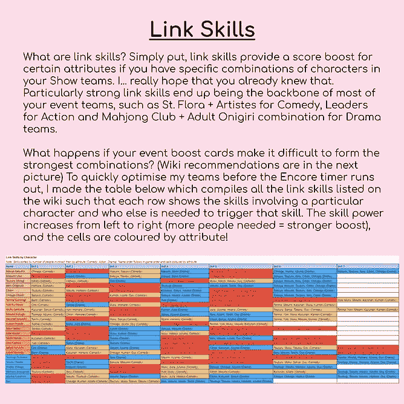

# 行动！瘾君子！演员！—建立字符元列表

> 原文：<https://medium.com/analytics-vidhya/act-addict-actors-building-a-character-meta-list-f21a9eba2e97?source=collection_archive---------8----------------------->

哪个角色最适合团队建设？请耐心听我解释。

图 1:总体元层列表

**Minion 动漫电子表格书呆子的元列表(2.0 版)**

*摘要*

你好！在这部分我的 [A3！在 x Data](https://ordinarytwilight.medium.com/list/act-addict-actors-d35ff7633ea9) 系列中，我们将进一步关注游戏性以及如何制定战略，尤其是如果你想尽快组建一支强大的队伍，为下一场比赛做准备的话。如果你不熟悉 A3！游戏，一定要看看这个系列的[序言](https://ordinarytwilight.medium.com/how-i-discovered-what-the-addict-in-act-addict-actors-really-meant-4c5631fced15?sk=6d329b2c35f15da934fd835e675b1409)以获得快速解释，以及这个系列的[第一部分](/analytics-vidhya/act-addict-actors-information-compilation-and-analysis-81506e70d863?source=friends_link&sk=null)，它经历了编译和分析所有角色的基本信息的不那么令人生畏的任务。本文假设你对建立一个“meta”(最有效的战术)团队的视频游戏概念有所了解。

欢迎来到我第二次尝试做一个元列表！这里的数字考虑了所有日本服务器(JP)事件，总计 4 年的游戏数据。请注意，这种尝试直接建立在 [Minion 的元列表 1.0](https://www.reddit.com/r/A3ActorsInTraining/comments/oae6lb/minions_meta_list_10/) 、[电子表格 Sankaku 对 A3](https://www.reddit.com/r/A3ActorsInTraining/comments/o2zb1c/spreadsheet_sankakukun_tried_to_count_every_card/) 中的每张牌以及我的 A3 的其余部分进行计数的尝试之上！x 数据项目。像往常一样，[完整的电子表格](https://docs.google.com/spreadsheets/d/10u7yHRtTEzVC8FVRe1_pcAZYaAlmjX8kyJrSR2JP6Vg/view#gid=49098659)将更详细地展示一切，但要小心剧透！我要把这写成一篇糟糕的研究论文，因为…为什么不呢？现在开始表演！

*假设*

1.  耶，纸杯蛋糕的团队是最好的。(A3 的不和谐可以说有更好的构建，但它们有点复杂，所以为了我的理智起见，我坚持使用 Yaycupcake，我认为差异不应该太大！)
2.  一个角色在另一个角色的团队中有用的次数(我在这里称之为“出现”)与元等级直接相关。
3.  如果需要一个角色来建立一个由 [Yaycupcake](https://yaycupcake.com/a3/index.php?title=EN_Version_Link_Skills) 推荐的最佳团队，那么这个角色/属性组合的外观将被计算在内(我已经在这里链接了 EN 技能，但请注意，第二幕技能仅在 JP 版本中得到充分反映，但请注意剧透！)对于一个以 gacha 支持为中心的团队来说。例如，在《剑下之死》中，喜剧团队将围绕盖伊的 SSR gacha 卡展开，因此鹤、穆库、一村里、左京和塔苏库将出现在他们的喜剧总数中，因为将他们与盖伊一起使用会给你提供 Yaycupcake 推荐的最佳喜剧链接技能提升，如图 2 所示。

图 2:喜剧男的最优链接技巧。

*方法论*

实际上与第一个元列表非常相似，但是我会在这里重复一遍给那些没有看过第一个列表的人。

1.  从计算 A3 的所有 gacha 卡的表中过滤出非事件提升卡。
2.  制作 Yaycupcake 推荐技能的表格版本，这样我就可以按 CTRL-F 进行下一步了。
3.  对于每个角色/属性组合，在步骤 2 的表格中搜索该角色在另一个角色的最佳团队中有用的次数。例如，戏剧阿兹马在最佳戏剧团队中对其他每个角色(除了他自己)都有用，所以要得到阿兹马在戏剧团队中有用的次数，我只需要总结除阿兹马之外的所有戏剧嘎查卡。相反，戏剧天马和由纪不需要任何最佳的戏剧建设，所以他们的出现次数将是零。(当然，根据你的库存卡，你可能最终会使用 Drama 天马/Yuki 进行团队优化，但我在这里只考虑最佳链接技能提升！)
4.  重复第 2 部分的第 2 步和第 3 步，因为我是个白痴，在第一个元列表中忘记了计算进化的链接技能。
5.  通过将所有东西相加并计算平均值来处理这些数字，考虑每个属性的最大出现次数(100+的出现次数真的那么令人印象深刻吗？没错。)并给出通常的条件格式处理，这样我就可以很容易地看到是否还有其他有趣的地方。
6.  将 V2.0 与 V1.0 进行比较，以及与 [u/Nocsos](https://www.reddit.com/u/Nocsos/) ' [元层列表](https://www.reddit.com/r/A3ActorsInTraining/comments/n8dgd0/a3_meta_tier_list_v20/)进行比较，后者更侧重于链接技能强度，而不是考虑 gacha 支持(这是一个超级好的列表，我仍然坚信它)。
7.  用漂亮的图表和层级列表让一切看起来不那么可怕。
8.  写下这个故事，并宣布我孤独的脑细胞完全被烧坏了。

*结果和分析*

对于所有的元等级列表:元等级在一个等级中从左到右递减，因此 Kazunari 总体上是最元的，而 Kumon 是最元的(对不起，在图 1 的最后一层中有一个小错误，它交换了 Guy 和 Kumon)。由于出现的数量因属性而异，我决定不使用绝对数字作为固定的等级界限，如果图表反映了某个特定属性/所有属性的出现数量相对较大的下降，则角色将被降级一级。当且仅当字符在特定属性中出现的总次数等于零时，字符才会出现在“实际无用”层中。请注意，任何特定角色的卡片，无论属性如何，都可以在你的活动团队中使用(除非他们是前 3 个团队位置的团队领导)，但为了获得最佳结果，匹配属性应该会给你更高的统计数据，因为这是卡片的专长。

*Minion 的元列表 V1.0 和 V2.0 有什么变化？*

虽然两个列表都考虑了 gacha 支持和最佳团队建设，但 V2.0 承认最佳团队随着新秀和第二部分链接技能的引入而发生了巨大变化。V2.0 也考虑了技能引入的时间，直到为他们引入新技能的事件出现时才计算角色。查看第一部和第二部的元列表比较(图 4.1)，我们可以看到新手的差距，因为他们没有出现在第一部中，我们可以看到一些角色在第二部开始后有了显著不同的元等级(天马和伊塔鲁非常神经衰弱，而阿兹马的等级上升，卡祖纳里设法保住了他的王冠)。排名变化如此之大的部分原因是由于全团技能的实用性下降。在第 1 部分中，5 人的夏季团队技能可以叠加高达 84%的提升，但一旦全团队技能改为需要 6 人，包括新手，叠加机会直线下降，现在全团队技能只能提供 60%的提升。与其他演员相比，一年后推出的新秀也会减少他们的出场次数，这可能有助于解释他们平均更差的元排名。虽然第一部的大部分技能仍然可以使用(事实上，其中一些在第二部到来时得到了提升)，但不幸的是，旧的全剧团技能不再有效，这可以解释一些角色等级的剧烈变化(Itaru 曾经对动作和戏剧很有帮助，但现在没有了)。

图 4.1:比较第 1 部分和第 2 部分的元列表。

*整体元层列表*

图 4.2:整体元层列表(同样为了便于参考)

图 4.3:总体元排名图

图 4.4:本帖所有内容所依据的数字墙，按元排名/总出现次数排列。

有趣的是，就元而言，“神级”角色在整个元级列表(图 4.2)和 Drama 的元级列表(图 4.7)中都是相同的。除了他们的恒星戏剧链接技能，这五个角色(麻将俱乐部+成人饭团俱乐部)还具有相对较强的喜剧技能，这提高了他们的整体排名。“真正好的”等级给你一些最好的喜剧和动作角色，它们分别使用圣弗洛拉和领袖技能。接下来的两层显示了有能力组建强队的角色，尽管这些强队与最常用的 A 队相比更倾向于被认为是 B 队。举例来说，Drama 的麻将俱乐部+成人饭团俱乐部对大多数角色的最佳团队来说都是至高无上的，尽管这个世界上唯一的技能可以与其他技能叠加，达到令人垂涎的 72%技能提升。另一个例子是将圣弗洛拉+艺术家/捣乱者建筑与明信片抽奖社会建筑进行比较，以获得喜剧效果，将领导者+奥嘉高中建筑与足球俱乐部进行比较。最后，“不伟大”层实际上就是:在最强大的版本中很少出现的角色。当它们出现时，通常只是为了罕见的优化。(哦，具有讽刺意味的是 Itaru 的铁杆玩家处于最后一个元层…)

“A 队，B 队”理论可以解释为什么足球俱乐部，千影(世界上唯一的)和盖伊(明信片抽奖社会)的元层级相当低，即使他们能够组成相对强大的球队，因为这些球队不经常使用。此外，较低等级的角色往往只在一个属性上有很强的技能，而在其他属性上相对较弱。一个值得注意的例外是生明，他可以为喜剧和动作片组建强大的团队，这将是一个很好的时间来指出新秀们处于垫底的两个层次。最后，总体元排名图(第二张图)也显示了一个角色偏向于哪个属性。比如 Muku 非常明显的偏向喜剧，而 Kazunari 在喜剧和戏剧两方面都很强但是在动作方面很弱。

*特定属性元层列表*

图 4.5:喜剧元层列表

图 4.6:动作元层列表

图 4.7:戏剧元层列表

特定属性列表(图 4.5，4.6 和 4.7)将更接近地反映实际的游戏性，尽管总的列表作为一种快速的方式来决定你下一个应该射击哪个角色来加强你的库存。个人名单通过分割某些强队来解决整体名单的问题(天马比其他领导人低一级，但没有他他们不会有太大用处)。查看列表会发现每个属性的一些最有用的团队构建，并且层级列表的平衡程度会显示属性是否偏向某些构建。

图 4.8:戏剧元排名图

图 4.9:喜剧元排名图

例如，戏剧将 24 个角色中的 13 个放置在较弱的层(底部 3 层)，这表明大多数戏剧的最佳团队严重依赖于相对较少数量的角色，尤其是麻将俱乐部+成人饭团俱乐部。这也反映在图表的形状中(图 4.8)，它显示了每一层边界的出现次数急剧下降，以及小条形的长尾，这反映了与最强的角色相比，有多少角色在戏剧中相对较弱。喜剧遵循类似的模式，尽管没有那么戏剧性，因为较强和较弱层次之间的分裂不是那么明显(图 4.9)。然而，喜剧图表中最元角色之间的急剧梯度确实表明喜剧并不完全依赖于单一的构建，而是构建的组合，圣弗洛拉是许多构建的基础。Muku 能够与 Shoujo 漫画俱乐部和偶尔的夏季剧团合作，这使他成为无可争议的喜剧冠军。

图 4.10:动作元排名图

Action 的图表(图 4.10)可能是最有趣的，因为该图表没有独特的尾部，并且各层之间的落差是属性中最难区分的。这反映了 Action 如何在团队建设中具有最大的灵活性，能够在 2 人和 3 人链接技能之间进行交换，以补充主导链接技能(通常是领导者或足球俱乐部)。因此，动作构建中没有真正无用的角色(尽管 Homare 在那里做了一个非常接近的决定)，你需要相当多的动作卡来拥有一个真正通用的动作构建武器库。幸运的是，行动牌恰好是永久牌库中最常见的一些 gacha 牌，所以随着时间的推移，这应该不是太大的问题。Gacha 分布也成为一个非常有趣的考虑因素，特别是在咲夜行动的情况下。将他的 102 次出场与剧团其他领导进行比较(特别是天马的堆叠技能让他有 148 次出场和动作元冠)让我感到非常奇怪，因为咲夜非常需要形成最常用的动作造型。在考虑了非领袖技能的出场次数后，我觉得咲夜仍然缺少一些出场，直到我查看了嘎查卡总数的表格。然而，咲夜行动并没有特别多的嘎查卡，所以我不能解释为什么团队建设的出场次数少而嘎查卡的出场次数多。这可能意味着咲夜的行动技能与其他领导者相比要有限得多，他的出场次数大致相当于领导者技能派上用场的次数。请注意，出现的次数总结了所有的可能性，这解释了为什么到目前为止 A3 中的事件总数比这个数字高。

图 4.11:按动作卡数量降序排列的嘎查卡。

我在图 4.11 和图 4.12 中观察到了一些奇怪的现象:如果一个角色在动作上有很高的元等级，实际上很有可能他们在其他属性上的元等级很弱。也许这是 Liber 平衡元排名的方式，这样我们最后就别无选择只能收集所有人了？

图 4.12:动作诡异…

*质量控制:将 V2.0 与 V1.0 和* [u/Nocsos](https://www.reddit.com/u/Nocsos/) ' [元列表](https://www.reddit.com/r/A3ActorsInTraining/comments/n8dgd0/a3_meta_tier_list_v20/)进行比较

图 4.13:1.0 版、2.0 版和 u/Nocsos 列表之间的元列表比较。

澄清:你在图 4.13 中看到的黄线是我处理过的 [u/Nocsos](https://www.reddit.com/u/Nocsos/) 列表版本，它试图将所有 3 个列表合并成一个总的元列表。(我想这是我第一次尝试玩 A3 的 meta…)不幸的是，坦白地说，我的处理有点混乱，尽管它似乎遵循了 Nocsos 的列表。更糟糕的是，我们的名单运作的尺度非常不同(24 位对 10 位)。试图将 10 个位置调整为 24 个位置并不太好，所以我只是保留数据进行比较。比较一下相对位置，我们可以看到，至少 Nocsos 和我在排名的极端上是一致的。然而，我的列表对使用频率的考虑意味着，与 Nocsos 的排名(生明)相比，形成强大但不太常用的链接技能的角色将会看到更差的排名，而在我的列表中，只有 1 个属性强大但经常使用的角色(霍马雷)将会看到他们的排名提高。比较我的列表的 1.0 版和 2.0 版也产生了一些有趣的结果，例如生明被削弱了(对不起，生明)，咲夜在排名中获得了非常大的提升，这是因为他在行动中的有用性和他在第二部分开始后的一贯表现。从 1.0 版和 2.0 版之间前 5 名和最后一名如何保持完全不变可以看出 1.0 版的准确性，而许多排名变化发生在+/- 2 位的相当小的幅度内。

*结论*

万岁，米尼恩的讲座快结束了！总之，如果新玩家希望有效地使用最强的链接技能，他们应该认真考虑将目光放在 SSR 卡上。对于每个属性，喜剧 Muku，动作天马和戏剧阿兹马分别是最强技能的主播。我们也看到了第 1 部分和第 2 部分之间的转换已经改变了元排名相当多，这肯定是在未来的团队建设中要注意的事情！现在，麻将俱乐部+成人饭团俱乐部的成员占据着至高无上的地位，Kazunari 没有表现出放弃他的元皇冠的迹象！也许外向会给链接技能提供更多的机会？这是改天再看的东西…未来工作的其他来源将包括合并第 3 部分的技能，因为 Yaycupcake 还没有更新他们的建议。进一步分析是什么让元滴答作响，以及深入探究 A3 Discord 的[团队建设](https://docs.google.com/document/d/1w52E3caskr7ihNfx3Jlx3ULKpWfXCqciYl4wrtFYmQU/edit) [文档](https://docs.google.com/document/d/1BwjRZJI_vwVqDr9duQpKuufaHF-3tz_O_yeyYSECNk8/edit)肯定也会很有趣！

*参考文献*

EN 版链接技巧。(2021 年 4 月 14 日)。A3！维基，。从[https://yaycupcake.com/a3/index.php?检索到 2021 年 7 月 8 日 19:09title = EN _ Version _ Link _ Skills&oldid = 50860](https://yaycupcake.com/a3/index.php?title=EN_Version_Link_Skills&oldid=50860)。

链接技巧。(2021 年 4 月 14 日)。A3！维基，。从[https://yaycupcake.com/a3/index.php?title=Link_Skills&oldid = 50861](https://yaycupcake.com/a3/index.php?title=Link_Skills&oldid=50861)检索到 2021 年 7 月 8 日 19:10。

诺克索斯。(2021).A3！元层列表 v2.0。于 2021 年 7 月 8 日检索，来自[https://www . Reddit . com/r/a3 actors training/comments/n8dgd 0/a3 _ meta _ Tier _ List _ v 20/](https://www.reddit.com/r/A3ActorsInTraining/comments/n8dgd0/a3_meta_tier_list_v20/)

童子军活动。(2021 年 7 月 6 日)。A3！维基，。从[https://yaycupcake.com/a3/index.php?title=Scouting_Events&oldid = 53646](https://yaycupcake.com/a3/index.php?title=Scouting_Events&oldid=53646)检索到 2021 年 7 月 8 日 19:10。

团队建设。(2020 年 7 月 24 日)。A3！维基，。从[https://yaycupcake.com/a3/index.php?title=Team_Building&oldid = 43721](https://yaycupcake.com/a3/index.php?title=Team_Building&oldid=43721)检索到 2021 年 7 月 8 日 19:09。

o .暮光之城(2021)。A3！信息。检索于 2021 年 7 月 8 日，来自[https://docs . Google . com/spreadsheets/d/10 u7 yhttezvc 8 fvre 1 _ pcazyaalmjx 8 kyjrsr 2 jp 6 VG/view # GID = 49098659](https://docs.google.com/spreadsheets/d/10u7yHRtTEzVC8FVRe1_pcAZYaAlmjX8kyJrSR2JP6Vg/view#gid=49098659)

o .暮光之城(2021)。Minion 的元列表 1.0。2021 年 7 月 8 日检索，来自[https://www . Reddit . com/r/a3 actors training/comments/oae6lb/minions _ meta _ list _ 10/](https://www.reddit.com/r/A3ActorsInTraining/comments/oae6lb/minions_meta_list_10/)

o .暮光之城(2021)。电子表格 Sankaku-kun 试图计算 A3 中的每张牌…2021 年 7 月 8 日检索，来自[https://www . Reddit . com/r/A3 actor sintraining/comments/o2zb1c/spread sheet _ sankakukun _ tryed _ to _ count _ every _ card/](https://www.reddit.com/r/A3ActorsInTraining/comments/o2zb1c/spreadsheet_sankakukun_tried_to_count_every_card/)

*作者注*

这个故事的整个格式是这样的，我终于可以在 Yaycupcake 上使用滑稽的[“引用这一页”](https://yaycupcake.com/a3/index.php?title=Special:CiteThisPage&page=EN_Version_Link_Skills&id=50860)功能了…玩笑归玩笑，我真的希望你喜欢阅读这篇文章，并且它对你得到你想要的卡片有所帮助！更多资源可以在[这里](https://drive.google.com/drive/folders/1sWp3OXWXEHKgWsbfEHtXjcvcBaHXzIgF)和我的[卡上](https://ordinarytwilight.carrd.co/)找到，我真的很感谢任何关于我在这里分享的任何东西的反馈/建议！分析过去事件结果的系列文章的下一部分可以在[这里](/analytics-vidhya/act-addict-actors-analysing-past-event-results-15c7312b63d)找到！

作为对你坚持到最后的感谢，这里是我的[三段第五和第七部分的提前预告！电子表格！星期六！](https://www.instagram.com/ordinarytwilight/guide/spreadsheet-nerd-collection/17869938518477930/)insta gram[上的系列](https://www.instagram.com/ordinarytwilight/)，涵盖了我的 A3！x 数据，以一种易于理解和相当美观的方式！

第五部分更详细地解释了链接技能的概念，以及我处理 Nocsos 列表的步骤，作为整体元列表的初始草案。

第七部分的这个片段介绍了我创建元层列表 1.0 版的步骤。

有了那个，A3 的这部分！x 数据系列终于结束了，以后的部分再见！一切顺利，为你的卡建立最好的团队！