# 行动！瘾君子！演员！信息汇编和分析

> 原文：<https://medium.com/analytics-vidhya/act-addict-actors-information-compilation-and-analysis-81506e70d863?source=collection_archive---------5----------------------->

*A3！x 数据第 1 部分:突袭维基，这样我就不需要一次打开 20 多个浏览器标签来折磨我的电脑了。*

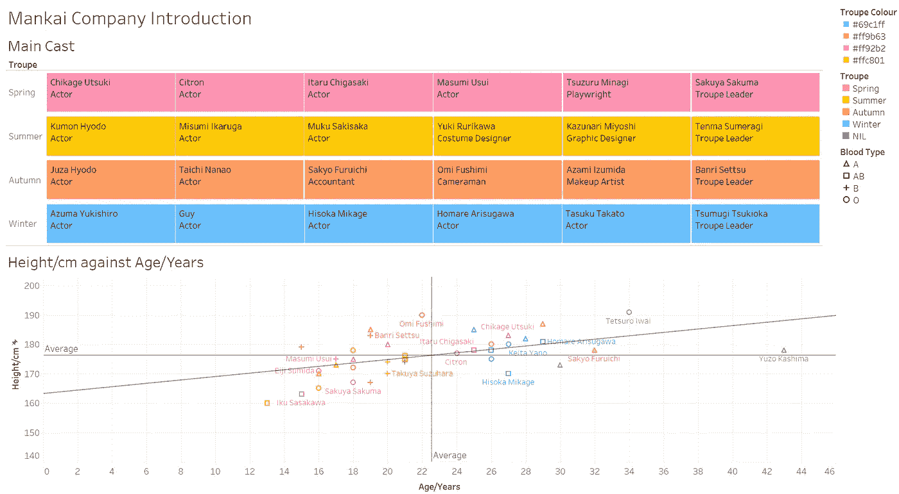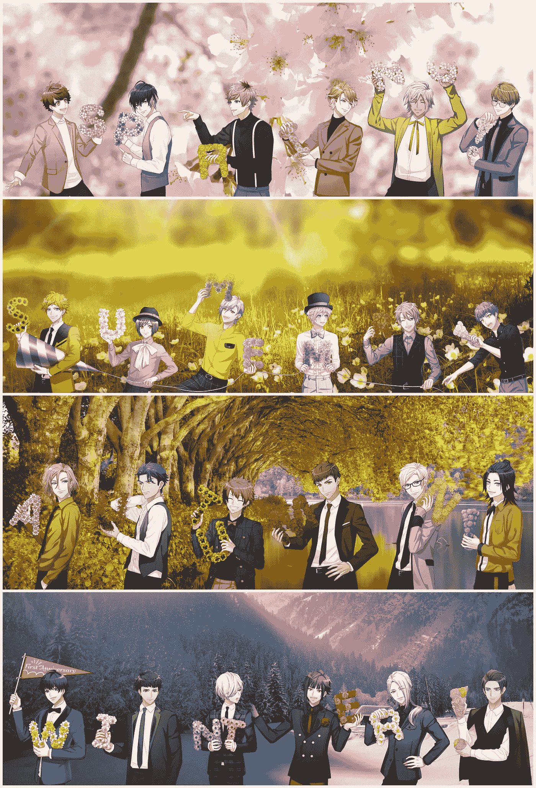

我编辑了所有角色的一周年卡片图片。

你好！这将是我的 [A3 的第一部分！x 数据](https://ordinarytwilight.medium.com/list/act-addict-actors-d35ff7633ea9)系列，我们将重点放在人物信息编译上！在我们继续之前，请打开[完整电子表格](https://docs.google.com/spreadsheets/d/10u7yHRtTEzVC8FVRe1_pcAZYaAlmjX8kyJrSR2JP6Vg/view#gid=0)和 [Tableau 工作簿](https://public.tableau.com/app/profile/ordinary.twilight/viz/A3Information1JulyVersion/MankaiCompanyIntroduction)查看它们，同时阅读本指南以导航表格！

以下几点可作为背景:

1.  行动！瘾君子！演员！(A3！)是由 Liber Entertainment 和 CYBIRD 联手打造的日本集卡手游。玩家收集卡片并组成团队在活动中清除目标，团队提供卡片(如[这张](https://yaycupcake.com/a3/images/c/c5/%28Full_Course_Monopoly%29_Hisoka_Comedy_SSR%2B.png))作为活动奖励。我玩的游戏的英文版于 2019 年底发布，而日文版于 2017 年初发布，这意味着 EN 玩家可以找到更多关于未来 3 年内发生的事件的信息。这提供了大量的数据来处理！对于 A3 更详细的解释！，查看本系列的[序言](https://ordinarytwilight.medium.com/how-i-discovered-what-the-addict-in-act-addict-actors-really-meant-4c5631fced15?sk=6d329b2c35f15da934fd835e675b1409)和 [A3！Yaycupcake Wiki](https://yaycupcake.com/a3/index.php?title=Main_Page) ，这是我的主要数据来源。
2.  在许多方面，A3！x 数据系列是我最初的 BanG Dream x 数据系列的续集和副产品。我最初是开 A3 的！x 数据系列，将我的 BanG Dream (Bandori)作品改编为 A3！在扩展 A3 之前！系列，以适应游戏的具体特点。随着时间的推移，随着我的电子表格技能的提高，我回到我的 Bandori 电子表格，并应用我新解锁的技能来提高它们。顺便说一下，这篇文章将很大程度上遵循其 [Bandori 对应](/analytics-vidhya/bang-dream-girls-band-party-character-database-and-tableau-analysis-f0446e2e570c?sk=c9eca5d349a691bfe9ac8b337c7df1a1)的结构！
3.  A3！和 BanG Dream 分享了游戏玩法的卡片收集方面，两个游戏都有相当大的发育良好的角色名册，但相似之处也就到此为止了。不像 Bandori，A3！这不是一个节奏游戏，除了团队建设，游戏大部分时间都是自己在玩。A3 的主要诉求！就是故事写的特别好，在记住谁是谁方面，让信息汇编更有用！

事不宜迟，我们开始吧！

**收集数据**

A3 的粉丝群相对较小，这意味着我只有维基来获取信息，还有像[r/a3 actor training](https://www.reddit.com/r/A3ActorsInTraining/)sub Reddit 这样的平台来澄清问题。尽管如此，运行维基的人们在全面地包括尽可能多的细节和 JP 内容的许多翻译方面做了出色的工作，这使得数据汇编更加容易。下面是一个典型的维基人物简介:

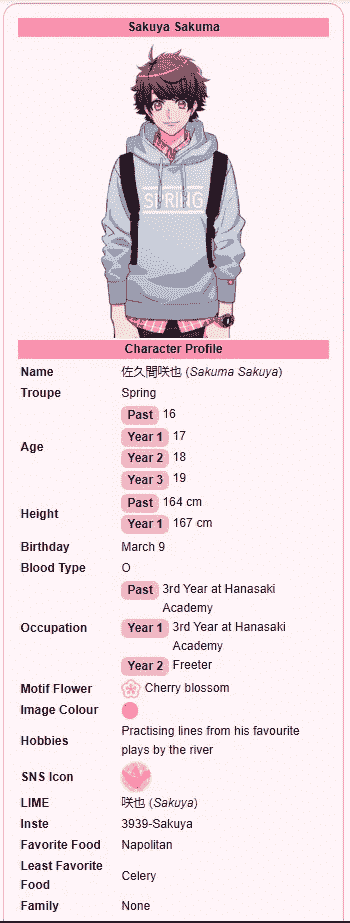

春天剧团的团长，曼凯的第一个成员，咲夜·佐久法史！

最初，我只关注那些可以量化的、因此更容易处理的指标，比如年龄、身高和生日。分组指标，如血型和职业也包括在内，由于主题花和图像颜色对粉丝内容创作者特别有用，我也将它们添加到表格中。最终，我扩展了这个表，几乎包含了上面概要中列出的所有内容。下面是 Github 上的表格，Github 只支持原始值，请查看电子表格以获得更漂亮的版本，其中一部分如下所示！

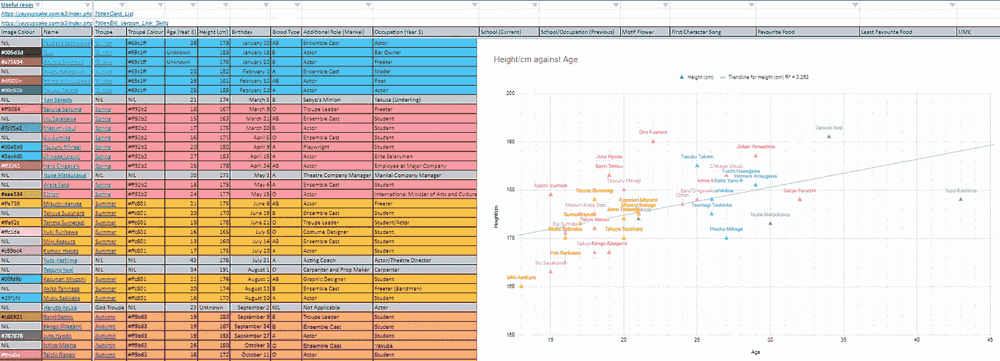

性格信息和身高与年龄图表

**分析和寻找模式**

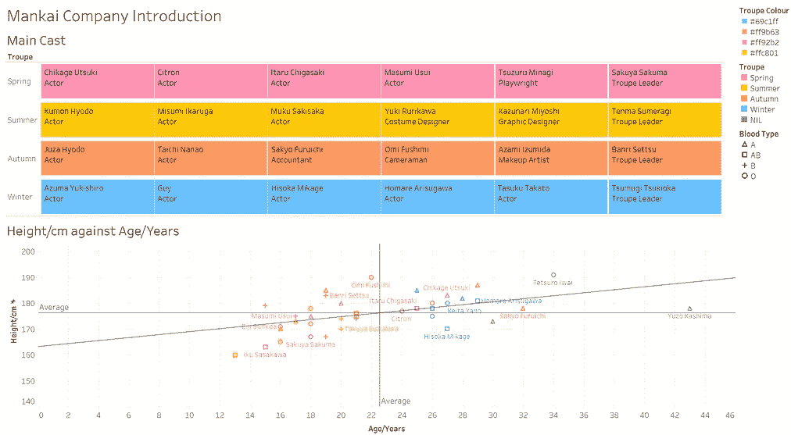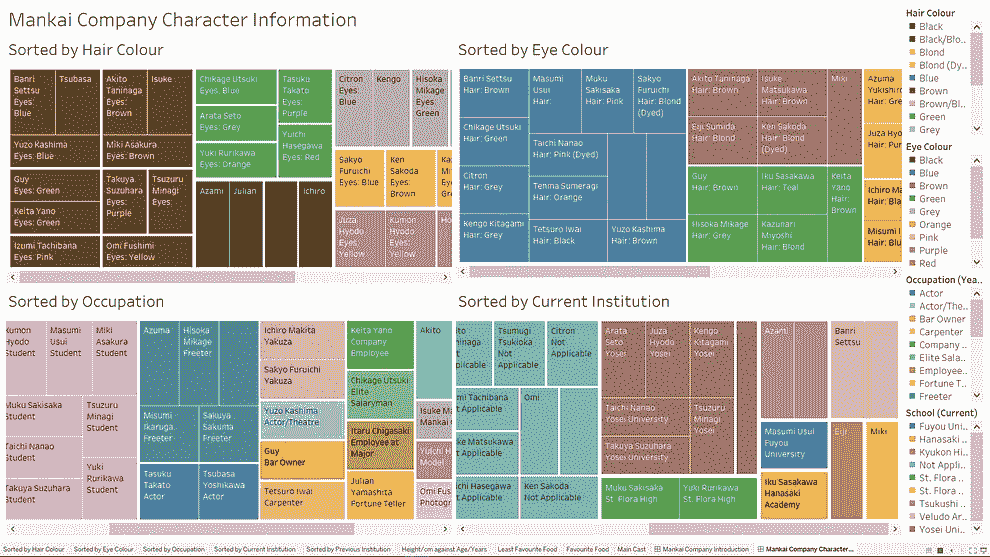

这里是我的大部分结果总结成两个 Tableau 仪表板。很漂亮，但是由于裁剪，很多数据都模糊了，所以我一会儿会仔细看看这些表。第一个仪表板(左)是一个简单的由剧团组织的曼凯公司的名人录，以及一个散点图，显示每个人(包括后台工作人员和全体演员)的身高、年龄和血型。使用这个仪表盘，你可能会对 A3 的演员阵容有所了解。第二个仪表板(右)仔细查看了外貌和职业等定性结果，并揭示了相当多的曼凯成员在剧院之外是如何相互认识的(嗯，这在故事中也是成立的，所以并不那么令人惊讶)。

*上浆曼凯 up*

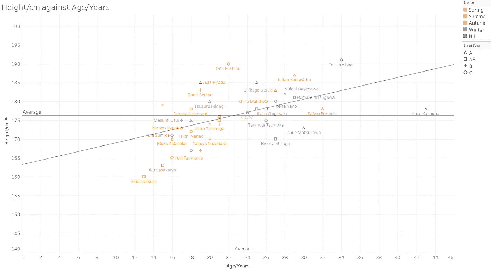

年龄与身高的相关性不大，R 平方值为 0.28。有道理，看到 15 岁的生明(左上象限中未标记的橙色十字)比左京高 1 厘米，他的年龄是他的两倍多。

图表说明:我们失去了冬季剧团的两位演员，阿兹马·由纪四郎和盖伊，因为他们的年龄至今仍不为人知。看看这些点是如何分散的，年龄与身高的相关性不是很大，R 平方值为 0.28，尽管随着年龄的增长，身高有一个总体趋势(如果这没有显示出来，老实说，我会担心)。有道理，看到 15 岁的生明(左上象限中未标记的橙色十字)比左京高 1 厘米，他的年龄是他的两倍多。一些有趣的观察:

1.  看演员的年龄范围，可以非常清楚的看到 A3！是面向年轻人的，但是对于一个动漫游戏来说，年龄范围是惊人的大，从中学到接近中年跨越了近 20 年。(开玩笑，严格来说，左京是千禧一代，尽管他的行为与刻板印象中的完全不同。)
2.  这些点按剧团来着色，观察每个剧团如何形成相对不同的集群是非常有趣的:夏季剧团(左下象限)是曼凯的婴儿，相对较小的身材适合他们年轻的形象。秋剧团的年龄范围很大，但他们都相当高，因此牢牢地位于图表的上半部分(有道理，几乎所有人都有某种不良历史)。与此同时，冬季剧团完全由成年人组成(他们是否是成熟的成年人仍有争议)，位于图表的右半部分，身高范围相当大(西索和塔苏库之间的身高差为 15 厘米)。
3.  日本人对将血型与性格特征联系起来有一种有趣的迷恋，但我们可以在这里看到它并不影响身高。
4.  你可能已经注意到后台工作人员(灰色点)相对较老，这是有道理的，因为他们大多数人都与曼凯公司的第一代人有联系。

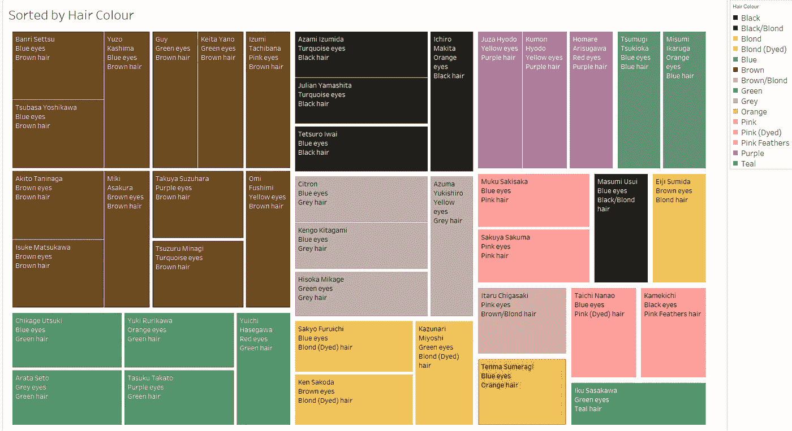

方框颜色代表角色的头发颜色。请注意，左京有一个小错误，因为他的头发是天然的金色，没有染色。还要注意龟吉是万凯的吉祥物鸟。

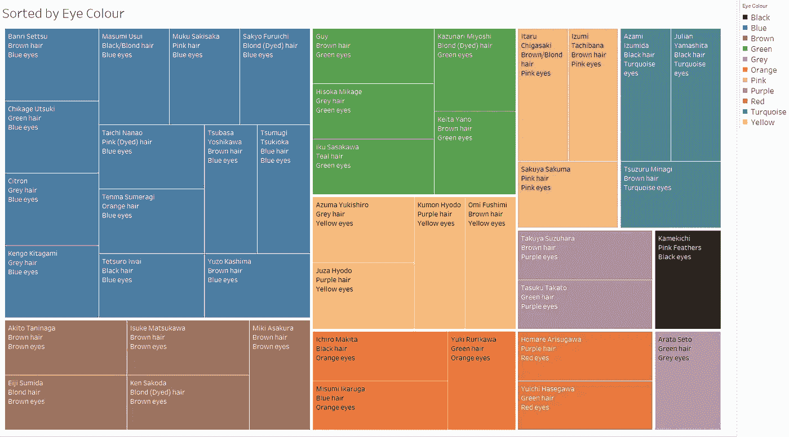

方框颜色代表角色眼睛的颜色。请注意，增美和左京的眼睛看起来是蓝紫色的，我改变了好几次主意，才决定用蓝色。

上面的树状图显示了曼凯人头发/眼睛颜色的相对分布。为了让我的生活更容易，我使用了头发的主色，并将某种颜色的所有色调合并到该颜色的类别中。正如动画系列所预期的那样，出现了不同寻常的头发和眼睛颜色的混合，如绿色和紫色。请注意，头发和眼睛的颜色是我眯着眼睛看了大约一个小时的照片确定的，所以它们可能不完全准确。

看第一张图表，你会发现棕色头发的角色是最常见的。然而，经过仔细观察，我意识到 13 个棕色头发的角色中有 8 个(包括 Itaru，因为他头发的金色部分是染的)不在主要演员阵容中，而是在全体演员或后台工作人员中服务。因此，这可能表明棕色头发通常用于背景人物，我可以用鹤木敏充经常被称为“村民 C”(意思是:不明显)，即使他是主要演员*和*是万凯唯一的剧作家作为证据。有趣的是，相当多的绿发成员有一种相当…独特的用言语冒犯人的方式。

眼睛颜色表显示，相对自然的眼睛颜色(蓝色、棕色和绿色)是最常见的，但请注意，一些色调非常像有色隐形眼镜。在曼凯公司，蓝眼睛似乎是最常见的，相当多的主要演员都有蓝眼睛。也许这是因为醒目的蓝色眼睛往往与大多数眼睛颜色形成良好的对比？在不太自然的眼睛颜色中看不到太多的趋势，但我应该注意到 Juza 和 Kumon Hyodo 是兄弟，这解释了他们匹配的紫色头发和黄色眼睛。有趣的是，古怪的诗人 Homare Arisugawa 的头发和眼睛颜色与 BanG Dream 中的 Kaoru Seta 一模一样，Kaoru Seta 是一个华丽的吉他手，也是一个痴迷于莎士比亚的女演员…

我还做了一个编辑，比较了每个人的身高，这样你就可以看到 Yuki(165 厘米)和 Omi(190 厘米)的身高差距了。请注意，一些精灵的姿势使高度看起来不同！

仅主要演员

我还创建了另一个版本，其中包括全体演员，因为他们应该得到更多的爱…在添加他们之后，我们可以看到最矮的曼凯演员是朝仓美纪，13 岁，身高 160 厘米。老实说，对他的年龄来说，这已经很高了。

所有曼凯演员(包括全体演员)

接下来，我看了看每个人的职业和附属机构。警告:机构图表的故事剧透，所以放大之前要小心！

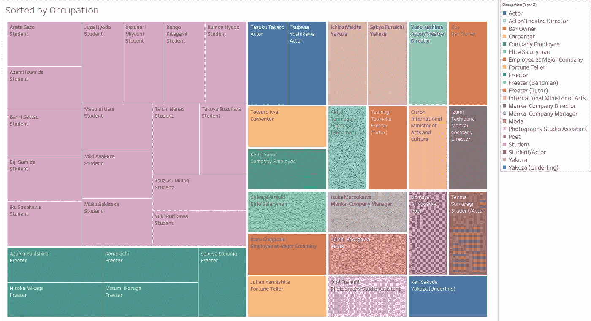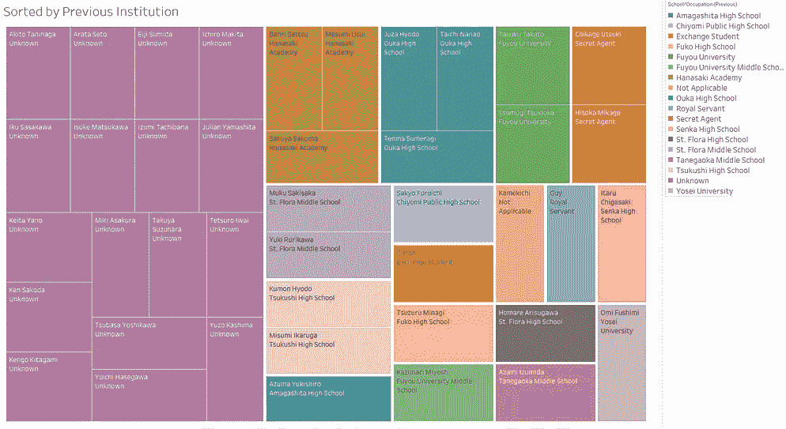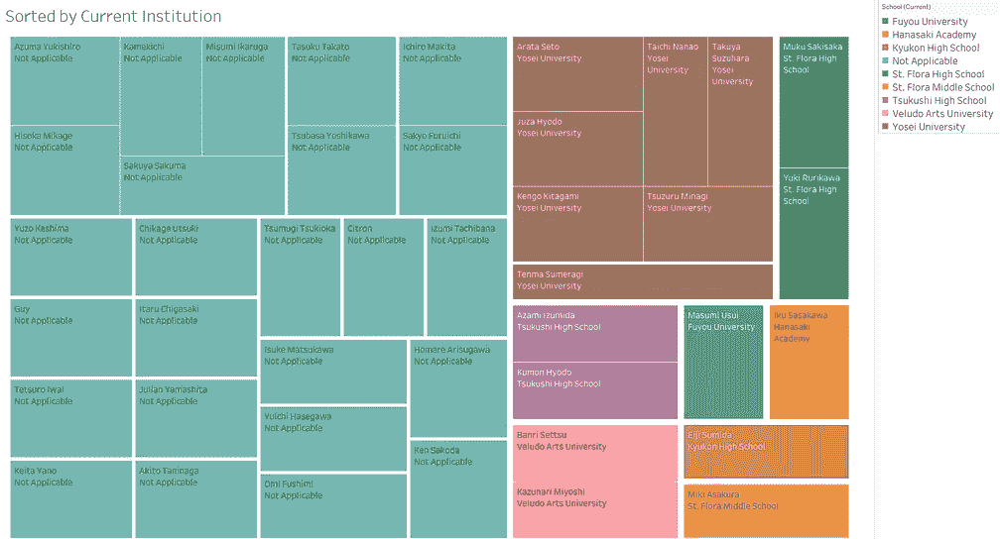

我们可以从职业图表中看到，曼凯公司有两个截然不同的群体，学生和飞行者(失业人员/兼职人员)，而公司的其他人从事各种各样的工作，从工薪族到算命师，甚至还有少数山口组成员。有趣的是，除了在曼凯公司表演之外，只有两名成员将表演列为他们的职业(需要注意的是，飞特乐队中的两名成员咲夜和津木，已知会接受其他剧院的客串角色作为兼职)。

看看这些机构，我们可以看到相当多的角色在学校就已经互相认识了(圣弗洛拉，花崎，奥嘉等)。)，后来相当多的高中生都进了永生大学。之前的机构图还包含了一些来自曼凯回放系列卡的信息，揭示了一些角色的共同历史和一些意想不到的联系，例如 Kumon 和 Misumi 共用一所高中，尽管他们从未在同一时间在那里学习。没有已知从属关系的在职成年人构成了机构图表的主体，使得分析学生群体有点困难。

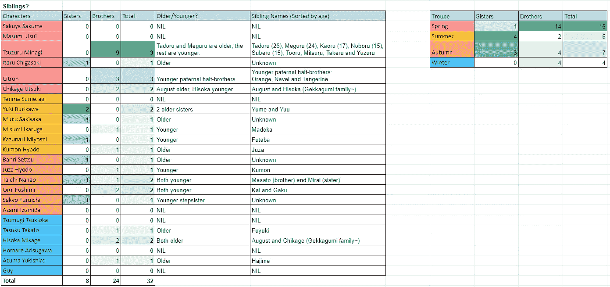

主要演员有几个兄弟姐妹？

这张表显示了每个人的家庭关系，因为我很好奇，想知道曼凯公司是否有很多独生子女，以及作为一个哥哥是否真的可以被认为是鹤木敏充的定义特征。这个表编译得非常快，它汇总了每个主要角色、每个剧团和总人数的兄弟姐妹数，并使用条件格式使确定最大值变得更容易。该表还指定了所讨论的角色是年长的、年幼的还是中等的孩子，以及兄弟姐妹的名字(如果他们是已知的)。

令我惊讶的是，Mankai 实际上没有很多独生子女，我之前的印象可能是因为游戏的故事没有深入到许多角色的家庭生活中，除了 Minagi 氏族的 10 个兄弟和 Hyodo 兄弟，因为他们都是主要演员。如果你把家庭的定义扩大到包括创始家庭，我会说每个人都有 23 个兄弟，因为曼凯实际上是一个大家庭。然而，我确实加入了这个家庭，它是西索和千影共同历史的一部分，并且包括了继兄弟姐妹(左京和香橼)。

总共有 32 个曼凯兄妹，加起来就是一大堆边角料。兄弟比姐妹更常见(考虑到曼凯的全男性演员和游戏的观众，这并不奇怪)，米纳吉斯人给春天剧团带来了拥有最大大家庭的荣誉。夏秋剧团有相当多的兄弟姐妹，而冬剧团没有很多(只有两个亲生兄弟)。总而言之，我可以断定我的朋友是对的:曼凯公司的兄弟姐妹数量可以用 1/2/3/Minagi 来形容…

*Omi 的菜单*

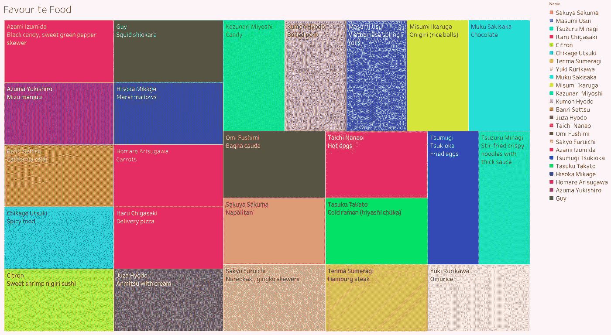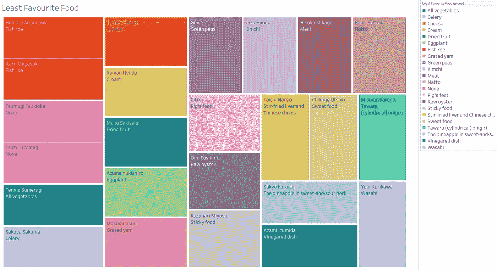

Omi Fushimi 是 Mankai 公司无可争议的主厨，这两张图表描述了你在餐桌上经常看到的和不太经常看到的东西！每个人都有非常广泛的最喜欢和最不喜欢的食物，这使得 Omi 可以烹饪出满足所有人的食物(不算导演对咖喱的一根筋)。

最不喜欢的食物图表有一对讨厌鱼子酱的人(这甚至是游戏中提高统计数据的链接技能)，一对不介意吃任何东西的圣人，几个讨厌蔬菜的人，一个根据三角形判断食物的人，以及奇怪的“糖醋猪肉菠萝”。哦，还有*猪蹄*。总结一下，向 Fushimi 主厨致敬…

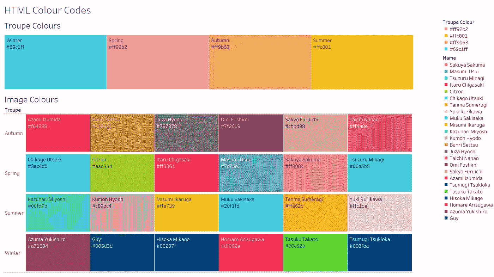

最后，这里有一个方便的仪表板，为任何可能需要它们的人提供图像颜色！人物信息汇编和 A3 的第一部分到此结束！x 数据，敬请期待下一部！在你离开之前，这里有更多的厨师 Fushimi:

秋剧团第七部戏的原始 SSR 拼贴，欢迎来到 Akebono-so！奥米扮演厨师利库。

作为对我忍受整篇文章的感谢，这里是这篇文章的 Instagram 友好版本，它也是没有画面分析的早期草稿！你可以在这里找到完整的 Instagram 系列！

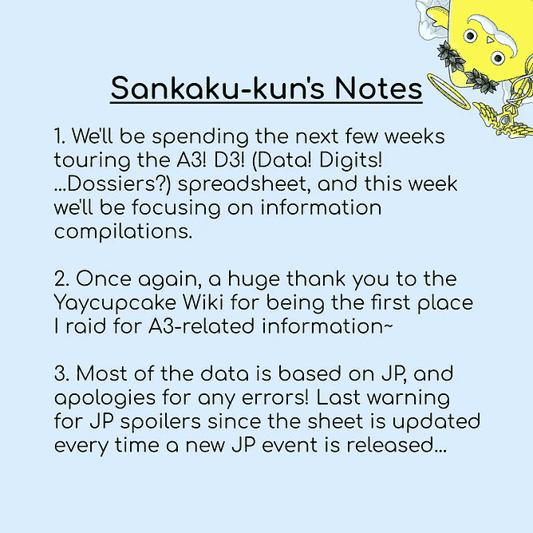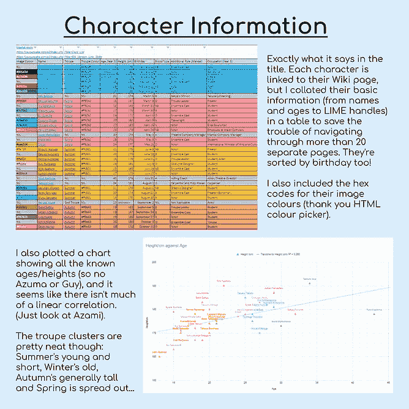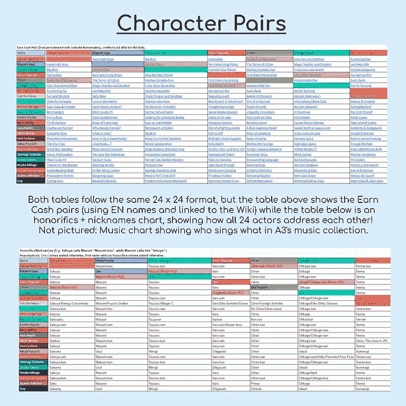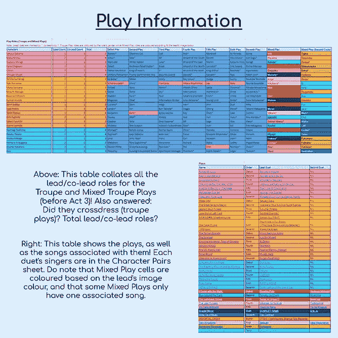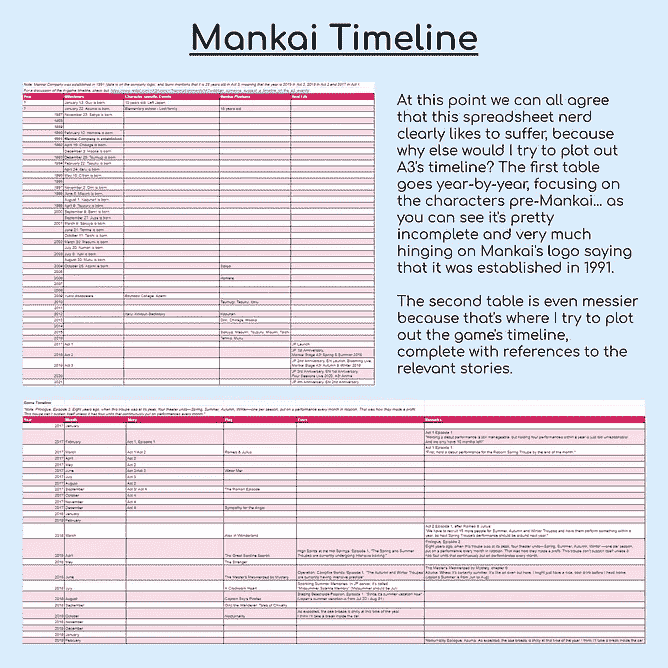