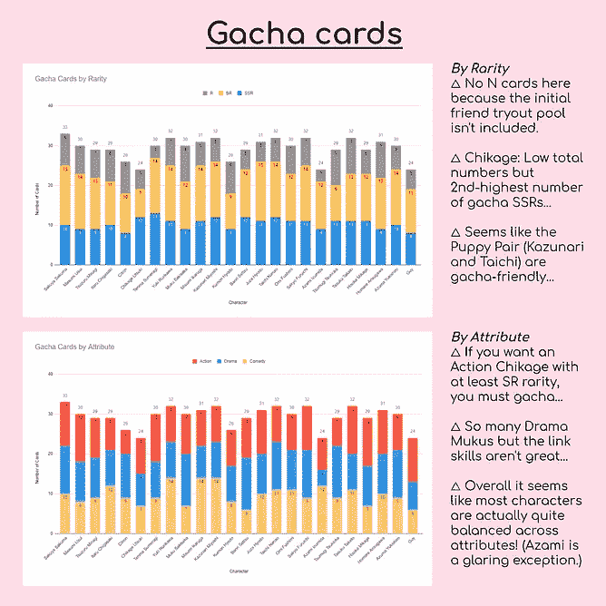

# 行动！瘾君子！演员！—预测事件和算牌

> 原文：<https://medium.com/analytics-vidhya/act-addict-actors-predicting-event-and-counting-cards-87d6da91f28d?source=collection_archive---------21----------------------->

我试图计算游戏中每张牌的时间，以及未来 3 年每场比赛的开始日期。

左:当前事件列表及更多信息。右图:原版。所有信息来自 Yaycupcake，当前 EN 事件之后的任何信息来自 JP。

你好！在这部分我的 [A3！x Data](https://ordinarytwilight.medium.com/list/act-addict-actors-d35ff7633ea9) 系列，我们将会看到我试图编译 A3 的所有事件信息。如果你不熟悉 A3！游戏，一定要看看这个系列的[序言](https://ordinarytwilight.medium.com/how-i-discovered-what-the-addict-in-act-addict-actors-really-meant-4c5631fced15?sk=6d329b2c35f15da934fd835e675b1409)的快速解释，以及这个系列的[第一部分](/analytics-vidhya/act-addict-actors-information-compilation-and-analysis-81506e70d863?source=friends_link&sk=null)，它通过汇编和分析所有角色的基本信息。该系列的第二部分[进入团队建设战术，实际上我在这里浏览的表格是我如何确定每个角色“变形”的根源，而分析过去事件结果的第三部分可以在这里找到](/analytics-vidhya/act-addict-actors-building-a-character-meta-list-f21a9eba2e97?sk=225c4fc823c66628edbd84e38cb499ed)！

在我们开始之前，请务必打开[完整的电子表格](https://docs.google.com/spreadsheets/d/10u7yHRtTEzVC8FVRe1_pcAZYaAlmjX8kyJrSR2JP6Vg/view#gid=488570835)以保护您的视力并查看表格的最新版本！如果你赶时间/没有心情去看一堵巨大的墙，请滚动到我的 [Sankaku 前两周的结尾！电子表格！星期六！](https://www.instagram.com/ordinarytwilight/guide/spreadsheet-nerd-collection/17869938518477930/)系列，企图让我的 A3！x 数据系列更加 Instagram 友好…

*预测事件开始日期*

2021 年活动日历

[事件列表](https://docs.google.com/spreadsheets/d/10u7yHRtTEzVC8FVRe1_pcAZYaAlmjX8kyJrSR2JP6Vg/view#gid=488570835)表格可能是在我的 A3 过程中收到最多修订的表格！x 数据项目。第一个版本发生在我试图看到我的免费游戏机会，得到更多我最喜欢的角色的 SSR 时…老实说，并没有很多。我很早就意识到新手的情况更糟，因为他们有很多 gacha 卡。我将在以后的算牌单中回到这一点！所有的信息都已经在 Yaycupcake wiki 上了，但是我把它们收集在一个表中，这样我就可以很容易地根据事件 SSR 特征对事件进行分类和计数。我整理了来自活动奖品和 gacha 的属性，如活动名称、类型、开始日期和 SSR 卡。

第二个版本是在我意识到最近事件之间的差距确实不一致后不久制作的。比如[征服大盐岛](https://yaycupcake.com/a3/index.php?title=Conquering_Misoshiosa_Island!)和[各种海誓山盟](https://yaycupcake.com/a3/index.php?title=Various_Vows_of_Love)之间有 10 天的休息，但是第四轮 K [晚登台](https://yaycupcake.com/a3/index.php?title=Knights_of_the_Round_IV_On_Stage)和[星河相逢](https://yaycupcake.com/a3/index.php?title=Meet_Me_by_the_Milky_Way)之前的休息只持续了 4 天。因此，我提出了一个相当基本的模型，该模型假设事件之间有一致的 4 天间隔，每个事件持续 10 天(除了每个持续 5 天的重新发布事件)。这再加上我对 gem 预算的持续恐慌，导致我坚持这个可怕的估计，并创建了一个活动日历，以更漂亮的格式显示了我对 2021 年活动开始的预测，以及所有角色的生日。请注意，后续更新仅反映在活动列表中，因此活动日历已经有点不同步了。哎呀。

完整的电子表格也显示了 2020 年的活动，因为我想看看以前的活动之间是否有中断的趋势。天数是不一致的，但平均似乎是事件之间有 6 天的间隔。然而，我决定为我的预测假设事件之间的 4 天，以模拟我寻求囤积宝石的最痛苦的时间线，并反映最近的事件比以前发布得更快的感觉。

从投影中观察到:

1.  祝那些对事件 SSR 采取无所不包方法的人好运，因为日历看起来真的很痛苦。几乎没有事件地狱的任何突破…
2.  事件之间 4 天休息的假设意味着休息往往发生在周末，而周一至周三一直是事件地狱的一部分。按照这个时间表，大多数活动将在星期一开始，星期三结束。从好的方面来看，这意味着我们可以全力以赴周五/周末的日常练习，但现实生活中的承诺是存在的。
3.  如果这种快节奏的时间表继续下去，我们将在 10 月份看到下一次新年活动，而不是去年的 12 月份，但时间表似乎与去年 10 月份的一周年活动同步。这也意味着事件顺序加快了两个月，从下一个情人节事件可能发生在 11 月而不是 1 月可以看出。嗯…万圣节发生在夏天…
4.  注意:我是根据 JP 来安排活动顺序的，但是我们已经看到 en 并不完全遵循这个顺序，尤其是当它涉及到再发行活动和剧集宣传活动的时候。所以，如果一个重新发布的事件突然发生并破坏了时间线，不要感到惊讶…一般来说，这些事件会在上次事件后的 3 天休息后持续 5 天。至于宣传活动，我不认为他们会在今年发布第 9 和第 10 集，因为菜鸟仍然很新，但谁知道明年会怎么样！
5.  另一个警告:自从建立预测模型以来，我们已经看到了 5 天的休息和一个不寻常的一周休息，这让人们对事件之间的休息有了希望。我从未如此高兴我的数据是错的…

[完整的电子表格](https://docs.google.com/spreadsheets/d/10u7yHRtTEzVC8FVRe1_pcAZYaAlmjX8kyJrSR2JP6Vg/edit?usp=sharing)也有 2021 年的空白日历模板！列表的第 3 版按属性对 spotlight SSRs 进行了颜色编码，以帮助进行元计划，以及截至 JP 的所有未来活动的预计开始和结束日期！过去的事件结束日期也被添加进来，根据我的早期估计，看起来好像 2021 年的日本事件将在 2024 年才发生。当我在制作算牌表时解锁了“条件格式”技能后，我修改了事件列表，使描述以 EN 结尾的事件的单元格自动变灰，这样就可以更容易地找到最近的 EN 事件！

*算牌*

事件列表还包括我第一次尝试数 A3 的 SSR 卡:

每个字符的 SSR 聚光灯数量

当时，我对 Excel 公式了解不多，所以这个表的值是长时间计算的结果。这不是我最聪明的想法，但令人惊讶的是，即使后来应用了 COUNTIF 函数，最初的数字也是准确的。这张表给我的印象是，新手的 SSR 更偏向于 gacha，因为他们的 SSR 卡的平均事件/gacha 比率更低。春季和冬季剧团明显偏向于事件，而秋季剧团真的很喜欢嘎查，这很有趣，尤其是考虑到秋季在粉丝群中的受欢迎程度是最高的！然而，请注意，受欢迎程度并不能很好地反映一个角色有多偏向 gacha！我绘制了 Gacha/事件比率排名(千影#1，咲夜#24)与 2020 A3[受欢迎程度排名的散点图！EN Playerbase 调查结果](https://twitter.com/ForgottenBrolly/status/1271789906864431105?s=20) ( [Reddit 版本](https://www.reddit.com/r/A3ActorsInTraining/comments/h87kri/a3_playerbase_survey_results/))。请注意，在进行受欢迎程度调查时，菜鸟对 EN 来说是非常新的，因此对大多数玩家来说是陌生的。

gacha/事件比率与受欢迎程度的排名

图表中的点按剧团进行了着色，我们可以看到，与其他剧团相比，冬季剧团通常不太受欢迎，更偏向于事件(偏向右上象限)。然而，散点图的形状和 0.007 的极低 R 平方比率表明，gacha 偏见和人物受欢迎程度之间最有可能没有线性相关性，尽管最初的暗示是不太受欢迎的人物更常被发现为事件 SSR，因为 Liber 会希望人们在他们最喜爱的 gacha 卡上花费。值得注意的是，事件和 gacha SSRs 比率最均匀的角色也有最多的 SSR，而比率极端的角色没有那么多 SSR。

尝试 2 计数卡要全面得多:我创建了一个表，计算每一个 gacha 和事件卡，不考虑稀有程度，一直到 JP。请注意，我没有包括不属于这两个类别的卡，例如特殊场合的登录奖励卡。这里有一个活动奖励卡表的进展中的镜头，完整版本可以在[这里](https://docs.google.com/spreadsheets/d/10u7yHRtTEzVC8FVRe1_pcAZYaAlmjX8kyJrSR2JP6Vg/view#gid=33310521)找到！这真的很乏味，尤其是当我决定将每个单元格链接到相应卡片的 wiki 页面，以便 Google Sheets 可以预览卡片艺术时，但至少条件格式使我只需要在添加链接之前输入稀有度和字符名称。

顺便说一下，所有东西都是手写的，因为我想要一个很酷的延时录像。哎呀。

后来，我用 COUNTIF 公式计算了所有的卡片，这样将来的条目也会自动计算，因为有太多的单元格需要手工计算。更多的条件格式和图表完成了表，然后冲洗和重复的 Gacha 卡表！

首先，我创建了两个表格，根据稀有度和属性对卡片进行汇总，然后根据它们生成图表。以下是总体结果:

作为我们在故事中遇到的第一个角色，也可以说是曼凯的领袖，咲夜拥有最多的卡真的不应该是一个惊喜(但大多数都是 Sr，因为他没有那么多 SSR)！其余的剧团领导(A3ders)出现在前 6 名，所以他们也不懒散…实际上，大多数演员都有类似的卡号，除了新人，他们在卡号上比其他人落后一年。属性图表显示了某些角色的卡可能偏向于某个特定的属性，例如动作 Yuki 对剧情 Yuki。巧合的是，Yuki 的剧情链接技能是他最弱的，所以 Yuki 的低剧情数量并不太令人担心，这张图表可能有利于 meta 卡的搜索，这将把我们带到这个系列的[第二部分](/analytics-vidhya/act-addict-actors-building-a-character-meta-list-f21a9eba2e97?sk=225c4fc823c66628edbd84e38cb499ed)！

以下是活动卡和嘎查卡的单独结果(按游戏顺序排序):

我对这些图表的发现已经很好地总结在文章末尾的图片中了，所以一定要去看看！基本上，分离的图表让你更深入地了解哪些角色/属性组合在免费游戏中更难找到(因此事件奖励)，例如喜剧班日卡。就稀有性而言，如果你真的想要 SSR 千影卡，你需要一些 gacha 运气，因为他只有 1 次事件 SSR，甚至直到 JP，这有点问题，因为千影可以形成相当强的链接技能构建。就总体卡数而言，班日和津木木作为活动奖励出现得非常频繁(值得注意的是，他们是更受欢迎的剧团领导)，而秋剧团可能拥有比平均水平更多的嘎查卡。然而，随着每一个 JP 事件，数字继续变化，由于数字相对接近，我不会宣布一个决定性的赢家，让图表自己说话！

A3 的这部分到此为止！x 数据系列，希望你喜欢！一如既往，非常感谢反馈和建议，更多资源可以在这里找到，如果你想在一个真实的周六看到周六的帖子，请查看我的[Instagram](https://www.instagram.com/ordinarytwilight/)……正如承诺的那样，这里是这篇文章的 insta gram 友好版本！

Sankaku 第一周！电子表格！星期六！

Sankaku 第 2 周！电子表格！星期六！