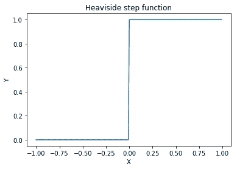
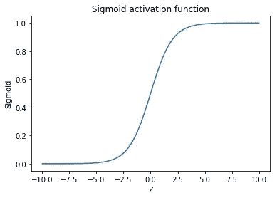

# 人工神经网络的激活函数。

> 原文：<https://medium.com/analytics-vidhya/activation-function-for-artificial-neural-network-8dc5b4854bdc?source=collection_archive---------18----------------------->

[附身摄影](https://unsplash.com/@possessedphotography?utm_source=medium&utm_medium=referral)在 [Unsplash](https://unsplash.com?utm_source=medium&utm_medium=referral) 上拍照

# 介绍

激活函数是人工智能背后的主要计算核心，主要用于神经网络，今天我们将通过一个简短的介绍和一个常见用例的清晰示例来概述其中的一些功能。

## 二元阶跃函数

*二进制阶跃函数*或“**亥维赛阶跃函数”**，是一个代表开启特定值或在特定时间后开启阈值的信号的函数。二进制阶跃函数主要用于单个感知器神经网络，并用于在两个类别之间进行线性分离。但是在神经网络上使用二进制阶跃函数的背后有一点需要注意，基于微积分，阶跃函数的梯度下降总是 0，这表示在更新权重时没有等级变化。

接下来，我们可以找到二进制阶跃函数的“python”实现。

二元阶跃函数图

## 线性激活函数

线性激活函数它接受来自范围[-inf，+inf]的输入并产生范围[-inf，+inf]，比在{0，1}之间堆叠的二进制阶跃函数好不了多少。相反，它可以像所有的*线性函数*一样共享相同的问题，其中导数总是常数，使得反向传播在更新权重方面无用。线性激活的另一个问题是，它使得 NN 中的堆叠层没有效果，并且最后一层作为第一层仍然具有线性激活。

下面是线性实现的代码片段和图表

线性激活函数图

## Sigmoid 激活函数

说到我们的第一个非线性激活函数，也是几种原因中最常用的一个，与 Heaviside 阶跃函数具有相同的形状，但其平滑性可以防止输出在 0 和 1 之间跳跃。它使 sigmoid 函数成为分类的最佳拟合函数，有助于进行清晰的预测。

Sigmoid 激活函数

## Tanh 激活函数

双曲正切函数是一个三角函数，与 sigmoid 函数一样，具有梯度下降初等变换的所有优点。但是 Tanh 激活函数有其秘密武器来对抗最强的负值，因为零中心形状。

Tanh 激活函数

## 整流线性单元

shot 的校正线性单元或 RelU 是用于比 Sigmoid 或 Tanh 更快地收敛神经网络的激活函数。尽管它看起来像一个线性函数，但它是为负范围设计的，这给了函数一个导数。但是 RelU 函数可能会死于零值或负值。

ReLU 激活功能

## Softmax 激活功能

softmax 激活函数最适合输出图层，因为它能够在多重分类中对输出类之间的一对一进行分类。