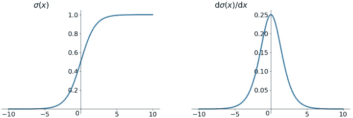
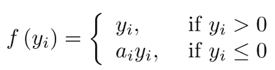
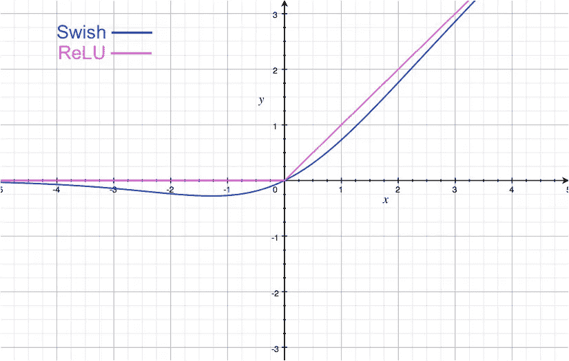

# 神经网络中的激活函数

> 原文：<https://medium.com/analytics-vidhya/activation-function-in-neural-networks-1680b8dc8de2?source=collection_archive---------8----------------------->

如果你不熟悉神经网络和深度学习，请参考[这篇文章](https://towardsdatascience.com/a-gentle-introduction-to-neural-networks-series-part-1-2b90b87795bc)以更好地理解我们在本文中讨论的激活函数。

我们知道，在神经网络中，每个神经元代表一个激活函数，那么，为什么要使用激活函数呢？常用的激活功能有哪些不同？

我们来详细讨论一下这个:

# 为什么要激活函数？

神经元激活功能概述

在神经网络中，我们从输入层(x0)发送到神经元的数据集将是线性数据，因此我们需要隐藏层中的一个函数，该函数将过滤、归一化、限制和非线性化作为输入数据发送到其他层的数据集，因此，这就是激活函数的存在。

激活函数还有助于将每个神经元的输出归一化到 1 和 0 之间或-1 和 1 之间的范围。

激活函数是帮助确定神经网络输出的函数。这些类型的函数附加到网络中的每个神经元，并根据每个神经元的输入是否与模型的预测相关来确定是否应该激活它。

输出层中的激活函数称为输出函数，如果它在隐藏层中，则称为激活函数。

在神经网络中，输入被输入到输入层的神经元中。每个神经元都有一个权重，输入数乘以权重就得到神经元的输出，输出传递到下一层。激活函数是馈送当前神经元的输入和去往下一层的输出之间的数学“门”。它可以像阶跃函数一样简单，根据规则或阈值打开或关闭神经元输出。

神经网络使用非线性激活函数，可以帮助网络学习复杂的数据，计算和学习几乎任何代表问题的函数，并提供准确的预测。

激活功能包括:

1.  **线性激活函数**

图片来源:[中](/analytics-vidhya/comprehensive-synthesis-of-the-main-activation-functions-pros-and-cons-dab105fe4b3b)

*   线性函数(直线形式→ y=mx+c ),其中 f(x)值的范围在-无穷大到+无穷大之间，这导致输出(y)值的范围也在-无穷大到+无穷大之间。
*   线性函数的导数总是常数

**为什么我们不用线性函数作为激活函数？**

*   线性函数在处理非常复杂的数据时存在一些限制(复杂性差)我所说的复杂数据是指从不同的图像中识别人脸，我们需要在像素范围内计算更多的特征，线性函数不能有效地做到这一点，但非线性函数在复杂数据集方面表现更好。

**2。二元阶跃函数**

图片来源:[中](/analytics-vidhya/comprehensive-synthesis-of-the-main-activation-functions-pros-and-cons-dab105fe4b3b)

*   与线性函数相比，二进制阶跃函数的计算量非常低，因为它只返回值 0，1。

**为什么我们不用二元阶跃函数作为激活函数？**

*   因为它只返回值 0，1，二进制阶跃函数的导数总是零。我们知道，在反向传播过程中，我们计算方程的微分，如果激活函数给出 0 值，那么权重没有更新或变化，这是一个大问题。

**3。非线性函数**

在神经网络中，我们通常使用非线性函数作为激活函数，因为非线性函数是可微的，并且是单调函数。

我们可以找出函数的微分，这有助于在有助于学习的反向传播过程中更新或改变权重。

# 常用的非线性激活函数

## 1.Sigmod 或逻辑激活函数

图片来源:谷歌搜索

图片来源:谷歌搜索

Sigmoid 函数是深度学习开始时最常用的激活函数。

在 sigmoid 函数中，输出在开区间(0，1)内。导数是 f'(x) = f(x)(1-f(x))

**乙状结肠功能的优点:-**

*   平滑渐变，防止输出值“跳跃”。
*   Sigmoid 是一个非线性函数和单调性函数，但导数不是。
*   输出值介于 0 和 1 之间，使每个神经元的输出正常化。
*   明确的预测，即非常接近 1 或 0。

**乙状结肠功能的缺点:**

*   **容易出现梯度消失:**当输入稍微远离坐标原点时，函数的梯度变得很小，几乎为零。在神经网络反向传播的过程中，我们都是利用微分的链式法则来计算每个权值 w 的微分，当反向传播经过 sigmoid 函数时，这条链上的微分是很小的。而且可能会经过很多 sigmoid 函数，最终导致权重 w 对损失函数影响不大，不利于权重的优化。这个问题叫做梯度饱和或梯度分散。
*   **函数输出不以零为中心:**函数输出不以 0 为中心，会降低权重更新的效率。
*   **幂运算相对耗时:**sigmoid 函数执行指数运算，计算机计算速度较慢。

# 2.Tanh 函数

双曲正切函数公式和曲线如下

图片来源:谷歌搜索

图片来源:谷歌搜索

双曲正切函数。双曲正切函数和 sigmoid 函数的曲线相对相似。

tanh 的输出区间为(-1，1)且整个函数以 0 为中心，优于 sigmoid。导数是 f'(x) = 1 — f(x)2

在二进制分类问题中，tanh 函数用于隐藏层，sigmoid 函数用于输出层。但这些都不是一成不变的，具体要用的激活函数，要根据具体问题具体分析，还是要看调试。

**双曲正切函数的优点:-**

*   功能输出以零为中心

**双曲正切函数的缺点:-**

*   倾向于梯度消失
*   电源操作相对耗时

# 3.ReLU 函数

ReLU 函数公式和曲线如下

f(x) = max(0，x)，其中 x→输入到神经元

图片来源:谷歌搜索

ReLU(直线单位)函数取最大值。

ReLu 的输出区间为(0，+无穷大)，导数为 f '(x)= { 0 for x<0 , 1 for x≥0

The ReLU (Rectified Linear Unit) function is an activation function that is currently more popular. Compared with the sigmoid function and the tanh function, it has the following advantages:

**ReLu 函数的优点:-**

1.  当输入为正时，不存在梯度饱和问题。
2.  它不会一次激活所有的神经元。
3.  计算速度快了很多。ReLU 函数只有线性关系。无论是向前还是向后，都比 sigmoid 和 tanh 快很多，因为 Sigmoid 和 tanh 需要计算指数，会慢一些。

**Relu 功能的缺点:-**

1)当输入为负数时，ReLU 完全不活动，也就是说一旦输入负数，ReLU 就会死掉。这样，在正向传播过程中，就不是问题了。有些区域敏感，有些区域不敏感。但是在反向传播过程中，如果你输入一个负数，梯度将完全为零，这与 sigmoid 函数和 tanh 函数有相同的问题。

2)我们发现 ReLU 函数的输出不是 0 就是正数，说明 ReLU 函数不是以 0 为中心的函数。

# 4.泄漏 ReLU 函数

漏 ReLU 函数公式和曲线如下:

f(x)= max(alpha x，x)，其中 alpha 是反向传播期间的可学习参数。

**为什么会漏 Relu？**

为了解决死的 ReLU 问题，人们提出将 ReLU 的前半部分设置为 0.01x，而不是 0。另一个直观的想法是基于参数的方法。

漏 Relu 如何解决死 Relu 问题？

如果 Leaky Relu 接收到正输入，它将返回 x，并返回一个非常小的值，它是 x 的 0.01 倍。因此，leaky Relu 也会返回负值的输出。通过这个负值的梯度，结果是非零的，因此不存在死区问题

# 5.ELU(指数线性单位)函数

ELU 还提议解决 ReLU 的问题。显然，ELU 拥有 ReLU 的所有优势，而且:

*   没有死 ReLU 问题
*   输出的平均值接近 0，这意味着以零为中心

一个小问题是它的计算量稍微大一点。类似于 Leaky ReLU，虽然理论上比 ReLU 好，但是目前在实践中没有很好的证据证明 eLU 总是比 ReLU 好。

# 6.Softmax

对于任意一个长度为 K 的实向量，Softmax 可以将其压缩成一个长度为 K 的实向量，取值范围为(0，1)，向量中元素的和为 1。

它在多类分类和神经网络中也有许多应用。Softmax 与普通的 max 函数不同:max 函数只输出最大值，Softmax 保证较小的值有较小的概率，不会被直接丢弃。是一个“软”的“max”。

Softmax 函数的分母结合了原始输出值的所有因子，这意味着 Softmax 函数获得的不同概率是相互关联的。在二元分类的情况下，对于乙状结肠，有:

对于 K = 2 的 Softmax，有:

其中可以看出，在二元分类的情况下，Softmax 退化为 Sigmoid。

# 7.参数 Relu

PReLU 也是 ReLU 的改进版本。在负区，PReLU 斜率小，也可以避免 ReLU 死的问题。与 ELU 相比，PReLU 是负区域中的线性运算。虽然斜率小，但不趋向于 0，这是一定的优势。

我们看了 PReLU 的公式。参数α一般是 0 到 1 之间的数，一般比较小，比如几个零。当α = 0.01 时，我们称之为 PReLU Leaky Relu，它是 PReLU it 的一个特例。

上面，yᵢ是第 I 个通道上的任何输入，aᵢ是负斜率，一个可学习的参数。

*   如果 aᵢ=0，f 变成了 ReLU
*   如果 aᵢ>0，f 变成泄漏的 ReLU
*   如果 aᵢ是一个可学习的参数，f 变成 PReLU

# 8.Swish(自门控)功能

公式为: **y = x * sigmoid (x)**

Swish 的设计灵感来自于 LSTMs 和高速公路网络中用于门控的 sigmoid 函数。我们使用相同的值进行选通，以简化选通机制，称为**自选通**。

自门控的优点是它只需要一个简单的标量输入，而正常门控需要多个标量输入。这一特性使得自门控激活函数(如 Swish)能够轻松替换以单个标量作为输入的激活函数(如 ReLU)，而不改变隐藏容量或参数数量。

1)无界性(Unboundedness)有助于防止梯度在慢速训练时逐渐趋近于 0，造成饱和。同时，有界也有好处，因为有界的活动函数可以有很强的正则化，更大的负输入会被解析。

2)同时，光滑度在优化和泛化中也起着重要的作用。

# 9.最大输出

一个相对流行的选择是 Maxout 神经元(最近由 Goodfellow 等人引入)，它概括了 ReLU 及其泄漏版本。注意，ReLU 和 Leaky ReLU 都是这种形式的特例(例如，对于 ReLU，我们有 w1，b1 =0)。因此，最大输出神经元享有 ReLU 单元的所有优点(线性操作方式，无饱和)并且没有其缺点

Maxout 激活是 ReLU 和 leaky ReLU 函数的推广。这是一个可学习的激活函数。

Maxout 可以看做是在深度学习网络中增加了一层激活函数，其中包含了一个参数 k .与 ReLU，sigmoid 等相比，，这一层的特殊之处在于增加了 k 个神经元，然后输出最大的激活值。价值。

# 10.Softplus

图片来源:[https://himanshuxd . medium . com/activation-functions-sigmoid-relu-leaky-relu-and-soft max-basics-for-neural-networks-and-deep-8d 9 c 70 eed 91 e](https://himanshuxd.medium.com/activation-functions-sigmoid-relu-leaky-relu-and-softmax-basics-for-neural-networks-and-deep-8d9c70eed91e)

软毛绒功能和 ReLU 功能差不多，但是比较流畅。是像 ReLU 一样的单方面打压。接受范围广(0，+ inf)。

Softplus 函数: **f(x) = ln(1+exp x)**

> Tensorflow Keras 提供了不同类型的激活功能，实现在 [**Tensorflow 官方文档**](https://www.tensorflow.org/api_docs/python/tf/keras/activations?version=nightly) 中。我强烈建议你尝试实现所有的激活函数，以获得我上面讨论的关于激活函数的实用知识。

在本文中，我们学习了大部分非线性激活函数，但问题是在处理真实场景时使用哪个激活函数？那是乙状结肠，tanh，Relu，还是其他…

答案是，选择激活函数是一件主观的事情，这意味着取决于我们正在处理的问题陈述，以及我们想要的输出。在大多数情况下，人们选择在隐藏层选择 ReLu 作为激活函数，在输出层选择 softmax 激活函数。

为了更好地了解在特定场景中使用哪种激活功能，请参考本文。

参考:

1.  [https://medium . com/analytics-vid hya/comprehensive-synthesis-of-the-main-activation-functions-pros-cons-dab 105 Fe 4 b 3 b](/analytics-vidhya/comprehensive-synthesis-of-the-main-activation-functions-pros-and-cons-dab105fe4b3b)
2.  【https://www.youtube.com/watch?v=y_baQlA8WwA 
3.  [https://www . Applied ai course . com/course/11/Applied-Machine-learning-course](https://www.appliedaicourse.com/course/11/Applied-Machine-learning-course)
4.  [https://www . LinkedIn . com/pulse/activation-functions-deep-learning-sunil-Kumar-cheru ku/？trk = read _ related _ article-card _ title](https://www.linkedin.com/pulse/activation-functions-deep-learning-sunil-kumar-cheruku/?trk=read_related_article-card_title)