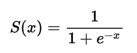
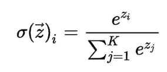
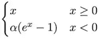
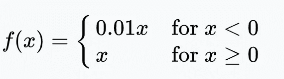

# 激活功能

> 原文：<https://medium.com/analytics-vidhya/activation-functions-67cd5f5d599c?source=collection_archive---------12----------------------->


非线性的艺术

本文是对以下部分的简要讨论

*   **激活功能**
*   **各种激活功能**
*   **需要激活功能**

# 激活功能

激活函数是决定神经网络输出的方程。激活函数的主要目的是向神经网络引入非线性。

*   激活函数将神经元线性输入转换成非线性输出。
*   它有助于使每个神经元的输出在-1 到 1 的范围内正常化

# 不同的激活功能

*   Sigmoid 函数
*   Softmax 函数
*   双曲正切函数
*   校正线性单位函数
*   指数线性单位函数(ELU)
*   漏整流线性单位函数

## Sigmoid 函数

*   Sigmoid 是一个可微函数
*   它有固定的输出范围。[介于 0 和 1 之间]
*   它通常用于二元分类



乙状结肠的

```
def sigmoid(x):
    return 1/(1+np.exp(-x))
```

## Softmax 函数

*   Softmax 函数是根据神经元的输入值计算概率分布的激活函数
*   它有固定的输出范围。[介于 0 和 1 之间]
*   它用在多类模型中，返回每个类的概率，目标类的概率最高。
*   它生成范围在 0 和 1 之间的输出，并且所有类别的概率之和等于 1。



softmax

```
def softmax(x):
    return np.exp(x)/(np.sum(np.exp(x)))
```

## 双曲正切函数

*   Tanh 是一个以零为中心的函数
*   它有一个固定的输出范围，[在-1 和 1 之间]
*   它用于多类神经网络模型


双曲正切

```
def tanh(x):
    return (np.exp(x) - np.exp(-x))/(np.exp(x) + np.exp(-x))
```

## 校正线性单位函数

*   ReLU 确认小于零的输入值，并将其设置为零
*   它没有固定的范围，[从 0 到 inf]
*   计算成本更低且速度更快
*   它只能在神经网络模型的隐藏层中使用


热卢

```
def ReLU(x):
    return np.array([i if i > 0 else 0 for i in x])
```

## 指数线性单位函数(ELU)

*   ELU 是 ReLU 的替代品
*   当输入值小于 0 时，ELU 使用参数化的[α]指数函数



ELU

```
def ELU(x, alpha=0.01):
    return np.array(
        [i if i > 0 else alpha*(np.exp(i) - 1) for i in x]
    )
```

## 漏整流线性单位函数

*   LeakyReLu 是 ReLu 的另一个变体
*   对于小于 0 的输入值，它允许非常小的非零恒定梯度α (α=0.01)



泄漏 ReLU

```
def LeakyReLU(x, alpha=0.01):
    return np.array(
        [i if i > 0 else alpha*i for i in x]
    )
```

# **需要激活功能**

*   如果没有应用激活函数，神经网络的输出将是一个**线性函数**
*   激活功能将在模型中引入一些非线性**。这种增加的非线性使得神经网络不同于简单的线性函数或简单的线性回归模型。**
*   **激活函数赋予神经网络理解不同特征之间复杂关系的能力。**
*   **在激活函数的帮助下，不同特征之间的**非线性关系可以被神经网络模型理解****