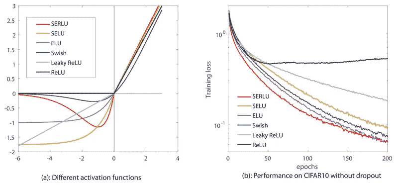

# 激活功能-概述

> 原文：<https://medium.com/analytics-vidhya/activation-functions-a-general-overview-c836ca759456?source=collection_archive---------15----------------------->

神经网络由多层“神经元”组成，这些神经元使用各自的权重和偏好来学习关于输入的信息。激活网络是其中的一部分——它将非线性引入模型，帮助它模拟更复杂的任务。

它还涉及反向传播，允许模型根据损失更新其网络权重。权重和激活函数的偏导数确定权重和偏差将如何以及在什么方向上通过梯度下降而改变。

我们在神经网络中使用三种标准激活函数:

# Sigmoid 函数(包括 Tanh)

主要用于二元分类问题，有两种类型的 Sigmoid 函数- Sigmoid 和 Tanh，或双曲正切。

Sigmoid 用于逻辑回归并将数据归一化到[0，1]范围内-与概率空间相同。在二元分类中，如果回归值大于或小于 0.5，则结果为 1 或 0。

Tanh 是一个缩放的 Sigmoid 函数，其输出范围在[-1，1]之间。由于其数值上更重的导数、计算效率和零中心性，它被认为比未缩放的 sigmoid 函数更好。特别是，它的零中心使权重能够在正负两个方向学习，并使输出居中。这个属性也有助于模型更快地收敛。

由于它们的形状，这两个函数都存在梯度消失的问题——在任一方向上的极端输入都会导致导数收敛到零。在应用链式法则足够多次后，梯度下降就几乎不存在了。人们只需认识到 0.01 乘以自身收敛到 0 的速度有多快，就可以看到这一点。

# ReLU(整流线性单元)和泄漏 ReLU

相比之下，ReLU 通过为大输入提供更响亮的信号来解决消失梯度问题，并为大于 0 的值分配常数导数。因此，对于小于零的数字，神经元根本不会被激活。

失活的神经元也被称为“死”神经元。当学习速率太高时，太多的神经元死亡，这导致消失梯度问题的另一个实例。

这种情况下的解决方案？修改你的超参数——或泄漏的 ReLU

当输入低于零时，泄漏 ReLU 是具有固定斜率的 ReLU，因此我们仍然有一个梯度。(我们仍然有 x 的导数<0)

Other equations that mimic the function of the ReLU and ‘fix’ the dead neuron include the ‘swish’ (Sigmoid Linear Unit) by Google or the Exponential linear unit(Elu), which all have significantly higher computational costs than the ReLU but may provide a better learning rate.

Note that the ReLU is **总是**用于隐藏层，而**从不**用于输出层。

# Softmax 函数

这个标准化的指数函数将逻辑函数推广到多个维度——非常适合多类回归模型。

它的输出范围是概率空间——它对输出进行除法运算，使它们的和等于 1，没有负值。

将 softmax activator 用于其最后一层的模型使用逻辑损失-方便，因为 softmax 的输出是指数的。

对于负对数损失可能性，当模型对其预测不确定时，损失会很高，即使其预测是正确的。当模型预测准确且非常有信心时，损失是最低的——对 softmax 试图预测的东西是直观的。

交叉熵损失就是这么做的。

[https://Guandi 1995 . github . io/Softmax-Function-and-Cross-Entropy-Loss-Function/](https://guandi1995.github.io/Softmax-Function-and-Cross-Entropy-Loss-Function/)更详细地介绍了实现 soft max 的代码，并分解了损耗等式。

最后，仍然创建新的激活函数，并对其效率和优化进行测试。方程成为激活函数的基本要求是:

1.  它必须是非线性的。
2.  它必须是单调的。(它的斜率必须保持正或负，包括零)
3.  它必须是可微分的(对于反向传播，它通过损失更新权重)。计算导数的计算强度也会影响整个模型的效率。

在[https://medium . com/ai-in-plain-English/activation-functions-in-neural-networks-3d 8211678 fb2](/ai-in-plain-english/activation-functions-in-neural-networks-3d8211678fb2)有对这些激活函数的等式和性质的很好的总结