# 激活功能—您需要知道的一切！

> 原文：<https://medium.com/analytics-vidhya/activation-functions-all-you-need-to-know-355a850d025e?source=collection_archive---------0----------------------->

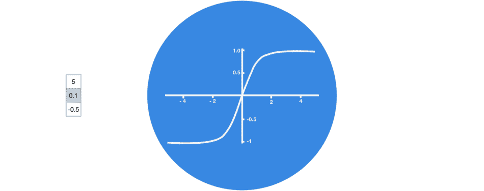

# 那么，什么是激活函数呢？

一个**激活函数**是一个**函数**，它被添加到一个**人工神经网络**中，以便帮助网络学习**数据**中的复杂模式。当与我们大脑中基于神经元的模型进行比较时，**激活功能**最终决定向下一个神经元发射什么。

> 在 [**人工神经网络**](https://en.wikipedia.org/wiki/Artificial_neural_network) 中，给定一个输入或一组输入，节点的**激活函数**定义该节点的输出。一个标准的 [**集成电路**](https://en.wikipedia.org/wiki/Integrated_circuit) 可以被看作是一个 [**数字网络**](https://en.wikipedia.org/wiki/Digital_electronics) 的激活功能，根据输入可以是“开”(1)或“关”(0)。— **维基百科**

所以，总结一下，**激活函数是决定神经网络输出的数学方程。**

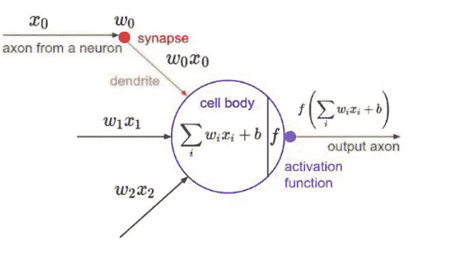

> 在这个博客中，我们将了解广泛使用的激活函数，其工作背后的后端数学，并讨论如何为您特定的深度学习问题陈述选择最佳的方法。

在深入讨论不同类型的激活功能之前，让我们快速了解一下人工神经元是如何工作的

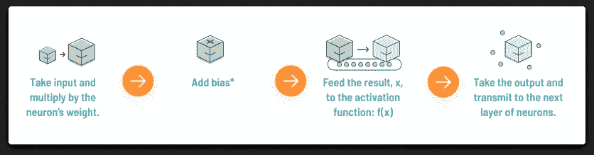

上述过程的数学可视化可以表示为

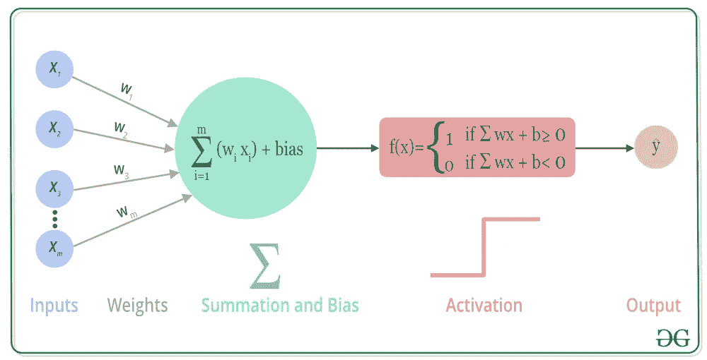

## 到目前为止，您一定非常熟悉人工神经网络的工作过程以及激活函数在该过程中的作用！

# 所以，拿起你的咖啡🥤，我们开始吧！

# 1.乙状结肠激活功能-

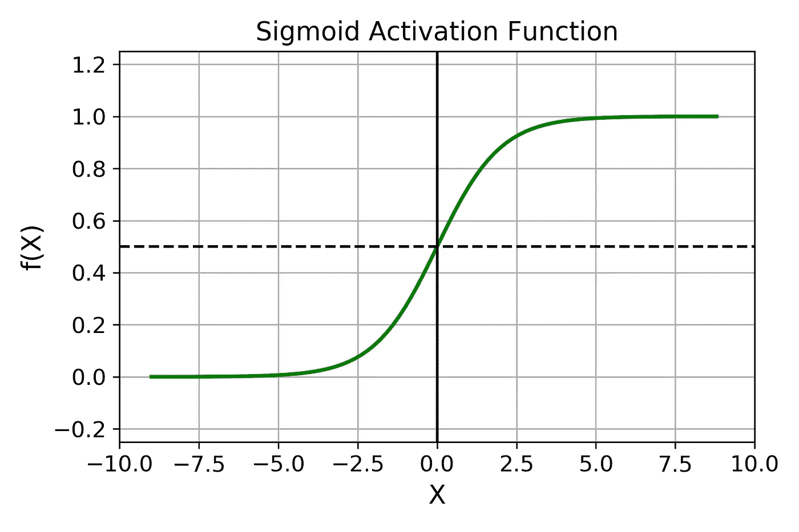

**S 形函数**看起来像一条 **S 形**曲线。

公式: **f(z) = 1/(1+ e^-z)**

我们为什么以及何时使用 Sigmoid 激活函数？

1.  sigmoid 函数**的输出范围在 0 和 1** 之间。由于输出值介于 0 和 1 之间，因此**对每个神经元的输出进行标准化**。
2.  专门用于我们必须**预测概率**作为输出的模型。由于任何事情的概率只存在于 **0 和 1 之间，** sigmoid 是**完美的**选择。
3.  **平滑梯度**，防止输出值“跳跃”。
4.  函数是**可微的**。这意味着，我们可以在任意两点找到 s 形曲线的斜率。
5.  **清晰的预测**，即非常接近 1 或 0。

乙状结肠激活功能的**缺点**有哪些？

1.  容易出现梯度消失(当 **sigmoid** 函数值过高或过低时，导数变得很小即< < 1。这导致**消失梯度**和深度网络的较差学习。)
2.  函数输出**不是以 0 为中心，**会降低权重更新的效率。
3.  sigmoid 函数执行指数运算，这对于计算机来说比较慢。

# 2.双曲正切激活函数

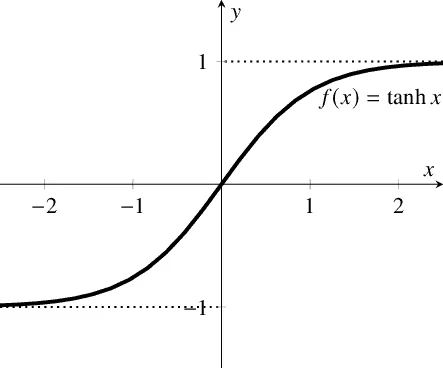

双曲正切激活函数也是**S 形的。**

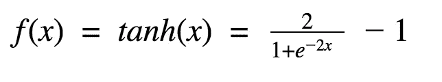

双曲正切激活函数公式

**Tanh 是双曲正切函数**。双曲正切函数和 sigmoid 函数的曲线比较相似。但是它比 sigmoid 函数有一些优势。让我们看看它是什么。

为什么 tanh **比**更适合乙状结肠激活功能？

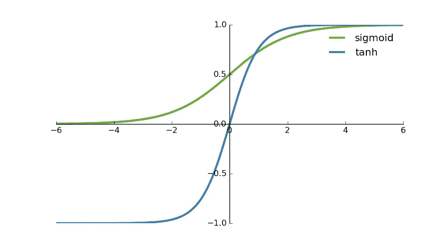

1.  首先，输入大或小时，输出**几乎平滑，梯度小**，不利于权重更新。区别在于输出间隔。tanh 的输出区间为 1，整个函数以 **0 为中心，比 sigmoid 好。**
2.  **的主要优点**是**负输入**将被强映射**负输入**并且**零输入**将被映射**接近双曲正切图中的零**。

> N **注:**在一般的**二元分类问题**中，tanh 函数用于**隐藏层**，sigmoid 函数用于**输出层**。不过这些都是**不是静态的**，具体要用的激活函数要根据具体问题具体分析，不然就要看调试了。

# 3.ReLU(整流线性单位)激活功能-

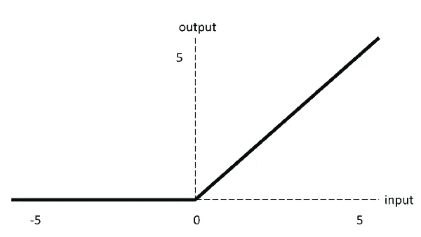

ReLU 被半整流(从底部)。当 z 小于零时 f(z)为零，当 z 大于或等于零时 f(z)等于 z。

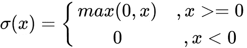

**范围:**【0 到无穷大】

**ReLU(整流线性单元)**函数是目前**比深度学习中其他激活函数更流行的**激活函数。

与 sigmoid 函数和 tanh 函数相比，它具有以下**优势**:

1.  当输入为正时，不存在**梯度饱和问题。**
2.  计算速度要比**快得多**。ReLU 函数只有线性关系。无论是向前还是向后，都比乙状结肠和 tanh 快很多。(Sigmoid 和 tanh 需要计算指数，会比较慢。)

当然还有**的缺点:**

1) **死 ReLU 问题** -当输入为负时，ReLU 完全**不活动**，这意味着一旦输入负数， **ReLU 就会死**。这样，在正向传播过程中，就不是问题了。有些区域敏感，有些区域不敏感。但是在**反向传播**过程中，如果输入一个负数，**梯度将完全为零，**与 sigmoid 函数和 tanh 函数有**相同的**问题。

2)我们发现 ReLU 函数的输出不是 0 就是正数，也就是说 ReLU 函数**不是以 0 为中心的函数。**

# 4.泄漏 ReLU 激活功能-

一个激活功能**专门设计用来补偿**的将死的 ReLU 问题。

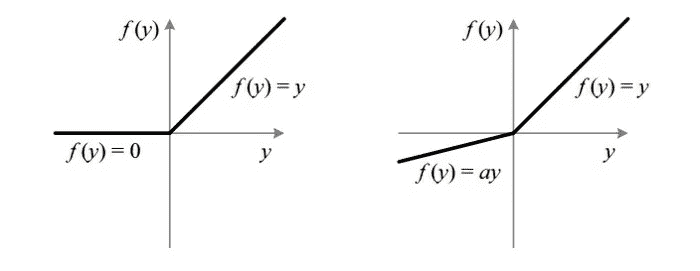

ReLU 与泄漏 ReLU

为什么漏的 ReLU 比 ReLU 好**？**

**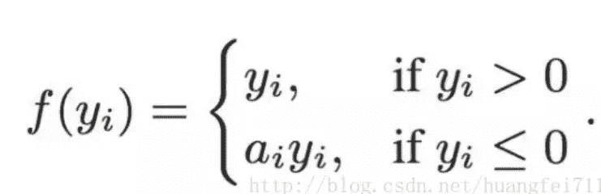**

1.  **泄漏 ReLU **通过给负输入 **(0.01x)** 一个非常小的 x** 线性分量来调整负值的零梯度问题。**
2.  **泄漏有助于增加 ReLU 功能的范围。通常情况下， **a** 的值为 **0.01** 左右。**
3.  **泄漏 ReLU 的范围是**(-无穷大到无穷大)。****

> ****注:**理论上，漏 ReLU 具有 ReLU 的所有优点，加上死 ReLU 不会有任何问题，但在实际操作中，并没有完全证明漏 ReLU 总是比 ReLU 好。**

# **5.ELU(指数线性单位)函数**

**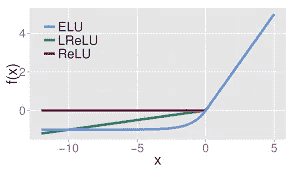**

**ELU vs 泄漏的雷鲁 vs 雷鲁**

****ELU** 也是**提出来解决 ReLU**的问题。与 ReLUs 相反，elu 具有**负值**，这使得激活**的平均值**更接近于**零。**意味着更接近零的激活**能够更快地学习**，因为它们使**梯度更接近自然梯度。****

**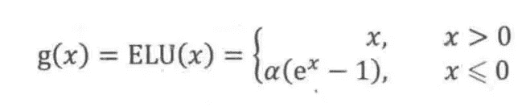**

**显然， **ELU 拥有 ReLU** 的所有优点，并且:**

*   ****没有死 ReLU** 问题，输出的平均值接近 0，**零点居中**。**
*   **在**中，对比**和 ReLUs，elu 具有负值，这允许它们像**批量标准化**一样将平均单位激活推至更接近零，但是具有**更低的计算复杂度**。由于**减少的偏移效应，均值向零偏移通过使正常梯度更接近单位自然梯度来加速学习。****
*   **ELUs **在较小的输入下饱和为负值**，从而减少了向前传播的变化和信息。**

**一个**小问题**是它的计算强度稍微大一些**。**类似于 Leaky ReLU，虽然理论上优于 ReLU，但目前实践中并没有很好的证据证明 eLU 总是优于 ReLU。**

# **6.PRelu(参数 Relu)**

**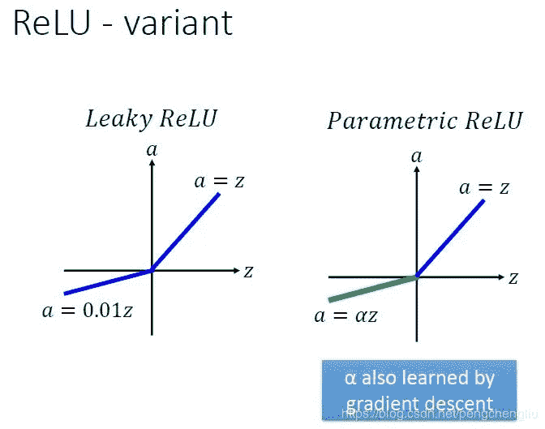**

****PReLU** 也是**ReLU 的**改进型。**

**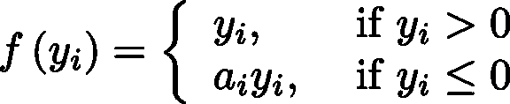**

**我们看了 PReLU 的公式。参数 **α** 一般是 0 到 1 之间的数，一般比较小，比如几个零。**

*   **如果 **aᵢ=0** ，f 变成 ReLU**
*   **如果 **aᵢ > 0** ，f 变成漏电继电器**
*   **如果 **aᵢ是一个可学习的参数**，f 变成 PReLU**

**到了 PReLU 的优势**

1.  **在负区域，PReLU 有一个**小斜坡**，也可以**避免**ReLU 死的问题。**
2.  **与 ELU 相比，PReLU 是负区域中的**线性操作**。虽然斜率小，但是它**不趋向于 0** ，这是一定的优势。**

# **7.Softmax**

**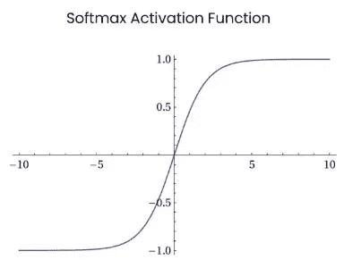**

****Softmax** 用作多类分类问题的**激活函数**，其中需要两个以上类标签上的类成员。对于任意长度为 K 的实向量，Softmax 可以**将其压缩成长度为 K 的实向量**，其值在**范围(0，1)** 内，向量中元素之和为 1。**

****

> **Softmax 的 S 与普通的 max 函数不同:max 函数只输出最大值，soft max 保证较小的值有较小的概率，不会被直接丢弃。是一个**【max】**就是**【软】**；可以认为它是 argmax 函数的**概率版或*软*版。****

**Softmax 函数的分母结合了原始输出值的所有因子，这意味着 Softmax 函数获得的不同概率是相互关联的。**

**softmax 激活功能的主要缺点是-**

1.  **在零点不可微，ReLU 无界。**

**2.负输入的梯度为零，这意味着对于该区域中的激活，权重在反向传播期间不更新。这会产生永远不会被激活的死亡神经元。**

# **8.Swish(自门控)功能**

**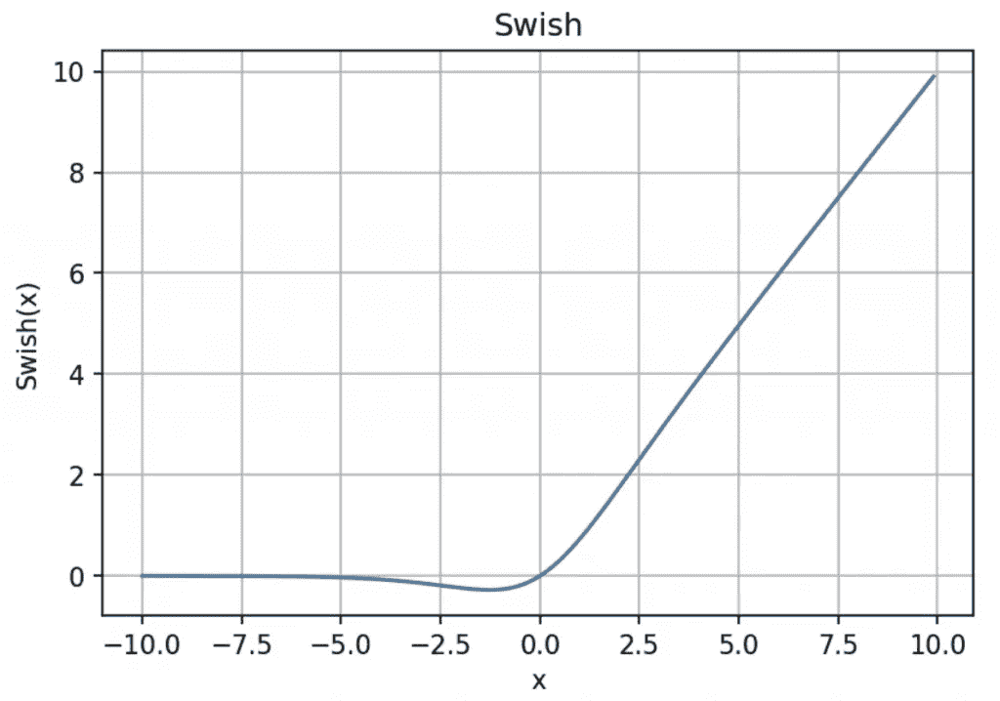**

**公式为: **y = x * sigmoid (x)****

**Swish 的设计灵感来自 LSTMs 和高速公路网络中使用 sigmoid 函数作为门控。我们使用相同的值进行选通，以简化选通机制，称为**自选通**。**

> **自门控的**优势在于它只需要一个**简单标量输入，**而正常门控需要多个标量输入。这一特性使得自门控激活函数(如 Swish)能够轻松地**替换以单个标量作为输入的激活函数(如 ReLU)** ，而不改变隐藏容量或参数数量。****

****注意:**只有当你的**神经网络≥ 40 层时，才能实现 Swish 激活功能。****

**Swish 激活功能的**主要优点**如下:**

**1.**无界度**有助于防止缓慢训练时梯度逐渐接近 0，造成饱和。**

**(同时有界也有好处，因为有界的活动函数可以有很强的正则化，更大的负输入会被解析。)**

**2.导数**始终为> 0。****

**3.**平滑度**在**优化和泛化中也起着重要的作用。****

# **9.最大输出**

**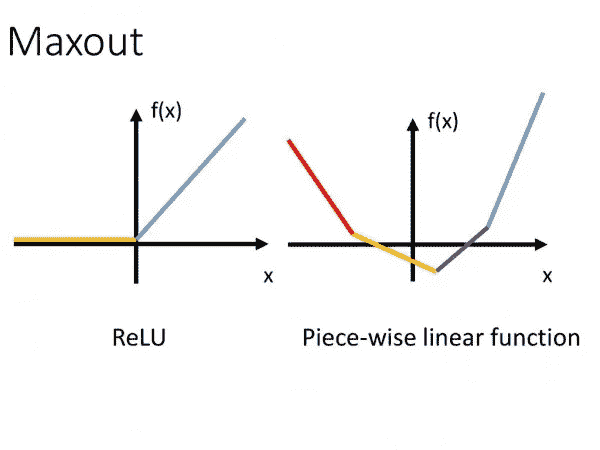**

**一个**最大输出**层仅仅是一个激活函数**是输入的最大值的层。**如**论文**中所述，即使是具有 **2 个最大输出单元**的 MLP 也可以**近似任何函数。****

**单个 Maxout 单元可以被解释为对一个**实值函数**进行**分段线性逼近(PWL)** ，其中该函数的图形上任意两点之间的线段位于该图形上(**凸函数**)。**

****

**Maxout 也可以为一个 **d 维向量(V)实现。****

**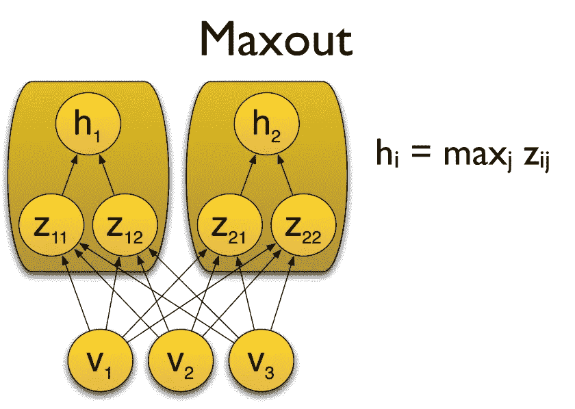**

**考虑两个凸函数 **h1(x)和 h2(x)** ，由两个 Maxout 单元近似。由上述命题可知，函数 **g(x)是一个连续的 PWL 函数。****

****

**因此，发现由两个 Maxout 单元组成的 **Maxout 层可以很好地逼近任意连续函数。****

**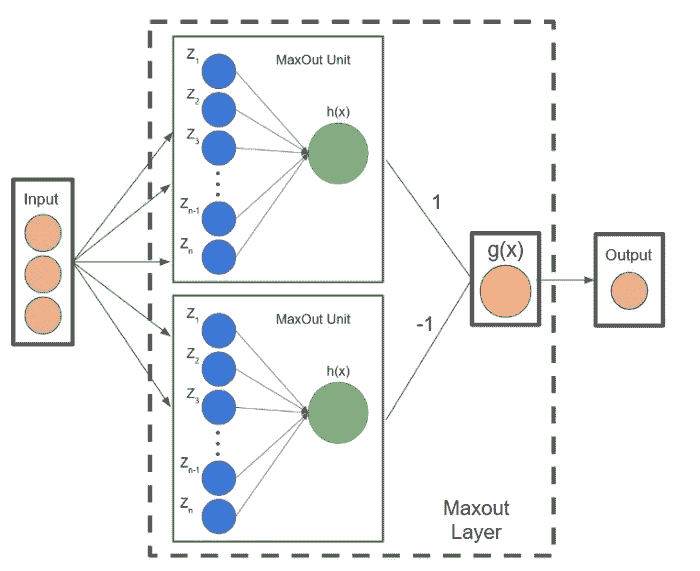**

# **10.软加-**

****

****软加函数** : f(x) = **ln(1+exp x)****

**softplus 的**导数**是——**

**f′(x)= exp(x)/(1+exp⁡x)**

**=**1/(1+exp(x))****

**，也称为**逻辑/sigmoid 函数。****

**softplus 函数和 ReLU 函数类似，但是**比较平滑。**和 ReLU 一样是单边打压。**

**接受范围广 **(0，+ inf)** 。**

> **一般来说，这些激活功能各有利弊。所有的好与坏，都必须通过用各种问题语句对它们进行实验来获得。**

# **至此，我们结束了这篇博客。希望这能给你一个关于深度学习中最常用的激活函数的不错的知识。**

**😎**

****

*****如果你是数据科学和机器学习的初学者，并对数据科学/ML-AI、向数据科学的职业过渡指导、面试/简历准备有一些具体的疑问，甚至想在你的 D-Day 之前获得模拟面试，请随时拨打*** [***这里***](https://topmate.io/sukannya) ***预约 1:1。我很乐意帮忙！*****

## ****下次见！🤓****

> **[领英](https://www.linkedin.com/in/sukannya/)**